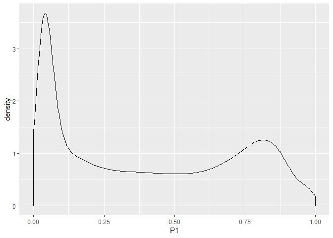
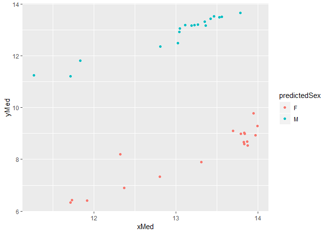
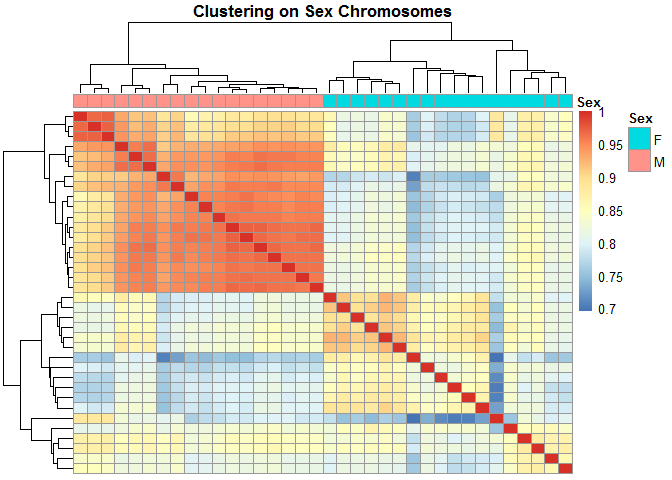
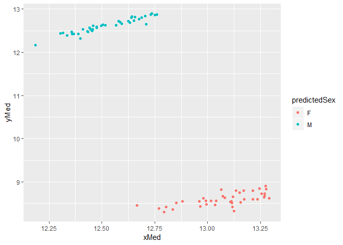
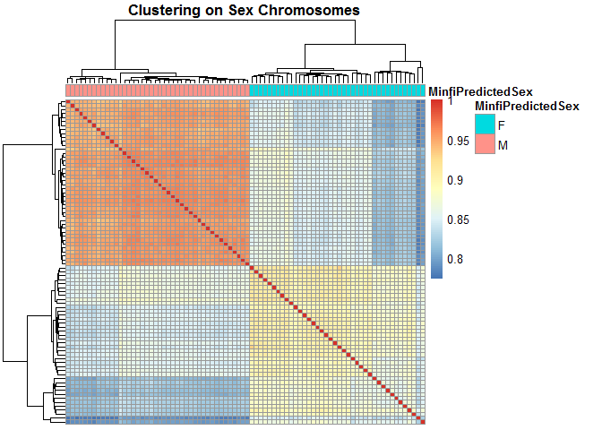

This script is for the merging, quality control, and preprocessing of all placental data.


# 1.0 Create Fry data

First I extract the Fry data from GEO data files which I already downloaded.

## 1.1 Load libraries and data


```r
#source("http://www.bioconductor.org/biocLite.R")
#biocLite(c("BiocParallel"))
library(minfi)
```

```
## Loading required package: BiocGenerics
```

```
## Loading required package: parallel
```

```
## 
## Attaching package: 'BiocGenerics'
```

```
## The following objects are masked from 'package:parallel':
## 
##     clusterApply, clusterApplyLB, clusterCall, clusterEvalQ,
##     clusterExport, clusterMap, parApply, parCapply, parLapply,
##     parLapplyLB, parRapply, parSapply, parSapplyLB
```

```
## The following objects are masked from 'package:stats':
## 
##     IQR, mad, sd, var, xtabs
```

```
## The following objects are masked from 'package:base':
## 
##     anyDuplicated, append, as.data.frame, basename, cbind,
##     colMeans, colnames, colSums, dirname, do.call, duplicated,
##     eval, evalq, Filter, Find, get, grep, grepl, intersect,
##     is.unsorted, lapply, lengths, Map, mapply, match, mget, order,
##     paste, pmax, pmax.int, pmin, pmin.int, Position, rank, rbind,
##     Reduce, rowMeans, rownames, rowSums, sapply, setdiff, sort,
##     table, tapply, union, unique, unsplit, which, which.max,
##     which.min
```

```
## Loading required package: GenomicRanges
```

```
## Loading required package: stats4
```

```
## Loading required package: S4Vectors
```

```
## 
## Attaching package: 'S4Vectors'
```

```
## The following object is masked from 'package:base':
## 
##     expand.grid
```

```
## Loading required package: IRanges
```

```
## 
## Attaching package: 'IRanges'
```

```
## The following object is masked from 'package:grDevices':
## 
##     windows
```

```
## Loading required package: GenomeInfoDb
```

```
## Loading required package: SummarizedExperiment
```

```
## Loading required package: Biobase
```

```
## Welcome to Bioconductor
## 
##     Vignettes contain introductory material; view with
##     'browseVignettes()'. To cite Bioconductor, see
##     'citation("Biobase")', and for packages 'citation("pkgname")'.
```

```
## Loading required package: DelayedArray
```

```
## Loading required package: matrixStats
```

```
## 
## Attaching package: 'matrixStats'
```

```
## The following objects are masked from 'package:Biobase':
## 
##     anyMissing, rowMedians
```

```
## Loading required package: BiocParallel
```

```
## 
## Attaching package: 'DelayedArray'
```

```
## The following objects are masked from 'package:matrixStats':
## 
##     colMaxs, colMins, colRanges, rowMaxs, rowMins, rowRanges
```

```
## The following objects are masked from 'package:base':
## 
##     aperm, apply
```

```
## Loading required package: Biostrings
```

```
## Loading required package: XVector
```

```
## 
## Attaching package: 'Biostrings'
```

```
## The following object is masked from 'package:DelayedArray':
## 
##     type
```

```
## The following object is masked from 'package:base':
## 
##     strsplit
```

```
## Loading required package: bumphunter
```

```
## Loading required package: foreach
```

```
## Loading required package: iterators
```

```
## Loading required package: locfit
```

```
## locfit 1.5-9.1 	 2013-03-22
```

```
## Setting options('download.file.method.GEOquery'='auto')
```

```
## Setting options('GEOquery.inmemory.gpl'=FALSE)
```

```r
library(GEOquery)
library(IlluminaHumanMethylation450kanno.ilmn12.hg19)
library(ggplot2)
```

```
## Warning: package 'ggplot2' was built under R version 3.5.1
```

```r
library(pheatmap)
library(dplyr)
```

```
## Warning: package 'dplyr' was built under R version 3.5.1
```

```
## 
## Attaching package: 'dplyr'
```

```
## The following object is masked from 'package:minfi':
## 
##     combine
```

```
## The following objects are masked from 'package:Biostrings':
## 
##     collapse, intersect, setdiff, setequal, union
```

```
## The following object is masked from 'package:XVector':
## 
##     slice
```

```
## The following object is masked from 'package:matrixStats':
## 
##     count
```

```
## The following object is masked from 'package:Biobase':
## 
##     combine
```

```
## The following objects are masked from 'package:GenomicRanges':
## 
##     intersect, setdiff, union
```

```
## The following object is masked from 'package:GenomeInfoDb':
## 
##     intersect
```

```
## The following objects are masked from 'package:IRanges':
## 
##     collapse, desc, intersect, setdiff, slice, union
```

```
## The following objects are masked from 'package:S4Vectors':
## 
##     first, intersect, rename, setdiff, setequal, union
```

```
## The following objects are masked from 'package:BiocGenerics':
## 
##     combine, intersect, setdiff, union
```

```
## The following objects are masked from 'package:stats':
## 
##     filter, lag
```

```
## The following objects are masked from 'package:base':
## 
##     intersect, setdiff, setequal, union
```

(Below is Magda's code)

Dataset: GSE73375 Fry

Load GEO data

```r
GSE75 <- getGEO(filename = "../../data/GSE73375_family.soft.gz") # takes a few minutes
```

```
## Reading file....
```

```
## Parsing....
```

```
## Found 37 entities...
```

```
## GPL13534 (1 of 38 entities)
```

```
## GSM1892025 (2 of 38 entities)
```

```
## GSM1892026 (3 of 38 entities)
```

```
## GSM1892027 (4 of 38 entities)
```

```
## GSM1892028 (5 of 38 entities)
```

```
## GSM1892029 (6 of 38 entities)
```

```
## GSM1892030 (7 of 38 entities)
```

```
## GSM1892031 (8 of 38 entities)
```

```
## GSM1892032 (9 of 38 entities)
```

```
## GSM1892033 (10 of 38 entities)
```

```
## GSM1892034 (11 of 38 entities)
```

```
## GSM1892035 (12 of 38 entities)
```

```
## GSM1892036 (13 of 38 entities)
```

```
## GSM1892037 (14 of 38 entities)
```

```
## GSM1892038 (15 of 38 entities)
```

```
## Warning in rbind(names(probs), probs_f): number of columns of result is not
## a multiple of vector length (arg 1)
```

```
## Warning: 74 parsing failures.
## row # A tibble: 5 x 5 col     row col          expected               actual    file         expected   <int> <chr>        <chr>                  <chr>     <chr>        actual 1 11354 detect_P_P12 no trailing characters .01166667 literal data file 2 14662 detect_P_P12 no trailing characters .06333333 literal data row 3 17195 detect_P_P12 no trailing characters .1216667  literal data col 4 18101 detect_P_P12 no trailing characters .01333333 literal data expected 5 18403 detect_P_P12 no trailing characters .005      literal data
## ... ................. ... .................................................................. ........ .................................................................. ...... .................................................................. .... .................................................................. ... .................................................................. ... .................................................................. ........ ..................................................................
## See problems(...) for more details.
```

```
## GSM1892039 (16 of 38 entities)
```

```
## GSM1892040 (17 of 38 entities)
```

```
## GSM1892041 (18 of 38 entities)
```

```
## GSM1892042 (19 of 38 entities)
```

```
## GSM1892043 (20 of 38 entities)
```

```
## GSM1892044 (21 of 38 entities)
```

```
## GSM1892045 (22 of 38 entities)
```

```
## GSM1892046 (23 of 38 entities)
```

```
## GSM1892047 (24 of 38 entities)
```

```
## GSM1892048 (25 of 38 entities)
```

```
## GSM1892049 (26 of 38 entities)
```

```
## GSM1892050 (27 of 38 entities)
```

```
## GSM1892051 (28 of 38 entities)
```

```
## GSM1892052 (29 of 38 entities)
```

```
## GSM1892053 (30 of 38 entities)
```

```
## GSM1892054 (31 of 38 entities)
```

```
## GSM1892055 (32 of 38 entities)
```

```
## GSM1892056 (33 of 38 entities)
```

```
## GSM1892057 (34 of 38 entities)
```

```
## GSM1892058 (35 of 38 entities)
```

```
## GSM1892059 (36 of 38 entities)
```

```
## GSM1892060 (37 of 38 entities)
```

```
## Warning in rbind(names(probs), probs_f): number of columns of result is not
## a multiple of vector length (arg 1)
```

```
## Warning: 160 parsing failures.
## row # A tibble: 5 x 5 col     row col          expected               actual     file         expected   <int> <chr>        <chr>                  <chr>      <chr>        actual 1 11354 detect_P_Q18 no trailing characters .06333333  literal data file 2 12069 detect_P_Q18 no trailing characters .02        literal data row 3 18345 detect_P_Q18 no trailing characters .003333333 literal data col 4 18403 detect_P_Q18 no trailing characters .01666667  literal data expected 5 20124 detect_P_Q18 no trailing characters .01        literal data
## ... ................. ... ................................................................... ........ ................................................................... ...... ................................................................... .... ................................................................... ... ................................................................... ... ................................................................... ........ ...................................................................
## See problems(...) for more details.
```

```r
# Here are some things we can access from GSE75
Meta(GSE75) # top-level series information 
```

```
## $contact_address
## [1] "1213 MHRC"
## 
## $contact_city
## [1] "Chapel Hill"
## 
## $contact_country
## [1] "USA"
## 
## $contact_department
## [1] "Environmental Sciences and Engineering"
## 
## $contact_email
## [1] "rfry@unc.edu"
## 
## $contact_institute
## [1] "UNC-Chapel Hill"
## 
## $contact_name
## [1] "Rebecca,Catherine,Fry"
## 
## $`contact_zip/postal_code`
## [1] "27599"
## 
## $contributor
## [1] "Elizabeth,,Martin" "Paul,D,Ray"        "Lisa,,Smeester"   
## [4] "Matthew,R,Grace"   "Kim,,Boggess"      "Rebecca,C,Fry"    
## 
## $email
## [1] "geo@ncbi.nlm.nih.gov"
## 
## $geo_accession
## [1] "GSE73375"
## 
## $institute
## [1] "NCBI NLM NIH"
## 
## $last_update_date
## [1] "May 04 2018"
## 
## $name
## [1] "Gene Expression Omnibus (GEO)"
## 
## $overall_design
## [1] "36 samples were analyzed, 18 in each group"
## 
## $platform_id
## [1] "GPL13534"
## 
## $platform_taxid
## [1] "9606"
## 
## $pubmed_id
## [1] "26510177"
## 
## $relation
## [1] "SubSeries of: GSE73377"                                         
## [2] "BioProject: https://www.ncbi.nlm.nih.gov/bioproject/PRJNA296823"
## 
## $sample_id
##  [1] "GSM1892025" "GSM1892026" "GSM1892027" "GSM1892028" "GSM1892029"
##  [6] "GSM1892030" "GSM1892031" "GSM1892032" "GSM1892033" "GSM1892034"
## [11] "GSM1892035" "GSM1892036" "GSM1892037" "GSM1892038" "GSM1892039"
## [16] "GSM1892040" "GSM1892041" "GSM1892042" "GSM1892043" "GSM1892044"
## [21] "GSM1892045" "GSM1892046" "GSM1892047" "GSM1892048" "GSM1892049"
## [26] "GSM1892050" "GSM1892051" "GSM1892052" "GSM1892053" "GSM1892054"
## [31] "GSM1892055" "GSM1892056" "GSM1892057" "GSM1892058" "GSM1892059"
## [36] "GSM1892060"
## 
## $sample_taxid
## [1] "9606"
## 
## $status
## [1] "Public on Sep 24 2015"
## 
## $submission_date
## [1] "Sep 23 2015"
## 
## $summary
## [1] "Placental Tissue Samples from 36 women (17 normotensive women, denoted with a P, and 19 preeclamptic women, denoted with a Q) were analyzed for differenital methylation"
## [2] "Preeclamptic womene were compared direclty to normotensive women controlling for gestational age, race, maternal age, and baby sex"                                      
## 
## $supplementary_file
## [1] "ftp://ftp.ncbi.nlm.nih.gov/geo/series/GSE73nnn/GSE73375/suppl/GSE73375_RAW.tar"                                  
## [2] "ftp://ftp.ncbi.nlm.nih.gov/geo/series/GSE73nnn/GSE73375/suppl/GSE73375_Unmethylated_and_methylated_signal.txt.gz"
## 
## $title
## [1] "Epigenetics and Preeclampsia: Defining Functional Epimutations in the Preeclamptic Placenta Related to the TGF-ß Pathway [methylation]"
## 
## $type
## [1] "Methylation profiling by genome tiling array"
## 
## $web_link
## [1] "http://www.ncbi.nlm.nih.gov/geo"
```

```r
Meta(GPLList(GSE75)[[1]]) # platform information
```

```
## $contact_address
## [1] "9885 Towne Centre Drive"
## 
## $contact_city
## [1] "San Diego"
## 
## $contact_country
## [1] "USA"
## 
## $contact_email
## [1] "expression@illumina.com, techsupport@illumina.com"
## 
## $contact_institute
## [1] "Illumina Inc."
## 
## $contact_name
## [1] " ,,Illumina Inc."
## 
## $contact_phone
## [1] "1 800 809 4566 "
## 
## $contact_state
## [1] "CA"
## 
## $contact_web_link
## [1] "www.illumina.com"
## 
## $`contact_zip/postal_code`
## [1] "92121"
## 
## $data_row_count
## [1] "485577"
## 
## $description
## [1] "1 difference between HumanMethylation450_15017482_v.1.1.bpm and HumanMethylation450_15017482_v.1.2.bpm:"
## [2] ""                                                                                                       
## [3] "1.1:"                                                                                                   
## [4] ""                                                                                                       
## [5] "41636384,NEGATIVE,-99,Negative 604"                                                                     
## [6] ""                                                                                                       
## [7] "1.2:"                                                                                                   
## [8] ""                                                                                                       
## [9] "41636384,RESTORATION,Green,Restore"                                                                     
## 
## $distribution
## [1] "commercial"
## 
## $geo_accession
## [1] "GPL13534"
## 
## $last_update_date
## [1] "May 04 2018"
## 
## $manufacture_protocol
## [1] "See manufacturer's website"
## 
## $manufacturer
## [1] "Illumina, Inc."
## 
## $organism
## [1] "Homo sapiens"
## 
## $relation
## [1] "Alternative to: GPL16304"
## 
## $status
## [1] "Public on May 13 2011"
## 
## $submission_date
## [1] "May 13 2011"
## 
## $supplementary_file
## [1] "ftp://ftp.ncbi.nlm.nih.gov/geo/platforms/GPL13nnn/GPL13534/suppl/GPL13534_450K_Manifest_header_Descriptions.xlsx.gz"    
## [2] "ftp://ftp.ncbi.nlm.nih.gov/geo/platforms/GPL13nnn/GPL13534/suppl/GPL13534_HumanMethylation450_15017482_v.1.1.bpm.txt.gz"
## [3] "ftp://ftp.ncbi.nlm.nih.gov/geo/platforms/GPL13nnn/GPL13534/suppl/GPL13534_HumanMethylation450_15017482_v.1.1.csv.gz"    
## [4] "ftp://ftp.ncbi.nlm.nih.gov/geo/platforms/GPL13nnn/GPL13534/suppl/GPL13534_HumanMethylation450_15017482_v.1.2.bpm.gz"    
## 
## $taxid
## [1] "9606"
## 
## $technology
## [1] "oligonucleotide beads"
## 
## $title
## [1] "Illumina HumanMethylation450 BeadChip (HumanMethylation450_15017482)"
```

```r
Meta(GSMList(GSE75)[[1]]) # information for the 1st sample in GSE73375
```

```
## $channel_count
## [1] "1"
## 
## $characteristics_ch1
## [1] "diagnosis: normotensive"           "tissue: placenta"                 
## [3] "maternal age: 22"                  "gestational age: African American"
## [5] "race: 41"                         
## 
## $contact_address
## [1] "1213 MHRC"
## 
## $contact_city
## [1] "Chapel Hill"
## 
## $contact_country
## [1] "USA"
## 
## $contact_department
## [1] "Environmental Sciences and Engineering"
## 
## $contact_email
## [1] "rfry@unc.edu"
## 
## $contact_institute
## [1] "UNC-Chapel Hill"
## 
## $contact_name
## [1] "Rebecca,Catherine,Fry"
## 
## $`contact_zip/postal_code`
## [1] "27599"
## 
## $data_processing
## [1] "Data were processed following the Morris et al 2014 pipeline (PMID 24336642)."
## 
## $data_row_count
## [1] "485577"
## 
## $description
## [1] "P1"
## 
## $extract_protocol_ch1
## [1] "Trizol"
## 
## $geo_accession
## [1] "GSM1892025"
## 
## $hyb_protocol
## [1] "Standard Illumina Hyb"
## 
## $label_ch1
## [1] "biotin"
## 
## $label_protocol_ch1
## [1] "Standard Illumina Labeling"
## 
## $last_update_date
## [1] "Sep 24 2015"
## 
## $molecule_ch1
## [1] "genomic DNA"
## 
## $organism_ch1
## [1] "Homo sapiens"
## 
## $platform_id
## [1] "GPL13534"
## 
## $scan_protocol
## [1] "Data were processed at Expression Analysis using standard in house processing"
## 
## $series_id
## [1] "GSE73375" "GSE73377"
## 
## $source_name_ch1
## [1] "Placental Tissue"
## 
## $status
## [1] "Public on Sep 24 2015"
## 
## $submission_date
## [1] "Sep 23 2015"
## 
## $supplementary_file
## [1] "NONE"
## 
## $taxid_ch1
## [1] "9606"
## 
## $title
## [1] "methylation_Placental Tissue_Normotensive_Subject_1"
## 
## $type
## [1] "genomic"
```

```r
Table(GSMList(GSE75)[[1]])[1:5,] # this contains beta values and detection p values for sample 1
```

```
##       ID_REF      VALUE detect_P_P1
## 1 cg00000029 0.06987578           0
## 2 cg00000108 0.92302840           0
## 3 cg00000109 0.64245810           0
## 4 cg00000165 0.40471700           0
## 5 cg00000236 0.80437280           0
```

```r
Columns(GSMList(GSE75)[[36]])[1:3,] # description of columns for sample 36
```

```
##         Column  Description
## 1       ID_REF             
## 2        VALUE average beta
## 3 detect_P_Q18
```

The next step is to extract the data we want from the complex gse format and get it into an 
expression dataset that we know how to work with.

Step 1: Check that all data is on the same platform

```r
lapply(GSMList(GSE75),function(x) {Meta(x)$platform})
```

```
## $GSM1892025
## [1] "GPL13534"
## 
## $GSM1892026
## [1] "GPL13534"
## 
## $GSM1892027
## [1] "GPL13534"
## 
## $GSM1892028
## [1] "GPL13534"
## 
## $GSM1892029
## [1] "GPL13534"
## 
## $GSM1892030
## [1] "GPL13534"
## 
## $GSM1892031
## [1] "GPL13534"
## 
## $GSM1892032
## [1] "GPL13534"
## 
## $GSM1892033
## [1] "GPL13534"
## 
## $GSM1892034
## [1] "GPL13534"
## 
## $GSM1892035
## [1] "GPL13534"
## 
## $GSM1892036
## [1] "GPL13534"
## 
## $GSM1892037
## [1] "GPL13534"
## 
## $GSM1892038
## [1] "GPL13534"
## 
## $GSM1892039
## [1] "GPL13534"
## 
## $GSM1892040
## [1] "GPL13534"
## 
## $GSM1892041
## [1] "GPL13534"
## 
## $GSM1892042
## [1] "GPL13534"
## 
## $GSM1892043
## [1] "GPL13534"
## 
## $GSM1892044
## [1] "GPL13534"
## 
## $GSM1892045
## [1] "GPL13534"
## 
## $GSM1892046
## [1] "GPL13534"
## 
## $GSM1892047
## [1] "GPL13534"
## 
## $GSM1892048
## [1] "GPL13534"
## 
## $GSM1892049
## [1] "GPL13534"
## 
## $GSM1892050
## [1] "GPL13534"
## 
## $GSM1892051
## [1] "GPL13534"
## 
## $GSM1892052
## [1] "GPL13534"
## 
## $GSM1892053
## [1] "GPL13534"
## 
## $GSM1892054
## [1] "GPL13534"
## 
## $GSM1892055
## [1] "GPL13534"
## 
## $GSM1892056
## [1] "GPL13534"
## 
## $GSM1892057
## [1] "GPL13534"
## 
## $GSM1892058
## [1] "GPL13534"
## 
## $GSM1892059
## [1] "GPL13534"
## 
## $GSM1892060
## [1] "GPL13534"
```
  > all are same platform

## 1.2 get Betas

Step 2: Extract matrix of *beta values*, keeping probe order (i.e. rows) constant

```r
#Take order of probes from the 1st sample
probesets <- Table(GSMList(GSE75)[[1]])[,1]

#Create matrix of beta values
data.matrix <- do.call('cbind',lapply(GSMList(GSE75),function(x)
 {tab <- Table(x)
 mymatch <- match(probesets,tab$ID_REF)
 return(tab$VALUE[mymatch])
 }))
data.matrix <- apply(data.matrix,2,function(x) {as.numeric(as.character(x))})
rownames(data.matrix) <- probesets
colnames(data.matrix) <- names(GSMList(GSE75))

#Sanity check - make sure numbers are in the same order
data.matrix[1:5,]
```

```
##            GSM1892025 GSM1892026 GSM1892027 GSM1892028 GSM1892029
## cg00000029 0.06987578 0.08530743  0.1414259 0.06011868 0.06959564
## cg00000108 0.92302840 0.87406410  0.9136322 0.89615860 0.91213000
## cg00000109 0.64245810 0.82399260  0.8610985 0.81923870 0.82458510
## cg00000165 0.40471700 0.56969470  0.6041360 0.65218530 0.59860070
## cg00000236 0.80437280 0.79227870  0.7460832 0.74899800 0.78787880
##            GSM1892030 GSM1892031 GSM1892032 GSM1892033 GSM1892034
## cg00000029  0.1212246 0.06665553  0.1592780  0.1005578 0.09580528
## cg00000108  0.9082766 0.93733680  0.8689342  0.8966587 0.91488810
## cg00000109  0.8011222 0.82985960  0.8021938  0.8518432 0.87935560
## cg00000165  0.5179153 0.64460410  0.4898600  0.5145656 0.54862000
## cg00000236  0.7366177 0.78772460  0.7622052  0.7475681 0.76174910
##            GSM1892035 GSM1892036 GSM1892037 GSM1892038 GSM1892039
## cg00000029 0.08015504 0.06910946 0.07191101 0.08789387 0.05270373
## cg00000108 0.90190380 0.89787670 0.94098480 0.91286440 0.86012860
## cg00000109 0.84280660 0.89264090 0.84536770 0.83891820 0.84771130
## cg00000165 0.41744130 0.49740690 0.59953080 0.51474930 0.57514880
## cg00000236 0.72895470 0.79428420 0.78538520 0.72788040 0.77157720
##            GSM1892040 GSM1892041 GSM1892042 GSM1892043 GSM1892044
## cg00000029  0.0488956 0.07682031  0.1014195 0.06848841 0.08431175
## cg00000108  0.9090054 0.90778380  0.8994414 0.91872970 0.90419740
## cg00000109  0.8167526 0.86277370  0.8141870 0.82500550 0.84866240
## cg00000165  0.5775006 0.53724890  0.5423860 0.61262950 0.56762220
## cg00000236  0.7561272 0.73935190  0.7617422 0.77433680 0.77271200
##            GSM1892045 GSM1892046 GSM1892047 GSM1892048 GSM1892049
## cg00000029 0.06693712 0.08396561  0.1247770  0.1243775  0.0516817
## cg00000108 0.88169480 0.89685050  0.9031498  0.8870488  0.9117647
## cg00000109 0.85721800 0.82334100  0.8263979  0.9192944  0.8443998
## cg00000165 0.53623410 0.43567680  0.5183340  0.5278665  0.6904762
## cg00000236 0.83364330 0.80140810  0.7537071  0.7324985  0.8238095
##            GSM1892050 GSM1892051 GSM1892052 GSM1892053 GSM1892054
## cg00000029  0.0584507 0.07061855 0.06629739  0.1537126 0.08633522
## cg00000108  0.9246539 0.93447830 0.88600580  0.9086726 0.93470420
## cg00000109  0.8792570 0.80688490 0.76550420  0.8480447 0.88542060
## cg00000165  0.6327955 0.52578190 0.70655150  0.6551209 0.68769870
## cg00000236  0.8496454 0.83991460 0.72246630  0.8320632 0.83195590
##            GSM1892055 GSM1892056 GSM1892057 GSM1892058 GSM1892059
## cg00000029  0.1995723 0.06811989 0.08316533 0.08479532  0.2078221
## cg00000108  0.9214264 0.93928730 0.90504600 0.92143210  0.9032803
## cg00000109  0.8677316 0.74520250 0.88254140 0.62678570  0.8824850
## cg00000165  0.5277889 0.60943000 0.67592260 0.46851000  0.4785714
## cg00000236  0.8302911 0.82324840 0.81821470 0.75916750  0.8425515
##            GSM1892060
## cg00000029  0.1873879
## cg00000108  0.9191469
## cg00000109  0.8559942
## cg00000165  0.4708091
## cg00000236  0.8216664
```

```r
Table(GSMList(GSE75)[[1]])[1:5,]
```

```
##       ID_REF      VALUE detect_P_P1
## 1 cg00000029 0.06987578           0
## 2 cg00000108 0.92302840           0
## 3 cg00000109 0.64245810           0
## 4 cg00000165 0.40471700           0
## 5 cg00000236 0.80437280           0
```

```r
Table(GSMList(GSE75)[[10]])[1:5,]
```

```
##       ID_REF      VALUE detect_P_Q6
## 1 cg00000029 0.09580528           0
## 2 cg00000108 0.91488810           0
## 3 cg00000109 0.87935560           0
## 4 cg00000165 0.54862000           0
## 5 cg00000236 0.76174910           0
```

Get detect p

Step 3: Extract matrix of *detection P Values*, keeping probe order (i.e. rows) constant

```r
#Create matrix of detection P values 
detect.matrix <- do.call('cbind',lapply(GSMList(GSE75),function(x)
 {tab <- Table(x)
 mymatch <- match(probesets,tab$ID_REF)
 return(tab[,3][mymatch]) # had to change the code because the detection p val columns are not consistently named!
 }))
detect.matrix <- apply(detect.matrix,2,function(x) {as.numeric(as.character(x))})
rownames(detect.matrix) <- probesets
colnames(detect.matrix) <- names(GSMList(GSE75))

#Sanity check GSM1892031 [7] row 65 should be 0.00333
detect.matrix[65,1:10]
```

```
##  GSM1892025  GSM1892026  GSM1892027  GSM1892028  GSM1892029  GSM1892030 
## 0.025000000 0.000000000 0.000000000 0.000000000 0.000000000 0.000000000 
##  GSM1892031  GSM1892032  GSM1892033  GSM1892034 
## 0.003333333 0.000000000 0.000000000 0.000000000
```

```r
Table(GSMList(GSE75)[[7]])[65,]
```

```
##        ID_REF     VALUE detect_P_Q2
## 65 cg00002749 0.4785408 0.003333333
```

```r
Table(GSMList(GSE75)[[1]])[65,]
```

```
##        ID_REF     VALUE detect_P_P1
## 65 cg00002749 0.3333333       0.025
```

## 1.3 get pData


```r
head(pData1 <- sapply(GSMList(GSE75),function(x) {Meta(x)$characteristics_ch1}))
```

```
##      GSM1892025                          GSM1892026                  
## [1,] "diagnosis: normotensive"           "diagnosis: normotensive"   
## [2,] "tissue: placenta"                  "tissue: placenta"          
## [3,] "maternal age: 22"                  "maternal age: 32"          
## [4,] "gestational age: African American" "gestational age: Caucasian"
## [5,] "race: 41"                          "race: 40"                  
##      GSM1892027                  GSM1892028                 
## [1,] "diagnosis: normotensive"   "diagnosis: normotensive"  
## [2,] "tissue: placenta"          "tissue: placenta"         
## [3,] "maternal age: 25"          "maternal age: 20"         
## [4,] "gestational age: Hispanic" "gestational age: Hispanic"
## [5,] "race: 40"                  "race: 40"                 
##      GSM1892029                   GSM1892030                         
## [1,] "diagnosis: normotensive"    "diagnosis: preeclamptic"          
## [2,] "tissue: placenta"           "tissue: placenta"                 
## [3,] "maternal age: 32"           "maternal age: 25"                 
## [4,] "gestational age: Caucasian" "gestational age: African American"
## [5,] "race: 35"                   "race: 34"                         
##      GSM1892031                         
## [1,] "diagnosis: preeclamptic"          
## [2,] "tissue: placenta"                 
## [3,] "maternal age: 20"                 
## [4,] "gestational age: African American"
## [5,] "race: 40"                         
##      GSM1892032                          GSM1892033                 
## [1,] "diagnosis: preeclamptic"           "diagnosis: preeclamptic"  
## [2,] "tissue: placenta"                  "tissue: placenta"         
## [3,] "maternal age: 24"                  "maternal age: 36"         
## [4,] "gestational age: African American" "gestational age: Hispanic"
## [5,] "race: 35"                          "race: 37"                 
##      GSM1892034                   GSM1892035                  
## [1,] "diagnosis: preeclamptic"    "diagnosis: normotensive"   
## [2,] "tissue: placenta"           "tissue: placenta"          
## [3,] "maternal age: 37"           "maternal age: 25"          
## [4,] "gestational age: Caucasian" "gestational age: Caucasian"
## [5,] "race: 28"                   "race: 36"                  
##      GSM1892036                          GSM1892037                  
## [1,] "diagnosis: normotensive"           "diagnosis: normotensive"   
## [2,] "tissue: placenta"                  "tissue: placenta"          
## [3,] "maternal age: 26"                  "maternal age: 34"          
## [4,] "gestational age: African American" "gestational age: Caucasian"
## [5,] "race: 40"                          "race: 39"                  
##      GSM1892038                   GSM1892039                         
## [1,] "diagnosis: normotensive"    "diagnosis: preeclamptic"          
## [2,] "tissue: placenta"           "tissue: placenta"                 
## [3,] "maternal age: 33"           "maternal age: 28"                 
## [4,] "gestational age: Caucasian" "gestational age: African American"
## [5,] "race: 40"                   "race: 33"                         
##      GSM1892040                   GSM1892041                         
## [1,] "diagnosis: preeclamptic"    "diagnosis: preeclamptic"          
## [2,] "tissue: placenta"           "tissue: placenta"                 
## [3,] "maternal age: 26"           "maternal age: 25"                 
## [4,] "gestational age: Caucasian" "gestational age: African American"
## [5,] "race: 36"                   "race: 35"                         
##      GSM1892042                          GSM1892043                 
## [1,] "diagnosis: preeclamptic"           "diagnosis: preeclamptic"  
## [2,] "tissue: placenta"                  "tissue: placenta"         
## [3,] "maternal age: 35"                  "maternal age: 19"         
## [4,] "gestational age: African American" "gestational age: Hispanic"
## [5,] "race: 34"                          "race: 38"                 
##      GSM1892044                   GSM1892045                         
## [1,] "diagnosis: preeclamptic"    "diagnosis: normotensive"          
## [2,] "tissue: placenta"           "tissue: placenta"                 
## [3,] "maternal age: 29"           "maternal age: 38"                 
## [4,] "gestational age: Caucasian" "gestational age: African American"
## [5,] "race: 29"                   "race: 38"                         
##      GSM1892046                  GSM1892047               
## [1,] "diagnosis: normotensive"   "diagnosis: preeclamptic"
## [2,] "tissue: placenta"          "tissue: placenta"       
## [3,] "maternal age: 36"          "maternal age: 31"       
## [4,] "gestational age: Hispanic" "gestational age: Other" 
## [5,] "race: 38"                  "race: 32"               
##      GSM1892048                          GSM1892049                  
## [1,] "diagnosis: preeclamptic"           "diagnosis: normotensive"   
## [2,] "tissue: placenta"                  "tissue: placenta"          
## [3,] "maternal age: 20"                  "maternal age: 28"          
## [4,] "gestational age: African American" "gestational age: Caucasian"
## [5,] "race: 27"                          "race: 39"                  
##      GSM1892050                GSM1892051                 
## [1,] "diagnosis: normotensive" "diagnosis: normotensive"  
## [2,] "tissue: placenta"        "tissue: placenta"         
## [3,] "maternal age: 30"        "maternal age: 19"         
## [4,] "gestational age: Asian"  "gestational age: Hispanic"
## [5,] "race: 36"                "race: 40"                 
##      GSM1892052                         
## [1,] "diagnosis: normotensive"          
## [2,] "tissue: placenta"                 
## [3,] "maternal age: 33"                 
## [4,] "gestational age: African American"
## [5,] "race: 36"                         
##      GSM1892053                         
## [1,] "diagnosis: normotensive"          
## [2,] "tissue: placenta"                 
## [3,] "maternal age: 20"                 
## [4,] "gestational age: African American"
## [5,] "race: 37"                         
##      GSM1892054                          GSM1892055               
## [1,] "diagnosis: normotensive"           "diagnosis: preeclamptic"
## [2,] "tissue: placenta"                  "tissue: placenta"       
## [3,] "maternal age: 27"                  "maternal age: 24"       
## [4,] "gestational age: African American" "gestational age: Other" 
## [5,] "race: 41"                          "race: 22"               
##      GSM1892056                          GSM1892057                  
## [1,] "diagnosis: preeclamptic"           "diagnosis: preeclamptic"   
## [2,] "tissue: placenta"                  "tissue: placenta"          
## [3,] "maternal age: 34"                  "maternal age: 34"          
## [4,] "gestational age: African American" "gestational age: Caucasian"
## [5,] "race: 27"                          "race: 30"                  
##      GSM1892058                   GSM1892059                         
## [1,] "diagnosis: preeclamptic"    "diagnosis: preeclamptic"          
## [2,] "tissue: placenta"           "tissue: placenta"                 
## [3,] "maternal age: 29"           "maternal age: 32"                 
## [4,] "gestational age: Caucasian" "gestational age: African American"
## [5,] "race: 40"                   "race: 30"                         
##      GSM1892060               
## [1,] "diagnosis: preeclamptic"
## [2,] "tissue: placenta"       
## [3,] "maternal age: 32"       
## [4,] "gestational age: Other" 
## [5,] "race: 36"
```

```r
pData1 <- gsub("diagnosis: ", "", 
							gsub("tissue: ", "",
									 gsub("maternal age: ", "",
									 		 gsub("gestational age: ", "",
									 		 		 gsub("race: ", "", pData1)))))
rownames(pData1) <- c("diagnosis", "tissue", "matAge", "ethnicity", "GA_2")
head(pData1 <- as.data.frame(t(pData1)))
```

```
##               diagnosis   tissue matAge        ethnicity GA_2
## GSM1892025 normotensive placenta     22 African American   41
## GSM1892026 normotensive placenta     32        Caucasian   40
## GSM1892027 normotensive placenta     25         Hispanic   40
## GSM1892028 normotensive placenta     20         Hispanic   40
## GSM1892029 normotensive placenta     32        Caucasian   35
## GSM1892030 preeclamptic placenta     25 African American   34
```

```r
#Format pData variables
pData1$matAge <- as.integer(pData1$matAge)
pData1$GA <- as.integer(pData1$GA_2)
```

## 1.5 get meth/unmeth

This data was stored seperately as a supplementary file in GEO

```r
#Read in the 1st 5 lines of the file
test <- read.delim("../../data/GSE73375_Unmethylated_and_methylated_signal.txt") 
colnames(test) # The file contains Methylated, Unmethylated and detection P values for all the samples. Though it seems that there is a different naming convension in this file.
```

```
##   [1] "TargetID"                "P1.Unmethylated.Signal" 
##   [3] "P1.Methylated.Signal"    "P1.Detection.Pval"      
##   [5] "P2.Unmethylated.Signal"  "P2.Methylated.Signal"   
##   [7] "P2.Detection.Pval"       "P4.Unmethylated.Signal" 
##   [9] "P4.Methylated.Signal"    "P4.Detection.Pval"      
##  [11] "P5.Unmethylated.Signal"  "P5.Methylated.Signal"   
##  [13] "P5.Detection.Pval"       "P6.Unmethylated.Signal" 
##  [15] "P6.Methylated.Signal"    "P6.Detection.Pval"      
##  [17] "Q1.Unmethylated.Signal"  "Q1.Methylated.Signal"   
##  [19] "Q1.Detection.Pval"       "Q2.Unmethylated.Signal" 
##  [21] "Q2.Methylated.Signal"    "Q2.Detection.Pval"      
##  [23] "Q4.Unmethylated.Signal"  "Q4.Methylated.Signal"   
##  [25] "Q4.Detection.Pval"       "Q5.Unmethylated.Signal" 
##  [27] "Q5.Methylated.Signal"    "Q5.Detection.Pval"      
##  [29] "Q6.Unmethylated.Signal"  "Q6.Methylated.Signal"   
##  [31] "Q6.Detection.Pval"       "P9.Unmethylated.Signal" 
##  [33] "P9.Methylated.Signal"    "P9.Detection.Pval"      
##  [35] "P10.Unmethylated.Signal" "P10.Methylated.Signal"  
##  [37] "P10.Detection.Pval"      "P11.Unmethylated.Signal"
##  [39] "P11.Methylated.Signal"   "P11.Detection.Pval"     
##  [41] "P12.Unmethylated.Signal" "P12.Methylated.Signal"  
##  [43] "P12.Detection.Pval"      "Q7.Unmethylated.Signal" 
##  [45] "Q7.Methylated.Signal"    "Q7.Detection.Pval"      
##  [47] "Q8.Unmethylated.Signal"  "Q8.Methylated.Signal"   
##  [49] "Q8.Detection.Pval"       "Q9.Unmethylated.Signal" 
##  [51] "Q9.Methylated.Signal"    "Q9.Detection.Pval"      
##  [53] "Q10.Unmethylated.Signal" "Q10.Methylated.Signal"  
##  [55] "Q10.Detection.Pval"      "Q11.Unmethylated.Signal"
##  [57] "Q11.Methylated.Signal"   "Q11.Detection.Pval"     
##  [59] "Q12.Unmethylated.Signal" "Q12.Methylated.Signal"  
##  [61] "Q12.Detection.Pval"      "P19.Unmethylated.Signal"
##  [63] "P19.Methylated.Signal"   "P19.Detection.Pval"     
##  [65] "P20.Unmethylated.Signal" "P20.Methylated.Signal"  
##  [67] "P20.Detection.Pval"      "Q19.Unmethylated.Signal"
##  [69] "Q19.Methylated.Signal"   "Q19.Detection.Pval"     
##  [71] "Q20.Unmethylated.Signal" "Q20.Methylated.Signal"  
##  [73] "Q20.Detection.Pval"      "P13.Unmethylated.Signal"
##  [75] "P13.Methylated.Signal"   "P13.Detection.Pval"     
##  [77] "P14.Unmethylated.Signal" "P14.Methylated.Signal"  
##  [79] "P14.Detection.Pval"      "P15.Unmethylated.Signal"
##  [81] "P15.Methylated.Signal"   "P15.Detection.Pval"     
##  [83] "P16.Unmethylated.Signal" "P16.Methylated.Signal"  
##  [85] "P16.Detection.Pval"      "P17.Unmethylated.Signal"
##  [87] "P17.Methylated.Signal"   "P17.Detection.Pval"     
##  [89] "P18.Unmethylated.Signal" "P18.Methylated.Signal"  
##  [91] "P18.Detection.Pval"      "Q13.Unmethylated.Signal"
##  [93] "Q13.Methylated.Signal"   "Q13.Detection.Pval"     
##  [95] "Q14.Unmethylated.Signal" "Q14.Methylated.Signal"  
##  [97] "Q14.Detection.Pval"      "Q15.Unmethylated.Signal"
##  [99] "Q15.Methylated.Signal"   "Q15.Detection.Pval"     
## [101] "Q16.Unmethylated.Signal" "Q16.Methylated.Signal"  
## [103] "Q16.Detection.Pval"      "Q17.Unmethylated.Signal"
## [105] "Q17.Methylated.Signal"   "Q17.Detection.Pval"     
## [107] "Q18.Unmethylated.Signal" "Q18.Methylated.Signal"  
## [109] "Q18.Detection.Pval"
```

```r
# It looks like what I saw here:
sapply(GSMList(GSE75),function(x) {Columns(x)[3,1]}) 
```

```
##     GSM1892025     GSM1892026     GSM1892027     GSM1892028     GSM1892029 
##  "detect_P_P1"  "detect_P_P2"  "detect_P_P4"  "detect_P_P5"  "detect_P_P6" 
##     GSM1892030     GSM1892031     GSM1892032     GSM1892033     GSM1892034 
##  "detect_P_Q1"  "detect_P_Q2"  "detect_P_Q4"  "detect_P_Q5"  "detect_P_Q6" 
##     GSM1892035     GSM1892036     GSM1892037     GSM1892038     GSM1892039 
##  "detect_P_P9" "detect_P_P10" "detect_P_P11" "detect_P_P12"  "detect_P_Q7" 
##     GSM1892040     GSM1892041     GSM1892042     GSM1892043     GSM1892044 
##  "detect_P_Q8"  "detect_P_Q9" "detect_P_Q10" "detect_P_Q11" "detect_P_Q12" 
##     GSM1892045     GSM1892046     GSM1892047     GSM1892048     GSM1892049 
## "detect_P_P19" "detect_P_P20" "detect_P_Q19" "detect_P_Q20" "detect_P_P13" 
##     GSM1892050     GSM1892051     GSM1892052     GSM1892053     GSM1892054 
## "detect_P_P14" "detect_P_P15" "detect_P_P16" "detect_P_P17" "detect_P_P18" 
##     GSM1892055     GSM1892056     GSM1892057     GSM1892058     GSM1892059 
## "detect_P_Q13" "detect_P_Q14" "detect_P_Q15" "detect_P_Q16" "detect_P_Q17" 
##     GSM1892060 
## "detect_P_Q18"
```

```r
# I can use this as a key to match the GSM numbers with the P/Q notation used elsewhere.
sampleKey <- cbind(sapply(GSMList(GSE75),function(x) {Columns(x)[3,1]}), names(GSMList(GSE75)))
all(rownames(sampleKey) == sampleKey[,2])
```

```
## [1] TRUE
```

```r
pubName <- substr(sampleKey[,1],10,12)
sampleKey <- cbind(sampleKey, pubName)
pData1 <- merge(pData1, sampleKey[,2:3], by = 0)

# Seperate the test data into 3 matricies: Detection.Pval, Unmethylated.Signal and Methylated.Signal
rownames(test) <- test[,1]
test <- test[,-1]

Detection.1 <- test[,grep(".Detection.Pval", colnames(test))]
colnames(Detection.1) <- gsub(".Detection.Pval", "", colnames(Detection.1))
colnames(Detection.1) #36
```

```
##  [1] "P1"  "P2"  "P4"  "P5"  "P6"  "Q1"  "Q2"  "Q4"  "Q5"  "Q6"  "P9" 
## [12] "P10" "P11" "P12" "Q7"  "Q8"  "Q9"  "Q10" "Q11" "Q12" "P19" "P20"
## [23] "Q19" "Q20" "P13" "P14" "P15" "P16" "P17" "P18" "Q13" "Q14" "Q15"
## [34] "Q16" "Q17" "Q18"
```

```r
unmeth.1 <- test[,grep(".Unmethylated.Signal", colnames(test))]
colnames(unmeth.1) <- gsub(".Unmethylated.Signal", "", colnames(unmeth.1))
colnames(unmeth.1) #36
```

```
##  [1] "P1"  "P2"  "P4"  "P5"  "P6"  "Q1"  "Q2"  "Q4"  "Q5"  "Q6"  "P9" 
## [12] "P10" "P11" "P12" "Q7"  "Q8"  "Q9"  "Q10" "Q11" "Q12" "P19" "P20"
## [23] "Q19" "Q20" "P13" "P14" "P15" "P16" "P17" "P18" "Q13" "Q14" "Q15"
## [34] "Q16" "Q17" "Q18"
```

```r
meth.1 <- test[,grep(".Methylated.Signal", colnames(test))]
colnames(meth.1) <- gsub(".Methylated.Signal", "", colnames(meth.1))
colnames(meth.1) #36
```

```
##  [1] "P1"  "P2"  "P4"  "P5"  "P6"  "Q1"  "Q2"  "Q4"  "Q5"  "Q6"  "P9" 
## [12] "P10" "P11" "P12" "Q7"  "Q8"  "Q9"  "Q10" "Q11" "Q12" "P19" "P20"
## [23] "Q19" "Q20" "P13" "P14" "P15" "P16" "P17" "P18" "Q13" "Q14" "Q15"
## [34] "Q16" "Q17" "Q18"
```

```r
#Shit! The samples don't seem to be named correctly!!! have e-mailed the authors of the article & GEO to try to resolve this...
#** resolved - they uploaded a new file with the correct information 
```


```r
# Here I check that the cpgs are all present in each meth, unmeth, and detect p matrixes, and the order is consistent
identical(rownames(meth.1), rownames(unmeth.1))
```

```
## [1] TRUE
```

```r
identical(rownames(meth.1), rownames(Detection.1))
```

```
## [1] TRUE
```

```r
# Now I check that the samples are in the same order
identical(colnames(meth.1), colnames(unmeth.1))
```

```
## [1] TRUE
```

```r
identical(colnames(meth.1), colnames(Detection.1))
```

```
## [1] TRUE
```

[End of Magda's code]

Here I try to reconstruct a genomic ratio set object. Here is an outline of what I am trying to do:

GenomicMethylSet(gr =  gr[ind2,],
                            Meth = mat[ind1,mindex],
                            Unmeth = mat[ind1,uindex],
                            pData = pData,
                            preprocessMethod = preprocessing,
                            annotation = c(array=array,annotation=annotation))

array = "IlluminaHumanMethylation450k",
                            annotation=.default.450k.annotation)
                            
ann <- .getAnnotationString(c(array=array,annotation=annotation))
object <- get(ann)
gr <- getLocations(object, mergeManifest = mergeManifest,
                                 orderByLocation = TRUE)
locusNames <- names(gr)
common <- intersect(locusNames,rownames(mat))
ind2 <- match(common,locusNames)

## 1.6 create methylset


```r
# the ann string should look like this: 
array = "IlluminaHumanMethylation450k"
annotation = "ilmn12.hg19"
object <- get("IlluminaHumanMethylation450kanno.ilmn12.hg19")

# Next I grab the locations of each probe
gr <- getLocations(object, mergeManifest = F, orderByLocation = T)

# Grab the cpg identifiers
locusNames <- names(gr)

common <- intersect(locusNames,rownames(data.matrix))
length(common) # 485512 missing the snps probes
```

```
## [1] 485512
```

```r
length(rownames(data.matrix)) # 485577 
```

```
## [1] 485577
```

```r
ind1 <- match(common,rownames(meth.1))
ind2 <- match(common,locusNames)
pData1$sampleID <- rownames(pData1)
rownames(pData1) <- pubName[pData1$pubNam]
```

This code to make a gmset returns a pData error. I think this is a problem with minfi. Check issues in github repo

GenomicMethylSet(
  gr = gr[ind2,],
  Meth = meth.1[ind1,],
  Unmeth = unmeth.1[ind1,],
  pData = pData1,
  preprocessMethod = 'no preprocessing',
  annotation = c(array=array,annotation=annotation)
) 

Instead, I create an mset here:


```r
mset <- new("MethylSet",
        SummarizedExperiment(assays = SimpleList(Meth = as.matrix(meth.1), 
                                                 Unmeth = as.matrix(unmeth.1))),
        annotation = c(array="IlluminaHumanMethylation450k",annotation="ilmn12.hg19"),
        preprocessMethod = c(rg.norm='Raw (no normalization or bg correction)',
                            minfi='1.24.0', manifest='0.4.0'))
pData(mset) <- DataFrame(pData1) # add in pData
mset
```

```
## class: MethylSet 
## dim: 485577 36 
## metadata(0):
## assays(2): Meth Unmeth
## rownames(485577): cg00000029 cg00000108 ... rs966367 rs9839873
## rowData names(0):
## colnames(36): P1 P10 ... P14 P15
## colData names(10): Row.names diagnosis ... pubName sampleID
## Annotation
##   array: IlluminaHumanMethylation450k
##   annotation: ilmn12.hg19
## Preprocessing
##   Method: Raw (no normalization or bg correction)
##   minfi version: 1.24.0
##   Manifest version: 0.4.0
```

Now I check if the mset is working properly


```r
gset <- mapToGenome(ratioConvert(mset))

#plot density, if the meth/unmeth intensities are flipped, then the hypermethylated peak will be bigger than the hypomethylated peak.
#this has been fixed**
beta <- as.data.frame(getBeta(mset))
head(beta)
```

```
##                    P1        P10       P12         Q7         Q8       Q10
## cg00000029 0.06746521 0.08645805 0.1435097 0.06107234 0.07050945 0.1237676
## cg00000108 0.89594079 0.88147960 0.9231008 0.90408777 0.92072768 0.9198824
## cg00000109 0.78021134 0.83691391 0.8810961 0.83489394 0.83878746 0.8181239
## cg00000165 0.71687363 0.57691333 0.6116204 0.66083267 0.60578423 0.5269492
## cg00000236 0.73357945 0.80271303 0.7562979 0.75849822 0.79812695 0.7484357
## cg00000289 0.64812976 0.72251149 0.7082398 0.67235404 0.63725231 0.6962963
##                   P17       Q13       Q14        Q15         Q9         P2
## cg00000029 0.06778797 0.1618404 0.1021862 0.09706191 0.08141732 0.07019472
## cg00000108 0.94973545 0.8768879 0.9057195 0.92289515 0.91044211 0.90639226
## cg00000109 0.84909597 0.8168834 0.8720627 0.89502762 0.86072720 0.91392465
## cg00000165 0.65461037 0.4958456 0.5212849 0.55578782 0.42261020 0.50320625
## cg00000236 0.80045242 0.7728031 0.7566549 0.77043201 0.73871702 0.80540389
## cg00000289 0.64783654 0.6059080 0.6902773 0.66437177 0.66237724 0.65145788
##                    P4         P5        Q16        Q17       Q18       Q11
## cg00000029 0.07287612 0.08912556 0.05351895 0.04983644 0.0785698 0.1031843
## cg00000108 0.94816794 0.92029634 0.87012082 0.91981918 0.9177049 0.9085046
## cg00000109 0.85977168 0.85343485 0.86678668 0.83835979 0.8842893 0.8315879
## cg00000165 0.60630366 0.52022998 0.58383686 0.58494457 0.5441669 0.5494649
## cg00000236 0.79389148 0.73622092 0.78567513 0.76781574 0.7499641 0.7722868
## cg00000289 0.75682018 0.69040531 0.66049954 0.67466667 0.6201495 0.6869489
##                   Q12        P19         P9        P11       P16       P18
## cg00000029 0.06969377 0.08526518 0.06832298 0.08540559 0.1261003 0.1259068
## cg00000108 0.92814678 0.91098926 0.89092432 0.90608588 0.9110994 0.8965665
## cg00000109 0.84374290 0.86161123 0.88036727 0.84262295 0.8400529 0.9400225
## cg00000165 0.62037154 0.57407618 0.54448892 0.44161330 0.5232536 0.5341875
## cg00000236 0.78374438 0.78146596 0.84797936 0.81333730 0.7625410 0.7413398
## cg00000289 0.73626016 0.72797445 0.73435824 0.56574152 0.6902613 0.7403685
##                    P6         Q1         Q2         Q4        Q5
## cg00000029 0.05630027 0.06287879 0.07575758 0.07445652 0.1606900
## cg00000108 0.94256757 0.94994530 0.98518519 0.96517740 0.9300683
## cg00000109 0.90510424 0.92709467 0.78947368 0.88084326 0.8982249
## cg00000165 0.72574055 0.66165071 0.44687500 0.54898500 0.6752847
## cg00000236 0.86983240 0.89181141 0.90897269 0.88726043 0.8562300
## cg00000289 0.71929825 0.75222552 0.62244898 0.65800416 0.7332776
##                    Q6       P20        Q19        Q20        P13       P14
## cg00000029 0.08898435 0.2148887 0.07492507 0.08757962 0.08913934 0.2132739
## cg00000108 0.94735418 0.9501402 0.98251266 0.92811624 0.96964940 0.9143066
## cg00000109 0.92045904 0.9269625 0.83412888 0.93231810 0.76304348 0.9050665
## cg00000165 0.69940426 0.5497709 0.65556397 0.70155480 0.50748752 0.4915761
## cg00000236 0.84752105 0.8733783 0.86939462 0.84889389 0.84268427 0.8599094
## cg00000289 0.76227989 0.6662338 0.71157895 0.73560209 0.38082557 0.6621951
##                  P15
## cg00000029 0.1923178
## cg00000108 0.9303574
## cg00000109 0.8884674
## cg00000165 0.4798163
## cg00000236 0.8352320
## cg00000289 0.6936895
```

```r
ggplot(beta, aes(x=P1)) +
  geom_density()
```

```
## Warning: Removed 2 rows containing non-finite values (stat_density).
```

<!-- -->

## 1.7 Infer Sex

Here I infer sex as sex information was not provided.


```r
ggplot(getSex(gset, cutoff = -2) %>% as.data.frame(), aes(x = xMed, y = yMed)) +
  geom_point(aes(col = predictedSex))
```

<!-- -->

```r
# Add predicted Sex to metadata
pDat <- as.data.frame(pData(mset))
pDat$Sex <- getSex(gset, cutoff = -2)$predictedSex   # add minfi sex prediction results
pData(mset) <- DataFrame(pDat)
```

Now I cluster based on XY probes 


```r
# Filter based on xy probes
ann450k = getAnnotation(IlluminaHumanMethylation450kanno.ilmn12.hg19)
sexCh <- featureNames(gset) %in% ann450k$Name[ann450k$chr %in% c('chrX', 'chrY')] 
gsetXY <- gset[sexCh,]

# extract beta values
betaXY <- getBeta(gsetXY)

# Generate heatmap, can choose to cluser rows / cols, and the labels (e.g. Sex, PredictedSex, Sample_Group)
pheatmap(cor(betaXY, use = 'pairwise.complete.obs'), 
         cluster_rows=T, cluster_cols=T, 
         annotation_col = pDat %>% dplyr::select(Sex), 
         main = 'Clustering on Sex Chromosomes', 
         show_rownames = F, show_colnames = F)
```

<!-- -->

## 1.8 Save data

great, now I save the mset to load later. I'll put this in the server Z:/ drive in my R objects folder there, with the other data, after.

I also save the detection p value matrix, because that will be useful too.


```r
saveRDS(mset, "../../Robjects/01_mset_Fry.rds")
head(detect.matrix)
colnames(detect.matrix) <- as.character(
  pubName[match(colnames(detect.matrix), names(pubName))]
)
saveRDS(detect.matrix, "../../Robjects/01_detectP_Fry.rds")
```


```r
mset_Fry <- mset
detp_Fry <- detect.matrix
```

# 2.0 Create Michels

## 2.1 Load Libraries and Data


```r
lapply(paste('package:',names(sessionInfo()$otherPkgs),sep=""),detach,character.only=TRUE,unload=TRUE)
```

```
## Warning: 'dplyr' namespace cannot be unloaded:
##   namespace 'dplyr' is imported by 'GEOquery' so cannot be unloaded
```

```
## Warning: 'GEOquery' namespace cannot be unloaded:
##   namespace 'GEOquery' is imported by 'minfi' so cannot be unloaded
```

```
## Warning: 'iterators' namespace cannot be unloaded:
##   namespace 'iterators' is imported by 'foreach', 'doRNG' so cannot be unloaded
```

```
## Warning: 'foreach' namespace cannot be unloaded:
##   namespace 'foreach' is imported by 'doRNG' so cannot be unloaded
```

```
## Warning: 'Biostrings' namespace cannot be unloaded:
##   namespace 'Biostrings' is imported by 'GenomicAlignments', 'GenomicFeatures', 'Rsamtools', 'rtracklayer' so cannot be unloaded
```

```
## Warning: 'XVector' namespace cannot be unloaded:
##   namespace 'XVector' is imported by 'GenomicRanges', 'GenomicFeatures', 'Biostrings', 'Rsamtools', 'rtracklayer' so cannot be unloaded
```

```
## Warning: 'SummarizedExperiment' namespace cannot be unloaded:
##   namespace 'SummarizedExperiment' is imported by 'GenomicAlignments' so cannot be unloaded
```

```
## Warning: 'DelayedArray' namespace cannot be unloaded:
##   namespace 'DelayedArray' is imported by 'SummarizedExperiment', 'DelayedMatrixStats', 'HDF5Array' so cannot be unloaded
```

```
## Warning: 'BiocParallel' namespace cannot be unloaded:
##   namespace 'BiocParallel' is imported by 'GenomicAlignments', 'Rsamtools', 'DelayedArray' so cannot be unloaded
```

```
## Warning: 'matrixStats' namespace cannot be unloaded:
##   namespace 'matrixStats' is imported by 'DelayedArray' so cannot be unloaded
```

```
## Warning: 'Biobase' namespace cannot be unloaded:
##   namespace 'Biobase' is imported by 'AnnotationDbi', 'annotate', 'GenomicFeatures', 'multtest', 'SummarizedExperiment', 'GEOquery', 'siggenes', 'genefilter' so cannot be unloaded
```

```
## Warning: 'GenomicRanges' namespace cannot be unloaded:
##   namespace 'GenomicRanges' is imported by 'GenomicAlignments', 'GenomicFeatures', 'SummarizedExperiment', 'Rsamtools', 'rtracklayer' so cannot be unloaded
```

```
## Warning: 'GenomeInfoDb' namespace cannot be unloaded:
##   namespace 'GenomeInfoDb' is imported by 'GenomicAlignments', 'GenomicRanges', 'GenomicFeatures', 'SummarizedExperiment', 'Rsamtools', 'rtracklayer' so cannot be unloaded
```

```
## Warning: 'IRanges' namespace cannot be unloaded:
##   namespace 'IRanges' is imported by 'AnnotationDbi', 'GenomicAlignments', 'GenomicRanges', 'GenomicFeatures', 'Biostrings', 'SummarizedExperiment', 'DelayedMatrixStats', 'XVector', 'Rsamtools', 'rtracklayer', 'DelayedArray', 'HDF5Array', 'GenomeInfoDb' so cannot be unloaded
```

```
## Warning: 'S4Vectors' namespace cannot be unloaded:
##   namespace 'S4Vectors' is imported by 'IRanges', 'AnnotationDbi', 'GenomicAlignments', 'GenomicRanges', 'GenomicFeatures', 'Biostrings', 'SummarizedExperiment', 'DelayedMatrixStats', 'XVector', 'Rsamtools', 'genefilter', 'rtracklayer', 'DelayedArray', 'HDF5Array', 'GenomeInfoDb' so cannot be unloaded
```

```
## Warning: 'BiocGenerics' namespace cannot be unloaded:
##   namespace 'BiocGenerics' is imported by 'IRanges', 'AnnotationDbi', 'GenomicAlignments', 'GenomicRanges', 'annotate', 'GenomicFeatures', 'multtest', 'Biostrings', 'SummarizedExperiment', 'S4Vectors', 'XVector', 'Rsamtools', 'rtracklayer', 'DelayedArray', 'Biobase', 'HDF5Array', 'GenomeInfoDb' so cannot be unloaded
```

```
## [[1]]
## NULL
## 
## [[2]]
## NULL
## 
## [[3]]
## NULL
## 
## [[4]]
## NULL
## 
## [[5]]
## NULL
## 
## [[6]]
## NULL
## 
## [[7]]
## NULL
## 
## [[8]]
## NULL
## 
## [[9]]
## NULL
## 
## [[10]]
## NULL
## 
## [[11]]
## NULL
## 
## [[12]]
## NULL
## 
## [[13]]
## NULL
## 
## [[14]]
## NULL
## 
## [[15]]
## NULL
## 
## [[16]]
## NULL
## 
## [[17]]
## NULL
## 
## [[18]]
## NULL
## 
## [[19]]
## NULL
## 
## [[20]]
## NULL
## 
## [[21]]
## NULL
## 
## [[22]]
## NULL
```

```r
library(minfi)
```

```
## Loading required package: BiocGenerics
```

```
## 
## Attaching package: 'BiocGenerics'
```

```
## The following objects are masked from 'package:parallel':
## 
##     clusterApply, clusterApplyLB, clusterCall, clusterEvalQ,
##     clusterExport, clusterMap, parApply, parCapply, parLapply,
##     parLapplyLB, parRapply, parSapply, parSapplyLB
```

```
## The following objects are masked from 'package:stats':
## 
##     IQR, mad, sd, var, xtabs
```

```
## The following objects are masked from 'package:base':
## 
##     anyDuplicated, append, as.data.frame, basename, cbind,
##     colMeans, colnames, colSums, dirname, do.call, duplicated,
##     eval, evalq, Filter, Find, get, grep, grepl, intersect,
##     is.unsorted, lapply, lengths, Map, mapply, match, mget, order,
##     paste, pmax, pmax.int, pmin, pmin.int, Position, rank, rbind,
##     Reduce, rowMeans, rownames, rowSums, sapply, setdiff, sort,
##     table, tapply, union, unique, unsplit, which, which.max,
##     which.min
```

```
## Loading required package: GenomicRanges
```

```
## Loading required package: S4Vectors
```

```
## 
## Attaching package: 'S4Vectors'
```

```
## The following object is masked from 'package:base':
## 
##     expand.grid
```

```
## Loading required package: IRanges
```

```
## 
## Attaching package: 'IRanges'
```

```
## The following object is masked from 'package:grDevices':
## 
##     windows
```

```
## Loading required package: GenomeInfoDb
```

```
## Loading required package: SummarizedExperiment
```

```
## Loading required package: Biobase
```

```
## Welcome to Bioconductor
## 
##     Vignettes contain introductory material; view with
##     'browseVignettes()'. To cite Bioconductor, see
##     'citation("Biobase")', and for packages 'citation("pkgname")'.
```

```
## Loading required package: DelayedArray
```

```
## Loading required package: matrixStats
```

```
## 
## Attaching package: 'matrixStats'
```

```
## The following objects are masked from 'package:Biobase':
## 
##     anyMissing, rowMedians
```

```
## Loading required package: BiocParallel
```

```
## 
## Attaching package: 'DelayedArray'
```

```
## The following objects are masked from 'package:matrixStats':
## 
##     colMaxs, colMins, colRanges, rowMaxs, rowMins, rowRanges
```

```
## The following objects are masked from 'package:base':
## 
##     aperm, apply
```

```
## Loading required package: Biostrings
```

```
## Loading required package: XVector
```

```
## 
## Attaching package: 'Biostrings'
```

```
## The following object is masked from 'package:DelayedArray':
## 
##     type
```

```
## The following object is masked from 'package:base':
## 
##     strsplit
```

```
## Loading required package: bumphunter
```

```
## Loading required package: foreach
```

```
## Loading required package: iterators
```

```
## Loading required package: locfit
```

```
## locfit 1.5-9.1 	 2013-03-22
```

```r
library(methylumi)
```

```
## Loading required package: scales
```

```
## Loading required package: reshape2
```

```
## Loading required package: ggplot2
```

```
## Warning: package 'ggplot2' was built under R version 3.5.1
```

```
## Loading required package: FDb.InfiniumMethylation.hg19
```

```
## Loading required package: GenomicFeatures
```

```
## Loading required package: AnnotationDbi
```

```
## Loading required package: TxDb.Hsapiens.UCSC.hg19.knownGene
```

```
## Loading required package: org.Hs.eg.db
```

```
## 
```

```r
library(pheatmap)
library(dplyr)
```

```
## Warning: package 'dplyr' was built under R version 3.5.1
```

```
## 
## Attaching package: 'dplyr'
```

```
## The following object is masked from 'package:methylumi':
## 
##     combine
```

```
## The following object is masked from 'package:AnnotationDbi':
## 
##     select
```

```
## The following object is masked from 'package:minfi':
## 
##     combine
```

```
## The following objects are masked from 'package:Biostrings':
## 
##     collapse, intersect, setdiff, setequal, union
```

```
## The following object is masked from 'package:XVector':
## 
##     slice
```

```
## The following object is masked from 'package:matrixStats':
## 
##     count
```

```
## The following object is masked from 'package:Biobase':
## 
##     combine
```

```
## The following objects are masked from 'package:GenomicRanges':
## 
##     intersect, setdiff, union
```

```
## The following object is masked from 'package:GenomeInfoDb':
## 
##     intersect
```

```
## The following objects are masked from 'package:IRanges':
## 
##     collapse, desc, intersect, setdiff, slice, union
```

```
## The following objects are masked from 'package:S4Vectors':
## 
##     first, intersect, rename, setdiff, setequal, union
```

```
## The following objects are masked from 'package:BiocGenerics':
## 
##     combine, intersect, setdiff, union
```

```
## The following objects are masked from 'package:stats':
## 
##     filter, lag
```

```
## The following objects are masked from 'package:base':
## 
##     intersect, setdiff, setequal, union
```

```r
# load data
load('../../data/Michels/GSE70453 for Ethnicity.RData')
```

## 2.2 Clean pData

Here I edit the Michels pData

And for ethnicity, this information was taken from the email from Dr. Binder: 

'...the associated pData matrix includes gestational diabetes status (1=yes, 0=no), and an indicator for maternal ethnicity (1=white (not of Hispanic origin),  3=Hispanic or Latino,  4= Asian/Pacific Islander,  5=Black/African-American).'


```r
#check pdata
pDat <- pData(lumiMethy.GDM)
head(pDat)
```

```
##       SampleID GDM ETHNIC
## DeID1    DeID1   0      1
## DeID2    DeID2   0      5
## DeID3    DeID3   1      1
## DeID4    DeID4   0      1
## DeID5    DeID5   0      4
## DeID6    DeID6   1      4
```

```r
#edit variables
pDat$PE <- FALSE # no preeclampsia
pDat$PE <- as.factor(pDat$PE)

colnames(pDat)[1:3] <- c('sampleNames', 'Condition', 'Ethnicity') # rename to match template colnames

pDat$Condition <- gsub('0', 'CONTROL',
                      gsub('1', 'GDM', pDat$Condition)) # rename condition variable

pDat$Ethnicity <- gsub('1', 'Caucasian',
                       gsub('3', 'Hispanic',
                            gsub('4', 'Asian',
                                 gsub('5', 'African', pDat$Ethnicity)))) #rename ethnicity
```

## 2.3 Make methylset

Here I coerce the methylumiset object into a minfi methylset object


```r
LumiToMset <- function(MethyLumiSet, pDat=NULL, array=NULL,annotation=NULL, preprocessing=NULL){
  m <- methylated(MethyLumiSet)
  u <- unmethylated(MethyLumiSet)
  
  if (is.null(preprocessing)){
     p <- c(rg.norm = 'Raw (no normalization or bg correction)', minfi = '1.24.0', manifest = '0.4.0')
  } else {
     p <- preprocessing
  }
 
  if (is.null(array)){
    array <- "IlluminaHumanMethylation450k"
  } else {
    array <- array
  }
  
  if (is.null(annotation)){
    annotation <- "ilmn12.hg19"
  } else {
    annotation <- annotation
  }
  
  mset <- new("MethylSet",
        SummarizedExperiment(assays = SimpleList(Meth = m, Unmeth = u)), #taken from github ./master/R/mset.R
        annotation = c(array=array,annotation=annotation),
        preprocessMethod = p
        )
  if (is.null(pDat)){
    pData(mset) <- DataFrame(pData(MethyLumiSet))
  }
  
  if(all(identical(rownames(pDat), colnames(mset)))) {
      pData(mset) <- DataFrame(pDat)
    } else {
    stop('pDat rownames do not match colnames of MethyLumiSet')
  }
  
  return(mset)
}

mset <- LumiToMset(lumiMethy.GDM, pDat = pDat)
mset
```

```
## class: MethylSet 
## dim: 485577 82 
## metadata(0):
## assays(2): Meth Unmeth
## rownames(485577): cg00000029 cg00000108 ... rs966367 rs9839873
## rowData names(0):
## colnames(82): DeID1 DeID2 ... DeID81 DeID82
## colData names(4): sampleNames Condition Ethnicity PE
## Annotation
##   array: IlluminaHumanMethylation450k
##   annotation: ilmn12.hg19
## Preprocessing
##   Method: Raw (no normalization or bg correction)
##   minfi version: 1.24.0
##   Manifest version: 0.4.0
```

## 2.4 Infer sex

Here I infer sex


```r
#map cpgs to genome
gset <- mapToGenome(ratioConvert(mset))
```

```
## Loading required package: IlluminaHumanMethylation450kanno.ilmn12.hg19
```

Here i use minfi's built in sex prediction function


```r
ggplot(getSex(gset, cutoff = -2) %>% as.data.frame(), aes(x = xMed, y = yMed)) +
  geom_point(aes(col = predictedSex))
```

<!-- -->

```r
# Add predicted Sex to metadata
pDat$MinfiPredictedSex <- getSex(gset, cutoff = -2)$predictedSex   # add minfi sex prediction results
```

Now I cluster based on XY probes 


```r
# Filter based on xy probes
ann450k = getAnnotation(IlluminaHumanMethylation450kanno.ilmn12.hg19)
sexCh <- featureNames(gset) %in% ann450k$Name[ann450k$chr %in% c('chrX', 'chrY')] 
gsetXY <- gset[sexCh,]

# extract beta values
betaXY <- getBeta(gsetXY)

# Generate heatmap, can choose to cluser rows / cols, and the labels (e.g. Sex, PredictedSex, Sample_Group)
pheatmap(cor(betaXY, use = 'pairwise.complete.obs'), 
         cluster_rows=T, cluster_cols=T, 
         annotation_col = pDat %>% select(MinfiPredictedSex), 
         main = 'Clustering on Sex Chromosomes', 
         show_rownames = F, show_colnames = F)
```

<!-- -->

In this case, the clustering  is very clear, and shows that these samples can be divided into females and males. Normally, I would go further and look at sex-specific methylated genes, like XIST and AR, but in this case, the clustering is convincing enough for me.

For consistency with the other data, I relabel this variable: 'PredictedSex' -> 'Sex'


```r
colnames(pDat)[5] <- 'Sex'
```

## 2.5 Save mset


```r
all(identical(colnames(mset), rownames(pDat)))
pData(mset) <- DataFrame(pDat)
saveRDS(mset, '../../Robjects/01_mset_michels.rds')
```


```r
mset_Mic <- mset
```

# 3.0 Merge Rob Mar Cox

This is where I merge datasets consisting of idats: the Robinson, Cox, and Marsit data. I save the final object with all metadata information (for others to use). Note that my final merged object will contain samples without irrelevant metadata, and will not exclusively contain samples with ethnicity of interest (Caucasian, Asian: south/east, African).

## 3.1 Load libraries and data


```r
#detach current libraries libraries
lapply(paste('package:',names(sessionInfo()$otherPkgs),sep=""),detach,character.only=TRUE,unload=TRUE)
```

```
## [[1]]
## NULL
## 
## [[2]]
## NULL
## 
## [[3]]
## NULL
## 
## [[4]]
## NULL
## 
## [[5]]
## NULL
## 
## [[6]]
## NULL
## 
## [[7]]
## NULL
## 
## [[8]]
## NULL
## 
## [[9]]
## NULL
## 
## [[10]]
## NULL
## 
## [[11]]
## NULL
## 
## [[12]]
## NULL
## 
## [[13]]
## NULL
## 
## [[14]]
## NULL
## 
## [[15]]
## NULL
## 
## [[16]]
## NULL
## 
## [[17]]
## NULL
## 
## [[18]]
## NULL
## 
## [[19]]
## NULL
## 
## [[20]]
## NULL
## 
## [[21]]
## NULL
## 
## [[22]]
## NULL
## 
## [[23]]
## NULL
## 
## [[24]]
## NULL
## 
## [[25]]
## NULL
## 
## [[26]]
## NULL
## 
## [[27]]
## NULL
## 
## [[28]]
## NULL
## 
## [[29]]
## NULL
```

```r
library(minfi)
library(dplyr)
library(stringr)
library(methylumi)
```


```r
#samplesheet
ss_Rob <- read.metharray.sheet(base = '../../data/Robinson/IDATs', recursive = T)
```

```
## [1] "../../data/Robinson/IDATs/AllSamples_DesignMatrix_July2017.csv"
```

```r
rgset_Rob <- read.metharray.exp(targets = ss_Rob, recursive = TRUE, verbose = TRUE, extended = TRUE)
```


```r
ss_Cox <- read.metharray.sheet('../../data/Cox', pattern = 'des')
```

```
## [1] "../../data/Cox/des.matrix.csv"
```

```r
rgset_Cox <- read.metharray.exp(targets = ss_Cox, verbose = TRUE, extended = TRUE)
```

Marsit data didn't contain any samplesheet, so I will load in the idats without one first. And then I will manually construct the metadata df.


```r
rgset_Mar <- read.metharray.exp(base = '../../data/GSE75248 - Marsit/IDATS', verbose = TRUE, extended = TRUE)
rgset_Mar
```

```
## class: RGChannelSetExtended 
## dim: 622399 335 
## metadata(0):
## assays(5): Green Red GreenSD RedSD NBeads
## rownames(622399): 10600313 10600322 ... 74810490 74810492
## rowData names(0):
## colnames(335): GSM1947014_3999997072_R03C02
##   GSM1947015_3999997114_R04C02 ... GSM1947408_3999997077_R06C01
##   GSM1947409_3999997093_R01C02
## colData names(0):
## Annotation
##   array: IlluminaHumanMethylation450k
##   annotation: ilmn12.hg19
```

```r
#load ethnicty R object
load(file = '../../data/GSE75248 - Marsit/GSE75428.EthnicityData.RData')
```

## 3.2 Edit Meta data

Here I edit the metadata to make everything consistent. And then I combine the arrays, and save that object for others to use. Then, I will edit the metadata again to fit my specific purpose (ethnicity), and do a filter based on ethnicity.

Next, I make sure the same column names are present in des matrices, and remove any extraneous information. I will start by making Cox and Rob des consistent, since Marsit has no metadata attached currently.


```r
names(pData(rgset_Rob)) 
```

```
##  [1] "sampleNames"  "Sample_Plate" "Basename"     "Condition"   
##  [5] "Sex"          "GA"           "Ethnicity"    "Array"       
##  [9] "Slide"        "filenames"
```

```r
names(pData(rgset_Cox))
```

```
##  [1] "ParticipantID" "GRP"           "GRP.2"         "Plate"        
##  [5] "IUGR"          "Sex"           "GA"            "BW"           
##  [9] "BW_SD"         "CH"            "Ethnicity"     "Array"        
## [13] "Slide"         "Basename"      "filenames"
```

```r
pDat_cox <- pData(rgset_Cox)
pDat_rob <- pData(rgset_Rob)
colnames(pDat_cox) <- gsub('ParticipantID', 'sampleNames', colnames(pDat_cox)) # sampleNames
colnames(pDat_rob) <- gsub('Sample_Plate', 'Plate', colnames(pDat_rob))        # plate

trim <- function (x) gsub("^\\s+|\\s+$", "", x) # remove white space from sex and coerce to factor
pDat_cox$Sex <- as.factor(pDat_cox$Sex)         # coerce strings to factors
pDat_rob$Sex <- as.factor(trim(pDat_rob$Sex))
pDat_rob$Plate <-as.factor(pDat_rob$Plate)
pDat_rob$Condition <-as.factor(pDat_rob$Condition)

# add dataset identifier
pDat_rob$Dataset <- as.factor('Robinson')
pDat_cox$Dataset <- as.factor('Cox')

# coerce some columns to factors
pDat_rob$Array <- as.factor(pDat_rob$Array)
pDat_rob$Slide <- as.factor(pDat_rob$Slide)

pDat_cox$GRP <- as.factor(pDat_cox$GRP)
pDat_cox$GRP.2 <- as.factor(pDat_cox$GRP.2)
pDat_cox$Plate <- as.factor(pDat_cox$Plate)
pDat_cox$IUGR <- as.factor(pDat_cox$IUGR)
pDat_cox$CH <- as.factor(pDat_cox$CH)
pDat_cox$Slide <- as.factor(pDat_cox$Slide)
pDat_cox$Array <- as.factor(pDat_cox$Array)
pDat_cox$Ethnicity <- as.factor(pDat_cox$Ethnicity)
```

The keeps object contains the information I will keep for my specfic project, however for others I will leave in the other columns in case people want that information (like condition). I move this filtering step to section 1.4

Because the marsit data wasn't loaded with a samplesheet, there is no information in the metadata slot of the rgset.
I will manually create the data using the ethnicity R object magda has obtained from the authors.


```r
# inspect ethnicity object
str(GSE75248.EthnicityData)
```

```
## 'data.frame':	336 obs. of  3 variables:
##  $ GestationalAgeWeeks: num  39 40.2 37 39 38 40 39 38 39 38 ...
##  $ FetalEthnicity     : Factor w/ 5 levels "Asian","Black",..: 5 5 4 5 2 5 5 4 5 5 ...
##  $ MaternalEthnicity  : Factor w/ 9 levels "American Indian",..: 9 9 6 9 3 9 9 6 9 9 ...
```

```r
head(GSE75248.EthnicityData)
```

```
##                     GestationalAgeWeeks FetalEthnicity MaternalEthnicity
## 3999997072\t_\tR03C02                39.0          White             White
## 3999997114\t_\tR04C02                40.2          White             White
## 3999997080\t_\tR04C02                37.0          Other             Other
## 5806636028\t_\tR05C02                39.0          White             White
## 3999997076\t_\tR06C02                38.0          Black             Black
## 6190781088\t_\tR05C01                40.0          White             White
```

```r
rownames(GSE75248.EthnicityData) <- gsub('[\t]', '', rownames(GSE75248.EthnicityData)) # remove tab delimiter

# Create meta data
pDat_mar <- pData(rgset_Mar) 

pDat_mar$sampleNames <- (str_sub(rownames(pDat_mar), start = 1, end = 10)) # input sample names, removing slide/array
pDat_mar$Slide <- as.factor(str_sub(rownames(pDat_mar), start = 12, end = 21)) # input slide
pDat_mar$Array<- as.factor(str_sub(rownames(pDat_mar), start = 23, end = nchar(rownames(pDat_mar))))
rownames(pDat_mar) <- str_sub(rownames(pDat_mar), start = 12, end = nchar(rownames(pDat_mar)))
pDat_mar$Ethnicity <- GSE75248.EthnicityData[match(rownames(pDat_mar), rownames(GSE75248.EthnicityData)),'FetalEthnicity']
pDat_mar$GA <- GSE75248.EthnicityData[match(rownames(pDat_mar), rownames(GSE75248.EthnicityData)), 'GestationalAgeWeeks']
pDat_mar$MaternalEthnicity <- GSE75248.EthnicityData[match(rownames(pDat_mar),                                                          rownames(GSE75248.EthnicityData)),'MaternalEthnicity']
pDat_mar$Dataset <- as.factor('Marsit')
pDat_mar$Sex <- as.factor(NA)

head(pDat_mar)
```

```
## DataFrame with 6 rows and 8 columns
##                   sampleNames      Slide    Array Ethnicity        GA
##                   <character>   <factor> <factor>  <factor> <numeric>
## 3999997072_R03C02  GSM1947014 3999997072   R03C02     White        39
## 3999997114_R04C02  GSM1947015 3999997114   R04C02     White      40.2
## 3999997080_R04C02  GSM1947016 3999997080   R04C02     Other        37
## 5806636028_R05C02  GSM1947017 5806636028   R05C02     White        39
## 3999997076_R06C02  GSM1947018 3999997076   R06C02     Black        38
## 6190781088_R05C01  GSM1947019 6190781088   R05C01     White        40
##                   MaternalEthnicity  Dataset      Sex
##                            <factor> <factor> <factor>
## 3999997072_R03C02             White   Marsit       NA
## 3999997114_R04C02             White   Marsit       NA
## 3999997080_R04C02             Other   Marsit       NA
## 5806636028_R05C02             White   Marsit       NA
## 3999997076_R06C02             Black   Marsit       NA
## 6190781088_R05C01             White   Marsit       NA
```

```r
pData(rgset_Mar) <- pDat_mar
```

Make columns consistent 

I need to make the content of the columns consistent before merging

Magda downloaded the geo data in 01_Merge Marsit and Robinson.RMD, which I will load here as .Rdata to obtain the metadata (sex and Condition) that I am missing.


```r
load("../../data/GSE75248 - Marsit/GSE75248.RData")
pDat_marG <- pData(GSE48)

sum(pDat_mar$sampleNames %in% rownames(pDat_marG)) # 335
```

```
## [1] 335
```

```r
#Sex, plate, Condition
pDat_mar$Sex <- pDat_marG[match(pDat_mar$sampleNames,rownames(pDat_marG)), 'sex']
pDat_mar$Sex <- as.factor(gsub('Female', 'F', pDat_mar$Sex))
pDat_mar$Sex <- as.factor(gsub('Male', 'M', pDat_mar$Sex))
pDat_mar$Plate <- as.factor(pDat_marG[match(pDat_mar$sampleNames,rownames(pDat_marG)), 'Sample_plate'])
pDat_mar$Condition <- as.factor(pDat_marG[match(pDat_mar$sampleNames,rownames(pDat_marG)), 'condition'])
rm(GSE48)
```


```r
names(pDat_mar)
```

```
##  [1] "sampleNames"       "Slide"             "Array"            
##  [4] "Ethnicity"         "GA"                "MaternalEthnicity"
##  [7] "Dataset"           "Sex"               "Plate"            
## [10] "Condition"
```

```r
names(pDat_cox) # GRP = cox diagnosis, GRP.2 = our diagnosis
```

```
##  [1] "sampleNames" "GRP"         "GRP.2"       "Plate"       "IUGR"       
##  [6] "Sex"         "GA"          "BW"          "BW_SD"       "CH"         
## [11] "Ethnicity"   "Array"       "Slide"       "Basename"    "filenames"  
## [16] "Dataset"
```

```r
names(pDat_rob)
```

```
##  [1] "sampleNames" "Plate"       "Basename"    "Condition"   "Sex"        
##  [6] "GA"          "Ethnicity"   "Array"       "Slide"       "filenames"  
## [11] "Dataset"
```

```r
# make column names the same
# sampleNames, Slide, Array, Plate, Ethnicity, GA, Dataset, Condition, Sex
pDat_cox$Condition <- pDat_cox$GRP.2
pDat_cox <- subset(pDat_cox, select = -GRP.2)

# add columns that are missing
# MaternalEthnicity, GRP, IUGR, BW, BW_SD, CH
c('MaternalEthnicity', 'GRP', 'IUGR', 'BW', 'BW_SD', 'CH') %in% colnames(pDat_mar)
```

```
## [1]  TRUE FALSE FALSE FALSE FALSE FALSE
```

```r
c('MaternalEthnicity', 'GRP', 'IUGR', 'BW', 'BW_SD', 'CH') %in% colnames(pDat_cox)
```

```
## [1] FALSE  TRUE  TRUE  TRUE  TRUE  TRUE
```

```r
c('MaternalEthnicity', 'GRP', 'IUGR', 'BW', 'BW_SD', 'CH') %in% colnames(pDat_rob)
```

```
## [1] FALSE FALSE FALSE FALSE FALSE FALSE
```

```r
pDat_mar$GRP <- NA
pDat_mar$IUGR <- NA
pDat_mar$BW <- NA
pDat_mar$BW_SD <- NA
pDat_mar$CH <- NA

pDat_cox$MaternalEthnicity <- NA

pDat_rob$MaternalEthnicity <- NA
pDat_rob$GRP <- NA
pDat_rob$IUGR <- NA
pDat_rob$BW <- NA
pDat_rob$BW_SD <- NA
pDat_rob$CH <- NA

c('MaternalEthnicity', 'GRP', 'IUGR', 'BW', 'BW_SD', 'CH') %in% colnames(pDat_mar)
```

```
## [1] TRUE TRUE TRUE TRUE TRUE TRUE
```

```r
c('MaternalEthnicity', 'GRP', 'IUGR', 'BW', 'BW_SD', 'CH') %in% colnames(pDat_cox)
```

```
## [1] TRUE TRUE TRUE TRUE TRUE TRUE
```

```r
c('MaternalEthnicity', 'GRP', 'IUGR', 'BW', 'BW_SD', 'CH') %in% colnames(pDat_rob)
```

```
## [1] TRUE TRUE TRUE TRUE TRUE TRUE
```

```r
pData(rgset_Mar) <- pDat_mar
pData(rgset_Cox) <- pDat_cox
pData(rgset_Rob) <- pDat_rob
```

## 3.3 Merge Data


```r
rgset <- combineArrays(rgset_Rob, rgset_Cox)
pData(rgset) <- pData(rgset)[,1:ncol(pData(rgset))-1] # remove arraytype column
rgset <- combineArrays(rgset, rgset_Mar, outType = 'IlluminaHumanMethylation450k')
pData(rgset)$Array <- as.factor(pData(rgset)$Array)
pData(rgset)$Slide <- as.factor(pData(rgset)$Slide)
pData(rgset) <- pData(rgset)[,1:ncol(pData(rgset))-1] # remove arraytype column
```

Save Combined Data

This data contains the full robinson cox and marsit datasets, without any filtering done.


```r
saveRDS(rgset, '../../Robjects/rgset_RobCoxMarsit.rds')
```

Load Combined Data


```r
rgset <- readRDS('../../Robjects/rgset_RobCoxMarsit.rds')
```

# 4.0 Merge All data

This script is for merging all of the data

**Note** make sure to run this twice if running the whole pipeline. Will need 
two ethnicity filtered msets: one with noob normalization and one without noob
normalization of the rob/cox/marsit samples. This is so we can track quality
improvement throughout the entire processing pipeline. **end note**

This script is for merging Fry and Michels (FM) datasets with the combined Rob-Cox-Marsit (RCM) data. The reason I didn't merge all 5 datasets together at once was because RCM data is available as idats, which makes things easier, whereas the FM data is only available as matrices of meth/unmeth/detect p val.

I previously already converted Michels and Fry data into a methylset object manually (in 01...Rmd)

Note, that I do noob normalization on the RCM data before combining, and then I 
rerun the script with no normalization to create a second mset_RCMFM object. 

RCM       ----------------> RCM
rgset     preprocessNoob    mset
          /preprocessRaw

RCM   +  FM                 RCMFM
mset  +  mset ------------> mset
              combineArrays    

## 4.1 Libraries and data


```r
rm(ann450k, beta, betaXY, data.matrix, GSE75, gset, gsetXY, lumiMethy.GDM, rgset_Cox, rgset_Mar,
   rgset_Rob)
#detach current libraries libraries
lapply(paste('package:',names(sessionInfo()$otherPkgs),sep=""),detach,character.only=TRUE,unload=TRUE)
```

```
## Warning: 'GenomicFeatures' namespace cannot be unloaded:
##   namespace 'GenomicFeatures' is imported by 'bumphunter' so cannot be unloaded
```

```
## Warning: 'AnnotationDbi' namespace cannot be unloaded:
##   namespace 'AnnotationDbi' is imported by 'GenomicFeatures', 'genefilter', 'biomaRt', 'bumphunter', 'annotate' so cannot be unloaded
```

```
## Warning: 'stringr' namespace cannot be unloaded:
##   namespace 'stringr' is imported by 'evaluate', 'bibtex', 'biomaRt', 'pkgmaker', 'rngtools' so cannot be unloaded
```

```
## Warning: 'dplyr' namespace cannot be unloaded:
##   namespace 'dplyr' is imported by 'GEOquery' so cannot be unloaded
```

```
## Warning: 'iterators' namespace cannot be unloaded:
##   namespace 'iterators' is imported by 'foreach', 'doRNG' so cannot be unloaded
```

```
## Warning: 'foreach' namespace cannot be unloaded:
##   namespace 'foreach' is imported by 'doRNG' so cannot be unloaded
```

```
## Warning: 'Biostrings' namespace cannot be unloaded:
##   namespace 'Biostrings' is imported by 'GenomicAlignments', 'GenomicFeatures', 'rtracklayer', 'Rsamtools' so cannot be unloaded
```

```
## Warning: 'XVector' namespace cannot be unloaded:
##   namespace 'XVector' is imported by 'GenomicFeatures', 'rtracklayer', 'Biostrings', 'Rsamtools', 'GenomicRanges' so cannot be unloaded
```

```
## Warning: 'SummarizedExperiment' namespace cannot be unloaded:
##   namespace 'SummarizedExperiment' is imported by 'GenomicAlignments' so cannot be unloaded
```

```
## Warning: 'DelayedArray' namespace cannot be unloaded:
##   namespace 'DelayedArray' is imported by 'SummarizedExperiment', 'DelayedMatrixStats', 'HDF5Array' so cannot be unloaded
```

```
## Warning: 'BiocParallel' namespace cannot be unloaded:
##   namespace 'BiocParallel' is imported by 'DelayedArray', 'GenomicAlignments', 'Rsamtools' so cannot be unloaded
```

```
## Warning: 'matrixStats' namespace cannot be unloaded:
##   namespace 'matrixStats' is imported by 'DelayedArray' so cannot be unloaded
```

```
## Warning: 'Biobase' namespace cannot be unloaded:
##   namespace 'Biobase' is imported by 'GenomicFeatures', 'genefilter', 'GEOquery', 'SummarizedExperiment', 'multtest', 'annotate', 'AnnotationDbi', 'siggenes' so cannot be unloaded
```

```
## Warning: 'GenomicRanges' namespace cannot be unloaded:
##   namespace 'GenomicRanges' is imported by 'GenomicAlignments', 'GenomicFeatures', 'SummarizedExperiment', 'rtracklayer', 'Rsamtools' so cannot be unloaded
```

```
## Warning: 'GenomeInfoDb' namespace cannot be unloaded:
##   namespace 'GenomeInfoDb' is imported by 'GenomicAlignments', 'GenomicFeatures', 'SummarizedExperiment', 'rtracklayer', 'Rsamtools', 'GenomicRanges' so cannot be unloaded
```

```
## Warning: 'IRanges' namespace cannot be unloaded:
##   namespace 'IRanges' is imported by 'DelayedArray', 'GenomicAlignments', 'GenomeInfoDb', 'GenomicFeatures', 'SummarizedExperiment', 'DelayedMatrixStats', 'rtracklayer', 'Biostrings', 'HDF5Array', 'Rsamtools', 'AnnotationDbi', 'GenomicRanges', 'XVector' so cannot be unloaded
```

```
## Warning: 'S4Vectors' namespace cannot be unloaded:
##   namespace 'S4Vectors' is imported by 'DelayedArray', 'IRanges', 'GenomicAlignments', 'GenomeInfoDb', 'GenomicFeatures', 'genefilter', 'SummarizedExperiment', 'DelayedMatrixStats', 'rtracklayer', 'Biostrings', 'HDF5Array', 'Rsamtools', 'AnnotationDbi', 'GenomicRanges', 'XVector' so cannot be unloaded
```

```
## Warning: 'BiocGenerics' namespace cannot be unloaded:
##   namespace 'BiocGenerics' is imported by 'DelayedArray', 'IRanges', 'GenomicAlignments', 'GenomeInfoDb', 'GenomicFeatures', 'S4Vectors', 'SummarizedExperiment', 'rtracklayer', 'multtest', 'Biostrings', 'Biobase', 'HDF5Array', 'annotate', 'Rsamtools', 'AnnotationDbi', 'GenomicRanges', 'XVector' so cannot be unloaded
```

```
## [[1]]
## NULL
## 
## [[2]]
## NULL
## 
## [[3]]
## NULL
## 
## [[4]]
## NULL
## 
## [[5]]
## NULL
## 
## [[6]]
## NULL
## 
## [[7]]
## NULL
## 
## [[8]]
## NULL
## 
## [[9]]
## NULL
## 
## [[10]]
## NULL
## 
## [[11]]
## NULL
## 
## [[12]]
## NULL
## 
## [[13]]
## NULL
## 
## [[14]]
## NULL
## 
## [[15]]
## NULL
## 
## [[16]]
## NULL
## 
## [[17]]
## NULL
## 
## [[18]]
## NULL
## 
## [[19]]
## NULL
## 
## [[20]]
## NULL
## 
## [[21]]
## NULL
## 
## [[22]]
## NULL
## 
## [[23]]
## NULL
## 
## [[24]]
## NULL
## 
## [[25]]
## NULL
## 
## [[26]]
## NULL
## 
## [[27]]
## NULL
## 
## [[28]]
## NULL
```

```r
#source("https://bioconductor.org/biocLite.R")
#biocLite(c('S4Vectors'))
library(minfi)
library(dplyr)
```

```
## Warning: package 'dplyr' was built under R version 3.5.1
```

```r
library(BiocGenerics)
```

Here I load the rcm dataset. After merging with the fry and michels, I filter based on ethnicity.


```r
rgset_RCM <- rgset;rm(rgset)

# convert to methylsets to merge
mset_RCM <- preprocessNoob(rgset_RCM) # noob normalize
```

```
## Loading required package: IlluminaHumanMethylation450kmanifest
```

```
## Loading required package: IlluminaHumanMethylation450kanno.ilmn12.hg19
```

```
## [dyeCorrection] Applying R/G ratio flip to fix dye bias
```

```r
mset_Fry 
```

```
## class: MethylSet 
## dim: 485577 36 
## metadata(0):
## assays(2): Meth Unmeth
## rownames(485577): cg00000029 cg00000108 ... rs966367 rs9839873
## rowData names(0):
## colnames(36): P1 P10 ... P14 P15
## colData names(11): Row.names diagnosis ... sampleID Sex
## Annotation
##   array: IlluminaHumanMethylation450k
##   annotation: ilmn12.hg19
## Preprocessing
##   Method: Raw (no normalization or bg correction)
##   minfi version: 1.24.0
##   Manifest version: 0.4.0
```

```r
mset_Mic
```

```
## class: MethylSet 
## dim: 485577 82 
## metadata(0):
## assays(2): Meth Unmeth
## rownames(485577): cg00000029 cg00000108 ... rs966367 rs9839873
## rowData names(0):
## colnames(82): DeID1 DeID2 ... DeID81 DeID82
## colData names(4): sampleNames Condition Ethnicity PE
## Annotation
##   array: IlluminaHumanMethylation450k
##   annotation: ilmn12.hg19
## Preprocessing
##   Method: Raw (no normalization or bg correction)
##   minfi version: 1.24.0
##   Manifest version: 0.4.0
```

## 4.2 load snp info

In converting an rgset to a mset, snp probes are dropped. This is a default effect of the minfi functions. 
Here I manually put them back in for the RCM mset.

I start by obtaining the methylated and unmethylated instensities of  snp probes for RCM.
Then I break down mset_RCM into it's components, add in the snp data, and reconstruct the mset.


```r
#get snp probes meth/unmeth intensities
#for type two snp probes, green = meth, red = unmeth
snpProbesII <- getProbeInfo(rgset_RCM, type = "SnpII")$Name
M.II <- getGreen(rgset_RCM)[getProbeInfo(rgset_RCM, type = "SnpII")$AddressA,,drop=FALSE]
U.II <- getRed(rgset_RCM)[getProbeInfo(rgset_RCM, type = "SnpII")$AddressA,,drop=FALSE]

#for type I snp probes, meth and unmeth may either be red or green, depending on the site
# for type I snp probes, the methylated and unmethylated probe are always measured in the same color channel. measurements in the other color channel are considered 'out of band' measurements.
snpProbesI.Green <- getProbeInfo(rgset_RCM, type = "SnpI")[getProbeInfo(rgset_RCM, type = "SnpI")$Color=="Grn",,drop=FALSE]
snpProbesI.Red <- getProbeInfo(rgset_RCM, type = "SnpI")[getProbeInfo(rgset_RCM, type = "SnpI")$Color=="Red",,drop=FALSE]

# get meth/unmeth matrices for 'red' type I probes
M.I.Red <- getRed(rgset_RCM)[snpProbesI.Red$AddressB,,drop=FALSE]
U.I.Red <- getRed(rgset_RCM)[snpProbesI.Red$AddressA,,drop=FALSE]
# get meth/unmeth matrices for 'green' type I probes
M.I.Green <- getGreen(rgset_RCM)[snpProbesI.Green$AddressB,,drop=FALSE]
U.I.Green <- getGreen(rgset_RCM)[snpProbesI.Green$AddressA,,drop=FALSE]
    
M <- rbind(M.II, M.I.Red, M.I.Green)
U <- rbind(U.II, U.I.Red, U.I.Green)
rownames(M) <- rownames(U) <- c(snpProbesII, snpProbesI.Red$Name, snpProbesI.Green$Name)
```

To add snp probe measurements to the mset, I take out the meth/unmeth matrices from the mset, concatenate the two pairs of meth/unmeth matrices, and reconstruct the mset.

mset --> meth/unmeth (no snp probes) -----------------------> meth/unmeth (with snp probes)
                                      add in snp meth/unmeth

-----> reconstruct mset


```r
#get meth/unmeth matrics
meth <- getMeth(mset_RCM)
unmeth <- getUnmeth(mset_RCM)

identical(colnames(meth), colnames(M))
```

```
## [1] TRUE
```

```r
identical(colnames(unmeth), colnames(U))
```

```
## [1] TRUE
```

```r
# bind snp meth/unmeth to mset meth/unmeth matrices
M_all <- rbind(meth, M)
dim(M_all)
```

```
## [1] 485577    467
```

```r
U_all <- rbind(unmeth, U)
dim(U_all)
```

```
## [1] 485577    467
```

```r
identical(rownames(M_all), rownames(U_all))
```

```
## [1] TRUE
```

```r
#prepare to reconstrusct mset
preprocessing <- mset_RCM@preprocessMethod
array = "IlluminaHumanMethylation450k"
annotation = "ilmn12.hg19"

# Recreate methylset_RCM
mset_RCM <- new("MethylSet",
        SummarizedExperiment(assays = SimpleList(Meth = M_all, Unmeth = U_all)), #stolen from github ./master/R/mset.R, # i use unmeth as meth and vice versa becaues the Fry mislabelled - July 26th 2017
        annotation = c(array=array,annotation=annotation),
        preprocessMethod = preprocessing
        )
pData(mset_RCM) <- pData(rgset_RCM) # add in pData
mset_RCM #should have 485577 rows
```

```
## class: MethylSet 
## dim: 485577 467 
## metadata(0):
## assays(2): Meth Unmeth
## rownames(485577): cg00050873 cg00212031 ... rs6471533 rs5926356
## rowData names(0):
## colnames(467): 7970368014_R02C01 9285451059_R06C02 ...
##   3999997077_R06C01 3999997093_R01C02
## colData names(17): sampleNames Plate ... BW_SD CH
## Annotation
##   array: IlluminaHumanMethylation450k
##   annotation: ilmn12.hg19
## Preprocessing
##   Method: NA
##   minfi version: NA
##   Manifest version: NA
```

## 4.3 Make phenoData consistent

This section is for making the pData of both objects the same.


```r
pDat_RCM <- as.data.frame(pData(mset_RCM))
pDat_Fry <- as.data.frame(pData(mset_Fry))
pDat_Mic <- as.data.frame(pData(mset_Mic))

# variables in RCM that are not in Fry
names(pDat_Fry)
```

```
##  [1] "Row.names" "diagnosis" "tissue"    "matAge"    "ethnicity"
##  [6] "GA_2"      "GA"        "V1"        "pubName"   "sampleID" 
## [11] "Sex"
```

```r
names(pDat_RCM)
```

```
##  [1] "sampleNames"       "Plate"             "Basename"         
##  [4] "Condition"         "Sex"               "GA"               
##  [7] "Ethnicity"         "Array"             "Slide"            
## [10] "filenames"         "Dataset"           "MaternalEthnicity"
## [13] "GRP"               "IUGR"              "BW"               
## [16] "BW_SD"             "CH"
```

```r
setdiff(unique(c(names(pDat_RCM), names(pDat_Mic))), names(pDat_Fry))
```

```
##  [1] "sampleNames"       "Plate"             "Basename"         
##  [4] "Condition"         "Ethnicity"         "Array"            
##  [7] "Slide"             "filenames"         "Dataset"          
## [10] "MaternalEthnicity" "GRP"               "IUGR"             
## [13] "BW"                "BW_SD"             "CH"               
## [16] "PE"
```

```r
# Rename variables to make them consistent
pDat_Fry <- pDat_Fry %>% mutate(sampleNames = as.character(pubName), 
                                GA = as.numeric(as.character(GA_2)), 
                                Ethnicity = as.factor(gsub('African American', 'African', ethnicity)),
                                Condition = as.factor(diagnosis), 
                                Dataset = as.factor('Fry')) %>%
                        dplyr::select(Sex, sampleNames, GA, Ethnicity, Condition, Dataset, GA_2, matAge)
```

```
## Warning: namespace 'ggplot2' is not available and has been replaced
## by .GlobalEnv when processing object 'GSE48'
```

```r
# Manually inspect if any are still labelled differently
names(pDat_Fry)
```

```
## [1] "Sex"         "sampleNames" "GA"          "Ethnicity"   "Condition"  
## [6] "Dataset"     "GA_2"        "matAge"
```

```r
names(pDat_RCM)
```

```
##  [1] "sampleNames"       "Plate"             "Basename"         
##  [4] "Condition"         "Sex"               "GA"               
##  [7] "Ethnicity"         "Array"             "Slide"            
## [10] "filenames"         "Dataset"           "MaternalEthnicity"
## [13] "GRP"               "IUGR"              "BW"               
## [16] "BW_SD"             "CH"
```

```r
# Now input NAs into variables present in RCM and michels but not in Fry:
setdiff(unique(c(names(pDat_RCM), names(pDat_Mic))), names(pDat_Fry))
```

```
##  [1] "Plate"             "Basename"          "Array"            
##  [4] "Slide"             "filenames"         "MaternalEthnicity"
##  [7] "GRP"               "IUGR"              "BW"               
## [10] "BW_SD"             "CH"                "PE"
```

```r
setdiff(names(pDat_Fry), unique(c(names(pDat_RCM), names(pDat_Mic))))
```

```
## [1] "GA_2"   "matAge"
```

```r
pDat_Fry <- pDat_Fry %>% mutate(Plate = as.factor('X'),  
                                Array = as.factor('X'), 
                                Slide = as.factor('X'), 
                                MaternalEthnicity = as.factor('Unknown'),
                                IUGR = as.factor('X'),
                                BW = 'X',
                                BW_SD = 'X',
                                CH = 'X',
                                PE = as.factor(gsub('normotensive', 'FALSE',
                                                    gsub('preeclamptic', 'TRUE', Condition))))
#input missing variables into pDat_Mic
names(pDat_Mic)
```

```
## [1] "sampleNames" "Condition"   "Ethnicity"   "PE"
```

```r
names(pDat_Fry)
```

```
##  [1] "Sex"               "sampleNames"       "GA"               
##  [4] "Ethnicity"         "Condition"         "Dataset"          
##  [7] "GA_2"              "matAge"            "Plate"            
## [10] "Array"             "Slide"             "MaternalEthnicity"
## [13] "IUGR"              "BW"                "BW_SD"            
## [16] "CH"                "PE"
```

```r
setdiff(unique(c(names(pDat_RCM), names(pDat_Fry))), names(pDat_Mic))
```

```
##  [1] "Plate"             "Basename"          "Sex"              
##  [4] "GA"                "Array"             "Slide"            
##  [7] "filenames"         "Dataset"           "MaternalEthnicity"
## [10] "GRP"               "IUGR"              "BW"               
## [13] "BW_SD"             "CH"                "GA_2"             
## [16] "matAge"
```

```r
pDat_Mic <- pDat_Mic %>% mutate(Plate = as.factor('X'), 
                                GA = 'X',
                                GA_2 = as.factor('X'),  
                                Array = as.factor('X'), 
                                Slide = as.factor('X'),
                                Dataset = as.factor('Michels'),
                                MaternalEthnicity = 'X',
                                IUGR = as.factor('X'),
                                BW = 'X', BW_SD = 'X',
                                CH = 'X',
                                matAge = as.factor('X'),
                                Sex = as.factor('X'))

#input missing variables into pDat_RCM
setdiff(unique(c(names(pDat_Mic), names(pDat_Fry))), names(pDat_RCM))
```

```
## [1] "PE"     "GA_2"   "matAge"
```

```r
table(pDat_RCM$Condition)
```

```
## 
## CONTROL    EOPE    IUGR    LOPE    PreT  CHR.AB    Term     AGA     LGA 
##      41      37      12      19       9       5       9     174      94 
##     SGA 
##      67
```

```r
pDat_RCM <- pDat_RCM %>% mutate(matAge = as.factor('X'),
                                GA_2 = as.factor('X'),
                                PE = 'X') %>% dplyr::select(-Basename, -filenames, -GRP)
pDat_RCM$PE[grep('^[EL]OPE', pDat_RCM$Condition, invert = T)] <- 'FALSE'
pDat_RCM$PE[grep('^[EL]OPE', pDat_RCM$Condition)] <- 'TRUE'
table(pDat_RCM$PE) #56 TRUE, 411 FALSE
```

```
## 
## FALSE  TRUE 
##   411    56
```

```r
table(pDat_RCM$Condition)
```

```
## 
## CONTROL    EOPE    IUGR    LOPE    PreT  CHR.AB    Term     AGA     LGA 
##      41      37      12      19       9       5       9     174      94 
##     SGA 
##      67
```

```r
setdiff(names(pDat_RCM), names(pDat_Mic))
```

```
## character(0)
```

```r
length(pDat_RCM) #17 17 17
```

```
## [1] 17
```

```r
length(pDat_Fry)
```

```
## [1] 17
```

```r
length(pDat_Mic)
```

```
## [1] 17
```

```r
rownames(pDat_Fry) <- pDat_Fry$sampleNames
rownames(pDat_RCM) <- pDat_RCM$sampleNames
rownames(pDat_Mic) <- pDat_Mic$sampleNames

# put pDat back in
pData(mset_RCM) <- DataFrame(pDat_RCM)
pData(mset_Fry) <- DataFrame(pDat_Fry)
pData(mset_Mic) <- DataFrame(pDat_Mic)

colnames(mset_RCM) <- rownames(pData(mset_RCM))
colnames(mset_Fry) <- rownames(pData(mset_Fry))
colnames(mset_Mic) <- rownames(pData(mset_Mic))
```

## 4.4 Combine data

First I combine michels and fry data, and then this combined mset with the mset_RCM.

michels + fry ----> mset_FM

mset_FM + mset_RCM ----> mset


```r
annotation(mset_Mic)["array"] == annotation(mset_Fry)["array"] # sanity check
```

```
## array 
##  TRUE
```

```r
annotation(mset_RCM)["array"] == annotation(mset_Fry)["array"]
```

```
## array 
##  TRUE
```

```r
common.features <- intersect(rownames(mset_Mic), rownames(mset_Fry)) # this is important bc the snp probes will be dropped

# Reorder probes, drop any that are not in common (should be none)
mset_Fry <- mset_Fry[common.features,]
mset_Mic <- mset_Mic[common.features,]
identical(rownames(mset_Fry), rownames(mset_Mic)) # are rows the same
```

```
## [1] TRUE
```

```r
all(common.features %in% rownames(mset_RCM)) #TRUE
```

```
## [1] TRUE
```

```r
all(rownames(mset_RCM) %in% common.features) #TRUE
```

```
## [1] TRUE
```

```r
mset_RCM <- mset_RCM[common.features,] #reorder mset_RCM based on mset_Fry/Michels
mset_Fry
```

```
## class: MethylSet 
## dim: 485577 36 
## metadata(0):
## assays(2): Meth Unmeth
## rownames(485577): cg00000029 cg00000108 ... rs966367 rs9839873
## rowData names(0):
## colnames(36): P1 P2 ... Q17 Q18
## colData names(17): Sex sampleNames ... CH PE
## Annotation
##   array: IlluminaHumanMethylation450k
##   annotation: ilmn12.hg19
## Preprocessing
##   Method: Raw (no normalization or bg correction)
##   minfi version: 1.24.0
##   Manifest version: 0.4.0
```

```r
mset_Mic
```

```
## class: MethylSet 
## dim: 485577 82 
## metadata(0):
## assays(2): Meth Unmeth
## rownames(485577): cg00000029 cg00000108 ... rs966367 rs9839873
## rowData names(0):
## colnames(82): DeID1 DeID2 ... DeID81 DeID82
## colData names(17): sampleNames Condition ... matAge Sex
## Annotation
##   array: IlluminaHumanMethylation450k
##   annotation: ilmn12.hg19
## Preprocessing
##   Method: Raw (no normalization or bg correction)
##   minfi version: 1.24.0
##   Manifest version: 0.4.0
```

combine() doesn't seem to work for some reason. My solution is to extract the data matrixes from the msets, and manually merge those, and then finally combining those into an mset.

## 4.5 Extract data matrices: Meth, Unmeth, pData


```r
# get data matrices
M_fry <- as.data.frame(getMeth(mset_Fry))
U_fry <- as.data.frame(getUnmeth(mset_Fry))
pDat_Fry <- pData(mset_Fry)

M_mic <- as.data.frame(getMeth(mset_Mic))
U_mic <- as.data.frame(getUnmeth(mset_Mic))
pDat_Mic <- pData(mset_Mic)

M_RCM <- as.data.frame(getMeth(mset_RCM))
U_RCM <- as.data.frame(getUnmeth(mset_RCM))
pDat_RCM <- pData(mset_RCM)
```

Need to make sure that everything is in consistent ordering


```r
# Are probes in the right order / the same?
identical(rownames(M_fry), rownames(M_mic))
```

```
## [1] TRUE
```

```r
identical(rownames(U_fry), rownames(U_mic))
```

```
## [1] TRUE
```

```r
identical(rownames(U_fry), rownames(M_mic))
```

```
## [1] TRUE
```

```r
# are sample IDs consistent?
identical(colnames(M_fry), colnames(U_fry))
```

```
## [1] TRUE
```

```r
identical(colnames(M_fry), rownames(pDat_Fry))
```

```
## [1] TRUE
```

```r
identical(colnames(M_mic), colnames(U_mic))
```

```
## [1] TRUE
```

```r
identical(colnames(M_mic), rownames(pDat_Mic))
```

```
## [1] TRUE
```

If everything is TRUE, then proceed with merging.

## 4.6 Merge data matrices

Here I merge the individual meth, unmeth, and pdatas from both of the objects.


```r
# add cpg names to M and U matrices to merge with dplyr
M_fry$cpg <- rownames(M_fry)
U_fry$cpg <- rownames(U_fry)

M_mic$cpg <- rownames(M_mic)
U_mic$cpg <- rownames(U_mic)

Meth <- inner_join(M_mic, M_fry, by = 'cpg') # will exclude rows that are not present in both (should be 0)
Unmeth <- inner_join(U_mic, U_fry, by = 'cpg')

rownames(Meth) <- Meth$cpg
rownames(Unmeth) <- Unmeth$cpg

Meth <- Meth %>% dplyr::select(-cpg)
Unmeth <- Unmeth %>% dplyr::select(-cpg)

dim(Meth)
```

```
## [1] 485577    118
```

```r
dim(Unmeth)
```

```
## [1] 485577    118
```

```r
class(Meth)
```

```
## [1] "data.frame"
```

```r
class(Unmeth)
```

```
## [1] "data.frame"
```

```r
# merge pData
pDat_Fry
```

```
## DataFrame with 36 rows and 17 columns
##             Sex sampleNames        GA Ethnicity    Condition  Dataset
##     <character> <character> <numeric>  <factor>     <factor> <factor>
## P1            M          P1        41   African normotensive      Fry
## P2            F          P2        40 Caucasian normotensive      Fry
## P4            F          P4        40  Hispanic normotensive      Fry
## P5            F          P5        40  Hispanic normotensive      Fry
## P6            M          P6        35 Caucasian normotensive      Fry
## ...         ...         ...       ...       ...          ...      ...
## Q14           M         Q14        27   African preeclamptic      Fry
## Q15           M         Q15        30 Caucasian preeclamptic      Fry
## Q16           F         Q16        40 Caucasian preeclamptic      Fry
## Q17           M         Q17        30   African preeclamptic      Fry
## Q18           M         Q18        36     Other preeclamptic      Fry
##         GA_2    matAge    Plate    Array    Slide MaternalEthnicity
##     <factor> <integer> <factor> <factor> <factor>          <factor>
## P1        41         3        X        X        X           Unknown
## P2        40        12        X        X        X           Unknown
## P4        40         5        X        X        X           Unknown
## P5        40         2        X        X        X           Unknown
## P6        35        12        X        X        X           Unknown
## ...      ...       ...      ...      ...      ...               ...
## Q14       27        14        X        X        X           Unknown
## Q15       30        14        X        X        X           Unknown
## Q16       40         9        X        X        X           Unknown
## Q17       30        12        X        X        X           Unknown
## Q18       36        12        X        X        X           Unknown
##         IUGR          BW       BW_SD          CH       PE
##     <factor> <character> <character> <character> <factor>
## P1         X           X           X           X    FALSE
## P2         X           X           X           X    FALSE
## P4         X           X           X           X    FALSE
## P5         X           X           X           X    FALSE
## P6         X           X           X           X    FALSE
## ...      ...         ...         ...         ...      ...
## Q14        X           X           X           X     TRUE
## Q15        X           X           X           X     TRUE
## Q16        X           X           X           X     TRUE
## Q17        X           X           X           X     TRUE
## Q18        X           X           X           X     TRUE
```

```r
pDat_Mic
```

```
## DataFrame with 82 rows and 17 columns
##        sampleNames   Condition   Ethnicity       PE    Plate          GA
##        <character> <character> <character> <factor> <factor> <character>
## DeID1        DeID1     CONTROL   Caucasian    FALSE        X           X
## DeID2        DeID2     CONTROL     African    FALSE        X           X
## DeID3        DeID3         GDM   Caucasian    FALSE        X           X
## DeID4        DeID4     CONTROL   Caucasian    FALSE        X           X
## DeID5        DeID5     CONTROL       Asian    FALSE        X           X
## ...            ...         ...         ...      ...      ...         ...
## DeID78      DeID78     CONTROL   Caucasian    FALSE        X           X
## DeID79      DeID79     CONTROL     African    FALSE        X           X
## DeID80      DeID80         GDM   Caucasian    FALSE        X           X
## DeID81      DeID81         GDM   Caucasian    FALSE        X           X
## DeID82      DeID82         GDM   Caucasian    FALSE        X           X
##            GA_2    Array    Slide  Dataset MaternalEthnicity     IUGR
##        <factor> <factor> <factor> <factor>       <character> <factor>
## DeID1         X        X        X  Michels                 X        X
## DeID2         X        X        X  Michels                 X        X
## DeID3         X        X        X  Michels                 X        X
## DeID4         X        X        X  Michels                 X        X
## DeID5         X        X        X  Michels                 X        X
## ...         ...      ...      ...      ...               ...      ...
## DeID78        X        X        X  Michels                 X        X
## DeID79        X        X        X  Michels                 X        X
## DeID80        X        X        X  Michels                 X        X
## DeID81        X        X        X  Michels                 X        X
## DeID82        X        X        X  Michels                 X        X
##                 BW       BW_SD          CH   matAge      Sex
##        <character> <character> <character> <factor> <factor>
## DeID1            X           X           X        X        X
## DeID2            X           X           X        X        X
## DeID3            X           X           X        X        X
## DeID4            X           X           X        X        X
## DeID5            X           X           X        X        X
## ...            ...         ...         ...      ...      ...
## DeID78           X           X           X        X        X
## DeID79           X           X           X        X        X
## DeID80           X           X           X        X        X
## DeID81           X           X           X        X        X
## DeID82           X           X           X        X        X
```

```r
pDat <- rbind(as.data.frame(pDat_Mic), as.data.frame(pDat_Fry))
```

```
## Warning in `[<-.factor`(`*tmp*`, ri, value = c(3L, 12L, 5L, 2L, 12L, 5L, :
## invalid factor level, NA generated
```

```r
# Check if samples are in the same order as the columns of the data matrices
identical(rownames(pDat), colnames(Meth))
```

```
## [1] TRUE
```

```r
identical(rownames(pDat), colnames(Unmeth))
```

```
## [1] TRUE
```

## 4.7 Construct mset 

Now that I have the final combined meth, unmeth, and pdata matrices, I can manually construct a methylset object

```r
preprocessing <- mset_Fry@preprocessMethod

mset_FM <- MethylSet(as.matrix(Meth), as.matrix(Unmeth), 
                  annotation = c(array="IlluminaHumanMethylation450k",annotation="ilmn12.hg19"),
                  preprocessMethod = preprocessing)
pData(mset_FM) <- DataFrame(pDat)
mset_FM # 485577 118 
```

```
## class: MethylSet 
## dim: 485577 118 
## metadata(0):
## assays(2): Meth Unmeth
## rownames(485577): cg00000029 cg00000108 ... rs966367 rs9839873
## rowData names(0):
## colnames(118): DeID1 DeID2 ... Q17 Q18
## colData names(17): sampleNames Condition ... matAge Sex
## Annotation
##   array: IlluminaHumanMethylation450k
##   annotation: ilmn12.hg19
## Preprocessing
##   Method: Raw (no normalization or bg correction)
##   minfi version: 1.24.0
##   Manifest version: 0.4.0
```

```r
identical(colnames(mset_FM), rownames(pData(mset_FM))) # sanity check samples are in the right order
```

```
## [1] TRUE
```

Now i repeat the above steps for combining the combined msets.

I write this as a function instead so I don't have to do this again.


```r
combineMset <- function(msetA, msetB) {
  if(nrow(msetA) != nrow(msetB)){
    stop('num of cpgs do not match')
  }
  
  pDatA <- pData(msetA)
  pDatB <- pData(msetB)
  
  if((length(setdiff(names(pDatA), names(pDatB))) != 0 )|
     (length(setdiff(names(pDatB), names(pDatA))) != 0 ) ){
    stop('pDat column names do not match')
  }
  
  order <- intersect(rownames(msetA), rownames(msetB)) 

  # Reorder probes, drop any that are not in common (should be none)
  msetA <- msetA[order,]
  msetB <- msetB[order,]
  
  # get meth/unmeth matrices
  m_A <- getMeth(msetA)
  u_A <- getUnmeth(msetA)
  
  m_B <- getMeth(msetB)
  u_B <- getUnmeth(msetB)
  
  # concatenate meth and unmeth matrices
  m <- cbind(m_A, m_B)
  u <- cbind(u_A, u_B)
  
  # merge pDats
  pDat <- rbind(as.data.frame(pDatA), as.data.frame(pDatB))
  
  mset <- MethylSet(as.matrix(m), as.matrix(u), 
                  annotation = c(array="IlluminaHumanMethylation450k",annotation="ilmn12.hg19"),
                  preprocessMethod = c(rg.norm='Raw (no normalization or bg correction)',
                                       minfi='1.24.0', manifest='0.4.0'))
  pData(mset) <- DataFrame(pDat)
  
  return(mset)
}

mset <- combineMset(mset_FM, mset_RCM)
mset
```

```
## class: MethylSet 
## dim: 485577 585 
## metadata(0):
## assays(2): Meth Unmeth
## rownames(485577): cg00000029 cg00000108 ... rs966367 rs9839873
## rowData names(0):
## colnames(585): DeID1 DeID2 ... GSM1947408 GSM1947409
## colData names(17): sampleNames Condition ... matAge Sex
## Annotation
##   array: IlluminaHumanMethylation450k
##   annotation: ilmn12.hg19
## Preprocessing
##   Method: Raw (no normalization or bg correction)
##   minfi version: 1.24.0
##   Manifest version: 0.4.0
```


```r
saveRDS(mset, '../../Robjects_final/00_mset_RCMFM_raw.rds')
```

## 4.8 Filter ethnicity

Here I remove those samples that are not Asian, Caucasian or African. I start with cleaning the data, making sure the labels are consistent.


```r
pDat <- as.data.frame(pData(mset))
table(pDat$Ethnicity)
```

```
## 
##        African          Asian          Black      Caucasian    East Indian 
##             30             35             30            135              2 
##     East_Asian       Hispanic         Indian Middle Eastern          Other 
##             20             17              2              2             36 
##    South_Asian        Unknown          White 
##              3              3            261
```

```r
pDat$Ethnicity <- gsub('White', 'Caucasian',
                       gsub('Indian', 'South Asian', 
                            gsub('.*Indian', 'South_Asian',
                                 gsub('Black', 'African',
                                      pDat$Ethnicity))))
table(pDat$Ethnicity)
```

```
## 
##        African          Asian      Caucasian     East_Asian       Hispanic 
##             60             35            396             20             17 
## Middle Eastern          Other    South_Asian        Unknown 
##              2             36              7              3
```

```r
sum(is.na(pDat$Ethnicity)) # change these to 'Unknown'
```

```
## [1] 9
```

```r
pDat$Ethnicity[is.na(pDat$Ethnicity)] <- 'Unknown'

# Filter out irrelevant ethnicities
dim(pDat) #585 17
```

```
## [1] 585  17
```

```r
ind <- grep('African|Asian|East_Asian|South_Asian|Caucasian', pDat$Ethnicity)
pDat <- pDat[ind,]
dim(pDat) #518 17
```

```
## [1] 518  17
```

```r
mset <- mset[,ind]

pData(mset) <- DataFrame(pDat)
mset # 485577 518
```

```
## class: MethylSet 
## dim: 485577 518 
## metadata(0):
## assays(2): Meth Unmeth
## rownames(485577): cg00000029 cg00000108 ... rs966367 rs9839873
## rowData names(0):
## colnames(518): DeID1 DeID2 ... GSM1947408 GSM1947409
## colData names(17): sampleNames Condition ... matAge Sex
## Annotation
##   array: IlluminaHumanMethylation450k
##   annotation: ilmn12.hg19
## Preprocessing
##   Method: Raw (no normalization or bg correction)
##   minfi version: 1.24.0
##   Manifest version: 0.4.0
```

Save ethnicity object


```r
saveRDS(mset, '../../Robjects_final/00_mset_RCMFM_raw_eth.rds')
```
