This script is for doing QC on the mset created from Rob Cox Marsit Fry and Michels data saved as mset_RCMFM_raw_eth.rds in C:/.../Robjects_final/

The QC that I do is mainly to decide on which samples to keep (any poor quality samples will be removed) and sites to filter against. I use a couple different strategies that I follow from Horvath (2013) age clock, Rachel's invariable probe paper (2016/2017), and the Roblab QC pipeline. I also do some sex analysis to infer sex on the Fry samples, and to also remove any samples with incorrect self-reported sex.

# 1.0 EDA

## 1.1 Load libraries and data


```r
library(minfi)
library(dplyr)
library(pheatmap)
library(ggplot2)
library(ggthemes)
library(reshape2)
library(gridExtra)
library(stringr)
library(waffle)
library(tidyr)
library(RColorBrewer) 
library(fastcluster)
library(parallelDist)
library(dendextend)
library(RColorBrewer)
library(caret)
library(pvclust)
library(parallel)
library(wateRmelon)
library(ape)
```


```r
mset <- readRDS('../../Robjects_final/00_mset_RCMFM_raw_eth.rds')
pDat <- as.data.frame(pData(mset))
pDat$rownames <- rownames(pDat)
```

Here I check if my samples overlap with Sam's project:


```r
samdes <- read.csv('../../data/Robinson/Sam_des.txt')
head(samdes)
```

```
##   ParticipantID group Cluster IUGR Ethnicity   MA    Sex   GA   BW BW_SD
## 1         PL102  PreT      C2   NO      <NA> 33.5   MALE 33.7 2865  3.23
## 2         PL113  PreT      C2   NO      <NA> 38.7   MALE 25.0  978  0.66
## 3         PL142  LOPE      C2  YES      <NA> 28.2   MALE 37.0 1845 -2.78
## 4         PL145  IUGR      C2  YES      <NA> 36.6   MALE 36.6 1830 -2.31
## 5          PL32  PreT      C2   NO      <NA> 32.1 FEMALE 33.7 2295  0.84
## 6          PL38  PreT      C2   NO      <NA> 28.6   MALE 32.7 2025  0.36
##   CH PPROM  CA Oligo_US PL_note Diabetes  PW F_PL PL_length PL_breadth
## 1 NO   YES  NO       NO      NO       NO 485 5.91        NA         NA
## 2 NO    NO  NO       NO      NO       NO 286 3.42        NA         NA
## 3 NO    NO  NO       NO      NO       NO 454 4.06        NA         NA
## 4 NO    NO  NO       NO      NO       NO 264 6.93        NA         NA
## 5 NO    NO YES       NO     YES       NO 525 4.37        NA         NA
## 6 NO    NO  NO       NO     YES       NO 265 7.64        NA         NA
##   Lgth_Bdth Vitamin  AAT AntiS_BP Anti_Dep  GDM  ART          Plate
## 1        NA    <NA> <NA>     <NA>     <NA> <NA> <NA> WG0009065-MSA4
## 2        NA    <NA> <NA>     <NA>     <NA> <NA> <NA> WG0003252-MSA2
## 3        NA    <NA> <NA>     <NA>     <NA> <NA> <NA> WG0011624-MSA4
## 4        NA    <NA> <NA>     <NA>     <NA> <NA> <NA> WG0011624-MSA4
## 5        NA    <NA> <NA>     <NA>     <NA> <NA> <NA> WG0009065-MSA4
## 6        NA    <NA> <NA>     <NA>     <NA> <NA>  YES WG0009065-MSA4
##   Sentrix_ID Sentrix_Position
## 1 7970368054           R03C01
## 2 6042324020           R05C01
## 3 9296930098           R06C02
## 4 9296930123           R06C02
## 5 7970368112           R02C02
## 6 7970368036           R04C01
```

```r
# remove Sam's samples without ethnicity info
samdes2 <- samdes %>% filter(Ethnicity != 'NA') %>% dplyr::select(ParticipantID, group, Ethnicity, GA, Sex)
dim(samdes2) # 35 samples
```

```
## [1] 35  5
```

```r
#how many of Sam's known ethnicity samples are in my combined dataset
sum(samdes2$ParticipantID %in% pDat$sampleNames) # 30/35
```

```
## [1] 30
```

```r
# which ones are they?
samdes3 <- samdes2[-which(samdes2$ParticipantID %in% pDat$sampleNames),] #what samples are not in pDat
samdes3
```

```
##    ParticipantID     group Ethnicity   GA  Sex
## 4        PM139r2      IUGR     Asian 35.7 MALE
## 5          PM158      Term Caucasian 37.7 MALE
## 29          PM67      EOPE    Muslim 33.9 MALE
## 32          PM66      LOPE Caucasian 35.0 MALE
## 35       PM139r1 REPLICATE     Asian 35.7 MALE
```

```r
grep('PM139', pDat$sampleNames, value = T)
```

```
## [1] "PM139"    "PM139_r"  "PM139_r2"
```

Above 5 samples present in Sam's samplesheet but not mine are because:
* PM139r2 and PM139r1 is in my dataset, just under a different label ('PM139_r2')
* PM158 no consent
* PM67 muslim
* PM66 sam can't remember but maintains this sample was removed with good reason

## 1.2 Dataset composition


```r
# By dataset
table(pDat$Dataset)
```

```
## 
##  Michels      Fry Robinson      Cox   Marsit 
##       73       27       77       46      295
```

```r
ggplot(pDat, aes(pDat$Ethnicity, fill = pDat$Dataset)) +
  geom_histogram(stat = 'count') +
  theme_classic() +
  theme(axis.title.x = element_blank(),
        axis.ticks.x=element_blank()) +
  ylab('# samples') +
  labs(fill='Dataset\n') +
  #scale_fill_discrete(labels=c('Robinson' = "Robinson (n = 77)", 
  #                             'Cox' = "Cox (n = 46)", 
  #                             'Marsit' = "Marsit (n = 293)", 
  #                             'Fry' = "Fry (n = 27)", 
  #                             'Michels' = "Michels (n = 73)"))+
  scale_fill_tableau(labels=c('Robinson' = "Robinson (n = 77)", 
                               'Cox' = "Cox (n = 46)", 
                               'Marsit' = "GSE75248 (n = 289)", 
                               'Fry' = "GSE73375 (n = 24)", 
                               'Michels' = "GSE70453 (n = 72)")) +
  scale_y_continuous(breaks=seq(0,400,25)) +
  ggtitle('Combined data (n = 508)')
```

```
## Warning: Ignoring unknown parameters: binwidth, bins, pad
```

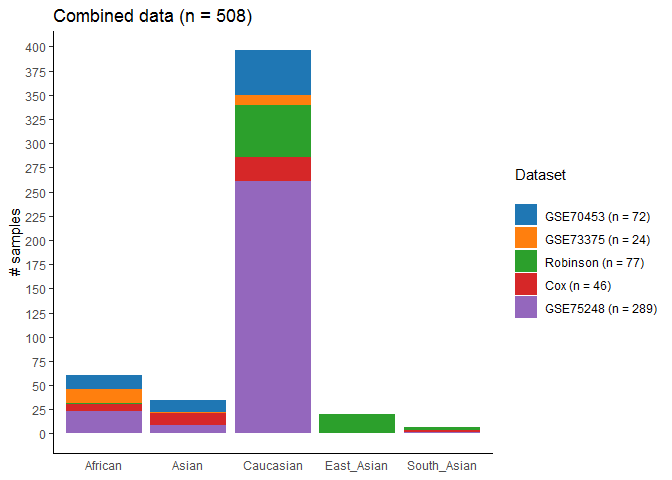<!-- -->

```r
composition <- data.frame(Group = factor(c('Caucasian', 'Asian', 'African'))) %>%
                              mutate(SampleSize = c(396, 62, 60),
                                     Total = cumsum(SampleSize),
                                     midpoint = Total - SampleSize/2,
                                     label = paste(Group, '\n', round(SampleSize/sum(SampleSize) * 100, 2), '%'))
# make blank theme
blank_theme <- theme_minimal()+
  theme(
  axis.title.x = element_blank(),
  axis.title.y = element_blank(),
  panel.border = element_blank(),
  panel.grid=element_blank(),
  axis.ticks = element_blank(),
  plot.title=element_text(size=14, face="bold"),
  axis.text.x=element_blank(),
  axis.text.y = element_blank()
  )

# pie chart, by ethnicity              
ggplot(composition, aes(x = 1, weight = SampleSize, fill = Group)) +
  geom_bar(position = 'stack', width = 1) +
  coord_polar('y', start = 0) +
  geom_text(aes(x = 1.2, y = midpoint, label = label)) +
  blank_theme +
  theme(legend.title = element_blank())
```

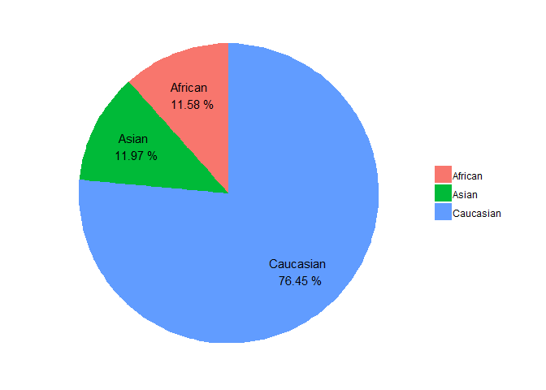<!-- -->

```r
#waffle chart, by ethnicity
SampleSize <- c(396, 62, 60)
label <- paste(composition$Group, ' (', round(SampleSize/sum(SampleSize) * 100, 2), '%)\n', sep = '')
names(SampleSize) <- label
waffle(SampleSize, rows = 20, flip = T, colors = c('darksalmon', 'gold1', 'olivedrab2')) +
  theme(legend.text = element_text(size = 24,vjust = -5),
        legend.key.size = unit(1.3, 'cm'))
```

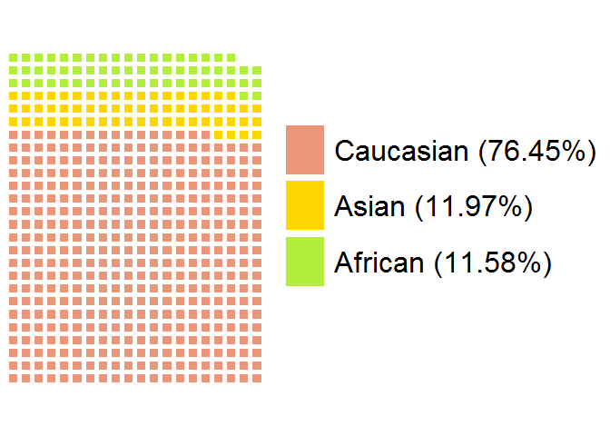<!-- -->

```r
raw <- getBeta(mset) #beta values
```

## 1.3 Sex Analysis

Here I predict sex and inspect sex chromosomesto identify sample mislabelling. I also use these tools to infer sex of the Fry samples.


```r
gset <- mapToGenome(ratioConvert(mset))

# plot predicted sex (Minfi)
ps <- getSex(gset, cutoff = -2)
```

```
## Warning in .getSex(CN = CN, xIndex = xIndex, yIndex = yIndex, cutoff
## = cutoff): An inconsistency was encountered while determining sex. One
## possibility is that only one sex is present. We recommend further checks,
## for example with the plotSex function.
```

```r
ggplot(ps %>% as.data.frame(), aes(x = xMed, y = yMed)) +
  geom_point(aes(col = predictedSex))
```

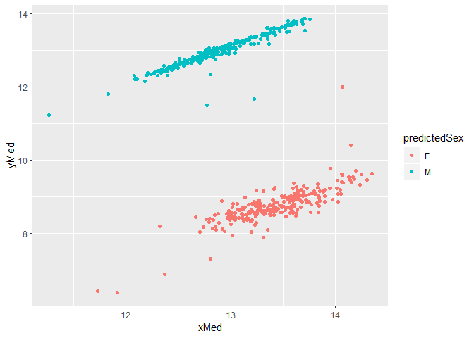<!-- -->

```r
# add predictedsex column
pDat$PredictedSex <- ps$predictedSex 

# add flagged column
pDat$Flag <- 'O'

# add inferred sex to 'sex' column for Fry/Michels (beecause we don't have their sex info)
pDat$Sex[which(pDat$Dataset == 'Fry')] <- pDat$PredictedSex[which(pDat$Dataset == 'Fry')]
pDat$Sex[which(pDat$Dataset == 'Michels')] <- pDat$PredictedSex[which(
  pDat$Dataset == 'Michels')]

pDat$Flag[which(pDat$Sex != pDat$PredictedSex)] <- 'X'

# Any samples with a predicted sex that doesn't match?
Flag <- pDat %>% filter(!(pDat$Sex == pDat$PredictedSex)) 
Flag
```

```
##   sampleNames Condition Ethnicity    PE     Plate GA GA_2  Array
## 1  GSM1947213       AGA Caucasian FALSE 2011GROUP 38    X R01C01
## 2  GSM1947253       SGA Caucasian FALSE 2011GROUP 39    X R04C02
## 3  GSM1947288       LGA Caucasian FALSE 2011GROUP 39    X R06C01
##        Slide Dataset MaternalEthnicity IUGR   BW BW_SD   CH matAge Sex
## 1 6008581028  Marsit             White <NA> <NA>  <NA> <NA>      X   F
## 2 5859594028  Marsit             White <NA> <NA>  <NA> <NA>      X   F
## 3 5806417064  Marsit             White <NA> <NA>  <NA> <NA>      X   F
##     rownames PredictedSex Flag
## 1 GSM1947213            M    X
## 2 GSM1947253            M    X
## 3 GSM1947288            M    X
```

```r
rm(gset)
```

3 samples appear to have incorrect sex information. I will further analyze these samples using sex chromosome analysis.

Note that amy found another sample with inconsistent sex information in the marsit data. I 
take a look at this sample.

Clustering on Sex Chromosomes


```r
# Filter based on xy probes
ann450k = getAnnotation(IlluminaHumanMethylation450kanno.ilmn12.hg19)
sexCh <- ann450k$Name[ann450k$chr %in% c('chrX', 'chrY')] 

raw_XY <- raw[sexCh,]
raw_XY_Mar <- raw_XY[,pDat$Dataset == 'Marsit']
raw_XY_Cox <- raw_XY[,pDat$Dataset == 'Cox']
raw_XY_Rob <- raw_XY[,pDat$Dataset == 'Robinson']

# cluster sex probes
d <- dist(t(na.omit(raw_XY_Mar)))
hc_Mar <- hclust(d, method = "complete")
d <- dist(t(na.omit(raw_XY_Cox)))
hc_Cox <- hclust(d, method = "complete")
d <- dist(t(na.omit(raw_XY_Rob)))
hc_Rob <- hclust(d, method = "complete")

plot(as.phylo(hc_Mar), lab4ut="axial", type = "unrooted", edge.width=0.5, cex=0.8,
     tip.color=as.numeric(pDat$Sex)[pDat$Dataset=='Marsit']-1, main = 'Marsit')
```

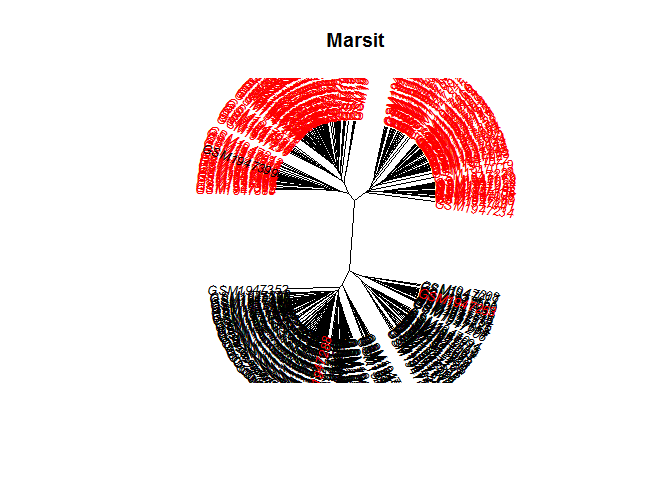<!-- -->

```r
plot(as.phylo(hc_Mar), lab4ut="axial", type = "unrooted", edge.width=0.5, cex=0.8,
     tip.color=as.numeric(as.factor(pDat$Flag))[pDat$Dataset=='Marsit'], main = 'Marsit')
```

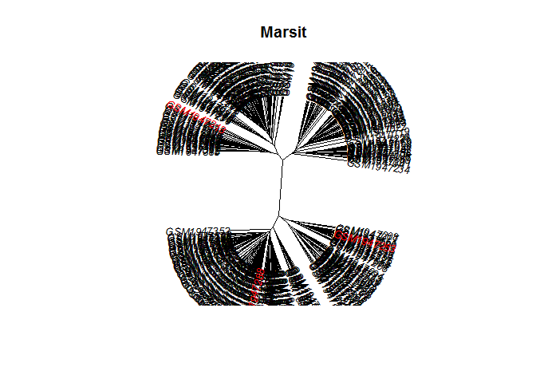<!-- -->

```r
plot(as.phylo(hc_Cox), lab4ut="axial", type = "unrooted", edge.width=0.5, cex=0.8,
     tip.color=as.numeric(pDat$Sex)[pDat$Dataset=='Cox']-1, main = 'Cox')
```

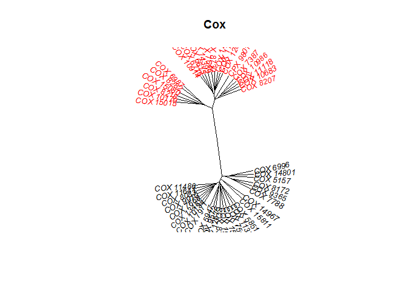<!-- -->

```r
plot(as.phylo(hc_Cox), lab4ut="axial", type = "unrooted", edge.width=0.5, cex=0.8,
     tip.color=as.numeric(as.factor(pDat$Flag))[pDat$Dataset=='Cox'], main = 'Cox')
```

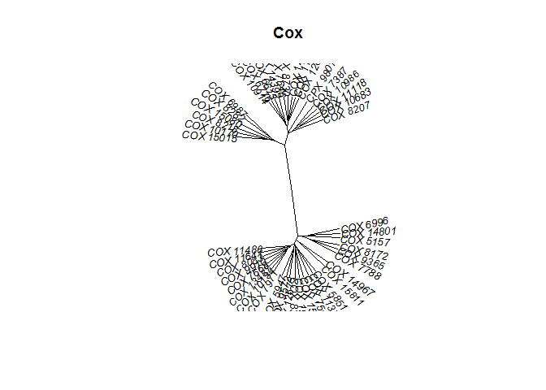<!-- -->

```r
plot(as.phylo(hc_Rob), lab4ut="axial", type = "unrooted", edge.width=0.5, cex=0.8,
     tip.color=as.numeric(pDat$Sex)[pDat$Dataset=='Robinson']-1, main = 'Robinson')
```

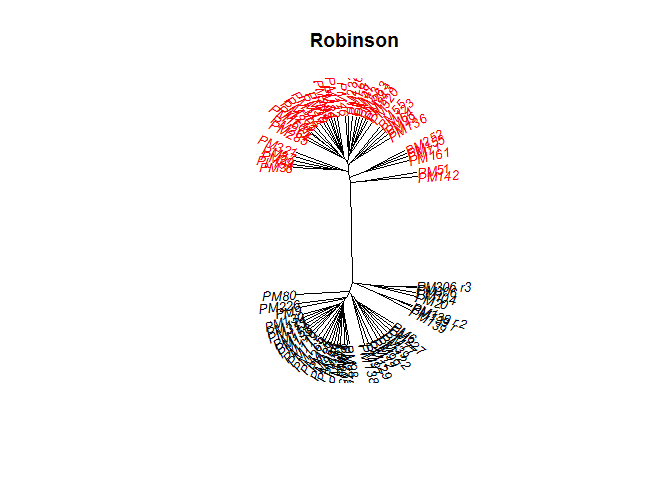<!-- -->

```r
plot(as.phylo(hc_Rob), lab4ut="axial", type = "unrooted", edge.width=0.5, cex=0.8,
     tip.color=as.numeric(as.factor(pDat$Flag))[pDat$Dataset=='Robinson'],
     main = 'Robinson')
```

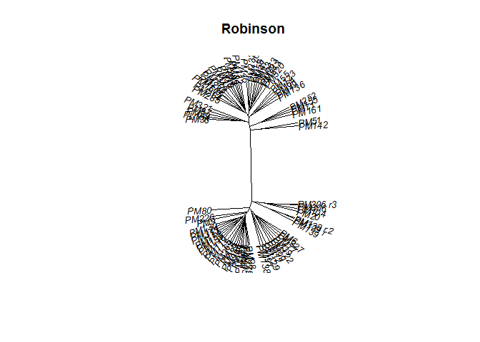<!-- -->

```r
# Find when a female/male labelled sample clusters with the opposite sex
sexMar <- (as.numeric(pDat %>% filter(Dataset == 'Marsit') %>% pull(Sex))*-1 + 4) 
psexMar <- cutree(hc_Mar, k = 2)
names(psexMar)[sexMar != psexMar]
```

```
## [1] "GSM1947253" "GSM1947288" "GSM1947399"
```

```r
ggplot( cbind(pDat, as.data.frame(ps)), aes(x = xMed, y = yMed)) +
  geom_point(aes(col = Sex)) +
  geom_text(aes(label = ifelse(sampleNames %in% names(psexMar)[sexMar != psexMar], sampleNames,'')))
```

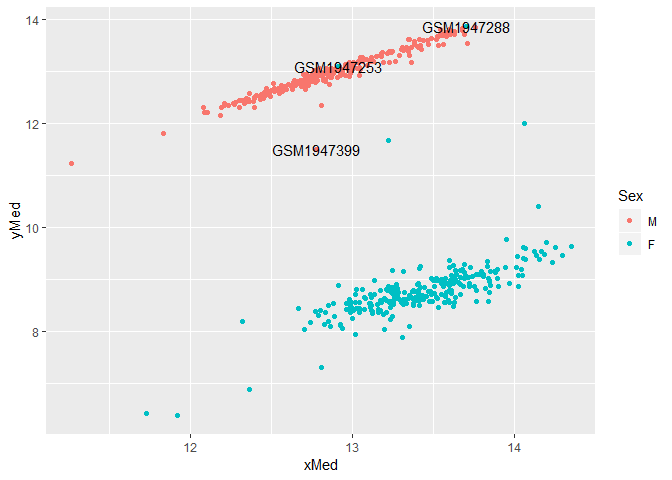<!-- -->

```r
# Generate heatmap, can choose to cluster rows / cols, and the labels (e.g. Sex, PredictedSex, Sample_Group)
cor_raw_XY <- cor(raw_XY, use = 'pairwise.complete.obs')

# Specify colors
ann_colors = list(
    Sex = c(M = "blue", F ="pink"),
    PredictedSex = c(M = "blue", F ="pink"),
    Dataset = brewer.pal(length(levels(pDat$Dataset)), 'Set1'),
    Ethnicity = c(Caucasian = '#984EA3', Asian = '#E41A1C', African = '#FFFF33', South_Asian = '#E41A1C', East_Asian = '#E41A1C'),
    Flag = c(O = 'Orange', X = 'Blue')
)

names(ann_colors$Dataset) <- levels(pDat$Dataset)

pheatmap(cor_raw_XY[,], cluster_rows=T, cluster_cols=T, 
         annotation_col = pDat %>% dplyr::select( Sex, PredictedSex, Dataset, Ethnicity, Flag), 
         annotation_colors = ann_colors,
         show_rownames = F, show_colnames = F,
         main = 'Clustering on Sex Chromosomes')
```

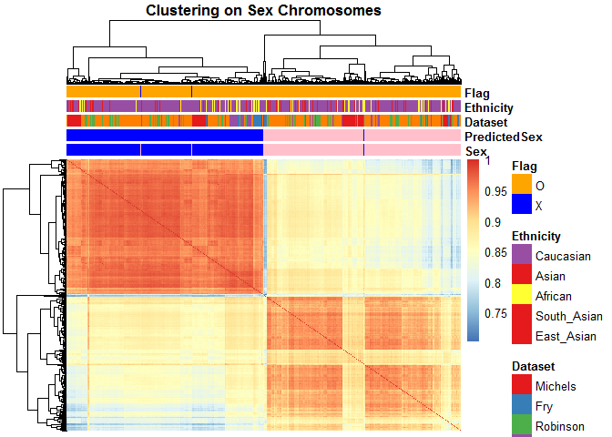<!-- -->

Samples with mislabelled sex: "GSM1947253" "GSM1947288" "GSM1947399"

# 2.0 Detection P BC

Load libraries and data 

```r
lapply(paste('package:',names(sessionInfo()$otherPkgs),sep=""),detach,character.only=TRUE,unload=TRUE)
```

```
## [[1]]
## NULL
## 
## [[2]]
## NULL
## 
## [[3]]
## NULL
## 
## [[4]]
## NULL
## 
## [[5]]
## NULL
## 
## [[6]]
## NULL
## 
## [[7]]
## NULL
## 
## [[8]]
## NULL
## 
## [[9]]
## NULL
## 
## [[10]]
## NULL
## 
## [[11]]
## NULL
## 
## [[12]]
## NULL
## 
## [[13]]
## NULL
## 
## [[14]]
## NULL
## 
## [[15]]
## NULL
## 
## [[16]]
## NULL
## 
## [[17]]
## NULL
## 
## [[18]]
## NULL
## 
## [[19]]
## NULL
## 
## [[20]]
## NULL
## 
## [[21]]
## NULL
## 
## [[22]]
## NULL
## 
## [[23]]
## NULL
## 
## [[24]]
## NULL
## 
## [[25]]
## NULL
## 
## [[26]]
## NULL
## 
## [[27]]
## NULL
## 
## [[28]]
## NULL
## 
## [[29]]
## NULL
## 
## [[30]]
## NULL
## 
## [[31]]
## NULL
## 
## [[32]]
## NULL
## 
## [[33]]
## NULL
## 
## [[34]]
## NULL
## 
## [[35]]
## NULL
## 
## [[36]]
## NULL
## 
## [[37]]
## NULL
## 
## [[38]]
## NULL
## 
## [[39]]
## NULL
## 
## [[40]]
## NULL
## 
## [[41]]
## NULL
## 
## [[42]]
## NULL
## 
## [[43]]
## NULL
## 
## [[44]]
## NULL
## 
## [[45]]
## NULL
## 
## [[46]]
## NULL
## 
## [[47]]
## NULL
## 
## [[48]]
## NULL
```

```r
library(minfi)
library(wateRmelon)
library(dplyr)
library(pheatmap)
library(ggplot2)
library(RColorBrewer)
library(parallel)
library(gridExtra)
library(reshape)
library(RColorBrewer)

# load rob cox marsit data
rgset_RCM <- readRDS('../../Robjects_final/00_rgset_RobCoxMarsit.rds')
pDat_RCM <- as.data.frame(pData(rgset_RCM))

colnames(rgset_RCM) <- pDat_RCM$sampleNames
pDat_RCM$rownames <- rownames(pDat_RCM)
```

### 2.1 Load detp and merge

Here I load the detection p value data for each dataset and merge them all into one big data frame.
The Rob, Cox, and Marsit data has already been merged, when I combined them as one 'rgset'. 


```r
# get detection p value matrix for RCM
system.time(det_RCM <- detectionP(rgset_RCM))
```

```
## Loading required package: IlluminaHumanMethylation450kmanifest
```

```
##    user  system elapsed 
##  289.35   16.00  305.45
```

```r
#remove extra ethn samples
ind <- pDat %>% filter(Dataset == 'Robinson' | Dataset == 'Cox' | Dataset == 'Marsit') %>%
  pull(sampleNames)
all(ind %in% colnames(det_RCM))
```

```
## [1] TRUE
```

```r
det_RCM <- det_RCM[,ind] 

# load fry detect p value
det_F <- readRDS('../../Robjects_final/00_detectP_Fry.rds')
pDat_Fry <- pDat %>% filter(Dataset == 'Fry')

# put samplenames into colnames of det_F
all(pDat_Fry$sampleNames %in% colnames(det_F))
```

```
## [1] TRUE
```

```r
det_F <- det_F[,pDat_Fry$sampleNames] #reorder det_F matching pDat_Fry
colnames(det_F) <-pDat_Fry$sampleNames
head(det_F)
```

```
##            P1 P2 P6 Q1 Q2 Q4 Q6 P9 P10 P11 P12 Q7 Q8 Q9 Q10 Q12 P19 Q20
## cg00000029  0  0  0  0  0  0  0  0   0   0   0  0  0  0   0   0   0   0
## cg00000108  0  0  0  0  0  0  0  0   0   0   0  0  0  0   0   0   0   0
## cg00000109  0  0  0  0  0  0  0  0   0   0   0  0  0  0   0   0   0   0
## cg00000165  0  0  0  0  0  0  0  0   0   0   0  0  0  0   0   0   0   0
## cg00000236  0  0  0  0  0  0  0  0   0   0   0  0  0  0   0   0   0   0
## cg00000289  0  0  0  0  0  0  0  0   0   0   0  0  0  0   0   0   0   0
##            P13 P14 P16 P17 P18 Q14 Q15 Q16 Q17
## cg00000029   0   0   0   0   0   0   0   0   0
## cg00000108   0   0   0   0   0   0   0   0   0
## cg00000109   0   0   0   0   0   0   0   0   0
## cg00000165   0   0   0   0   0   0   0   0   0
## cg00000236   0   0   0   0   0   0   0   0   0
## cg00000289   0   0   0   0   0   0   0   0   0
```

```r
# Load Michels
load('../../data/Michels/GSE70453 for Ethnicity.RData')
all(colnames(lumiMethy.GDM) %in% pDat$sampleNames) # FALSE, because of extra ethn samples
```

```
## [1] FALSE
```

```r
# remove samples with irrelevant ethnicity samples
ncol(lumiMethy.GDM) #82
```

```
## Samples 
##      82
```

```r
lumiMethy.GDM <- lumiMethy.GDM[,pDat[pDat$Dataset=='Michels','sampleNames']]
ncol(lumiMethy.GDM) #73
```

```
## Samples 
##      73
```

```r
all(colnames(lumiMethy.GDM) %in% pDat$sampleNames) # should be TRUE now
```

```
## [1] TRUE
```

```r
#get detection p values
det_Mic <- pvals(lumiMethy.GDM)

# get nbead info for A and B probes
bcA_Mic <- lumiMethy.GDM@assayData$Avg_NBEADS_A
bcB_Mic <- lumiMethy.GDM@assayData$Avg_NBEADS_B

# get indices which probes are <3
indA <- bcA_Mic < 3
indB <- bcB_Mic < 3

# combine into one
indA[indB] <- TRUE

sum(indA) # 33374 cells with bc < 3
```

```
## [1] 33374
```

```r
bc_Mic <- indA   # so bc_Mic is a bead count matrix with logical values, where TRUE corresponds to a bead count atha is less than 3, and FALSE is for cells that have a bead count > 3
rm(indA, indB)

all(colnames(bc_Mic) %in% pDat$sampleNames)
```

```
## [1] TRUE
```


Here I look at bad detection p value probes. I can get detection p values from the rgset containing Marsit, Cox, and Robinson datasets. 


```r
dim(det_F)   # 485577 27
```

```
## [1] 485577     27
```

```r
dim(det_RCM) # 485512 418
```

```
## [1] 485512    418
```

```r
dim(det_Mic) # 485577 73
```

```
## [1] 485577     73
```

```r
det_F <- det_F[rownames(det_RCM),] # re order probes, drops the snp probes
det_Mic <- det_Mic[rownames(det_RCM),] # re order probes, drops the snp probes

identical(rownames(det_F), rownames(det_RCM)) #sanity check
```

```
## [1] TRUE
```

```r
identical(rownames(det_Mic), rownames(det_RCM)) #sanity check
```

```
## [1] TRUE
```

```r
identical(rownames(det_Mic), rownames(det_F)) #sanity check
```

```
## [1] TRUE
```

```r
dim(det_F)   # 485512 27
```

```
## [1] 485512     27
```

```r
dim(det_RCM) # 485512 418
```

```
## [1] 485512    418
```

```r
dim(det_Mic) # 485512 73
```

```
## [1] 485512     73
```

```r
#make data frame
det_F <- as.data.frame(det_F)
det_RCM <- as.data.frame(det_RCM)
det_Mic <- as.data.frame(det_Mic)

# add merging column
det_F$Cpg <- rownames(det_F) # for merging
det_RCM$Cpg <- rownames(det_RCM)
det_Mic$Cpg <- rownames(det_Mic) # for merging

#merge
det <- inner_join(det_F, det_Mic, by = 'Cpg') # join fry and Michels
det <- inner_join(det, det_RCM, by = 'Cpg') # join FM and rcm

# drop Cpg column, input as rownames
rownames(det) <- det$Cpg
det <- det[, -match('Cpg', colnames(det))]
dim(det) #485512 518
```

```
## [1] 485512    518
```

```r
# make sure pDat is in right order as det
identical(rownames(pDat), colnames(det)) #False
```

```
## [1] FALSE
```

```r
all(pDat$sampleNames %in% colnames(det)) # True - just in wrong order
```

```
## [1] TRUE
```

```r
ncol(det) #518
```

```
## [1] 518
```

```r
nrow(pDat) #518
```

```
## [1] 518
```

```r
# reorder
pDat <- pDat[colnames(det), ]
identical(rownames(pDat), colnames(det)) # re ordered
```

```
## [1] TRUE
```

```r
dim(pDat) #518 21
```

```
## [1] 518  20
```


```r
saveRDS(det, "../../Robjects_final/01_detP_RCMFM.rds")
```

Detection p - sample filtering

Here I look at the number of failed probes defined as having a detection p value >0.01 in > 5% of all probes per sample, for the purpose of sample filtering.


```r
barplot(colMeans(det),col=brewer.pal(8,"Dark2")[factor(pDat$Dataset)],
        las=2,cex.names=0.8, main="Mean detection p-values", ylim = c(0,0.02), 
        names.arg ='', xlab = 'Sample')
```

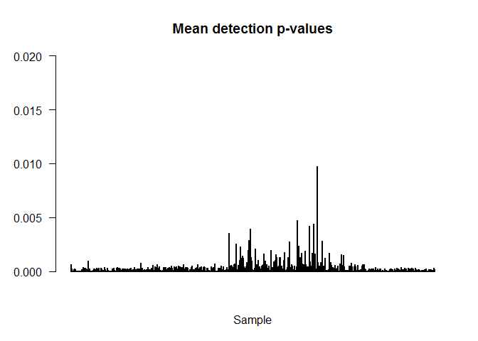<!-- -->


```r
# num of probes in a sample that fail the cutoff
ndet <- colSums(det > 0.01, na.rm = T)
head(ndet)
```

```
##   P1   P2   P6   Q1   Q2   Q4 
## 1462  313  140  105  114  249
```

```r
pDat$ndet <- ndet[match(pDat$rownames, names(ndet))] # put into pDat
```

Below I calculate the number of samples with a total number of bad detection p value probes that is greater than 5% of the total amount of probes (~4800). 

I also want to highlight samples that have a low mean interarray correlation (<0.95).


```r
# how many samples have > 1% of their probes that failed the cutoff?
sum(pDat$ndet > 0.05*nrow(det)) # 0
```

```
## [1] 0
```

Looks like no samples have >5% failed probes. 

ndetect p probes

Horvath only keeps probes with < 10 missing values (note)


```r
probes_morethan5NAs <- as.data.frame(names(which((rowSums(det > 0.01, na.rm = T)>5))))
```


```r
write.table(probes_morethan5NAs, '../../Robjects/probes_morethan5NAs.txt')
```

## 2.2 nbeads

Here I look at beadcount information. For this I only have information for the robinson, cox, 
marsit, and Michels data.

Examine thresholds


```r
#obtain beadcounts from an extended rgset using Watermelon function
rgset_RCM <- rgset_RCM[,ind]
bc_RCM <- beadcount(rgset_RCM)
dim(bc_RCM) # 485512 418
```

```
## [1] 485512    418
```

```r
sum(is.na(bc_RCM)) #237040
```

```
## [1] 237040
```

```r
dim(bc_Mic) # 485577 73
```

```
## [1] 485577     73
```

```r
bc_Mic <- bc_Mic[rownames(bc_RCM),]
dim(bc_Mic) # 485512 73
```

```
## [1] 485512     73
```

```r
sum(bc_Mic) #33374
```

```
## [1] 33374
```

```r
bc <- cbind(bc_RCM, bc_Mic)
dim(bc) #485512 491
```

```
## [1] 485512    491
```

```r
head(bc) 
```

```
##            PL104 PM104 PM112 PM114 PM115 PM116 PM119 PM12 PM120 PM122
## cg00050873    18    20    24    16    12     6    25   15    11    16
## cg00212031     8    20     8    16    16    15    28   10    23    12
## cg00213748    10     9    18     5     9     8     8   13     9    11
## cg00214611    12    17     6    14    18    18    20   19    21    13
## cg00455876    16    24     9    14    24    11    16   17    14    10
## cg01707559     9    11    12    16    11    10    10    7    11    11
##            PM123 PM124 PM129 PM130 PM135 PM136 PM138 PM139 PM139_r
## cg00050873    28    16    17     8    13    13    13    17      18
## cg00212031    19    16    21    21    22    16    18    24      17
## cg00213748     5    13    15    14     5    11    14    13      16
## cg00214611    12    13    14    22    12    19    12    14      15
## cg00455876    14    16    14    12    10    19    11    20      15
## cg01707559    14    17    14     9    20     7    11    14       9
##            PM139_r2 PM142 PM153 PM155 PM161 PM167 PM167_r PM17 PM181 PM20
## cg00050873       20    22    21    12    13    28       8   11    13   20
## cg00212031       19    14    19    18    12    17      14    8    15   20
## cg00213748        9    11    13    15     9     5      17   10    15   15
## cg00214611       15    21    17    14    14    18      17    8    15   15
## cg00455876       12    23    16    15    13    19      11   12    19    9
## cg01707559       16    10    12    11    19     8      18   12    10   12
##            PM205 PM226 PM227 PM233 PM243 PM249 PM252 PM256 PM263 PM264
## cg00050873    14    19    23    21    20    14    16    18    15    17
## cg00212031    18    25    24    17    26     8    17    12    13     6
## cg00213748    15    16     9    18    13    14    16    12    15     7
## cg00214611    16    22    17    11    15    11    13    20    13    14
## cg00455876    15     8    23    10    18    15    17    10     7    14
## cg01707559    16    14     5     8    13    10     8     8     7     9
##            PM269 PM272 PM275 PM285 PM29 PM30 PM306 PM306_r3 PM307 PM313
## cg00050873    14    16    18    18   17   15    22       17    11    16
## cg00212031    13    11    13    16   20    6    19       10    15    15
## cg00213748    11    11     9     9   10   18    14       15     9    10
## cg00214611    11    17    16    22   15    9    12       17    11    14
## cg00455876     9     8    18    12   15   16    11       17     9    14
## cg01707559    13    11    18    21    4    4    13       10    16     7
##            PM320 PM321 PM329 PM343 PM36 PM39 PM4 PM44 PM46 PM47 PM49 PM51
## cg00050873    13    13    11    13    9   15  28   18   15   15    6   11
## cg00212031    14    13    10    19   14   19  12   12   14    8   10   12
## cg00213748    13    13    12    20    7   17  10   18   15   12    9    9
## cg00214611    16     5    27    22    9   15  16   23    5   17   10    9
## cg00455876    16    16    14    11   13    8  18   24   13    5   NA   10
## cg01707559    10    11    16    13    5   16   8   16    8   10   14   10
##            PM53 PM55 PM58 PM6 PM64 PM71 PM74 PM76 PM77 PM80 PM84 PM87 PM9
## cg00050873   20   14   23   8    3   23   25   18   16   17   26    5  15
## cg00212031   16    9    6  17    5   17   18   19   10   11   21    4  12
## cg00213748    9   12   11  12    9   11   17    8   13   21   12   11  13
## cg00214611   16    9   11  12    5   12   15   18   18   18   21    5  20
## cg00455876   16   18   11  15    7   10   14   10   14   11   20   13  11
## cg01707559    7   12   12   7    7   14   10   14   19    5   16   13  13
##            PM97 PM98 PM99 COX_6776 COX_6613 COX_8319 COX_6987 COX_10170
## cg00050873   16   26   17       27       15       17       17        20
## cg00212031   13   17   14       13       17       18       14        18
## cg00213748    9    8    8       15       14        9       14        14
## cg00214611   18   19   12       14       11       10       13        20
## cg00455876   13   14   20       11       16       NA       20        16
## cg01707559    7   14    6       13       20       13       18         7
##            COX_10986 COX_14801 COX_7387 COX_11378 COX_11405 COX_11486
## cg00050873        19        16       18        12        17        18
## cg00212031        14        10       14        13        16        20
## cg00213748        14         5       10        13        11        20
## cg00214611        22         4       14        18        15         6
## cg00455876        21        17        9        15        12        16
## cg01707559        15        11       20        11        10        12
##            COX_15449 COX_8730 CPX_9801 COX_10914 COX_13487 COX_9572
## cg00050873        16       16       15        13        22       21
## cg00212031        20       10       19        12        26        8
## cg00213748         9       18        7        14        10       10
## cg00214611        12       17       14        18        10        9
## cg00455876         9       10       15        15        13        8
## cg01707559        14        8       16        13        12       12
##            COX_12880 COX_15080 COX_5157 COX_5947 COX_6996 COX_7668
## cg00050873        14        10       15        9       23       15
## cg00212031        16        25        4       13       10       16
## cg00213748        18        10       18       13       18       13
## cg00214611        17        15       13       12       15       11
## cg00455876        11        22        9       11       12       13
## cg01707559         9        12        9       16       10       14
##            COX_8282 COX_15039 COX_14392 COX_10683 COX_11641 COX_15015
## cg00050873       13        14        13        14        16        14
## cg00212031       17        17        17        21        12        13
## cg00213748       11        19        13         8        10        13
## cg00214611       18        20        25        15        16        16
## cg00455876       17        18        16        15        13        13
## cg01707559       15        11        12        11        13        16
##            COX_15811 COX_5851 COX_7513 COX_10134 COX_11118 COX_12673
## cg00050873        22       11       15        19        15        21
## cg00212031        17       20        9        13        19        22
## cg00213748        11       20       18        12        12        17
## cg00214611        14       12       14         8        14        18
## cg00455876        10        8       18        12         8        12
## cg01707559         6       17       10        12        13        14
##            COX_7646 COX_7971 COX_12747 COX_14967 COX_7788 COX_8218
## cg00050873       14       14        12        16        9       26
## cg00212031       15       15        12        17       12       12
## cg00213748       13       11         9        20       11       14
## cg00214611       10       13        16        11       12       21
## cg00455876       17       15        13        21       18       15
## cg01707559       20       19        10        11       12       16
##            COX_8083 COX_9365 COX_9910 COX_8172 COX_8207 GSM1947014
## cg00050873       14       13       19       10       14          6
## cg00212031       15       11       16       21       12         19
## cg00213748        8       12       18       11       16         11
## cg00214611       11       15       13        7       11         11
## cg00455876       19       16       15       15       16         19
## cg01707559       13       18       15       11       14         13
##            GSM1947015 GSM1947017 GSM1947018 GSM1947019 GSM1947020
## cg00050873         11         13         12          4          7
## cg00212031         14         17         11         11          8
## cg00213748          8         15         10          8         14
## cg00214611         14         15         10          4         15
## cg00455876         15         13          9          6          9
## cg01707559         10          8         13         13          6
##            GSM1947022 GSM1947023 GSM1947024 GSM1947025 GSM1947026
## cg00050873         17         17         17         14         10
## cg00212031          9          8          7         10         10
## cg00213748         13         16         10          9         10
## cg00214611          8          7          7         12         10
## cg00455876          6          7         10          6         12
## cg01707559         18         10         21          7         17
##            GSM1947027 GSM1947028 GSM1947029 GSM1947030 GSM1947031
## cg00050873         10         14         10         18         19
## cg00212031         18         22         14         11         11
## cg00213748         19         16         12         15         12
## cg00214611         12         18          9         11          9
## cg00455876         16         14          7         10         10
## cg01707559          4         16         19         10         13
##            GSM1947032 GSM1947034 GSM1947035 GSM1947036 GSM1947038
## cg00050873         15         14         21         20          8
## cg00212031         17         11         17         19          8
## cg00213748         13         10         14         17         15
## cg00214611          8         11         13          7          3
## cg00455876         11          8         13         10          6
## cg01707559         14         16          7         12         17
##            GSM1947040 GSM1947041 GSM1947042 GSM1947043 GSM1947045
## cg00050873         17         14         16         14         17
## cg00212031         12         13          8          8         18
## cg00213748         12         19         10          7         12
## cg00214611         13          8          9          9         12
## cg00455876          9          8         15         13         12
## cg01707559          6         13         13          9         10
##            GSM1947046 GSM1947047 GSM1947073 GSM1947075 GSM1947077
## cg00050873         10         17         17          6         13
## cg00212031         11         10         10          9         14
## cg00213748         12          9         10          9         15
## cg00214611          7         16         17         17         17
## cg00455876         12         10         11         12         10
## cg01707559         10          8         10         14         13
##            GSM1947078 GSM1947079 GSM1947080 GSM1947081 GSM1947082
## cg00050873         19         15         25         17          9
## cg00212031         16         12         16         18          9
## cg00213748         14          9         13         24         12
## cg00214611         16          7         14          9         15
## cg00455876         13         12         10         16         12
## cg01707559         20         14          5         12         22
##            GSM1947083 GSM1947084 GSM1947085 GSM1947087 GSM1947088
## cg00050873          5         18         16         12         15
## cg00212031         15         14         11         15         13
## cg00213748         15         14         13         10         20
## cg00214611          8         16         13         12          9
## cg00455876          4         13         11          8         11
## cg01707559         15         12         13          8         12
##            GSM1947089 GSM1947090 GSM1947091 GSM1947092 GSM1947093
## cg00050873         17         15         10         13         14
## cg00212031         11          6         12         12         17
## cg00213748         13          6          8         12         14
## cg00214611          6          6         18         11          7
## cg00455876         13          9         17          6         18
## cg01707559          9         10          7          6          9
##            GSM1947094 GSM1947095 GSM1947097 GSM1947098 GSM1947099
## cg00050873         17         16         13         10         15
## cg00212031         14         10         11          5          8
## cg00213748         11         16         16          8          8
## cg00214611         11         16          7          6          8
## cg00455876         16         15         17         11         18
## cg01707559          8          8         12          5          7
##            GSM1947100 GSM1947101 GSM1947102 GSM1947103 GSM1947104
## cg00050873          9         13          9         11         17
## cg00212031         16         10         10          6         13
## cg00213748         10          9         13          7         15
## cg00214611          8         11          6         12          8
## cg00455876          8         17         18         14          8
## cg01707559         16          9         12         15         19
##            GSM1947106 GSM1947107 GSM1947108 GSM1947109 GSM1947110
## cg00050873         18         16         19         12         11
## cg00212031          9         10         15         11         23
## cg00213748         19          6         11          9         17
## cg00214611         10         NA         17          3         12
## cg00455876          5         13          7         13         10
## cg01707559         16          8         14         18          8
##            GSM1947111 GSM1947112 GSM1947113 GSM1947114 GSM1947115
## cg00050873         19         13          7         14         13
## cg00212031         15         12         11         10         16
## cg00213748         12         17          9         10         10
## cg00214611         15          7          8         13         12
## cg00455876         15          8         11         11         12
## cg01707559         11         16         15          5         10
##            GSM1947116 GSM1947117 GSM1947118 GSM1947119 GSM1947121
## cg00050873         17         18         16         13         14
## cg00212031         13         15         16         12          8
## cg00213748         10         16         21         16          7
## cg00214611          8         12         11         11          8
## cg00455876          7          8          7         12         14
## cg01707559          9          9         10         10         11
##            GSM1947122 GSM1947123 GSM1947124 GSM1947125 GSM1947126
## cg00050873         13          9         13         21         15
## cg00212031          9         10         11         18         17
## cg00213748          6         18         10         11         10
## cg00214611         14         13         12          9         14
## cg00455876         12         10         15         22         13
## cg01707559         12         12          8          8          9
##            GSM1947127 GSM1947128 GSM1947129 GSM1947130 GSM1947131
## cg00050873          9         14         22         13         14
## cg00212031          9          9         17         21         10
## cg00213748         10          6         13         16          4
## cg00214611         11          9         11         24          3
## cg00455876         11         12         10         15         10
## cg01707559         10         13         15          7         11
##            GSM1947133 GSM1947134 GSM1947135 GSM1947136 GSM1947137
## cg00050873          5         18         21          9         12
## cg00212031          3         13         14         16         10
## cg00213748         NA          9         16         10         11
## cg00214611         NA         13         16         14          8
## cg00455876          9         15         14         17         14
## cg01707559         13         17         17          8          9
##            GSM1947138 GSM1947139 GSM1947140 GSM1947142 GSM1947143
## cg00050873          5         19         21         22         12
## cg00212031         13         17          9         12          8
## cg00213748         13         12         10         14         12
## cg00214611          6          7          8          7         11
## cg00455876          8         17         21         23         14
## cg01707559          9          6         16         10          9
##            GSM1947144 GSM1947145 GSM1947146 GSM1947147 GSM1947148
## cg00050873         13          9         18         24         12
## cg00212031         22         12         20         13         14
## cg00213748         13          7          6         21          7
## cg00214611         18          7         12          9         11
## cg00455876         17          9          7         12          6
## cg01707559         11         15          9         14         17
##            GSM1947149 GSM1947150 GSM1947151 GSM1947154 GSM1947155
## cg00050873         28         11         25         23         11
## cg00212031         12         14         14         17          4
## cg00213748         19         10         11         13         13
## cg00214611          8         12          9         20          8
## cg00455876          5         15         13          5          8
## cg01707559          8          8         20          6         15
##            GSM1947156 GSM1947157 GSM1947158 GSM1947159 GSM1947160
## cg00050873         17         13          7         10          7
## cg00212031         12          5         18          5         16
## cg00213748         10         10         13         10          9
## cg00214611         11          9          9         13          6
## cg00455876         22         11          9         12         15
## cg01707559         18         12         14          8         13
##            GSM1947161 GSM1947163 GSM1947192 GSM1947193 GSM1947194
## cg00050873         12         19         13         11         15
## cg00212031          9          9         15         12         12
## cg00213748         10         12         12          8         10
## cg00214611         16         16          6         15         13
## cg00455876         12         11         17         15          7
## cg01707559          6         13         10         11         11
##            GSM1947195 GSM1947196 GSM1947197 GSM1947198 GSM1947200
## cg00050873          8         21         11         11         17
## cg00212031          9         19         13         11         13
## cg00213748          7          7          9         11          7
## cg00214611         10         12          6          8         16
## cg00455876         10          9          7         12         20
## cg01707559          8         14          8         17          7
##            GSM1947201 GSM1947202 GSM1947203 GSM1947205 GSM1947206
## cg00050873         21         25         14         15         15
## cg00212031         14         13          8         18         18
## cg00213748         17         19         13          9         12
## cg00214611         13         17         13          9         20
## cg00455876          7         19         13         18          9
## cg01707559         10          9         12         13         12
##            GSM1947207 GSM1947208 GSM1947209 GSM1947211 GSM1947212
## cg00050873         12          7         18         16         12
## cg00212031         23         13         20         16         12
## cg00213748         17         11         14          9          7
## cg00214611         15         10         12         15         13
## cg00455876         14         11         10         11         21
## cg01707559          9         13         13          8         11
##            GSM1947213 GSM1947214 GSM1947215 GSM1947216 GSM1947218
## cg00050873         14         11         18         16         15
## cg00212031         13         20         12          7         14
## cg00213748         10         11         16         12          9
## cg00214611         13         14         15         13          7
## cg00455876         10         12         17         15          9
## cg01707559          8         11         10          9          7
##            GSM1947219 GSM1947220 GSM1947221 GSM1947222 GSM1947223
## cg00050873         18         22         13         14         11
## cg00212031         14         12         15         17         11
## cg00213748         13         16          9         17         11
## cg00214611         17         10          9         12         12
## cg00455876         11         16         14          5          8
## cg01707559         10         19         11         10         15
##            GSM1947224 GSM1947225 GSM1947226 GSM1947227 GSM1947228
## cg00050873         15         17         13         11         18
## cg00212031         12         11         15          9         11
## cg00213748         16         12         13         19         12
## cg00214611          6         12         12         11         12
## cg00455876         11          7         12         11          8
## cg01707559         12          7         15         15         10
##            GSM1947229 GSM1947230 GSM1947231 GSM1947232 GSM1947233
## cg00050873         19         15         12         15         12
## cg00212031         13         12         NA         17          9
## cg00213748         17         13         20         14         11
## cg00214611          8         15         18         10          9
## cg00455876         18          5         15          8         17
## cg01707559         12         14         17         15         13
##            GSM1947234 GSM1947235 GSM1947236 GSM1947237 GSM1947238
## cg00050873          8         14          7         19         21
## cg00212031          6         11          8         14         13
## cg00213748         13          7         NA          8         10
## cg00214611          6         11         13         10         12
## cg00455876         10         13         15         15         15
## cg01707559         11         13         17         18          6
##            GSM1947239 GSM1947240 GSM1947241 GSM1947242 GSM1947243
## cg00050873         13         11         22         15         11
## cg00212031         15          9          8         10         14
## cg00213748         14         12         12         10         11
## cg00214611         16         11          9         19         13
## cg00455876         13         19         12         14         10
## cg01707559         14         25         15         20          8
##            GSM1947244 GSM1947245 GSM1947246 GSM1947247 GSM1947248
## cg00050873         13         13         17         14         12
## cg00212031         15         12          9         15         18
## cg00213748          7         12         14          8         15
## cg00214611         14          9         12         14          4
## cg00455876         17         10         20          9         13
## cg01707559         14         14         10         11         12
##            GSM1947249 GSM1947250 GSM1947251 GSM1947252 GSM1947253
## cg00050873         12         13         26         13         15
## cg00212031         12         14          7         11         22
## cg00213748          7          8         14         12         12
## cg00214611          5         15         11         12         10
## cg00455876          7         13         11         11         14
## cg01707559         16          9         20         14         19
##            GSM1947254 GSM1947255 GSM1947257 GSM1947258 GSM1947259
## cg00050873          9         13         19         13         23
## cg00212031          9         16          9         12         20
## cg00213748         12         14         11         18         12
## cg00214611          6         13         11         16         18
## cg00455876          5         10         17         21         14
## cg01707559         13          8         17          8          8
##            GSM1947260 GSM1947262 GSM1947263 GSM1947264 GSM1947266
## cg00050873         12         18         13         10          9
## cg00212031         11         22          9          8         10
## cg00213748          8         22         15          5         10
## cg00214611         23         14         11          7          7
## cg00455876          5         11         11         16          7
## cg01707559         14         13         22         11         17
##            GSM1947267 GSM1947268 GSM1947269 GSM1947270 GSM1947272
## cg00050873         11          8         19         16         18
## cg00212031         11         13         11         11         15
## cg00213748         17          7         18         15         10
## cg00214611         13         12         10          8          8
## cg00455876          7         18         11         12         13
## cg01707559         11         10         15         14         14
##            GSM1947273 GSM1947274 GSM1947275 GSM1947276 GSM1947277
## cg00050873         23          5         16          8          5
## cg00212031         10          7          6         14         17
## cg00213748          6          9          8         14          9
## cg00214611          8         12         16          7         10
## cg00455876         14         NA          8         13          9
## cg01707559          6          8          8         12          9
##            GSM1947278 GSM1947279 GSM1947280 GSM1947281 GSM1947282
## cg00050873         18         22         16         16         10
## cg00212031          9          9         14         16         13
## cg00213748         15         17         14          9         16
## cg00214611         13         18         11         NA         10
## cg00455876         12         11         17          9         10
## cg01707559         11         11         13          7         15
##            GSM1947283 GSM1947284 GSM1947285 GSM1947286 GSM1947287
## cg00050873          8         10         15         10         10
## cg00212031         12         10          8          7         14
## cg00213748         10          5         11          8         16
## cg00214611         12          9         12         17         15
## cg00455876         11         13          8         13          6
## cg01707559          7         14          6         12         10
##            GSM1947288 GSM1947289 GSM1947291 GSM1947293 GSM1947295
## cg00050873         12         17          8         20         15
## cg00212031         14         12         12         12         15
## cg00213748         12         14         17         10         11
## cg00214611          4         13          5         10         15
## cg00455876          7         16         13         11          8
## cg01707559          6         13         15         14         15
##            GSM1947296 GSM1947297 GSM1947298 GSM1947300 GSM1947302
## cg00050873         13         15         12         10         12
## cg00212031         16         16         14          9         17
## cg00213748         12         16          9         10         16
## cg00214611         19         21          8         18         16
## cg00455876         14         10         10         15         13
## cg01707559         14         14         15          9         13
##            GSM1947303 GSM1947304 GSM1947305 GSM1947306 GSM1947307
## cg00050873         18         14         17         16         14
## cg00212031         12         13         17         19         17
## cg00213748         12         17         17         22         14
## cg00214611         16          4         15         17         19
## cg00455876         15          8         15         16          7
## cg01707559         12         13          9         13          8
##            GSM1947309 GSM1947310 GSM1947312 GSM1947313 GSM1947314
## cg00050873         16         14         12         22         17
## cg00212031         11         15          8         19         27
## cg00213748          8         12          8         17         14
## cg00214611         12         12         NA         13         12
## cg00455876         13         21         12          5          6
## cg01707559         11         16         13         11         15
##            GSM1947315 GSM1947317 GSM1947318 GSM1947319 GSM1947320
## cg00050873         14         11         13         18         18
## cg00212031         10         15         10         16         14
## cg00213748         12          9         13         16         11
## cg00214611         10         10         14         14         19
## cg00455876         13         11         13         19          9
## cg01707559          8         12          6         15         11
##            GSM1947321 GSM1947322 GSM1947323 GSM1947324 GSM1947325
## cg00050873         19         23         13         11          9
## cg00212031         13         13         17         18         17
## cg00213748         13         12          9          9          7
## cg00214611         11          9          8          9         15
## cg00455876         14         10         15         18         22
## cg01707559         13         17          8         15         15
##            GSM1947326 GSM1947328 GSM1947329 GSM1947330 GSM1947331
## cg00050873          9         16         13         21         13
## cg00212031          9         16         18         12         15
## cg00213748         17         19          7         18         17
## cg00214611         16         20         17         11         22
## cg00455876         20         15         13         12         14
## cg01707559         15         11         17         10         10
##            GSM1947332 GSM1947335 GSM1947336 GSM1947337 GSM1947338
## cg00050873         18          5         14         13          7
## cg00212031         16         16         13         19          7
## cg00213748         12          7          9         10          5
## cg00214611         16          4          9          9         16
## cg00455876         15          8         15         10         13
## cg01707559          8          9          9         12         12
##            GSM1947339 GSM1947340 GSM1947341 GSM1947342 GSM1947343
## cg00050873         10         11         18         14         19
## cg00212031         12         21          6         17         14
## cg00213748         19         12         19          7          9
## cg00214611         17         16         11          7         13
## cg00455876         11         17          9         11          7
## cg01707559         17         11         13          9         13
##            GSM1947344 GSM1947345 GSM1947346 GSM1947347 GSM1947348
## cg00050873         16         19         20         14         12
## cg00212031         14         23         10         12         21
## cg00213748         17         12         14         13         20
## cg00214611         11         13         13         19         17
## cg00455876          7         12          7         15          8
## cg01707559         10         20         22         10         12
##            GSM1947349 GSM1947350 GSM1947351 GSM1947352 GSM1947353
## cg00050873         21         20         26         14         13
## cg00212031         16          7         11         15          8
## cg00213748         15          8         12          5         14
## cg00214611         19         15         13         17          9
## cg00455876         20         17         11         16         12
## cg01707559         10         11         15         12          8
##            GSM1947354 GSM1947355 GSM1947356 GSM1947357 GSM1947358
## cg00050873         20         12          8         16          9
## cg00212031         17         13         12          6         19
## cg00213748         12         14         14         19         13
## cg00214611         15         10         14         15         13
## cg00455876         24         17         10         12         11
## cg01707559         12         15         11         14         20
##            GSM1947361 GSM1947362 GSM1947363 GSM1947364 GSM1947365
## cg00050873          7         17         16          6         11
## cg00212031         13         20         16         10         14
## cg00213748          8          5         15          9         11
## cg00214611          8         11         25         11         15
## cg00455876          8         18         18          8          9
## cg01707559         13         12         17         17         12
##            GSM1947366 GSM1947367 GSM1947368 GSM1947369 GSM1947370
## cg00050873         18          7         18         12         12
## cg00212031         11         13         15         14         25
## cg00213748         15         13         15         16         13
## cg00214611          8         11         19          6         15
## cg00455876         14          9         21         12         15
## cg01707559         15         12          9         15         15
##            GSM1947379 GSM1947381 GSM1947382 GSM1947383 GSM1947384
## cg00050873         13         14          9         16         14
## cg00212031         15          5         17         18         24
## cg00213748         10         18          9         13         20
## cg00214611         15         15         12         10         17
## cg00455876         13          8         12         21         16
## cg01707559         16         12         10         11         16
##            GSM1947385 GSM1947386 GSM1947387 GSM1947388 GSM1947389
## cg00050873         11         17         19         19         11
## cg00212031          9         14         14         23         12
## cg00213748          4          7         16         12         12
## cg00214611         16         10         21         14         14
## cg00455876         14         17         16         14         12
## cg01707559         21         10         14          8         13
##            GSM1947390 GSM1947391 GSM1947392 GSM1947393 GSM1947394
## cg00050873         17         12         15         15         14
## cg00212031         19         18         15         13         22
## cg00213748         15         10         13          8         10
## cg00214611         18         20         11         13         12
## cg00455876          8         20         14         15         15
## cg01707559         19         20         16         17          9
##            GSM1947395 GSM1947396 GSM1947397 GSM1947398 GSM1947399
## cg00050873          7         20         19         15         17
## cg00212031         13         22         15         23         18
## cg00213748         12          9         12         11         21
## cg00214611         20         13         14         13         15
## cg00455876         14         16         12         10         12
## cg01707559         14         20         11         12         14
##            GSM1947400 GSM1947401 GSM1947402 GSM1947403 GSM1947405
## cg00050873         16         13         23         11         15
## cg00212031         18         10         10         17          9
## cg00213748         10         13         20          5          8
## cg00214611         13         21         15          7         19
## cg00455876         19         12         12          8         17
## cg01707559          9         11         11         13         11
##            GSM1947406 GSM1947407 GSM1947408 GSM1947409 DeID1 DeID2 DeID3
## cg00050873         15         19         13         19 FALSE FALSE FALSE
## cg00212031         13         10         11         14 FALSE FALSE FALSE
## cg00213748         10         17         14         14 FALSE FALSE FALSE
## cg00214611         10         16         14         11 FALSE FALSE FALSE
## cg00455876         13         14         14         11 FALSE FALSE FALSE
## cg01707559         12         10         14         11 FALSE FALSE FALSE
##            DeID4 DeID5 DeID6 DeID7 DeID8 DeID9 DeID10 DeID11 DeID13 DeID14
## cg00050873 FALSE FALSE FALSE FALSE FALSE FALSE  FALSE  FALSE  FALSE  FALSE
## cg00212031 FALSE FALSE FALSE FALSE FALSE FALSE  FALSE  FALSE  FALSE  FALSE
## cg00213748 FALSE FALSE FALSE FALSE FALSE FALSE  FALSE  FALSE  FALSE  FALSE
## cg00214611 FALSE FALSE FALSE FALSE FALSE FALSE  FALSE  FALSE  FALSE  FALSE
## cg00455876 FALSE FALSE FALSE FALSE FALSE FALSE  FALSE  FALSE  FALSE  FALSE
## cg01707559 FALSE FALSE FALSE FALSE FALSE FALSE  FALSE  FALSE  FALSE  FALSE
##            DeID15 DeID16 DeID17 DeID18 DeID19 DeID21 DeID23 DeID24 DeID25
## cg00050873  FALSE  FALSE  FALSE  FALSE  FALSE  FALSE  FALSE  FALSE  FALSE
## cg00212031  FALSE  FALSE  FALSE  FALSE  FALSE  FALSE  FALSE  FALSE  FALSE
## cg00213748  FALSE  FALSE  FALSE  FALSE  FALSE  FALSE  FALSE  FALSE  FALSE
## cg00214611  FALSE  FALSE  FALSE  FALSE  FALSE  FALSE  FALSE  FALSE  FALSE
## cg00455876  FALSE  FALSE  FALSE  FALSE  FALSE  FALSE  FALSE  FALSE  FALSE
## cg01707559  FALSE  FALSE  FALSE  FALSE  FALSE  FALSE  FALSE  FALSE  FALSE
##            DeID26 DeID27 DeID28 DeID29 DeID31 DeID32 DeID33 DeID35 DeID36
## cg00050873  FALSE  FALSE  FALSE  FALSE  FALSE  FALSE  FALSE  FALSE  FALSE
## cg00212031  FALSE  FALSE  FALSE  FALSE  FALSE  FALSE  FALSE  FALSE  FALSE
## cg00213748  FALSE  FALSE  FALSE  FALSE  FALSE  FALSE  FALSE  FALSE  FALSE
## cg00214611  FALSE  FALSE  FALSE  FALSE  FALSE  FALSE  FALSE  FALSE  FALSE
## cg00455876  FALSE  FALSE  FALSE  FALSE  FALSE  FALSE  FALSE  FALSE  FALSE
## cg01707559  FALSE  FALSE  FALSE  FALSE  FALSE  FALSE  FALSE  FALSE  FALSE
##            DeID37 DeID39 DeID40 DeID42 DeID43 DeID45 DeID46 DeID47 DeID48
## cg00050873  FALSE  FALSE  FALSE  FALSE  FALSE  FALSE  FALSE  FALSE  FALSE
## cg00212031  FALSE   TRUE  FALSE  FALSE  FALSE  FALSE  FALSE  FALSE  FALSE
## cg00213748  FALSE  FALSE  FALSE  FALSE  FALSE  FALSE  FALSE  FALSE  FALSE
## cg00214611  FALSE  FALSE  FALSE  FALSE  FALSE  FALSE  FALSE  FALSE  FALSE
## cg00455876  FALSE  FALSE  FALSE  FALSE  FALSE  FALSE  FALSE  FALSE  FALSE
## cg01707559  FALSE  FALSE  FALSE  FALSE  FALSE  FALSE  FALSE  FALSE  FALSE
##            DeID49 DeID50 DeID51 DeID52 DeID53 DeID54 DeID55 DeID56 DeID57
## cg00050873  FALSE  FALSE  FALSE  FALSE  FALSE  FALSE  FALSE  FALSE  FALSE
## cg00212031  FALSE  FALSE   TRUE  FALSE  FALSE  FALSE  FALSE  FALSE  FALSE
## cg00213748  FALSE  FALSE   TRUE  FALSE  FALSE  FALSE  FALSE  FALSE  FALSE
## cg00214611  FALSE  FALSE  FALSE  FALSE  FALSE  FALSE  FALSE  FALSE  FALSE
## cg00455876  FALSE   TRUE  FALSE  FALSE  FALSE  FALSE  FALSE  FALSE  FALSE
## cg01707559  FALSE  FALSE  FALSE  FALSE  FALSE  FALSE  FALSE  FALSE  FALSE
##            DeID58 DeID59 DeID60 DeID61 DeID62 DeID63 DeID64 DeID65 DeID66
## cg00050873  FALSE  FALSE  FALSE  FALSE  FALSE  FALSE  FALSE  FALSE  FALSE
## cg00212031  FALSE  FALSE   TRUE  FALSE  FALSE  FALSE  FALSE  FALSE  FALSE
## cg00213748  FALSE  FALSE  FALSE  FALSE  FALSE  FALSE  FALSE  FALSE  FALSE
## cg00214611  FALSE  FALSE  FALSE  FALSE  FALSE  FALSE  FALSE  FALSE  FALSE
## cg00455876  FALSE  FALSE  FALSE  FALSE   TRUE  FALSE  FALSE  FALSE  FALSE
## cg01707559  FALSE  FALSE  FALSE  FALSE  FALSE  FALSE  FALSE  FALSE  FALSE
##            DeID67 DeID69 DeID70 DeID71 DeID72 DeID73 DeID74 DeID75 DeID76
## cg00050873  FALSE  FALSE  FALSE  FALSE  FALSE  FALSE  FALSE  FALSE  FALSE
## cg00212031  FALSE  FALSE  FALSE  FALSE  FALSE  FALSE  FALSE  FALSE  FALSE
## cg00213748  FALSE  FALSE  FALSE  FALSE  FALSE  FALSE  FALSE  FALSE  FALSE
## cg00214611  FALSE  FALSE  FALSE  FALSE  FALSE  FALSE  FALSE  FALSE  FALSE
## cg00455876  FALSE  FALSE  FALSE  FALSE  FALSE  FALSE  FALSE  FALSE  FALSE
## cg01707559  FALSE  FALSE  FALSE  FALSE  FALSE  FALSE  FALSE  FALSE  FALSE
##            DeID77 DeID78 DeID79 DeID80 DeID81 DeID82
## cg00050873  FALSE  FALSE  FALSE  FALSE  FALSE  FALSE
## cg00212031  FALSE  FALSE  FALSE  FALSE  FALSE  FALSE
## cg00213748  FALSE  FALSE  FALSE  FALSE  FALSE  FALSE
## cg00214611  FALSE  FALSE  FALSE  FALSE  FALSE  FALSE
## cg00455876  FALSE  FALSE  FALSE  FALSE  FALSE  FALSE
## cg01707559  FALSE  FALSE  FALSE  FALSE  FALSE  FALSE
```

```r
# change FALSE to '4', and TRUE|na to '2'
bc[bc == TRUE] <- 2
bc[bc == FALSE] <- 4
bc[is.na(bc)] <- 2
head(bc)
```

```
##            PL104 PM104 PM112 PM114 PM115 PM116 PM119 PM12 PM120 PM122
## cg00050873    18    20    24    16    12     6    25   15    11    16
## cg00212031     8    20     8    16    16    15    28   10    23    12
## cg00213748    10     9    18     5     9     8     8   13     9    11
## cg00214611    12    17     6    14    18    18    20   19    21    13
## cg00455876    16    24     9    14    24    11    16   17    14    10
## cg01707559     9    11    12    16    11    10    10    7    11    11
##            PM123 PM124 PM129 PM130 PM135 PM136 PM138 PM139 PM139_r
## cg00050873    28    16    17     8    13    13    13    17      18
## cg00212031    19    16    21    21    22    16    18    24      17
## cg00213748     5    13    15    14     5    11    14    13      16
## cg00214611    12    13    14    22    12    19    12    14      15
## cg00455876    14    16    14    12    10    19    11    20      15
## cg01707559    14    17    14     9    20     7    11    14       9
##            PM139_r2 PM142 PM153 PM155 PM161 PM167 PM167_r PM17 PM181 PM20
## cg00050873       20    22    21    12    13    28       8   11    13   20
## cg00212031       19    14    19    18    12    17      14    8    15   20
## cg00213748        9    11    13    15     9     5      17   10    15   15
## cg00214611       15    21    17    14    14    18      17    8    15   15
## cg00455876       12    23    16    15    13    19      11   12    19    9
## cg01707559       16    10    12    11    19     8      18   12    10   12
##            PM205 PM226 PM227 PM233 PM243 PM249 PM252 PM256 PM263 PM264
## cg00050873    14    19    23    21    20    14    16    18    15    17
## cg00212031    18    25    24    17    26     8    17    12    13     6
## cg00213748    15    16     9    18    13    14    16    12    15     7
## cg00214611    16    22    17    11    15    11    13    20    13    14
## cg00455876    15     8    23    10    18    15    17    10     7    14
## cg01707559    16    14     5     8    13    10     8     8     7     9
##            PM269 PM272 PM275 PM285 PM29 PM30 PM306 PM306_r3 PM307 PM313
## cg00050873    14    16    18    18   17   15    22       17    11    16
## cg00212031    13    11    13    16   20    6    19       10    15    15
## cg00213748    11    11     9     9   10   18    14       15     9    10
## cg00214611    11    17    16    22   15    9    12       17    11    14
## cg00455876     9     8    18    12   15   16    11       17     9    14
## cg01707559    13    11    18    21    4    4    13       10    16     7
##            PM320 PM321 PM329 PM343 PM36 PM39 PM4 PM44 PM46 PM47 PM49 PM51
## cg00050873    13    13    11    13    9   15  28   18   15   15    6   11
## cg00212031    14    13    10    19   14   19  12   12   14    8   10   12
## cg00213748    13    13    12    20    7   17  10   18   15   12    9    9
## cg00214611    16     5    27    22    9   15  16   23    5   17   10    9
## cg00455876    16    16    14    11   13    8  18   24   13    5    2   10
## cg01707559    10    11    16    13    5   16   8   16    8   10   14   10
##            PM53 PM55 PM58 PM6 PM64 PM71 PM74 PM76 PM77 PM80 PM84 PM87 PM9
## cg00050873   20   14   23   8    3   23   25   18   16   17   26    5  15
## cg00212031   16    9    6  17    5   17   18   19   10   11   21    4  12
## cg00213748    9   12   11  12    9   11   17    8   13   21   12   11  13
## cg00214611   16    9   11  12    5   12   15   18   18   18   21    5  20
## cg00455876   16   18   11  15    7   10   14   10   14   11   20   13  11
## cg01707559    7   12   12   7    7   14   10   14   19    5   16   13  13
##            PM97 PM98 PM99 COX_6776 COX_6613 COX_8319 COX_6987 COX_10170
## cg00050873   16   26   17       27       15       17       17        20
## cg00212031   13   17   14       13       17       18       14        18
## cg00213748    9    8    8       15       14        9       14        14
## cg00214611   18   19   12       14       11       10       13        20
## cg00455876   13   14   20       11       16        2       20        16
## cg01707559    7   14    6       13       20       13       18         7
##            COX_10986 COX_14801 COX_7387 COX_11378 COX_11405 COX_11486
## cg00050873        19        16       18        12        17        18
## cg00212031        14        10       14        13        16        20
## cg00213748        14         5       10        13        11        20
## cg00214611        22         4       14        18        15         6
## cg00455876        21        17        9        15        12        16
## cg01707559        15        11       20        11        10        12
##            COX_15449 COX_8730 CPX_9801 COX_10914 COX_13487 COX_9572
## cg00050873        16       16       15        13        22       21
## cg00212031        20       10       19        12        26        8
## cg00213748         9       18        7        14        10       10
## cg00214611        12       17       14        18        10        9
## cg00455876         9       10       15        15        13        8
## cg01707559        14        8       16        13        12       12
##            COX_12880 COX_15080 COX_5157 COX_5947 COX_6996 COX_7668
## cg00050873        14        10       15        9       23       15
## cg00212031        16        25        4       13       10       16
## cg00213748        18        10       18       13       18       13
## cg00214611        17        15       13       12       15       11
## cg00455876        11        22        9       11       12       13
## cg01707559         9        12        9       16       10       14
##            COX_8282 COX_15039 COX_14392 COX_10683 COX_11641 COX_15015
## cg00050873       13        14        13        14        16        14
## cg00212031       17        17        17        21        12        13
## cg00213748       11        19        13         8        10        13
## cg00214611       18        20        25        15        16        16
## cg00455876       17        18        16        15        13        13
## cg01707559       15        11        12        11        13        16
##            COX_15811 COX_5851 COX_7513 COX_10134 COX_11118 COX_12673
## cg00050873        22       11       15        19        15        21
## cg00212031        17       20        9        13        19        22
## cg00213748        11       20       18        12        12        17
## cg00214611        14       12       14         8        14        18
## cg00455876        10        8       18        12         8        12
## cg01707559         6       17       10        12        13        14
##            COX_7646 COX_7971 COX_12747 COX_14967 COX_7788 COX_8218
## cg00050873       14       14        12        16        9       26
## cg00212031       15       15        12        17       12       12
## cg00213748       13       11         9        20       11       14
## cg00214611       10       13        16        11       12       21
## cg00455876       17       15        13        21       18       15
## cg01707559       20       19        10        11       12       16
##            COX_8083 COX_9365 COX_9910 COX_8172 COX_8207 GSM1947014
## cg00050873       14       13       19       10       14          6
## cg00212031       15       11       16       21       12         19
## cg00213748        8       12       18       11       16         11
## cg00214611       11       15       13        7       11         11
## cg00455876       19       16       15       15       16         19
## cg01707559       13       18       15       11       14         13
##            GSM1947015 GSM1947017 GSM1947018 GSM1947019 GSM1947020
## cg00050873         11         13         12          4          7
## cg00212031         14         17         11         11          8
## cg00213748          8         15         10          8         14
## cg00214611         14         15         10          4         15
## cg00455876         15         13          9          6          9
## cg01707559         10          8         13         13          6
##            GSM1947022 GSM1947023 GSM1947024 GSM1947025 GSM1947026
## cg00050873         17         17         17         14         10
## cg00212031          9          8          7         10         10
## cg00213748         13         16         10          9         10
## cg00214611          8          7          7         12         10
## cg00455876          6          7         10          6         12
## cg01707559         18         10         21          7         17
##            GSM1947027 GSM1947028 GSM1947029 GSM1947030 GSM1947031
## cg00050873         10         14         10         18         19
## cg00212031         18         22         14         11         11
## cg00213748         19         16         12         15         12
## cg00214611         12         18          9         11          9
## cg00455876         16         14          7         10         10
## cg01707559          4         16         19         10         13
##            GSM1947032 GSM1947034 GSM1947035 GSM1947036 GSM1947038
## cg00050873         15         14         21         20          8
## cg00212031         17         11         17         19          8
## cg00213748         13         10         14         17         15
## cg00214611          8         11         13          7          3
## cg00455876         11          8         13         10          6
## cg01707559         14         16          7         12         17
##            GSM1947040 GSM1947041 GSM1947042 GSM1947043 GSM1947045
## cg00050873         17         14         16         14         17
## cg00212031         12         13          8          8         18
## cg00213748         12         19         10          7         12
## cg00214611         13          8          9          9         12
## cg00455876          9          8         15         13         12
## cg01707559          6         13         13          9         10
##            GSM1947046 GSM1947047 GSM1947073 GSM1947075 GSM1947077
## cg00050873         10         17         17          6         13
## cg00212031         11         10         10          9         14
## cg00213748         12          9         10          9         15
## cg00214611          7         16         17         17         17
## cg00455876         12         10         11         12         10
## cg01707559         10          8         10         14         13
##            GSM1947078 GSM1947079 GSM1947080 GSM1947081 GSM1947082
## cg00050873         19         15         25         17          9
## cg00212031         16         12         16         18          9
## cg00213748         14          9         13         24         12
## cg00214611         16          7         14          9         15
## cg00455876         13         12         10         16         12
## cg01707559         20         14          5         12         22
##            GSM1947083 GSM1947084 GSM1947085 GSM1947087 GSM1947088
## cg00050873          5         18         16         12         15
## cg00212031         15         14         11         15         13
## cg00213748         15         14         13         10         20
## cg00214611          8         16         13         12          9
## cg00455876          4         13         11          8         11
## cg01707559         15         12         13          8         12
##            GSM1947089 GSM1947090 GSM1947091 GSM1947092 GSM1947093
## cg00050873         17         15         10         13         14
## cg00212031         11          6         12         12         17
## cg00213748         13          6          8         12         14
## cg00214611          6          6         18         11          7
## cg00455876         13          9         17          6         18
## cg01707559          9         10          7          6          9
##            GSM1947094 GSM1947095 GSM1947097 GSM1947098 GSM1947099
## cg00050873         17         16         13         10         15
## cg00212031         14         10         11          5          8
## cg00213748         11         16         16          8          8
## cg00214611         11         16          7          6          8
## cg00455876         16         15         17         11         18
## cg01707559          8          8         12          5          7
##            GSM1947100 GSM1947101 GSM1947102 GSM1947103 GSM1947104
## cg00050873          9         13          9         11         17
## cg00212031         16         10         10          6         13
## cg00213748         10          9         13          7         15
## cg00214611          8         11          6         12          8
## cg00455876          8         17         18         14          8
## cg01707559         16          9         12         15         19
##            GSM1947106 GSM1947107 GSM1947108 GSM1947109 GSM1947110
## cg00050873         18         16         19         12         11
## cg00212031          9         10         15         11         23
## cg00213748         19          6         11          9         17
## cg00214611         10          2         17          3         12
## cg00455876          5         13          7         13         10
## cg01707559         16          8         14         18          8
##            GSM1947111 GSM1947112 GSM1947113 GSM1947114 GSM1947115
## cg00050873         19         13          7         14         13
## cg00212031         15         12         11         10         16
## cg00213748         12         17          9         10         10
## cg00214611         15          7          8         13         12
## cg00455876         15          8         11         11         12
## cg01707559         11         16         15          5         10
##            GSM1947116 GSM1947117 GSM1947118 GSM1947119 GSM1947121
## cg00050873         17         18         16         13         14
## cg00212031         13         15         16         12          8
## cg00213748         10         16         21         16          7
## cg00214611          8         12         11         11          8
## cg00455876          7          8          7         12         14
## cg01707559          9          9         10         10         11
##            GSM1947122 GSM1947123 GSM1947124 GSM1947125 GSM1947126
## cg00050873         13          9         13         21         15
## cg00212031          9         10         11         18         17
## cg00213748          6         18         10         11         10
## cg00214611         14         13         12          9         14
## cg00455876         12         10         15         22         13
## cg01707559         12         12          8          8          9
##            GSM1947127 GSM1947128 GSM1947129 GSM1947130 GSM1947131
## cg00050873          9         14         22         13         14
## cg00212031          9          9         17         21         10
## cg00213748         10          6         13         16          4
## cg00214611         11          9         11         24          3
## cg00455876         11         12         10         15         10
## cg01707559         10         13         15          7         11
##            GSM1947133 GSM1947134 GSM1947135 GSM1947136 GSM1947137
## cg00050873          5         18         21          9         12
## cg00212031          3         13         14         16         10
## cg00213748          2          9         16         10         11
## cg00214611          2         13         16         14          8
## cg00455876          9         15         14         17         14
## cg01707559         13         17         17          8          9
##            GSM1947138 GSM1947139 GSM1947140 GSM1947142 GSM1947143
## cg00050873          5         19         21         22         12
## cg00212031         13         17          9         12          8
## cg00213748         13         12         10         14         12
## cg00214611          6          7          8          7         11
## cg00455876          8         17         21         23         14
## cg01707559          9          6         16         10          9
##            GSM1947144 GSM1947145 GSM1947146 GSM1947147 GSM1947148
## cg00050873         13          9         18         24         12
## cg00212031         22         12         20         13         14
## cg00213748         13          7          6         21          7
## cg00214611         18          7         12          9         11
## cg00455876         17          9          7         12          6
## cg01707559         11         15          9         14         17
##            GSM1947149 GSM1947150 GSM1947151 GSM1947154 GSM1947155
## cg00050873         28         11         25         23         11
## cg00212031         12         14         14         17          4
## cg00213748         19         10         11         13         13
## cg00214611          8         12          9         20          8
## cg00455876          5         15         13          5          8
## cg01707559          8          8         20          6         15
##            GSM1947156 GSM1947157 GSM1947158 GSM1947159 GSM1947160
## cg00050873         17         13          7         10          7
## cg00212031         12          5         18          5         16
## cg00213748         10         10         13         10          9
## cg00214611         11          9          9         13          6
## cg00455876         22         11          9         12         15
## cg01707559         18         12         14          8         13
##            GSM1947161 GSM1947163 GSM1947192 GSM1947193 GSM1947194
## cg00050873         12         19         13         11         15
## cg00212031          9          9         15         12         12
## cg00213748         10         12         12          8         10
## cg00214611         16         16          6         15         13
## cg00455876         12         11         17         15          7
## cg01707559          6         13         10         11         11
##            GSM1947195 GSM1947196 GSM1947197 GSM1947198 GSM1947200
## cg00050873          8         21         11         11         17
## cg00212031          9         19         13         11         13
## cg00213748          7          7          9         11          7
## cg00214611         10         12          6          8         16
## cg00455876         10          9          7         12         20
## cg01707559          8         14          8         17          7
##            GSM1947201 GSM1947202 GSM1947203 GSM1947205 GSM1947206
## cg00050873         21         25         14         15         15
## cg00212031         14         13          8         18         18
## cg00213748         17         19         13          9         12
## cg00214611         13         17         13          9         20
## cg00455876          7         19         13         18          9
## cg01707559         10          9         12         13         12
##            GSM1947207 GSM1947208 GSM1947209 GSM1947211 GSM1947212
## cg00050873         12          7         18         16         12
## cg00212031         23         13         20         16         12
## cg00213748         17         11         14          9          7
## cg00214611         15         10         12         15         13
## cg00455876         14         11         10         11         21
## cg01707559          9         13         13          8         11
##            GSM1947213 GSM1947214 GSM1947215 GSM1947216 GSM1947218
## cg00050873         14         11         18         16         15
## cg00212031         13         20         12          7         14
## cg00213748         10         11         16         12          9
## cg00214611         13         14         15         13          7
## cg00455876         10         12         17         15          9
## cg01707559          8         11         10          9          7
##            GSM1947219 GSM1947220 GSM1947221 GSM1947222 GSM1947223
## cg00050873         18         22         13         14         11
## cg00212031         14         12         15         17         11
## cg00213748         13         16          9         17         11
## cg00214611         17         10          9         12         12
## cg00455876         11         16         14          5          8
## cg01707559         10         19         11         10         15
##            GSM1947224 GSM1947225 GSM1947226 GSM1947227 GSM1947228
## cg00050873         15         17         13         11         18
## cg00212031         12         11         15          9         11
## cg00213748         16         12         13         19         12
## cg00214611          6         12         12         11         12
## cg00455876         11          7         12         11          8
## cg01707559         12          7         15         15         10
##            GSM1947229 GSM1947230 GSM1947231 GSM1947232 GSM1947233
## cg00050873         19         15         12         15         12
## cg00212031         13         12          2         17          9
## cg00213748         17         13         20         14         11
## cg00214611          8         15         18         10          9
## cg00455876         18          5         15          8         17
## cg01707559         12         14         17         15         13
##            GSM1947234 GSM1947235 GSM1947236 GSM1947237 GSM1947238
## cg00050873          8         14          7         19         21
## cg00212031          6         11          8         14         13
## cg00213748         13          7          2          8         10
## cg00214611          6         11         13         10         12
## cg00455876         10         13         15         15         15
## cg01707559         11         13         17         18          6
##            GSM1947239 GSM1947240 GSM1947241 GSM1947242 GSM1947243
## cg00050873         13         11         22         15         11
## cg00212031         15          9          8         10         14
## cg00213748         14         12         12         10         11
## cg00214611         16         11          9         19         13
## cg00455876         13         19         12         14         10
## cg01707559         14         25         15         20          8
##            GSM1947244 GSM1947245 GSM1947246 GSM1947247 GSM1947248
## cg00050873         13         13         17         14         12
## cg00212031         15         12          9         15         18
## cg00213748          7         12         14          8         15
## cg00214611         14          9         12         14          4
## cg00455876         17         10         20          9         13
## cg01707559         14         14         10         11         12
##            GSM1947249 GSM1947250 GSM1947251 GSM1947252 GSM1947253
## cg00050873         12         13         26         13         15
## cg00212031         12         14          7         11         22
## cg00213748          7          8         14         12         12
## cg00214611          5         15         11         12         10
## cg00455876          7         13         11         11         14
## cg01707559         16          9         20         14         19
##            GSM1947254 GSM1947255 GSM1947257 GSM1947258 GSM1947259
## cg00050873          9         13         19         13         23
## cg00212031          9         16          9         12         20
## cg00213748         12         14         11         18         12
## cg00214611          6         13         11         16         18
## cg00455876          5         10         17         21         14
## cg01707559         13          8         17          8          8
##            GSM1947260 GSM1947262 GSM1947263 GSM1947264 GSM1947266
## cg00050873         12         18         13         10          9
## cg00212031         11         22          9          8         10
## cg00213748          8         22         15          5         10
## cg00214611         23         14         11          7          7
## cg00455876          5         11         11         16          7
## cg01707559         14         13         22         11         17
##            GSM1947267 GSM1947268 GSM1947269 GSM1947270 GSM1947272
## cg00050873         11          8         19         16         18
## cg00212031         11         13         11         11         15
## cg00213748         17          7         18         15         10
## cg00214611         13         12         10          8          8
## cg00455876          7         18         11         12         13
## cg01707559         11         10         15         14         14
##            GSM1947273 GSM1947274 GSM1947275 GSM1947276 GSM1947277
## cg00050873         23          5         16          8          5
## cg00212031         10          7          6         14         17
## cg00213748          6          9          8         14          9
## cg00214611          8         12         16          7         10
## cg00455876         14          2          8         13          9
## cg01707559          6          8          8         12          9
##            GSM1947278 GSM1947279 GSM1947280 GSM1947281 GSM1947282
## cg00050873         18         22         16         16         10
## cg00212031          9          9         14         16         13
## cg00213748         15         17         14          9         16
## cg00214611         13         18         11          2         10
## cg00455876         12         11         17          9         10
## cg01707559         11         11         13          7         15
##            GSM1947283 GSM1947284 GSM1947285 GSM1947286 GSM1947287
## cg00050873          8         10         15         10         10
## cg00212031         12         10          8          7         14
## cg00213748         10          5         11          8         16
## cg00214611         12          9         12         17         15
## cg00455876         11         13          8         13          6
## cg01707559          7         14          6         12         10
##            GSM1947288 GSM1947289 GSM1947291 GSM1947293 GSM1947295
## cg00050873         12         17          8         20         15
## cg00212031         14         12         12         12         15
## cg00213748         12         14         17         10         11
## cg00214611          4         13          5         10         15
## cg00455876          7         16         13         11          8
## cg01707559          6         13         15         14         15
##            GSM1947296 GSM1947297 GSM1947298 GSM1947300 GSM1947302
## cg00050873         13         15         12         10         12
## cg00212031         16         16         14          9         17
## cg00213748         12         16          9         10         16
## cg00214611         19         21          8         18         16
## cg00455876         14         10         10         15         13
## cg01707559         14         14         15          9         13
##            GSM1947303 GSM1947304 GSM1947305 GSM1947306 GSM1947307
## cg00050873         18         14         17         16         14
## cg00212031         12         13         17         19         17
## cg00213748         12         17         17         22         14
## cg00214611         16          4         15         17         19
## cg00455876         15          8         15         16          7
## cg01707559         12         13          9         13          8
##            GSM1947309 GSM1947310 GSM1947312 GSM1947313 GSM1947314
## cg00050873         16         14         12         22         17
## cg00212031         11         15          8         19         27
## cg00213748          8         12          8         17         14
## cg00214611         12         12          2         13         12
## cg00455876         13         21         12          5          6
## cg01707559         11         16         13         11         15
##            GSM1947315 GSM1947317 GSM1947318 GSM1947319 GSM1947320
## cg00050873         14         11         13         18         18
## cg00212031         10         15         10         16         14
## cg00213748         12          9         13         16         11
## cg00214611         10         10         14         14         19
## cg00455876         13         11         13         19          9
## cg01707559          8         12          6         15         11
##            GSM1947321 GSM1947322 GSM1947323 GSM1947324 GSM1947325
## cg00050873         19         23         13         11          9
## cg00212031         13         13         17         18         17
## cg00213748         13         12          9          9          7
## cg00214611         11          9          8          9         15
## cg00455876         14         10         15         18         22
## cg01707559         13         17          8         15         15
##            GSM1947326 GSM1947328 GSM1947329 GSM1947330 GSM1947331
## cg00050873          9         16         13         21         13
## cg00212031          9         16         18         12         15
## cg00213748         17         19          7         18         17
## cg00214611         16         20         17         11         22
## cg00455876         20         15         13         12         14
## cg01707559         15         11         17         10         10
##            GSM1947332 GSM1947335 GSM1947336 GSM1947337 GSM1947338
## cg00050873         18          5         14         13          7
## cg00212031         16         16         13         19          7
## cg00213748         12          7          9         10          5
## cg00214611         16          4          9          9         16
## cg00455876         15          8         15         10         13
## cg01707559          8          9          9         12         12
##            GSM1947339 GSM1947340 GSM1947341 GSM1947342 GSM1947343
## cg00050873         10         11         18         14         19
## cg00212031         12         21          6         17         14
## cg00213748         19         12         19          7          9
## cg00214611         17         16         11          7         13
## cg00455876         11         17          9         11          7
## cg01707559         17         11         13          9         13
##            GSM1947344 GSM1947345 GSM1947346 GSM1947347 GSM1947348
## cg00050873         16         19         20         14         12
## cg00212031         14         23         10         12         21
## cg00213748         17         12         14         13         20
## cg00214611         11         13         13         19         17
## cg00455876          7         12          7         15          8
## cg01707559         10         20         22         10         12
##            GSM1947349 GSM1947350 GSM1947351 GSM1947352 GSM1947353
## cg00050873         21         20         26         14         13
## cg00212031         16          7         11         15          8
## cg00213748         15          8         12          5         14
## cg00214611         19         15         13         17          9
## cg00455876         20         17         11         16         12
## cg01707559         10         11         15         12          8
##            GSM1947354 GSM1947355 GSM1947356 GSM1947357 GSM1947358
## cg00050873         20         12          8         16          9
## cg00212031         17         13         12          6         19
## cg00213748         12         14         14         19         13
## cg00214611         15         10         14         15         13
## cg00455876         24         17         10         12         11
## cg01707559         12         15         11         14         20
##            GSM1947361 GSM1947362 GSM1947363 GSM1947364 GSM1947365
## cg00050873          7         17         16          6         11
## cg00212031         13         20         16         10         14
## cg00213748          8          5         15          9         11
## cg00214611          8         11         25         11         15
## cg00455876          8         18         18          8          9
## cg01707559         13         12         17         17         12
##            GSM1947366 GSM1947367 GSM1947368 GSM1947369 GSM1947370
## cg00050873         18          7         18         12         12
## cg00212031         11         13         15         14         25
## cg00213748         15         13         15         16         13
## cg00214611          8         11         19          6         15
## cg00455876         14          9         21         12         15
## cg01707559         15         12          9         15         15
##            GSM1947379 GSM1947381 GSM1947382 GSM1947383 GSM1947384
## cg00050873         13         14          9         16         14
## cg00212031         15          5         17         18         24
## cg00213748         10         18          9         13         20
## cg00214611         15         15         12         10         17
## cg00455876         13          8         12         21         16
## cg01707559         16         12         10         11         16
##            GSM1947385 GSM1947386 GSM1947387 GSM1947388 GSM1947389
## cg00050873         11         17         19         19         11
## cg00212031          9         14         14         23         12
## cg00213748          4          7         16         12         12
## cg00214611         16         10         21         14         14
## cg00455876         14         17         16         14         12
## cg01707559         21         10         14          8         13
##            GSM1947390 GSM1947391 GSM1947392 GSM1947393 GSM1947394
## cg00050873         17         12         15         15         14
## cg00212031         19         18         15         13         22
## cg00213748         15         10         13          8         10
## cg00214611         18         20         11         13         12
## cg00455876          8         20         14         15         15
## cg01707559         19         20         16         17          9
##            GSM1947395 GSM1947396 GSM1947397 GSM1947398 GSM1947399
## cg00050873          7         20         19         15         17
## cg00212031         13         22         15         23         18
## cg00213748         12          9         12         11         21
## cg00214611         20         13         14         13         15
## cg00455876         14         16         12         10         12
## cg01707559         14         20         11         12         14
##            GSM1947400 GSM1947401 GSM1947402 GSM1947403 GSM1947405
## cg00050873         16         13         23         11         15
## cg00212031         18         10         10         17          9
## cg00213748         10         13         20          5          8
## cg00214611         13         21         15          7         19
## cg00455876         19         12         12          8         17
## cg01707559          9         11         11         13         11
##            GSM1947406 GSM1947407 GSM1947408 GSM1947409 DeID1 DeID2 DeID3
## cg00050873         15         19         13         19     4     4     4
## cg00212031         13         10         11         14     4     4     4
## cg00213748         10         17         14         14     4     4     4
## cg00214611         10         16         14         11     4     4     4
## cg00455876         13         14         14         11     4     4     4
## cg01707559         12         10         14         11     4     4     4
##            DeID4 DeID5 DeID6 DeID7 DeID8 DeID9 DeID10 DeID11 DeID13 DeID14
## cg00050873     4     4     4     4     4     4      4      4      4      4
## cg00212031     4     4     4     4     4     4      4      4      4      4
## cg00213748     4     4     4     4     4     4      4      4      4      4
## cg00214611     4     4     4     4     4     4      4      4      4      4
## cg00455876     4     4     4     4     4     4      4      4      4      4
## cg01707559     4     4     4     4     4     4      4      4      4      4
##            DeID15 DeID16 DeID17 DeID18 DeID19 DeID21 DeID23 DeID24 DeID25
## cg00050873      4      4      4      4      4      4      4      4      4
## cg00212031      4      4      4      4      4      4      4      4      4
## cg00213748      4      4      4      4      4      4      4      4      4
## cg00214611      4      4      4      4      4      4      4      4      4
## cg00455876      4      4      4      4      4      4      4      4      4
## cg01707559      4      4      4      4      4      4      4      4      4
##            DeID26 DeID27 DeID28 DeID29 DeID31 DeID32 DeID33 DeID35 DeID36
## cg00050873      4      4      4      4      4      4      4      4      4
## cg00212031      4      4      4      4      4      4      4      4      4
## cg00213748      4      4      4      4      4      4      4      4      4
## cg00214611      4      4      4      4      4      4      4      4      4
## cg00455876      4      4      4      4      4      4      4      4      4
## cg01707559      4      4      4      4      4      4      4      4      4
##            DeID37 DeID39 DeID40 DeID42 DeID43 DeID45 DeID46 DeID47 DeID48
## cg00050873      4      4      4      4      4      4      4      4      4
## cg00212031      4      2      4      4      4      4      4      4      4
## cg00213748      4      4      4      4      4      4      4      4      4
## cg00214611      4      4      4      4      4      4      4      4      4
## cg00455876      4      4      4      4      4      4      4      4      4
## cg01707559      4      4      4      4      4      4      4      4      4
##            DeID49 DeID50 DeID51 DeID52 DeID53 DeID54 DeID55 DeID56 DeID57
## cg00050873      4      4      4      4      4      4      4      4      4
## cg00212031      4      4      2      4      4      4      4      4      4
## cg00213748      4      4      2      4      4      4      4      4      4
## cg00214611      4      4      4      4      4      4      4      4      4
## cg00455876      4      2      4      4      4      4      4      4      4
## cg01707559      4      4      4      4      4      4      4      4      4
##            DeID58 DeID59 DeID60 DeID61 DeID62 DeID63 DeID64 DeID65 DeID66
## cg00050873      4      4      4      4      4      4      4      4      4
## cg00212031      4      4      2      4      4      4      4      4      4
## cg00213748      4      4      4      4      4      4      4      4      4
## cg00214611      4      4      4      4      4      4      4      4      4
## cg00455876      4      4      4      4      2      4      4      4      4
## cg01707559      4      4      4      4      4      4      4      4      4
##            DeID67 DeID69 DeID70 DeID71 DeID72 DeID73 DeID74 DeID75 DeID76
## cg00050873      4      4      4      4      4      4      4      4      4
## cg00212031      4      4      4      4      4      4      4      4      4
## cg00213748      4      4      4      4      4      4      4      4      4
## cg00214611      4      4      4      4      4      4      4      4      4
## cg00455876      4      4      4      4      4      4      4      4      4
## cg01707559      4      4      4      4      4      4      4      4      4
##            DeID77 DeID78 DeID79 DeID80 DeID81 DeID82
## cg00050873      4      4      4      4      4      4
## cg00212031      4      4      4      4      4      4
## cg00213748      4      4      4      4      4      4
## cg00214611      4      4      4      4      4      4
## cg00455876      4      4      4      4      4      4
## cg01707559      4      4      4      4      4      4
```

```r
sum(is.na(bc)) # 0
```

```
## [1] 0
```

```r
sum(bc < 3) # how many signals have <3 beads contributing to signal? 270414
```

```
## [1] 270414
```

```r
isna_bc <- bc < 3
numNA_probe <- rowSums(isna_bc) # how many samples with <3 bead counts for each probe
sum(numNA_probe > 5) # number of probes with <3 bead counts in > 5 samples, 5253
```

```
## [1] 5253
```

```r
thresholds3 <- data.frame(cutoff = seq(1, 20, 1))
system.time(thresholds3 <- thresholds3 %>% mutate(
  Num_probes_remove = apply(thresholds3, 1, function(x) sum(numNA_probe > x))))
```

```
##    user  system elapsed 
##    0.06    0.00    0.07
```

```r
p7 <- ggplot(thresholds3, aes(x = cutoff, y = Num_probes_remove)) +
  geom_bar(stat='identity')+
  theme_classic() +
  xlab('Bead count < 3 in > x number of samples') +
  ylab('resulting # probes to remove') +
  ggtitle('Probe filtering on bead count') +
  scale_x_continuous(breaks = pretty(thresholds3$cutoff, n = 10)) +
  scale_y_continuous(breaks = pretty(thresholds3$Num_probes_remove, n = 8))+
  theme(panel.grid.major.y = element_line(size = 0.1, colour = 'gray')) +
  geom_vline(xintercept = 4, col = 'red')
p7
```

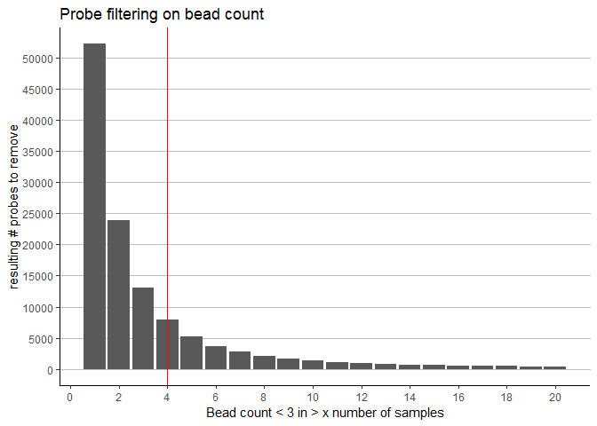<!-- -->

## 2.3 number of bad detect and bc probes

Here I combine bad detection p and bc information into one matrix. cells with EITHER bad detection p value >0.01 or bc < 3 are replaced with a '1', otherwise cells will be '0', indicating good quality.

Ultimately, I use this matrix to filter probes and determine low quality samples. Except for Fry, which only has detection p values available, and not bead count.


```r
all(colnames(bc) %in% colnames(det)) # TRUE
```

```
## [1] TRUE
```

```r
all(colnames(det) %in% colnames(bc)) # FALSE - b/c Fry doesn't contain beadcount info
```

```
## [1] FALSE
```

```r
fp <- det

dim(fp) # 485512  518
```

```
## [1] 485512    518
```

```r
dim(bc) # 485512 491
```

```
## [1] 485512    491
```

```r
dim(det)#  485512 518
```

```
## [1] 485512    518
```

```r
# replace bad detection p and low bead count features with NA
fp[fp > 0.01] <- NA 
sum(is.na(fp)) # 300594
```

```
## [1] 300594
```

```r
# subset out Fry info
fp_temp <- fp[,colnames(bc)]
dim(fp_temp) # 491 samples
```

```
## [1] 485512    491
```

```r
fp_temp[bc < 3] <- NA
sum(is.na(fp_temp)) # 554091
```

```
## [1] 554091
```

```r
# put back in
fp[,colnames(fp_temp)] <- fp_temp
dim(fp) #518 samples
```

```
## [1] 485512    518
```

```r
sum(is.na(fp)) # 562933 562976
```

```
## [1] 562976
```

```r
# replace failed values (NAs) with TRUE, and non failed values with FALSE
fp[!is.na(fp)] <- FALSE
fp[is.na(fp)] <- TRUE
sum(fp) # 562933 562976
```

```
## [1] 562976
```

```r
fpt <- rowSums((fp)) # number of failed observations for each cpg

thresholds4 <- data.frame(cutoff = seq(1, 20, 1))
system.time(thresholds4 <- thresholds4 %>% mutate(
  Num_probes_remove = apply(thresholds4, 1, function(x) sum(fpt > x)))) # number of probes that have > x number of failed probes
```

```
##    user  system elapsed 
##    0.06    0.00    0.06
```

```r
p8 <- ggplot(thresholds4, aes(x = cutoff, y = Num_probes_remove)) +
  geom_bar(stat='identity')+
  theme_classic() +
  xlab('Bead count < 3 and bad detect p > 0.01 in > x number of samples') +
  ylab('resulting # probes to remove') +
  ggtitle('Probe filtering on failed probes') +
  scale_x_continuous(breaks = pretty(thresholds3$cutoff, n = 5)) +
  scale_y_continuous(breaks = pretty(thresholds3$Num_probes_remove, n = 4))+
  theme(panel.grid.major.y = element_line(size = 0.1, colour = 'gray')) +
  geom_vline(xintercept = 4, col = 'red')
p8
```

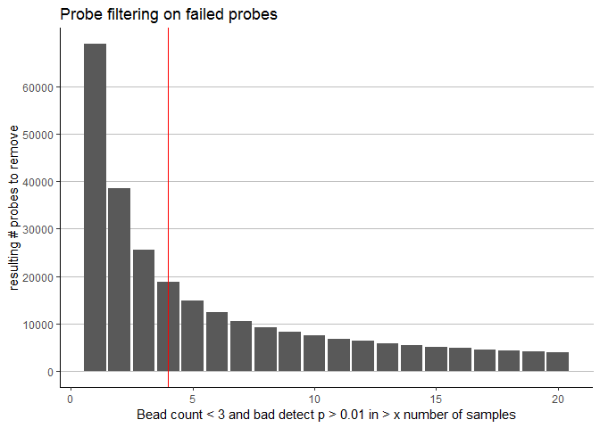<!-- -->

fpt - contains # of failed probes (both bad detect p and beadcount) in a p by 1 matrix
fp - contains NAs for failed observations, in a p by m matrix.

# 3.0 Pre-normalization filtering

Here I summarize the results for my QC analysis and filter samples and probes.

## 3.1 Setup


```r
lapply(paste('package:',names(sessionInfo()$otherPkgs),sep=""),detach,character.only=TRUE,unload=TRUE)
```

```
## [[1]]
## NULL
## 
## [[2]]
## NULL
## 
## [[3]]
## NULL
## 
## [[4]]
## NULL
## 
## [[5]]
## NULL
## 
## [[6]]
## NULL
## 
## [[7]]
## NULL
## 
## [[8]]
## NULL
## 
## [[9]]
## NULL
## 
## [[10]]
## NULL
## 
## [[11]]
## NULL
## 
## [[12]]
## NULL
## 
## [[13]]
## NULL
## 
## [[14]]
## NULL
## 
## [[15]]
## NULL
## 
## [[16]]
## NULL
## 
## [[17]]
## NULL
## 
## [[18]]
## NULL
## 
## [[19]]
## NULL
## 
## [[20]]
## NULL
## 
## [[21]]
## NULL
## 
## [[22]]
## NULL
## 
## [[23]]
## NULL
## 
## [[24]]
## NULL
## 
## [[25]]
## NULL
## 
## [[26]]
## NULL
## 
## [[27]]
## NULL
## 
## [[28]]
## NULL
## 
## [[29]]
## NULL
## 
## [[30]]
## NULL
## 
## [[31]]
## NULL
## 
## [[32]]
## NULL
## 
## [[33]]
## NULL
## 
## [[34]]
## NULL
## 
## [[35]]
## NULL
## 
## [[36]]
## NULL
## 
## [[37]]
## NULL
## 
## [[38]]
## NULL
```

```r
library(irlba) # fast PCA
library(rsvd) # fast (randomized) PCA
library(minfi)
library(dplyr)
library(pheatmap)
library(ggplot2)
library(RColorBrewer)
library(reshape)
library(gridExtra)
library(ggfortify)
library(RCurl)
library(parallel)
library(parallelDist)
library(dendextend)
library(waffle)
library(wateRmelon)

# check data
dim(mset) # 485577    518
```

```
## [1] 485577    518
```

```r
dim(pDat) # 518  25
```

```
## [1] 518  21
```

```r
all(rownames(pDat) %in% colnames(mset)) #TRUE
```

```
## [1] TRUE
```

```r
identical(rownames(pDat), colnames(mset)) #FALSE
```

```
## [1] FALSE
```

```r
pDat <- pDat[colnames(mset),] # reorder to match

pData(mset) <- DataFrame(pDat)
raw_b <- getBeta(mset)
```

## 3.2 Probe Filtering

bad detection p and beadcount probes

Here I load a list of counts per CpG corresponding to the number of observations that failed detection p value or had a bead count less than 3.

I pull out from this list a new list of probes that had a count greater than 1% of the dataset (>5 samples).


```r
# number of bad observarions per probe
badprobe <- fpt
head(badprobe)
```

```
## cg00050873 cg00212031 cg00213748 cg00214611 cg00455876 cg01707559 
##        211        253        226        249         83          1
```

```r
badprobe<- names(badprobe)[badprobe > 0.01*ncol(mset)]
length(badprobe) # 14858
```

```
## [1] 14858
```

Cross hybridizing probes

Here I combine Magda's and Chen's annotations to form a list of 29770 cross hybridizing probes.

Magda's annotation (2013) has a list of CH probes. 


```r
library(GEOquery)
base <-'https://www.ncbi.nlm.nih.gov/geo/download/?acc=GPL16304&format=file'
end <- '&file=GPL16304%5FGene%5Ffeatures%5FPlatformTable%2Etxt%2Egz'

mprice <- as_tibble(getGEO('GPL16304')@dataTable@table)
```

```
## File stored at:
```

```
## C:\Users\vyuan\AppData\Local\Temp\3\RtmpGM1mxU/GPL16304.soft
```

```
## Warning in rbind(names(probs), probs_f): number of columns of result is not
## a multiple of vector length (arg 1)
```

```
## Warning: 38 parsing failures.
## row # A tibble: 5 x 5 col     row col           expected               actual    file         expected   <int> <chr>         <chr>                  <chr>     <chr>        actual 1 18000 Closest_TSS   no trailing characters ;59854523 literal data file 2 18000 Closest_TSS_1 no trailing characters ;59854524 literal data row 3 23807 Closest_TSS   no trailing characters ;838621   literal data col 4 23807 Closest_TSS_1 no trailing characters ;838622   literal data expected 5 54524 Closest_TSS   no trailing characters ;72977984 literal data
## ... ................. ... ................................................................... ........ ................................................................... ...... ................................................................... .... ................................................................... ... ................................................................... ... ................................................................... ........ ...................................................................
## See problems(...) for more details.
```

```r
mprice_XY <- mprice %>% filter(XY_Hits == 'XY_YES') %>% pull(ID)
mprice_AU <- mprice %>% filter(Autosomal_Hits == 'A_YES') %>% pull(ID)

mprice_CH <- union(mprice_XY, mprice_AU)
length(mprice_CH) #41937
```

```
## [1] 41937
```

Chen Y, Lemire M, Choufani S, Butcher DT, Grafodatskaya D, Zanke BW, Gallinger S, Hudson TJ, Weksberg R: Discovery of cross-reactive probes and polymorphic CpGs in the Illumina Infinium HumanMethylation450 microarray. Epigenetics 2013, 8:203-9.


```r
library(RCurl)
library(httr)
```

```
## 
## Attaching package: 'httr'
```

```
## The following object is masked from 'package:Biobase':
## 
##     content
```

```r
library(readxl)
base <- 'http://www.sickkids.ca/MS-Office-Files/Research/Weksberg%20Lab/'
end <- '48639-non-specific-probes-Illumina450k.xlsx'
GET((paste(base, end, sep = '')), write_disk(tf <- tempfile(fileext = ".xlsx")))
```

```
## Response [http://www.sickkids.ca/MS-Office-Files/Research/Weksberg%20Lab/48639-non-specific-probes-Illumina450k.xlsx]
##   Date: 2018-11-17 22:12
##   Status: 200
##   Content-Type: application/vnd.openxmlformats-officedocument.spreadsheetml.sheet
##   Size: 1.02 MB
## <ON DISK>  C:\Users\vyuan\AppData\Local\Temp\3\RtmpGM1mxU\file57b8141d2aaf.xlsx
```

```r
chen_CH <- read_excel(tf, 1L) %>% pull(TargetID)
length(chen_CH)
```

```
## [1] 29233
```

Now I combine the lists into one list of probes to filter


```r
CH <- union(mprice_CH, chen_CH)

length(badprobe) #14858
```

```
## [1] 14858
```

```r
length(CH) #41993
```

```
## [1] 41993
```

```r
filter.probes <- unique(c(badprobe, CH))
length(filter.probes) # 55637
```

```
## [1] 55637
```

```r
badprobes <- which(rownames(mset) %in% filter.probes)
length(badprobes) # 55637
```

```
## [1] 55637
```

1) Probes that failed detection p value threshold (>0.01) and/or beadcount (<3) were marked as NAs.
Probes that had >1% of observations missing (0.01 * 518 samples ~=5) were removed.
This equated to 14858 probes that failed this QC check.

2) Cross hybridizing probes (autosome and XY) were removed. This was based on the combined annotations 
of Magda Price's 2013 publication, and from Chen's popular publication. 
This amounted to 41993 probes.

1) and 2) probesets overlap to a certain extent. But the overall total number of unique probes that
were filtered at this step is 55637.


```r
dim(mset) # 485577 518
```

```
## [1] 485577    518
```

```r
mset <- mset[-badprobes,]
dim(mset) # 429940 518
```

```
## [1] 429940    518
```

## 3.3 Sample filtering

Interarray Sample-sample correlation

Next I look at mean sample-sample correlation. I mainly do this to identify outliers and to remove those that have too many technical artifacts or are of low quality. I draw upon Horvath from his age clock paper for inspiration. I also cite Rachel's nonvariable probe paper as they use this strategy as well.


```r
raw <- getBeta(mset)
cor_raw <- cor(raw, use = 'pairwise.complete.obs')

#Calculate mean sample-sample correlation
sample_cor <- apply(cor_raw, 1, mean)
sample_cor <- data.frame(mean_sample_cor = sample_cor, sampleName = as.factor(names(sample_cor)))
head(sample_cor)
```

```
##       mean_sample_cor sampleName
## DeID1       0.9615000      DeID1
## DeID2       0.9637822      DeID2
## DeID3       0.9678758      DeID3
## DeID4       0.9593204      DeID4
## DeID5       0.9661569      DeID5
## DeID6       0.9651997      DeID6
```

```r
#put in pData
pDat$meanSScor <- sample_cor[match(sample_cor$sampleName, rownames(pDat)),'mean_sample_cor']
```

Plotting by samples we can see if there are any low correlated samples. I put horizontal absolute value lines at 0.95, 0.955, and 0.96 to visualize the potential number of samples that will be removed at a respectively cutoff.

Horvath uses 0.90, but he was working with multiple tissue types. 

Rachel's data was much cleaner and within tissue. She could have used a cutoff of 0.95 (doesn't say in the paper, but there is a relevant figure).


```r
# This theme is for increasing text size
sizetheme <-  theme(axis.text.x = element_blank(),
        axis.text.y = element_text(size = 24),
        axis.ticks = element_blank(),
        text = element_text(size = 32),
        plot.title  = element_text(size = 36))

# Plot correlation by sample colored by chip
ggplot(pDat, aes(x = sampleNames, y = meanSScor, col = Dataset)) +
  geom_point() + 
  geom_text(aes(label = ifelse(meanSScor < 0.95, sampleNames, ''))) +
  geom_text(aes(label = ifelse(sampleNames == 'GSM1947201', sampleNames, '')), col = 'black') +
  scale_size(guide = FALSE) +
  scale_y_continuous(limits = c(0.88, 1.00)) +
  theme_classic() +
  theme(axis.text.x = element_blank(),
        axis.ticks.x = element_blank()) +
  scale_shape_manual(values = c(0, 8, 19)) +
  ggtitle('Mean sample-sample correlation') +
  labs(x = 'Sample', y = 'Correlation') +
  geom_hline(yintercept = 0.95, linetype = 'dashed', color = 'red') +
  geom_hline(yintercept = 0.955, linetype = 'dashed', color = 'orange') +
  geom_hline(yintercept = 0.96, linetype = 'dashed', color = 'brown')
```

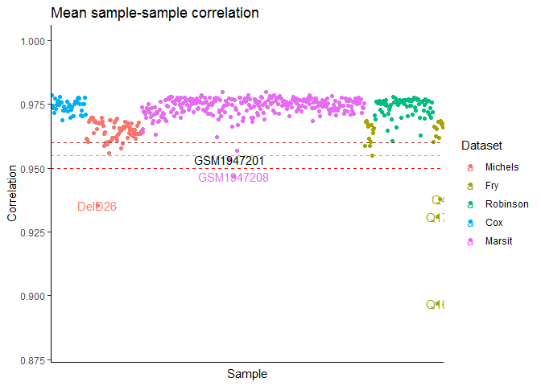<!-- -->

Now I remove samples below 0.95:
  * DeID26     
  * Q4
  * Q16        
  * Q17        
  * GSM1947208


```r
badsamps <- pDat %>% filter(meanSScor < 0.95) %>% 
  dplyr::select(sampleNames, rownames, meanSScor, Ethnicity, Dataset) %>% pull(sampleNames)
pData(mset) <- DataFrame(pDat) # put meanSScor into pData

mset <- mset[,setdiff(colnames(mset), badsamps)] # remove samples
dim(mset) #429940    513
```

```
## [1] 429940    513
```

Please see QCresults.xlsx for a table of all QC steps and questionable samples.

The following samples have mislabelled sex and will be removed:
  * GSM1947253
  * GSM1947288
  * GSM1947399


```r
sexmislabels <- c('GSM1947253', 'GSM1947288', 'GSM1947399')
mset <- mset[,setdiff(colnames(mset), sexmislabels)] # remove samples
dim(mset) #429940    510
```

```
## [1] 429940    510
```

```r
pDat <- as.data.frame(pData(mset))
```

# 4.0 Normalization

Here I use BMIQ normalization. Previously, I had explored other methods.


```r
#serial
set.seed(1)
system.time(
  BMIQ <- as.data.frame(BMIQ(mset))
)
```

```
## Loading required package: IlluminaHumanMethylation450kmanifest
```

```
## 
## Attaching package: 'RPMM'
```

```
## The following object is masked from 'package:limma':
## 
##     ebayes
```

```
##    user  system elapsed 
## 2690.99   16.91 2709.60
```

```r
#  user   system  elapsed 
# 1659.796   13.608 1673.289 
```

# 5.0 Post-normalization filtering

Invariable probes


```r
# Load the invariable probe data
library(RCurl) 
base <- paste("https://raw.githubusercontent.com/redgar598/",
        "Tissue_Invariable_450K_CpGs/master/", sep = "")
csv <- c("Invariant_Buccal_CpGs.csv", 
         "Invariant_Blood_CpGs.csv", 
         "Invariant_Placenta_CpGs.csv")
invar_Pl <- read.csv(text = getURL(paste(base, csv[3], sep = "")))$CpG

# remove invariable probes
Variation <- function(x) {quantile(x, c(0.9),na.rm=T)[[1]] -
        quantile(x, c(0.1), na.rm=T)[[1]]}
rr <- lapply(match(invar_Pl, rownames(BMIQ)),
                 function(x) Variation(BMIQ[x,]))
rr <- unlist(rr)

# get cpg names of probes with <0.05 range
iv <- intersect(invar_Pl[which(rr < 0.05)], invar_Pl)
length(iv) #86502
```

```
## [1] 86502
```

```r
BMIQ <- BMIQ[setdiff(rownames(BMIQ), iv),]
dim(BMIQ) # 343438 510
```

```
## [1] 343438    510
```

Keep probes overlapping 450k/850k arrays

* previously I was usin epic B2 manifest
* now I use latest epic manifest, B4, rmeoving (319625 - 319223) more probes


```r
# load EPIC b4 manifest file
library(IlluminaHumanMethylationEPICanno.ilm10b4.hg19)
```

```
## 
## Attaching package: 'IlluminaHumanMethylationEPICanno.ilm10b4.hg19'
```

```
## The following objects are masked from 'package:IlluminaHumanMethylation450kanno.ilmn12.hg19':
## 
##     Islands.UCSC, Locations, Manifest, Other,
##     SNPs.132CommonSingle, SNPs.135CommonSingle,
##     SNPs.137CommonSingle, SNPs.138CommonSingle,
##     SNPs.141CommonSingle, SNPs.142CommonSingle,
##     SNPs.144CommonSingle, SNPs.146CommonSingle,
##     SNPs.147CommonSingle, SNPs.Illumina
```

```r
library(minfiData)
library(minfiDataEPIC)
```

```
## Loading required package: IlluminaHumanMethylationEPICmanifest
```

```
## Loading required package: IlluminaHumanMethylationEPICanno.ilm10b2.hg19
```

```
## 
## Attaching package: 'IlluminaHumanMethylationEPICanno.ilm10b2.hg19'
```

```
## The following objects are masked from 'package:IlluminaHumanMethylationEPICanno.ilm10b4.hg19':
## 
##     Islands.UCSC, Locations, Manifest, Other,
##     SNPs.132CommonSingle, SNPs.135CommonSingle,
##     SNPs.137CommonSingle, SNPs.138CommonSingle,
##     SNPs.141CommonSingle, SNPs.142CommonSingle,
##     SNPs.144CommonSingle, SNPs.146CommonSingle,
##     SNPs.147CommonSingle, SNPs.Illumina
```

```
## The following objects are masked from 'package:IlluminaHumanMethylation450kanno.ilmn12.hg19':
## 
##     Islands.UCSC, Locations, Manifest, Other,
##     SNPs.132CommonSingle, SNPs.135CommonSingle,
##     SNPs.137CommonSingle, SNPs.138CommonSingle,
##     SNPs.141CommonSingle, SNPs.142CommonSingle,
##     SNPs.144CommonSingle, SNPs.146CommonSingle,
##     SNPs.147CommonSingle, SNPs.Illumina
```

```r
annoEPIC <- getAnnotation(IlluminaHumanMethylationEPICanno.ilm10b4.hg19)
dim(annoEPIC) # 865859
```

```
## [1] 865859     46
```

```r
dim(ann450k) # 485512 
```

```
## [1] 485512     33
```

```r
cpg_ol <- intersect(annoEPIC$Name, ann450k$Name)
length(cpg_ol) # 452453 overlapping probes
```

```
## [1] 452453
```

```r
data(RGsetEx)
data("RGsetEPIC")

# snp probes
snp_450k <- rownames(getSnpBeta(RGsetEx))
snp_EPIC <- rownames(getSnpBeta(RGsetEPIC))
length(snp_450k);length(snp_EPIC) #65 59
```

```
## [1] 65
```

```
## [1] 59
```

```r
snp_ol <- intersect(snp_450k, snp_EPIC)
length(snp_ol) # 59
```

```
## [1] 59
```

```r
# remove non-overlapping probes from combined data
BMIQ_epic <- BMIQ[intersect(rownames(BMIQ), c(cpg_ol, snp_ol)),]
dim(BMIQ_epic) # 319233 510
```

```
## [1] 319233    510
```

# 6.0 Save processed data


```r
saveRDS(BMIQ, '../../Robjects_final/01_processed_betas.rds')
saveRDS(BMIQ_epic, '../../Robjects_final/01_processed_betas_EPIC.rds')
saveRDS(pDat, '../../Robjects_final/01_pDat.rds')
```
