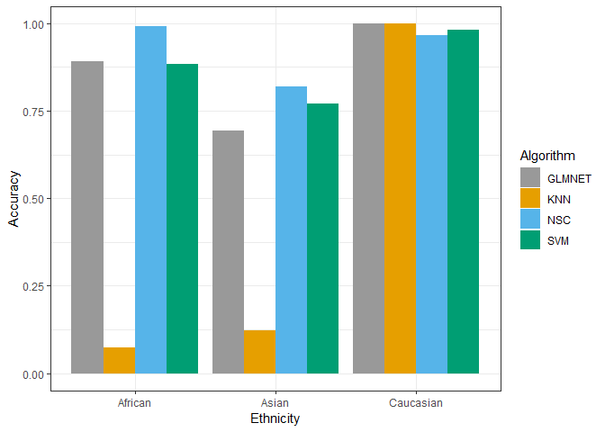
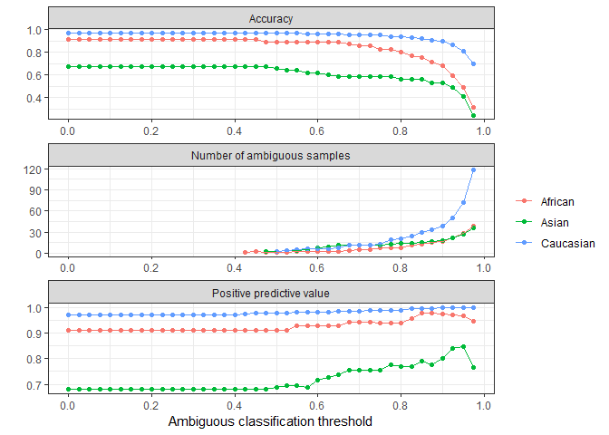
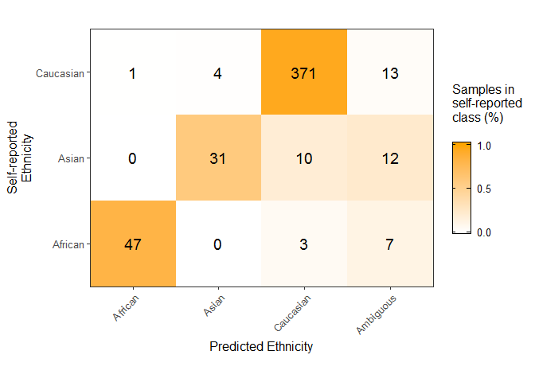

Here I implement nested cross validation to train an ethnicity classifier and
evaluate performance of the classifier.

# 1.0 Setup


```r
library(minfi)
library(parallel)
library(doParallel)
library(e1071)
library(factoextra)
library(ggthemes)
library(RCurl)
library(methylkit) #install_github('wvictor14/methylkit', force=T)
library(pheatmap)
library(wateRmelon)
library(caret)
library(VennDiagram)
library(UpSetR)
library(tidyr)
library(pamr)
library(ggpubr)
library(ggsci)
library(dplyr)
library(impute)
library(ggridges)
library(sesame)
library(readxl)
source('../sscen.R')
```

## 1.1 load data


```r
betas <- readRDS('../../Robjects_final/01_processed_betas_EPIC.rds') 
dim(betas) #  319233    510
```

```
## [1] 319233    510
```

```r
pDat <- readRDS('../../Robjects_final/01_pDat.rds')
dim(pDat) # 510 22
```

```
## [1] 510  22
```

Next I normalize the data without any filtering, so that I can use epistructure
and Barfield's methods with all of the relevant probes.


```r
#load raw mset data
mset <- readRDS('../../Robjects_final/00_mset_RCMFM_raw_eth.rds')
betas_all <- BMIQ(mset)
saveRDS(betas_all, '../../Robjects_final/02_BMIQ_nofiltering.rds')
```


```r
betas_all <- readRDS('../../Robjects_final/02_BMIQ_nofiltering.rds')
dim(betas_all) # 485577    518
```

```
## [1] 485577    518
```

```r
betas_all <- betas_all[,colnames(betas)]
dim(betas_all) # 485577    510
```

```
## [1] 485577    510
```

- remove nas (Here I use knn impute)
- transpose data and make dataframe (for caret)


```r
sum(is.na(betas));sum(is.na(betas_all))
```

```
## [1] 339
```

```
## [1] 848
```

```r
# knn impute
set.seed(1)
betas <- impute.knn(as.matrix(betas), maxp = 15000)$data
```

```
## Cluster size 319233 broken into 154713 164520 
## Cluster size 154713 broken into 62742 91971 
## Cluster size 62742 broken into 30470 32272 
## Cluster size 30470 broken into 14322 16148 
## Done cluster 14322 
## Cluster size 16148 broken into 7658 8490 
## Done cluster 7658 
## Done cluster 8490 
## Done cluster 16148 
## Done cluster 30470 
## Cluster size 32272 broken into 16350 15922 
## Cluster size 16350 broken into 13822 2528 
## Done cluster 13822 
## Done cluster 2528 
## Done cluster 16350 
## Cluster size 15922 broken into 11649 4273 
## Done cluster 11649 
## Done cluster 4273 
## Done cluster 15922 
## Done cluster 32272 
## Done cluster 62742 
## Cluster size 91971 broken into 63575 28396 
## Cluster size 63575 broken into 42097 21478 
## Cluster size 42097 broken into 14224 27873 
## Done cluster 14224 
## Cluster size 27873 broken into 15821 12052 
## Cluster size 15821 broken into 6862 8959 
## Done cluster 6862 
## Done cluster 8959 
## Done cluster 15821 
## Done cluster 12052 
## Done cluster 27873 
## Done cluster 42097 
## Cluster size 21478 broken into 11733 9745 
## Done cluster 11733 
## Done cluster 9745 
## Done cluster 21478 
## Done cluster 63575 
## Cluster size 28396 broken into 16275 12121 
## Cluster size 16275 broken into 8620 7655 
## Done cluster 8620 
## Done cluster 7655 
## Done cluster 16275 
## Done cluster 12121 
## Done cluster 28396 
## Done cluster 91971 
## Done cluster 154713 
## Cluster size 164520 broken into 101365 63155 
## Cluster size 101365 broken into 38474 62891 
## Cluster size 38474 broken into 17605 20869 
## Cluster size 17605 broken into 8674 8931 
## Done cluster 8674 
## Done cluster 8931 
## Done cluster 17605 
## Cluster size 20869 broken into 4 20865 
## Done cluster 4 
## Cluster size 20865 broken into 3144 17721 
## Done cluster 3144 
## Cluster size 17721 broken into 17720 1 
## Cluster size 17720 broken into 8080 9640 
## Done cluster 8080 
## Done cluster 9640 
## Done cluster 17720 
## Done cluster 1 
## Done cluster 17721 
## Done cluster 20865 
## Done cluster 20869 
## Done cluster 38474 
## Cluster size 62891 broken into 29052 33839 
## Cluster size 29052 broken into 5784 23268 
## Done cluster 5784 
## Cluster size 23268 broken into 10541 12727 
## Done cluster 10541 
## Done cluster 12727 
## Done cluster 23268 
## Done cluster 29052 
## Cluster size 33839 broken into 31397 2442 
## Cluster size 31397 broken into 15982 15415 
## Cluster size 15982 broken into 4240 11742 
## Done cluster 4240 
## Done cluster 11742 
## Done cluster 15982 
## Cluster size 15415 broken into 6155 9260 
## Done cluster 6155 
## Done cluster 9260 
## Done cluster 15415 
## Done cluster 31397 
## Done cluster 2442 
## Done cluster 33839 
## Done cluster 62891 
## Done cluster 101365 
## Cluster size 63155 broken into 30835 32320 
## Cluster size 30835 broken into 15213 15622 
## Cluster size 15213 broken into 8765 6448 
## Done cluster 8765 
## Done cluster 6448 
## Done cluster 15213 
## Cluster size 15622 broken into 4214 11408 
## Done cluster 4214 
## Done cluster 11408 
## Done cluster 15622 
## Done cluster 30835 
## Cluster size 32320 broken into 15344 16976 
## Cluster size 15344 broken into 8551 6793 
## Done cluster 8551 
## Done cluster 6793 
## Done cluster 15344 
## Cluster size 16976 broken into 12369 4607 
## Done cluster 12369 
## Done cluster 4607 
## Done cluster 16976 
## Done cluster 32320 
## Done cluster 63155 
## Done cluster 164520
```

```r
set.seed(1)
betas_all <- impute.knn(as.matrix(betas_all), maxp = 15000)$data
```

```
## Cluster size 485577 broken into 237466 248111 
## Cluster size 237466 broken into 144971 92495 
## Cluster size 144971 broken into 88786 56185 
## Cluster size 88786 broken into 36386 52400 
## Cluster size 36386 broken into 7505 28881 
## Done cluster 7505 
## Cluster size 28881 broken into 11180 17701 
## Done cluster 11180 
## Cluster size 17701 broken into 9977 7724 
## Done cluster 9977 
## Done cluster 7724 
## Done cluster 17701 
## Done cluster 28881 
## Done cluster 36386 
## Cluster size 52400 broken into 29269 23131 
## Cluster size 29269 broken into 14498 14771 
## Done cluster 14498 
## Done cluster 14771 
## Done cluster 29269 
## Cluster size 23131 broken into 17755 5376 
## Cluster size 17755 broken into 20 17735 
## Done cluster 20 
## Cluster size 17735 broken into 13181 4554 
## Done cluster 13181 
## Done cluster 4554 
## Done cluster 17735 
## Done cluster 17755 
## Done cluster 5376 
## Done cluster 23131 
## Done cluster 52400 
## Done cluster 88786 
## Cluster size 56185 broken into 31510 24675 
## Cluster size 31510 broken into 1 31509 
## Done cluster 1 
## Cluster size 31509 broken into 1 31508 
## Done cluster 1 
## Cluster size 31508 broken into 26806 4702 
## Cluster size 26806 broken into 18810 7996 
## Cluster size 18810 broken into 6499 12311 
## Done cluster 6499 
## Done cluster 12311 
## Done cluster 18810 
## Done cluster 7996 
## Done cluster 26806 
## Done cluster 4702 
## Done cluster 31508 
## Done cluster 31509 
## Done cluster 31510 
## Cluster size 24675 broken into 22538 2137 
## Cluster size 22538 broken into 8353 14185 
## Done cluster 8353 
## Done cluster 14185 
## Done cluster 22538 
## Done cluster 2137 
## Done cluster 24675 
## Done cluster 56185 
## Done cluster 144971 
## Cluster size 92495 broken into 48543 43952 
## Cluster size 48543 broken into 3824 44719 
## Done cluster 3824 
## Cluster size 44719 broken into 22144 22575 
## Cluster size 22144 broken into 4828 17316 
## Done cluster 4828 
## Cluster size 17316 broken into 9801 7515 
## Done cluster 9801 
## Done cluster 7515 
## Done cluster 17316 
## Done cluster 22144 
## Cluster size 22575 broken into 9652 12923 
## Done cluster 9652 
## Done cluster 12923 
## Done cluster 22575 
## Done cluster 44719 
## Done cluster 48543 
## Cluster size 43952 broken into 22252 21700 
## Cluster size 22252 broken into 13054 9198 
## Done cluster 13054 
## Done cluster 9198 
## Done cluster 22252 
## Cluster size 21700 broken into 8760 12940 
## Done cluster 8760 
## Done cluster 12940 
## Done cluster 21700 
## Done cluster 43952 
## Done cluster 92495 
## Done cluster 237466 
## Cluster size 248111 broken into 76858 171253 
## Cluster size 76858 broken into 35049 41809 
## Cluster size 35049 broken into 18219 16830 
## Cluster size 18219 broken into 8561 9658 
## Done cluster 8561 
## Done cluster 9658 
## Done cluster 18219 
## Cluster size 16830 broken into 3583 13247 
## Done cluster 3583 
## Done cluster 13247 
## Done cluster 16830 
## Done cluster 35049 
## Cluster size 41809 broken into 19462 22347 
## Cluster size 19462 broken into 3216 16246 
## Done cluster 3216 
## Cluster size 16246 broken into 7310 8936 
## Done cluster 7310 
## Done cluster 8936 
## Done cluster 16246 
## Done cluster 19462 
## Cluster size 22347 broken into 11791 10556 
## Done cluster 11791 
## Done cluster 10556 
## Done cluster 22347 
## Done cluster 41809 
## Done cluster 76858 
## Cluster size 171253 broken into 39536 131717 
## Cluster size 39536 broken into 19837 19699 
## Cluster size 19837 broken into 15833 4004 
## Cluster size 15833 broken into 9201 6632 
## Done cluster 9201 
## Done cluster 6632 
## Done cluster 15833 
## Done cluster 4004 
## Done cluster 19837 
## Cluster size 19699 broken into 10335 9364 
## Done cluster 10335 
## Done cluster 9364 
## Done cluster 19699 
## Done cluster 39536 
## Cluster size 131717 broken into 42073 89644 
## Cluster size 42073 broken into 26604 15469 
## Cluster size 26604 broken into 1297 25307 
## Done cluster 1297 
## Cluster size 25307 broken into 17774 7533 
## Cluster size 17774 broken into 6776 10998 
## Done cluster 6776 
## Done cluster 10998 
## Done cluster 17774 
## Done cluster 7533 
## Done cluster 25307 
## Done cluster 26604 
## Cluster size 15469 broken into 14136 1333 
## Done cluster 14136 
## Done cluster 1333 
## Done cluster 15469 
## Done cluster 42073 
## Cluster size 89644 broken into 38539 51105 
## Cluster size 38539 broken into 35777 2762 
## Cluster size 35777 broken into 19734 16043 
## Cluster size 19734 broken into 8494 11240 
## Done cluster 8494 
## Done cluster 11240 
## Done cluster 19734 
## Cluster size 16043 broken into 8587 7456 
## Done cluster 8587 
## Done cluster 7456 
## Done cluster 16043 
## Done cluster 35777 
## Done cluster 2762 
## Done cluster 38539 
## Cluster size 51105 broken into 27066 24039 
## Cluster size 27066 broken into 19385 7681 
## Cluster size 19385 broken into 10405 8980 
## Done cluster 10405 
## Done cluster 8980 
## Done cluster 19385 
## Done cluster 7681 
## Done cluster 27066 
## Cluster size 24039 broken into 7769 16270 
## Done cluster 7769 
## Cluster size 16270 broken into 8559 7711 
## Done cluster 8559 
## Done cluster 7711 
## Done cluster 16270 
## Done cluster 24039 
## Done cluster 51105 
## Done cluster 89644 
## Done cluster 131717 
## Done cluster 171253 
## Done cluster 248111
```

```r
sum(is.na(betas));sum(is.na(betas_all))
```

```
## [1] 0
```

```
## [1] 0
```

```r
#transpose data
betas <- as.data.frame(t(betas))
betas_all <- as.data.frame(t(betas_all))
```

I remove south asian samples here


```r
ind <- which(pDat$Ethnicity == 'South_Asian')
pDat <- pDat[-ind,]
betas <- betas[-ind,]

pDat$Ethnicity2 <- gsub('East_', '', pDat$Ethnicity)
table(pDat$Ethnicity2) # 57        55       391
```

```
## 
##   African     Asian Caucasian 
##        57        55       391
```

```r
betas_all <- betas_all[pDat$sampleNames,]
```

Here I keep the replicate sample with the highest mean interarray correlation.


```r
# Identify replicates and then keep the one with highest correlation
# Here I pull out the replicates I don't want
reps_remove <- pDat %>% mutate(Case_ID = gsub('_r.*', '', sampleNames)) %>%
  group_by(Case_ID) %>% filter(n() > 1) %>%
  arrange(Case_ID, desc(meanSScor)) %>% 
  slice(2:n()) %>% pull(sampleNames)

pDat <- pDat %>% filter(!sampleNames %in% reps_remove) 
betas <- betas[pDat$sampleNames,]
betas_all <- betas_all[pDat$sampleNames,]

dim(pDat);dim(betas);dim(betas_all) # [1] 499  23 [1]    499 319233 [1]    499 485577
```

```
## [1] 499  23
```

```
## [1]    499 319233
```

```
## [1]    499 485577
```

# 2.0 Inner CV

This is where I build the predictors in the inner cross validation. The outer cross validation I 
reserve for evaluating the predictors.

Here I split the dataset 3 times (3-fold cv), and train glm_fit1 using inner-fold
cv (repeats = 5, cv = 3). I train GLMNET, SVM, KNN, and rf glm_fit1 to compare.


```r
# Create outer fold sample indices
set.seed(10)

# Create outer fold sample indices
folds <- list(Fold1 = grep('Robinson', pDat$Dataset),
              Fold2 = grep('Cox', pDat$Dataset),
              Fold3 = grep('Marsit', pDat$Dataset),
              Fold4 = grep('Fry', pDat$Dataset),
              Fold5 = grep('Michels', pDat$Dataset))

# traincontrol
fitControl <- trainControl(method = "repeatedcv", number = 3, repeats = 10,
                           allowParallel = T, classProbs = T, returnData = F,
                           savePredictions = 'final', returnResamp = 'final',
                           summaryFunction = mnLogLoss)
```

## 2.1 Train / parameter tune

I start off by fitting various Algorithm that suitable for classification on
high dimensional data: GLMNET, SVM, KNN, NSC, rf.

### GLMNET

GLMNET fitted over 48 combinations of alpha and lambda


```r
# configure parallel processing
cluster <- makeCluster(18) # ram is limiting
# at peak around 6.5 - 7 gb is used in an instance
registerDoParallel(cluster)

# create seeds for each resample 
seeds <- list()
set.seed(11)
for (i in 1:length(folds)) {
  seeds[[paste0('fold', i)]] <- vector(mode = 'list', length = 10)
  for (j in 1:30) seeds[[paste0('fold', i)]][[j]] <- sample.int(1000, 48)
  seeds[[paste0('fold', i)]][[31]] <- sample.int(1000,1)
}

# tuning grid
glmGrid <-  expand.grid(alpha = c(0.025, 0.05, 0.1, 0.15, 0.2, 0.25, 0.3, 0.5), 
                        lambda = c(0.0025, 0.005, 0.01, 0.05, 0.1, 0.25))

# train i glm_fit1 for i folds
glm_fit1 <- list()
system.time(
for (i in 1:length(folds)) {
  # set seed for resamples
  fitControl$seeds <- seeds[[paste0('fold', i)]]
  
  # inner cv / training
  glm_fit <- train(x = betas[-folds[[i]],], y = pDat$Ethnicity2[-folds[[i]]],
                 method = "glmnet",
                 metric = 'logLoss',
                 trControl = fitControl,
                 tuneGrid = glmGrid)
  glm_fit1[[paste0('fold', i)]] <- glm_fit;rm(glm_fit)
}
)#user  system elapsed 
 #300.36  164.57 5274.27 
stopCluster(cluster)
saveRDS(glm_fit1, '../../Robjects_final/02_innerCV_glm_fit_logloss.rds')
```

### SVM 

SVM with a linear kernel over 8 different values of cost.


```r
cluster <- makeCluster(14)
# 16 cores consumes ~90% of hpc01 ram
# at peak around 11 gb for 1 instance
registerDoParallel(cluster)

# SVM
seeds <- list()
set.seed(11)
for (i in 1:length(folds)) {
  seeds[[paste0('fold', i)]] <- vector(mode = 'list', length = 31)
  for (j in 1:30) seeds[[paste0('fold', i)]][[j]] <- sample.int(1000, 4)
  seeds[[paste0('fold', i)]][[31]] <- sample.int(1000,1)
}

svm_fit <- list()
system.time(
for (i in 1:length(folds)) {
  fitControl$seeds <- seeds[[paste0('fold', i)]]
  svm_fit1 <- train(x = betas[-folds[[i]],], y = pDat$Ethnicity2[-folds[[i]]],
                 method = "svmLinear",
                 metric = 'logLoss',
                 tuneGrid = data.frame(C = c(0.25, 1, 5, 20)),
                 trControl = fitControl)
  svm_fit[[paste0('fold', i)]] <- svm_fit1;rm(svm_fit1)
}
)# user   system  elapsed 
# 3092.52   344.18 27610.45 
stopCluster(cluster)
saveRDS(svm_fit, '../../Robjects_final/02_innerCV_svm_fit_logloss.rds')
```

### KNN

KNN from k = 1 to k = 10


```r
cluster <- makeCluster(14)
registerDoParallel(cluster)

# KNN
seeds <- list()
set.seed(111)
for (i in 1:length(folds)) {
  seeds[[paste0('fold', i)]] <- vector(mode = 'list', length = 16)
  for (j in 1:30) seeds[[paste0('fold', i)]][[j]] <- sample.int(1000, 10)
  seeds[[paste0('fold', i)]][[31]] <- sample.int(1000,1)
}
knn_fit <- list()
system.time(
for (i in 1:length(folds)) {
  fitControl$seeds <- seeds[[paste0('fold', i)]]
  knn_fit1 <- train(x = betas[-folds[[i]],], y = pDat$Ethnicity2[-folds[[i]]],
                   method = 'knn',
                   metric = 'logLoss',
                   tuneGrid = data.frame(k = seq(1,10, 1)),
                   trControl = fitControl)
  knn_fit[[paste0('fold', i)]] <- knn_fit1; rm(knn_fit1)
}
)# user   system  elapsed  (16 cores)
  #115.99   157.11 66293.92

stopCluster(cluster)
saveRDS(knn_fit, '../../Robjects_final/02_innerCV_knn_fit_logloss.rds')
```

### NSC
Nearest Shrunken Centroids


```r
cluster <- makeCluster(16)
registerDoParallel(cluster)

# create seeds for each resample 
seeds <- list()
set.seed(11)
for (i in 1:length(folds)) {
  seeds[[paste0('fold', i)]] <- vector(mode = 'list', length = 10)
  for (j in 1:30) seeds[[paste0('fold', i)]][[j]] <- sample.int(1000, 81)
  seeds[[paste0('fold', i)]][[31]] <- sample.int(1000,1)
}

NSCGrid <- data.frame(threshold = seq(0,10, 0.125))

# train i glm_fit1 for i folds
nsc_fit <- list();set.seed(0)
system.time(
for (i in 1:length(folds)) {
  # set seed for resamples
  fitControl$seeds <- seeds[[paste0('fold', i)]]
  
  # inner cv / training
  nsc_fit1 <- train(x = betas[-folds[[i]],], y = pDat$Ethnicity2[-folds[[i]]],
                 method = "pam",
                 metric = 'logLoss',
                 trControl = fitControl,
                 tuneGrid = NSCGrid)
  nsc_fit[[paste0('fold', i)]] <- nsc_fit1;rm(nsc_fit1)
}
)#111   user  system elapsed (16 cores) 
 # 251.94  333.25 8856.84 
stopCluster(cluster)
saveRDS(nsc_fit, '../../Robjects_final/02_innerCV_nsc_fit_logLoss.rds')
```


```r
glm_fit1 <- readRDS('../../Robjects_final/02_innerCV_glm_fit_logloss.rds')
svm_fit <- readRDS('../../Robjects_final/02_innerCV_svm_fit_logloss.rds')
knn_fit <- readRDS('../../Robjects_final/02_innerCV_knn_fit_logloss.rds')
nsc_fit <- readRDS('../../Robjects_final/02_innerCV_nsc_fit_logLoss.rds')
```

## 2.2 Compare Parameter tuning 

Here I examine the parameter tuning across all outer folds.


```r
# tuning parameters
res <- list(GLMNET =
  rbind(glm_fit1$fold1$results %>% mutate(fold = 'fold1'),
        glm_fit1$fold2$results %>% mutate(fold = 'fold2'),
        glm_fit1$fold3$results %>% mutate(fold = 'fold3'),
        glm_fit1$fold4$results %>% mutate(fold = 'fold4'),
        glm_fit1$fold5$results %>% mutate(fold = 'fold5')) %>% as_tibble(),
  KNN =
  rbind(knn_fit$fold1$results %>% mutate(fold = 'fold1'),
        knn_fit$fold2$results %>% mutate(fold = 'fold2'),
        knn_fit$fold3$results %>% mutate(fold = 'fold3'),
        knn_fit$fold4$results %>% mutate(fold = 'fold4'),
        knn_fit$fold5$results %>% mutate(fold = 'fold5')) %>% as_tibble(),
  NSC = 
  rbind(nsc_fit$fold1$results %>% mutate(fold = 'fold1'),
        nsc_fit$fold2$results %>% mutate(fold = 'fold2'),
        nsc_fit$fold3$results %>% mutate(fold = 'fold3'),
        nsc_fit$fold4$results %>% mutate(fold = 'fold4'),
        nsc_fit$fold5$results %>% mutate(fold = 'fold5')) %>% as_tibble(),
#  rf =
#  rbind(rf_fit$fold1$results %>% mutate(fold = 'fold1'),
#        rf_fit$fold2$results %>% mutate(fold = 'fold2'),
#        rf_fit$fold3$results %>% mutate(fold = 'fold3')) %>% as_tibble(),
  SVM =
  rbind(svm_fit$fold1$results %>% mutate(fold = 'fold1'),
        svm_fit$fold2$results %>% mutate(fold = 'fold2'),
        svm_fit$fold3$results %>% mutate(fold = 'fold3'),
        svm_fit$fold4$results %>% mutate(fold = 'fold4'),
        svm_fit$fold5$results %>% mutate(fold = 'fold5')) %>% as_tibble())

ggplot(res$GLMNET , aes(x = alpha, y = logLoss, color = as.factor(lambda))) +
  geom_point()+ geom_line() + coord_cartesian(ylim = c(0,0.5)) +
  facet_wrap(~fold) +
  theme_bw() +
  labs(title = 'GLMNET no filtering', y = 'Inner CV performance (logLoss)', 
       x = 'Alpha (regularization parameter)', color = 'Lambda (mixing %)')
```

<!-- -->

```r
print('best alpha lambda:');print('fold1');
```

```
## [1] "best alpha lambda:"
```

```
## [1] "fold1"
```

```r
glm_fit1$fold1$bestTune;print('fold2:');glm_fit1$fold2$bestTune
```

```
##   alpha lambda
## 9  0.05   0.01
```

```
## [1] "fold2:"
```

```
##    alpha lambda
## 15   0.1   0.01
```

```r
print('fold3:');glm_fit1$fold3$bestTune
```

```
## [1] "fold3:"
```

```
##    alpha lambda
## 33  0.25   0.01
```

```r
ggplot(res$SVM , aes(x = C, y = logLoss)) +
  geom_point()+ geom_line() + coord_cartesian(ylim = c(0,0.5)) +
  facet_wrap(~fold) +
  theme_bw() +
  labs(title = 'Support Vector Machines', y = 'Inner CV performance (logLoss)', 
       x = 'Cost')
```

<!-- -->

```r
ggplot(res$KNN , aes(x = k, y = logLoss)) +
  geom_point()+ geom_line() + coord_cartesian() +
  facet_wrap(~fold) +
  theme_bw() +
  labs(title = 'K nearest neighbours', y = 'Inner CV performance (logLoss)', 
       x = '# of neighbours')
```

<!-- -->

```r
ggplot(res$NSC , aes(x = threshold, y = logLoss)) +
  geom_point()+ geom_line() + coord_cartesian() +
  facet_wrap(~fold) +
  theme_bw() +
  labs(title = 'Nearest shrunken centroids', y = 'Inner CV performance (logLoss)', 
       x = 'Threshold')
```

<!-- -->

```r
#put best tune in table format
g <- rbind(
  glm_fit1$fold1$bestTune %>% as_tibble() %>% mutate(model = 'GLMNET', fold = 1),
  glm_fit1$fold2$bestTune %>% as_tibble() %>% mutate(model = 'GLMNET', fold = 2),
  glm_fit1$fold3$bestTune %>% as_tibble() %>% mutate(model = 'GLMNET', fold = 3),
  glm_fit1$fold4$bestTune %>% as_tibble() %>% mutate(model = 'GLMNET', fold = 4),
  glm_fit1$fold5$bestTune %>% as_tibble() %>% mutate(model = 'GLMNET', fold = 5))  %>%
    mutate(bestTune = paste0('alpha = ', alpha, ', lambda = ', lambda)) %>%
    select(model, fold, bestTune)
  
k <- rbind(
  knn_fit$fold1$bestTune %>% as_tibble() %>% mutate(model = 'KNN', fold = 1),
  knn_fit$fold2$bestTune %>% as_tibble() %>% mutate(model = 'KNN', fold = 2),
  knn_fit$fold3$bestTune %>% as_tibble() %>% mutate(model = 'KNN', fold = 3),
  knn_fit$fold4$bestTune %>% as_tibble() %>% mutate(model = 'KNN', fold = 4),
  knn_fit$fold5$bestTune %>% as_tibble() %>% mutate(model = 'KNN', fold = 5)) %>%
    mutate(bestTune = paste0('k = ', k)) %>%
    select(model, fold, bestTune)

s <- rbind(
  svm_fit$fold1$bestTune %>% as_tibble() %>% mutate(model = 'SVM', fold = 1),
  svm_fit$fold2$bestTune %>% as_tibble() %>% mutate(model = 'SVM', fold = 2),
  svm_fit$fold3$bestTune %>% as_tibble() %>% mutate(model = 'SVM', fold = 3),
  svm_fit$fold4$bestTune %>% as_tibble() %>% mutate(model = 'SVM', fold = 4),
  svm_fit$fold5$bestTune %>% as_tibble() %>% mutate(model = 'SVM', fold = 5)) %>%
    mutate(bestTune = paste0('Cost = ', C)) %>%
    select(model, fold, bestTune)
n <- rbind(
  nsc_fit$fold1$bestTune %>% as_tibble() %>% mutate(model = 'NSC', fold = 1),
  nsc_fit$fold2$bestTune %>% as_tibble() %>% mutate(model = 'NSC', fold = 2),
  nsc_fit$fold3$bestTune %>% as_tibble() %>% mutate(model = 'NSC', fold = 3),
  nsc_fit$fold4$bestTune %>% as_tibble() %>% mutate(model = 'NSC', fold = 4),
  nsc_fit$fold5$bestTune %>% as_tibble() %>% mutate(model = 'NSC', fold = 5)) %>%
    mutate(bestTune = paste0('Threshold = ', threshold)) %>%
    select(model, fold, bestTune)

bestTune <- rbind(g, k, n, s); rm(g,k,n,s)
bestTune
```

```
## # A tibble: 20 x 3
##    model   fold bestTune                    
##    <chr>  <dbl> <chr>                       
##  1 GLMNET     1 alpha = 0.05, lambda = 0.01 
##  2 GLMNET     2 alpha = 0.1, lambda = 0.01  
##  3 GLMNET     3 alpha = 0.25, lambda = 0.01 
##  4 GLMNET     4 alpha = 0.05, lambda = 0.01 
##  5 GLMNET     5 alpha = 0.025, lambda = 0.05
##  6 KNN        1 k = 10                      
##  7 KNN        2 k = 10                      
##  8 KNN        3 k = 10                      
##  9 KNN        4 k = 10                      
## 10 KNN        5 k = 10                      
## 11 NSC        1 Threshold = 7.125           
## 12 NSC        2 Threshold = 6.5             
## 13 NSC        3 Threshold = 4.375           
## 14 NSC        4 Threshold = 6.5             
## 15 NSC        5 Threshold = 6.75            
## 16 SVM        1 Cost = 5                    
## 17 SVM        2 Cost = 1                    
## 18 SVM        3 Cost = 0.25                 
## 19 SVM        4 Cost = 1                    
## 20 SVM        5 Cost = 5
```

## 2.3 Compare Resampling results

Here I compare the performance of each Algorithm using the inner resampling
performance across all outer folds.


```r
# start with a list of each model
resamp <- list(
  GLMNET =
  rbind(glm_fit1$fold1$resample %>% mutate(fold = 'Outer fold1'),
        glm_fit1$fold2$resample %>% mutate(fold = 'Outer fold2'),
        glm_fit1$fold3$resample %>% mutate(fold = 'Outer fold3'),
        glm_fit1$fold4$resample %>% mutate(fold = 'Outer fold4'),
        glm_fit1$fold5$resample %>% mutate(fold = 'Outer fold5')) %>% as_tibble(),
  NSC =
  rbind(nsc_fit$fold1$resample %>% mutate(fold = 'Outer fold1'),
        nsc_fit$fold2$resample %>% mutate(fold = 'Outer fold2'),
        nsc_fit$fold3$resample %>% mutate(fold = 'Outer fold3'),
        nsc_fit$fold4$resample %>% mutate(fold = 'Outer fold4'),
        nsc_fit$fold5$resample %>% mutate(fold = 'Outer fold5')) %>% as_tibble(),
  KNN =
  rbind(knn_fit$fold1$resample %>% mutate(fold = 'Outer fold1'),
        knn_fit$fold2$resample %>% mutate(fold = 'Outer fold2'),
        knn_fit$fold3$resample %>% mutate(fold = 'Outer fold3'),
        knn_fit$fold4$resample %>% mutate(fold = 'Outer fold4'),
        knn_fit$fold5$resample %>% mutate(fold = 'Outer fold5')) %>% as_tibble(),
  SVM =
  rbind(svm_fit$fold1$resample %>% mutate(fold = 'Outer fold1'),
        svm_fit$fold2$resample %>% mutate(fold = 'Outer fold2'),
        svm_fit$fold3$resample %>% mutate(fold = 'Outer fold3'),
        svm_fit$fold4$resample %>% mutate(fold = 'Outer fold4'),
        svm_fit$fold5$resample %>% mutate(fold = 'Outer fold5')) %>% as_tibble())

# take out resampling results from each Outer cv fold
x <- rbind(
  resamp$GLMNET %>% select(logLoss, fold) %>% mutate(Algorithm = 'GLMNET'),
  resamp$NSC %>% select(logLoss, fold) %>%
    mutate(Algorithm = 'NSC'),
  resamp$KNN %>% select(logLoss, fold) %>% mutate(Algorithm = 'KNN'),
  resamp$SVM %>% select(logLoss, fold) %>% mutate(Algorithm = 'SVM'))


y <- list()
for (i in 1:length(levels(as.factor(x$Algorithm)))){
  y[[i]] <- x %>%
    filter(Algorithm == levels(as.factor(x$Algorithm))[i]) %>% 
    mutate(meanlogLoss = mean(logLoss)) %>%
    select(Algorithm, meanlogLoss) %>% slice(1)
}
meanK_Algorithm <- rbind(y[[1]], y[[2]], y[[3]], y[[4]]);rm(y)
meanK_Algorithm
```

```
## # A tibble: 4 x 2
##   Algorithm meanlogLoss
##   <chr>           <dbl>
## 1 GLMNET          0.170
## 2 KNN             1.82 
## 3 NSC           NaN    
## 4 SVM             0.231
```

```r
ggplot(x, aes(x = Algorithm, y= logLoss)) +
  geom_boxplot(aes()) + geom_jitter(alpha = 0.5, width = 0.05)+
  #geom_point(position =position_jitterdodge(jitter.width = 0.05), alpha = 0.5)+
  coord_cartesian(ylim = c(0,3))+ facet_wrap(~fold) +
  theme_bw() + theme(axis.text.x=element_text(angle=90, hjust=0.95)) +
  labs(title = 'Resampling performance between models', x = 'Model', 
       y = 'Inner CV logLoss')
```

<!-- -->

```r
p1 <- ggplot(x, aes(x = Algorithm, y= logLoss)) +
  geom_boxplot(aes()) + 
  #geom_point(position =position_jitterdodge(jitter.width = 0.05), alpha = 0.5)+
  #coord_cartesian(ylim = c(0,1))+
  theme_bw(base_size = 12) + 
  theme(legend.position="none", axis.text.x = element_text(angle = 45, vjust = 0.5)) +
  labs(x = '', y = 'logLoss') 

p1
```

<!-- -->
ggsave(plot = p1, filename = '../../Results/11_ResamplingPerformance_logloss.tiff', 
  height = 5, width = 4)

### significance test between errors

By comparing mean performance across all outer folds we can see that GLMNET 
beats all other classifiers, but is this statistically significant?


```r
wilcox.test(x %>% filter(Algorithm == 'GLMNET') %>% pull(logLoss), 
            x %>% filter(Algorithm == 'SVM') %>% pull(logLoss), 
            alternative = "two.sided")
```

```
## 
## 	Wilcoxon rank sum test with continuity correction
## 
## data:  x %>% filter(Algorithm == "GLMNET") %>% pull(logLoss) and x %>% filter(Algorithm == "SVM") %>% pull(logLoss)
## W = 6657, p-value = 9.768e-10
## alternative hypothesis: true location shift is not equal to 0
```

```r
wilcox.test(x %>% filter(Algorithm == 'NSC') %>% pull(logLoss), 
            x %>% filter(Algorithm == 'SVM') %>% pull(logLoss), 
            alternative = "two.sided")
```

```
## 
## 	Wilcoxon rank sum test with continuity correction
## 
## data:  x %>% filter(Algorithm == "NSC") %>% pull(logLoss) and x %>% filter(Algorithm == "SVM") %>% pull(logLoss)
## W = 13949, p-value = 1.676e-08
## alternative hypothesis: true location shift is not equal to 0
```

```r
wilcox.test(x %>% filter(Algorithm == 'NSC') %>% pull(logLoss), 
            x %>% filter(Algorithm == 'GLMNET') %>% pull(logLoss), 
            alternative = "two.sided")
```

```
## 
## 	Wilcoxon rank sum test with continuity correction
## 
## data:  x %>% filter(Algorithm == "NSC") %>% pull(logLoss) and x %>% filter(Algorithm == "GLMNET") %>% pull(logLoss)
## W = 17018, p-value < 2.2e-16
## alternative hypothesis: true location shift is not equal to 0
```

The answer is GLMNET is statistically significantly better than NSC and SVM
SVM is statistically better than NSC

Summary of performance

```r
s <- x %>% group_by(Algorithm) %>% 
  summarize(mean_logLoss = mean(logLoss), sd_logLoss = sd(logLoss))
s;write.csv(s, '../../Results/11_resampling_performance_logloss.csv')
```

### Class skewing

Let's look at how our unbalanced classes is handled by each Algorithmrithm


```r
#take out resampling predictions
cm_fold1 <- glm_fit1$fold1$pred %>% select(pred, obs) %>% table() %>% 
  confusionMatrix
cm_fold2 <- glm_fit1$fold2$pred %>% select(pred, obs) %>% table() %>% 
  confusionMatrix
cm_fold3 <- glm_fit1$fold3$pred %>% select(pred, obs) %>% table() %>% 
  confusionMatrix
cm_fold4 <- glm_fit1$fold4$pred %>% select(pred, obs) %>% table() %>% 
  confusionMatrix
cm_fold5 <- glm_fit1$fold5$pred %>% select(pred, obs) %>% table() %>% 
  confusionMatrix
x <- data.frame(fold1 = cm_fold1$byClass[,1], fold2 = cm_fold2$byClass[,1],
                fold3 = cm_fold3$byClass[,1], fold4 = cm_fold4$byClass[,1], 
                fold5 = cm_fold5$byClass[,1]) %>% t() %>% 
  as.data.frame()%>%mutate(Algorithm = 'GLMNET', fold = c('fold1', 'fold2', 'fold3', 'fold4', 'fold5'))

cm_fold1 <- nsc_fit$fold1$pred %>% select(pred, obs) %>% table() %>% 
  confusionMatrix
cm_fold2 <- nsc_fit$fold2$pred %>% select(pred, obs) %>% table() %>% 
  confusionMatrix
cm_fold3 <- nsc_fit$fold3$pred %>% select(pred, obs) %>% table() %>% 
  confusionMatrix
cm_fold4 <- nsc_fit$fold4$pred %>% select(pred, obs) %>% table() %>% 
  confusionMatrix
cm_fold5 <- nsc_fit$fold5$pred %>% select(pred, obs) %>% table() %>% 
  confusionMatrix
y <- data.frame(fold1 = cm_fold1$byClass[,1], fold2 = cm_fold2$byClass[,1],
                fold3 = cm_fold3$byClass[,1], fold4 = cm_fold4$byClass[,1], 
                fold5 = cm_fold5$byClass[,1]) %>% t() %>%
  as.data.frame() %>% mutate(Algorithm = 'NSC', fold = c('fold1', 'fold2', 'fold3', 'fold4', 'fold5'))

cm_fold1 <- knn_fit$fold1$pred %>% select(pred, obs) %>% table() %>% 
  confusionMatrix
cm_fold2 <- knn_fit$fold2$pred %>% select(pred, obs) %>% table() %>% 
  confusionMatrix
cm_fold3 <- knn_fit$fold3$pred %>% select(pred, obs) %>% table() %>% 
  confusionMatrix
cm_fold4 <- knn_fit$fold4$pred %>% select(pred, obs) %>% table() %>% 
  confusionMatrix
cm_fold5 <- knn_fit$fold5$pred %>% select(pred, obs) %>% table() %>% 
  confusionMatrix
k <- data.frame(fold1 = cm_fold1$byClass[,1], fold2 = cm_fold2$byClass[,1],
                fold3 = cm_fold3$byClass[,1], fold4 = cm_fold4$byClass[,1], 
                fold5 = cm_fold5$byClass[,1]) %>% t() %>%
  as.data.frame() %>% mutate(Algorithm = 'KNN', fold = c('fold1', 'fold2', 'fold3', 'fold4', 'fold5'))

cm_fold1 <- svm_fit$fold1$pred %>% select(pred, obs) %>% table() %>% 
  confusionMatrix
cm_fold2 <- svm_fit$fold2$pred %>% select(pred, obs) %>% table() %>% 
  confusionMatrix
cm_fold3 <- svm_fit$fold3$pred %>% select(pred, obs) %>% table() %>% 
  confusionMatrix
cm_fold4 <- svm_fit$fold4$pred %>% select(pred, obs) %>% table() %>% 
  confusionMatrix
cm_fold5 <- svm_fit$fold5$pred %>% select(pred, obs) %>% table() %>% 
  confusionMatrix
s <- data.frame(fold1 = cm_fold1$byClass[,1], fold2 = cm_fold2$byClass[,1],
                fold3 = cm_fold3$byClass[,1], fold4 = cm_fold4$byClass[,1], 
                fold5 = cm_fold5$byClass[,1]) %>% t() %>%
  as.data.frame() %>% mutate(Algorithm = 'SVM', fold = c('fold1', 'fold2', 'fold3', 'fold4', 'fold5'))

z <- rbind(x, y, k, s) %>% melt %>% 
  mutate(Ethnicity = gsub('Class: ', '', variable)) %>% 
  select(-variable) %>% rename(Accuracy = value)
```

```
## Using Algorithm, fold as id variables
```

```r
class_acc <- z; rm(x,y,k,s,z)


#plot
cbPalette <- c("#999999", "#E69F00", "#56B4E9", "#009E73", "#F0E442", "#0072B2",
               "#D55E00", "#CC79A7")
ggplot(class_acc, 
       aes(x = Ethnicity, y = Accuracy, fill = Algorithm)) +
  geom_bar(stat = 'identity', position = 'dodge') +
  theme_bw() + scale_fill_manual(values =  cbPalette)
```

<!-- -->

```r
g2 <- ggplot(class_acc, aes(x = Algorithm, y = Accuracy)) +
  geom_bar(stat = 'summary', fun.y = 'mean') +
  theme_bw() +
  theme(legend.position="none", axis.text.x = element_text(angle = 45, vjust = 1, hjust = 1)) +
  labs(x = '') + facet_wrap(~Ethnicity)
g2  
```

<!-- -->

```r
#ggbarplot(class_acc, x= 'Algorithm', y = 'Accuracy', color = 'Algorithm', 
#          fill = 'Algorithm', facet.by = 'Ethnicity',
#          palette = 'jco',   position = position_dodge(0.75)) +
#  theme(legend.position="none", axis.text.x = element_text(angle = 45, vjust = 0.5)) +
#  labs(x = '')
class_acc %>% arrange(Algorithm, Ethnicity, fold)
```

```
##    Algorithm  fold    Accuracy Ethnicity
## 1     GLMNET fold1 0.891071429   African
## 2     GLMNET fold2 0.868000000   African
## 3     GLMNET fold3 0.876470588   African
## 4     GLMNET fold4 0.829545455   African
## 5     GLMNET fold5 0.865909091   African
## 6     GLMNET fold1 0.431428571     Asian
## 7     GLMNET fold2 0.692682927     Asian
## 8     GLMNET fold3 0.672727273     Asian
## 9     GLMNET fold4 0.665384615     Asian
## 10    GLMNET fold5 0.665000000     Asian
## 11    GLMNET fold1 0.997041420 Caucasian
## 12    GLMNET fold2 0.998351648 Caucasian
## 13    GLMNET fold3 0.996969697 Caucasian
## 14    GLMNET fold4 0.999208443 Caucasian
## 15    GLMNET fold5 0.998833819 Caucasian
## 16       KNN fold1 0.048214286   African
## 17       KNN fold2 0.024000000   African
## 18       KNN fold3 0.073529412   African
## 19       KNN fold4 0.006818182   African
## 20       KNN fold5 0.036363636   African
## 21       KNN fold1 0.040000000     Asian
## 22       KNN fold2 0.007317073     Asian
## 23       KNN fold3 0.122727273     Asian
## 24       KNN fold4 0.067307692     Asian
## 25       KNN fold5 0.077500000     Asian
## 26       KNN fold1 0.994970414 Caucasian
## 27       KNN fold2 0.999175824 Caucasian
## 28       KNN fold3 0.979545455 Caucasian
## 29       KNN fold4 0.996306069 Caucasian
## 30       KNN fold5 0.996793003 Caucasian
## 31       NSC fold1 0.961290323   African
## 32       NSC fold2 0.992000000   African
## 33       NSC fold3 0.941176471   African
## 34       NSC fold4 0.947506562   African
## 35       NSC fold5 0.961651917   African
## 36       NSC fold1 0.000000000     Asian
## 37       NSC fold2 0.380487805     Asian
## 38       NSC fold3 0.820454545     Asian
## 39       NSC fold4 0.484513274     Asian
## 40       NSC fold5 0.459283388     Asian
## 41       NSC fold1 0.966252220 Caucasian
## 42       NSC fold2 0.951923077 Caucasian
## 43       NSC fold3 0.961363636 Caucasian
## 44       NSC fold4 0.950974421 Caucasian
## 45       NSC fold5 0.950551541 Caucasian
## 46       SVM fold1 0.883928571   African
## 47       SVM fold2 0.884000000   African
## 48       SVM fold3 0.755882353   African
## 49       SVM fold4 0.872727273   African
## 50       SVM fold5 0.854545455   African
## 51       SVM fold1 0.488571429     Asian
## 52       SVM fold2 0.770731707     Asian
## 53       SVM fold3 0.672727273     Asian
## 54       SVM fold4 0.755769231     Asian
## 55       SVM fold5 0.687500000     Asian
## 56       SVM fold1 0.978994083 Caucasian
## 57       SVM fold2 0.979120879 Caucasian
## 58       SVM fold3 0.946212121 Caucasian
## 59       SVM fold4 0.981002639 Caucasian
## 60       SVM fold5 0.979300292 Caucasian
```
ggsave(g2, filename = '../../Results/11_Class_specific_resampling_performance.tiff')

I decide on glmnet in the end because it receives the least amount of skewing.


# 3.0 Outer CV

Now I evaluate the 3 inner fold-trained classifiers on their respective test
sets, and pool these results.

Evaluation of performance is done by 1) measuring prediction accuraccy across 
test sets, 2) comparing correlation of sites to ethnicity between model-selected
sites and also other methods.

## 3.1 Accuracy / Kappa

Here I assess the prediction performance o NSC and GLMNET model on outer folds.

Each sample is predicted it's ethnicity by an independently generated classifier.


```r
res <- tibble(index = c(folds[[1]], folds[[2]], folds[[3]], folds[[4]], folds[[5]]),
       pred = c(predict(glm_fit1[[1]], betas[folds[[1]],]) %>% as.character(),
                predict(glm_fit1[[2]], betas[folds[[2]],]) %>% as.character(),
                predict(glm_fit1[[3]], betas[folds[[3]],]) %>% as.character(),
                predict(glm_fit1[[4]], betas[folds[[4]],]) %>% as.character(),
                predict(glm_fit1[[5]], betas[folds[[5]],]) %>% as.character()))

pDat$glm_pred[res$index] <- res$pred

cm <- confusionMatrix(as.factor(pDat$glm_pred), as.factor(pDat$Ethnicity2))
cm$byClass[1:3, 'Pos Pred Value'] %>% mean() # 0.9035936
```

```
## [1] 0.9035936
```

```r
cm
```

```
## Confusion Matrix and Statistics
## 
##            Reference
## Prediction  African Asian Caucasian
##   African        52     0         4
##   Asian           0    36         7
##   Caucasian       5    17       378
## 
## Overall Statistics
##                                          
##                Accuracy : 0.9339         
##                  95% CI : (0.9084, 0.954)
##     No Information Rate : 0.7796         
##     P-Value [Acc > NIR] : < 2.2e-16      
##                                          
##                   Kappa : 0.8127         
##  Mcnemar's Test P-Value : NA             
## 
## Statistics by Class:
## 
##                      Class: African Class: Asian Class: Caucasian
## Sensitivity                  0.9123      0.67925           0.9717
## Specificity                  0.9910      0.98430           0.8000
## Pos Pred Value               0.9286      0.83721           0.9450
## Neg Pred Value               0.9887      0.96272           0.8889
## Prevalence                   0.1142      0.10621           0.7796
## Detection Rate               0.1042      0.07214           0.7575
## Detection Prevalence         0.1122      0.08617           0.8016
## Balanced Accuracy            0.9516      0.83178           0.8859
```

```r
cm_df <- as.data.frame(cm$table) %>% 
  mutate(proportion = if_else(Reference == 'African', Freq/57, if_else(
    Reference == 'Asian', Freq/53, Freq/389))) %>%
  mutate(proportion_round = round(proportion, 3))

# prediction confusion matrix on test results
g3 <- ggplot(cm_df) +
  geom_tile(aes(x = Prediction, y = Reference, fill = proportion_round)) +
  geom_text(aes(x = Prediction, y = Reference, label = Freq), size = 5) +
  scale_fill_gradient2(low = "white", high = "orange", limits = c(0,1),
                       breaks = c(0, 0.5, 1.0), 
                       guide = guide_colorbar(frame.colour = "black", ticks.colour = "black")) +
  #scale_x_discrete(labels=c(
  #  paste0('African\n(', round(cm$byClass[1,1]*100, 2), '%)'),
  #  paste0('Asian\n(', round(cm$byClass[2,1]*100, 2), '%)'),
  #  paste0('Caucasian\n(', round(cm$byClass[3,1]*100, 2), '%)'))) +
  theme_bw(base_size = 12) + 
  scale_x_discrete(expand = c(0,0)) + scale_y_discrete(expand=c(0,0))+
  labs(fill = 'Samples in\nself-reported\nclass (%)\n', 
       x = 'Predicted Ethnicity', y = 'Self-reported\nEthnicity') +
  coord_equal()
g3
```

<!-- -->

ggsave(g3, filename = '../../Results/11_outerCV_cm_logLoss.tiff', height = 6, width = 5.25)


## 3.2 Class probabilities

Here I look at the distribution of class probabilities.

**August 8th 2018 - probabilities may need 'calibration' (see http://danielnee.com/2014/10/calibrating-classifier-probabilties/).
**Oct 2018 - Tried a bunch, couldn't get something to work


```r
# get class probabilities
class_probs <- rbind(
  cbind(predict(glm_fit1[[1]], betas[folds[[1]],], type ='prob'), fold = 1),
  cbind(predict(glm_fit1[[2]], betas[folds[[2]],], type ='prob'), fold = 2),
  cbind(predict(glm_fit1[[3]], betas[folds[[3]],], type ='prob'), fold = 3),
  cbind(predict(glm_fit1[[4]], betas[folds[[4]],], type ='prob'), fold = 4),
  cbind(predict(glm_fit1[[5]], betas[folds[[5]],], type ='prob'), fold = 5))
class_probs <- class_probs %>% mutate(sampleNames = rownames(class_probs)) %>%
  rename(Prob_African = African, Prob_Asian = Asian, 
         Prob_Caucasian = Caucasian)

#add to pDat
pDat <- pDat %>% inner_join(class_probs) %>% as_tibble()
```

```
## Joining, by = "sampleNames"
```

## 3.3 Confidence thresholds

HereI try calling some samples 'Ambiguous' if they go over a threshold. I experiment with different
'confidence' thresholds.


```r
# create a matrix of results to fill up
thresh <- seq(0, 1, 0.025)
thresholds <- tibble(thresholds = thresh, 
                     Accuracy_AFR = rep(0, length(thresh)),
                     Accuracy_ASI = rep(0, length(thresh)),
                     Accuracy_CAU = rep(0, length(thresh)),
                     PPV_AFR = rep(0, length(thresh)),
                     PPV_ASI = rep(0, length(thresh)),
                     PPV_CAU = rep(0, length(thresh)),
                     Ambiguous_AFR = rep(0, length(thresh)),
                     Ambiguous_ASI = rep(0, length(thresh)),
                     Ambiguous_CAU = rep(0, length(thresh)))

# I need to choose what probability to compare the thresholds to. There are two options,
# 1) The class-specific probability that is the highest (most likely class)
# 2) The class-specific probability corresponding to the self-reported class
# I think 1) is less biased

pDat <- pDat %>% 
  mutate(glm_pred = factor(glm_pred, levels = c('African', 'Asian', 'Caucasian')), 
         Ethnicity2 = factor(Ethnicity2, levels = c('African', 'Asian', 'Caucasian')),
         # create a variable of the highest class-specific probability
         Highest_Prob = case_when(
           (Prob_African > Prob_Asian) &  (Prob_African > Prob_Caucasian) ~ Prob_African,
           (Prob_Asian > Prob_African) &  (Prob_Asian > Prob_Caucasian) ~ Prob_Asian,
           (Prob_Caucasian > Prob_African) &  (Prob_Caucasian > Prob_Asian) ~ Prob_Caucasian)) %>%
  as_tibble()

# fill up results matrix
for (i in 1:length(thresh)) {
  df <- pDat %>% select(Ethnicity2, glm_pred, Highest_Prob)
  df <- df %>% mutate(pred_thresh = case_when(
    Highest_Prob < thresh[i] ~ 'Ambiguous',
    Highest_Prob > thresh[i] ~ as.character(glm_pred)
  ))
  
  # class-specific accuracy
  correct <-  df %>% filter(Ethnicity2 == pred_thresh) %>% count(Ethnicity2) %>% pull(n)
  total <-  df %>% count(Ethnicity2) %>% pull(n)
  acc <- correct/total
  
  thresholds[i,2] <- acc[1] 
  thresholds[i,3] <- acc[2] 
  thresholds[i,4] <- acc[3] 
  
  # class-specific PPV
  df2 <- df %>% filter(pred_thresh != 'Ambiguous') 
  cm <- confusionMatrix(factor(df2$pred_thresh,  levels = c('African', 'Asian', 'Caucasian')), 
                        factor(df2$Ethnicity2,  levels = c('African', 'Asian', 'Caucasian')))
  
  thresholds[i,5] <- cm$byClass[1,1] #African
  thresholds[i,6] <- cm$byClass[2,1] #Asian
  thresholds[i,7] <- cm$byClass[3,1] #Caucasian
  
  # number of ambiguous samples
  df2 <- df %>% filter(pred_thresh == 'Ambiguous') %>% count(Ethnicity2)
  thresholds[i, 8] <- df2[1,2] # African
  thresholds[i, 9] <- df2[2,2] # Asian
  thresholds[i, 10] <- df2[3,2] # caucasians
  
}

thresholds_plot <- as_tibble(melt(thresholds, id.vars = 'thresholds')) %>% 
  separate(variable, into = c('Metric', 'Class')) %>%
  mutate(Class = case_when(
    Class == 'ASI' ~ 'Asian',
    Class == 'AFR' ~ 'African',
    Class == 'CAU' ~ 'Caucasian'
  ))


p <- ggplot(thresholds_plot %>% filter(thresholds != 1), aes(x = thresholds, y = value, col = Class)) +
  geom_point() + geom_line() + #geom_vline(xintercept = 0.6, col = 'red') +
  labs(y = '', x = 'Ambiguous classification threshold', col = '') +
  facet_wrap(~Metric, ncol = 1, scales = 'free',
             labeller = labeller(Metric = c(Accuracy = 'Accuracy', 
                                            Ambiguous = 'Number of ambiguous samples', 
                                            PPV = 'Positive predictive value'))) +
  scale_x_continuous(breaks = seq(0,1,0.2)) +
  theme(legend.position = 'bottom') + theme_bw();p
```

```
## Warning: Removed 56 rows containing missing values (geom_point).
```

<!-- -->

```r
p2 <- ggplot(thresholds_plot %>% filter(thresholds != 1), aes(x = thresholds, y = value, col = Class)) +
  geom_point() + geom_line() + #geom_vline(xintercept = 0.6, col = 'red') +
  labs(y = '', x = 'Ambiguous classification threshold', col = '') +
  facet_wrap(~Metric, ncol = 3, scales = 'free',
             labeller = labeller(Metric = c(Accuracy = 'Accuracy', 
                                            Ambiguous = 'Number of ambiguous samples', 
                                            PPV = 'Positive predictive value'))) +
  scale_x_continuous(breaks = seq(0,1,0.2)) +
  theme(legend.position = 'bottom') + theme_bw();p2
```

```
## Warning: Removed 56 rows containing missing values (geom_point).
```

<!-- -->

```r
thresholds_plot %>% filter(thresholds < 0.625 & thresholds > 0.58)
```

```
## # A tibble: 9 x 4
##   thresholds Metric    Class     value
##        <dbl> <chr>     <chr>     <dbl>
## 1        0.6 Accuracy  African   0.895
## 2        0.6 Accuracy  Asian     0.623
## 3        0.6 Accuracy  Caucasian 0.967
## 4        0.6 PPV       African   0.927
## 5        0.6 PPV       Asian     0.717
## 6        0.6 PPV       Caucasian 0.982
## 7        0.6 Ambiguous African   2    
## 8        0.6 Ambiguous Asian     7    
## 9        0.6 Ambiguous Caucasian 6
```

```r
thresholds_plot %>% filter(thresholds < 0.005 )
```

```
## # A tibble: 9 x 4
##   thresholds Metric    Class      value
##        <dbl> <chr>     <chr>      <dbl>
## 1          0 Accuracy  African    0.912
## 2          0 Accuracy  Asian      0.679
## 3          0 Accuracy  Caucasian  0.972
## 4          0 PPV       African    0.912
## 5          0 PPV       Asian      0.679
## 6          0 PPV       Caucasian  0.972
## 7          0 Ambiguous African   NA    
## 8          0 Ambiguous Asian     NA    
## 9          0 Ambiguous Caucasian NA
```

I decide on a threshold of 0.6, after playing around with a couple. This leads to only moderate
decreases in overall accuracy, with some slight increases in positive predictive value.

The real benefit here is that the self-reported labels cannot be considered the ground 'truth', and
likely many samples are truly epigenetic / genetic mixtures between ethnicities.


```r
## Threshold at 0.75
pDat <- pDat %>% 
  mutate(Predicted_ethnicity = case_when(
      Highest_Prob > 0.75 ~ as.character(glm_pred),
      Highest_Prob < 0.75 ~ 'Ambiguous'))

############ create confusion matrix
levels <- c("African", "Asian", "Caucasian", "Ambiguous")
cm3 <- confusionMatrix(factor(pDat$Predicted_ethnicity, levels = levels), 
                reference = factor(pDat$Ethnicity2, levels = levels))
cm_df_thresh <- cm3$table %>% as.data.frame() %>%
  filter(Reference != 'Ambiguous') %>%
  mutate(proportion = case_when(
    Reference=='African' ~ Freq/57,
    Reference=='Asian' ~ Freq/53,
    Reference=='Caucasian'~ Freq/389
  )) 
acc <- cm3$overall
cm3$byClass[1:3, 'Pos Pred Value'] %>% mean() # Pos Pred Value 0.9436756
```

```
## [1] 0.9436756
```

```r
ggplot(cm_df_thresh) +
  geom_tile(aes(x = Prediction, y = Reference, fill = proportion)) +
  geom_text(aes(x = Prediction, y = Reference, label = Freq), size = 5) +
  scale_fill_gradient2(low = "white", high = "orange", limits = c(0,1),
                       breaks = c(0, 0.5, 1.0), 
                       guide = guide_colorbar(frame.colour = "black", ticks.colour = "black")) +
  theme_bw(base_size = 12) + 
  theme(axis.text.x = element_text(angle = 45, vjust = 1, hjust = 1)) +
  scale_x_discrete(expand = c(0,0)) + 
  scale_y_discrete(expand=c(0,0))+
  labs(fill = 'Samples in\nself-reported\nclass (%)\n', 
       x = 'Predicted Ethnicity', y = 'Self-reported\nEthnicity') +
  coord_equal()
```

<!-- -->

saveRDS(pDat %>% select(-PredictedSex), '../../Robjects_final/02_pDat.rds')
pDat <- readRDS('../../Robjects_final/02_pDat.rds')

For each dataset


```r
# add dataset identifiers
pDat <- pDat %>% mutate(Cohort = case_when(
    Dataset == 'Michels' ~ 'GSE70453',
    Dataset == 'Fry' ~ 'GSE73375',
    Dataset == 'Robinson' ~ 'GSE100197, GSE108567, GSE74738',
    Dataset == 'Marsit' ~ 'GSE75248' ,
    Dataset == 'Cox' ~ 'GSE98224'), 
  Cohort = case_when(
    Dataset == 'Michels' ~ 'C1',
    Dataset == 'Fry' ~ 'C2',
    Dataset == 'Robinson' ~ 'C5',
    Dataset == 'Marsit' ~ 'C3' ,
    Dataset == 'Cox' ~ 'C4'))

# generate confusion matrix by cohort
for (i in levels(as.factor(pDat$Cohort))) {
  
  #filter down to samples for a specific cohort
  p <- pDat %>% filter(Cohort == i)
  
  # calculate confusion matrix
  cm <-confusionMatrix(factor(p$Predicted_ethnicity, levels = levels), 
                       reference = factor(p$Ethnicity2, levels = levels))
  
  # pull out count table of reference classes to calculate proportions
  fr <- table(factor(p$Ethnicity2, levels = levels))
  
  # convert to plottable format and add proportion column
  cmt <- cm$table %>% as.data.frame() %>%
    filter(Reference != 'Ambiguous') %>%
    mutate(proportion = case_when(
              Reference=='African' ~ Freq/fr[1],
              Reference=='Asian' ~ Freq/fr[2],
              Reference=='Caucasian'~ Freq/fr[3]),
           Cohort = i)
  
  # grow with each iteration
  if (i == 'C1') {
    cm_by_dataset <- cmt
    perf_by_dataset <- t(data.frame(c(Dataset = 'C1', cm$overall[1:2])))
  } else{
    cm_by_dataset <- rbind(cm_by_dataset, cmt)
    perf_by_dataset <- rbind(perf_by_dataset, t(data.frame(c(Dataset = i, cm$overall[1:2]))))
  }
  
}
perf_by_dataset <- as_tibble(perf_by_dataset) %>% 
  mutate(Accuracy = as.numeric(Accuracy), Kappa = as.numeric(Kappa))
perf_by_dataset
```

```
## # A tibble: 5 x 3
##   Dataset Accuracy Kappa
##   <chr>      <dbl> <dbl>
## 1 C1         0.806 0.652
## 2 C2         0.917 0.85 
## 3 C3         0.927 0.711
## 4 C4         0.795 0.610
## 5 C5         0.943 0.851
```

```r
ggplot(cm_by_dataset) +
  geom_tile(aes(x = Prediction, y = Reference, fill = proportion)) +
  geom_text(aes(x = Prediction, y = Reference, label =  Freq), size = 3) +
  scale_fill_gradient2(low = "white", high = "orange", limits = c(0,1),
                       breaks = c(0, 0.5, 1.0), 
                       guide = guide_colorbar(frame.colour = "black", ticks.colour = "black")) +
  theme_bw(base_size = 11) + 
  theme(axis.text.x = element_text(angle = 45, vjust = 1, hjust = 1)) +
  scale_x_discrete(expand = c(0,0)) + 
  scale_y_discrete(expand=c(0,0))+
  labs(fill = 'Samples in\nself-reported\nclass (%)\n', 
       x = 'Predicted Ethnicity', y = 'Self-reported\nEthnicity') +
  coord_equal() +
  facet_grid(~Cohort)
```

<!-- -->

write.table(perf_by_dataset, '../../Performance_by_dataset.txt', quote = F, row.names= F)
write.table(cm_by_dataset, '../../Performance_by_dataset.txt', quote = F, row.names= F)

## 3.4 missclassifications

Here I examine missclassifications by projecting samples on ancestry coordinates and examining the relationship between probability estimates and these coordinates.

First I hypothesize that incorrectly predicted samples have less confident predictions (lower probability)


```r
# load aims data
aims_plomics <- read.csv('../../data/Robinson/AIMs/MDSCOORD_AIMsWR-P2.csv')
aims_rob <- read.csv('../../data/Robinson/AIMs/ROBLAB.MDS.noAMR.csv')

# merge the two
aims <- rbind(aims_plomics, aims_rob) %>% as_tibble() %>% 
  mutate(sampleNames = gsub('v$', '', X)) %>% rename(SampleID = sampleNames)

# create some probability thresholds to plot with
pDat <- pDat %>% 
# First I make a new variable of the probability associated with the most confident predicted class
# I make a variable that is the exact value, and then another that is categorical
  mutate(Prob_High_con = if_else(Prob_African > Prob_Asian & 
                                  Prob_African > Prob_Caucasian, Prob_African,
                        if_else(Prob_Asian > Prob_African &
                                  Prob_Asian > Prob_Caucasian, Prob_Asian, Prob_Caucasian)),
         Prob_High_cat = if_else(Prob_High_con > 0.9, '> 90%',
                                 if_else(Prob_High_con > 0.75, '> 75%', 
                                         if_else(Prob_High_con > 0.5, '> 50%', '< 50%'))),
# Next I make another new variable of the probability of being correctly predicted
         Prob_correct_con = if_else(Ethnicity2 == 'African', Prob_African,
                                if_else(Ethnicity2 == 'Asian', Prob_Asian, Prob_Caucasian)),
         Prob_correct_cat = if_else(Prob_correct_con > 0.9, '> 90%',
                                 if_else(Prob_correct_con > 0.75, '> 75%', 
                                         if_else(Prob_correct_con > 0.5, '> 50%', '< 50%'))))

# Now I separate samples by those that were incorrectly/correctly predicted
pDat <- pDat %>% mutate(Prediction_result = if_else(Ethnicity2 == glm_pred, 'Correct', 'Incorrect'))

ggboxplot(pDat, x = 'Prediction_result', y = 'Prob_High_con',
          add = 'jitter', color = 'Prediction_result', palette = 'jco',
          ylab = 'Probability associated with\nmost confident predicted class', 
          xlab = 'Classification Result') +
  theme(legend.position = 'none')
```

<!-- -->

```r
ggboxplot(pDat, x = 'Prediction_result', y = 'Prob_correct_con',
          add = 'jitter', color = 'Prediction_result', palette = 'jco',
          ylab = 'Probability associated with\ncorrect class', 
          xlab = 'Classification Result') +
  theme(legend.position = 'none')
```

<!-- -->

```r
ggplot(pDat, aes(x = Prediction_result, y = Prob_correct_con)) +
  geom_boxplot() + theme_bw() + geom_jitter() +
  labs(y = 'Probability associated with\ncorrect class', x = 'Classification Result')
```

<!-- -->

```r
# statistically signficant?
wilcox.test(pDat %>% filter(Prediction_result == 'Correct') %>% pull(Prob_High_con), 
            pDat %>% filter(Prediction_result == 'Incorrect') %>% pull(Prob_High_con), 
            alternative = "two.sided")
```

```
## 
## 	Wilcoxon rank sum test with continuity correction
## 
## data:  pDat %>% filter(Prediction_result == "Correct") %>% pull(Prob_High_con) and pDat %>% filter(Prediction_result == "Incorrect") %>% pull(Prob_High_con)
## W = 13195, p-value = 6.076e-12
## alternative hypothesis: true location shift is not equal to 0
```

```r
#ggsave(plot = g7, filename = '../../Results/11_HighestProb_logLoss.tiff')

# Now plot on genetic ancestry coordinates
#take out those samples that have aims and methylation data
df <- pDat %>% select(contains('Prob'), Ethnicity2, sampleNames) %>%
  inner_join(aims %>% mutate(sampleNames = SampleID) %>%
               select(contains('Coord'), sampleNames))
```

```
## Joining, by = "sampleNames"
```

```r
ggplot(df, aes(x=Coordinate1,y=Coordinate2)) + 
  geom_point(aes(fill = Ethnicity2, size = Prob_correct_cat), pch = 21, alpha = 0.75) +
  scale_size_manual(values = c('< 50%' =2 , '> 50%' = 3, '> 75%' = 4, 
                                '> 90%' = 5),
                    labels = c('0  - 50%', '50 - 75%', '75 - 90%', '90 - 100%')) +
  labs(size = '\nProbability\ncorrectly\nclassified',
       fill = '\nSelf\n-reported\nethnicity',
       x = 'Genetic Ancestry\ncoordinate 1', y = 'Genetic Ancestry\ncoordinate 2') +
  guides(fill = guide_legend(override.aes = list(size=5))) +
  theme_bw(base_size = 12);
```

<!-- -->

# 4.0 Final training

Now I rebuild a final Algorithmrithm using the model building procedure evaluated
above. 


```r
#setup parallel, resampling, seeds, tuninggrid
cluster <- makeCluster(16)
registerDoParallel(cluster)

seeds <- list()
set.seed(300)
for (i in 1:30) seeds[[i]] <- sample.int(1000, 81)
seeds[[31]] <- sample.int(1000,1)
fitControl <- trainControl(method = "repeatedcv", number = 3, repeats = 10,
                           allowParallel = T, classProbs = T, returnData = F,
                           savePredictions = 'final', returnResamp = 'final',
                           summaryFunction = mnLogLoss, seeds = seeds)
NSCGrid <- data.frame(threshold = seq(0,10, 0.125))

#train
NSC_cv <- train(x = betas, y = pDat$Ethnicity2,
                 method = "pam",
                 metric = 'logLoss',
                 trControl = fitControl,
                 tuneGrid = NSCGrid)
stopCluster(cluster)
```
saveRDS(NSC_cv, '../../Robjects_final/02_NSC_cv_logloss.rds')


```r
# configure parallel processing
cluster <- makeCluster(16) # ram is limiting
# at peak around 6.5 - 7 gb is used in an instance
registerDoParallel(cluster)

# create seeds for each resample 
seeds <- list()
set.seed(11)
for (j in 1:30) seeds[[j]] <- sample.int(1000, 96)
seeds[[31]] <- sample.int(1000,1)

# tuning grid
glmGrid <-  expand.grid(alpha = c(0.025, 0.05, 0.1, 0.15, 0.2, 0.25, 0.3, 0.5), 
                        lambda = c(0.0025, 0.005, 0.01, 0.05, 0.1, 0.25))
fitControl <- trainControl(method = "repeatedcv", number = 3, repeats = 10,
                           allowParallel = T, classProbs = T, returnData = F,
                           savePredictions = 'final', returnResamp = 'final',
                           summaryFunction = mnLogLoss, seeds = seeds)

GLM_cv <- train(x = betas, y = pDat$Ethnicity2,
                 method = "glmnet",
                 metric = 'logLoss',
                 trControl = fitControl,
                 tuneGrid = glmGrid)

#user  system elapsed 
 #300.36  164.57 5274.27 
stopCluster(cluster)
saveRDS(GLM_cv, '../../Robjects_final/02_GLM_cv_logloss.rds')
```


```r
GLM_cv <- readRDS('../../Robjects_final/02_GLM_cv_logloss.rds')
```

## 4.1 Feature analysis


```r
# Calculate the 'importance' for each predictor. This is related to the centroid distance for each
# class
glm_features <- varImp(GLM_cv)
glm <- glm_features$importance
glm$features <- rownames(glm)
glm <- glm %>% mutate(features = rownames(glm)) %>% as_tibble() %>% 
  filter(Asian > 0 | African > 0 | Caucasian > 0) %>% arrange(desc(African)) # remove non-predictors

# pull the top 4 predictors for each class
glm_afr_4 <- glm %>% filter(grepl('cg', features)) %>% slice(1:4) %>% pull(features)
glm_asi_4 <- glm %>% filter(grepl('cg', features)) %>% arrange(desc(Asian)) %>% slice(1:4) %>% pull(features)
glm_cau_4 <- glm %>% filter(grepl('cg', features)) %>% arrange(desc(Caucasian)) %>% slice(1:4) %>% pull(features)

# plot top 4 predictors of each class
plot_data <-betas[,c(glm_afr_4, glm_asi_4, glm_cau_4)] %>% mutate(Ethnicity = pDat$Ethnicity2) %>%
  melt() %>% as_tibble() 
```

```
## Using Ethnicity as id variables
```

```r
plot1 <- ggplot(plot_data, aes(x = value, y = variable)) +
  geom_density_ridges(aes(fill = Ethnicity), alpha = 0.5) + 
  labs(x = 'DNA methylation', y = '') + 
  scale_x_continuous(breaks = c(0, 0.5, 1));plot1
```

```
## Picking joint bandwidth of 0.00307
```

<!-- -->

```r
# Figure out how many sites fall into each category
length(glm$features)#1860
```

```
## [1] 1860
```

```r
sum(grepl('rs', glm$features))# 15 are rs probes
```

```
## [1] 15
```

```r
# load 450k annotations to figure out if any annotated SNPs lie in the probe body
library(IlluminaHumanMethylation450kanno.ilmn12.hg19)
data(IlluminaHumanMethylation450kanno.ilmn12.hg19)
anno <-  getAnnotation(IlluminaHumanMethylation450kanno.ilmn12.hg19)
anno$CpG <- rownames(anno)

#filter out relevant columns
anno <- anno %>% as_tibble() %>%
  select(CpG, chr, pos, strand, Probe_rs, Probe_maf, CpG_rs, CpG_maf,
         SBE_rs, SBE_maf, Islands_Name, Relation_to_Island,
         UCSC_RefGene_Name, UCSC_RefGene_Accession, UCSC_RefGene_Group,
         Phantom, DMR, Enhancer, HMM_Island, Regulatory_Feature_Name,
         Regulatory_Feature_Group, DHS)
```

```
## Warning in as.data.frame(x, row.names = NULL, optional = optional, ...):
## Arguments in '...' ignored
```

```r
# filter out to only those in glm predictor (explicit rs probes excluded)
anno_glm <- anno %>% filter(CpG %in% glm$features)

# Catherine Do et al 2018 placental mQTLs
cdo <- read_xlsx('../../data/C Do et al 2018/journal.pgen.1007785.s018.xlsx')
```

```
## Warning in read_fun(path = path, sheet_i = sheet, limits = limits, shim =
## shim, : Expecting numeric in H1585 / R1585C8: got '5.11901415656116e-320'
```

```
## Warning in read_fun(path = path, sheet_i = sheet, limits = limits, shim =
## shim, : Expecting numeric in I1585 / R1585C9: got '2.41092769238639e-314'
```

```r
length(intersect(anno_glm$CpG, cdo$cpgID)) # 220 / 4342
```

```
## [1] 220
```

```r
anno_glm <- anno_glm %>% 
  mutate(CDo_2016_pl_mQTLs = ifelse(CpG %in% cdo$cpgID, 1, 0)) 

# ALSPAC birth / cord blood mQTLs
alspac <- as_tibble(read.table('../../data/ALSPAC mQTLs/cord.ALL.M.tab'), header = TRUE)
colnames(alspac) <- as.character(t(alspac[1, ])) # the first row will be the header
alspac <- alspac[-1, ]          # removing the first row.
#fix variable classes
alspac2 <- alspac %>% mutate_at(vars(beta:FDR), as.character) %>% mutate_if(is.character, as.numeric)
alspac3 <- alspac2 %>% filter(`p-value` < 1e-14) %>% pull(gene) %>% as.character
length(intersect(anno_glm$CpG, alspac3)) #242 / 27992
```

```
## [1] 242
```

```r
anno_glm <- anno_glm %>% mutate(ALSPAC_mQTL = ifelse(CpG %in% alspac3, 1, 0))

# our pilot study
roblab <- read_xlsx('../../Results/16_mQTL_results.xlsx')
length(intersect(anno_glm$CpG, roblab$cpg)) # 147 / 2461
```

```
## [1] 147
```

```r
anno_glm <- anno_glm %>% mutate(roblab_pilot_mQTL = ifelse(CpG %in% roblab$cpg, 1, 0)) 

# aggregate mQTL (-roblab b/c unpublished) into one column, and snp in probe/cpg/sbe into one
anno_glm <- anno_glm %>% 
  mutate(mQTL = ifelse(CDo_2016_pl_mQTLs == 1 | ALSPAC_mQTL == 1, 1, 0),
         SNP_in_probe_CpG_SBE = if_else(Probe_maf > 0.01 | CpG_maf > 0.01 | SBE_maf > 0.01, 1, 0, 
                                        missing = 0))

glm_upset <- anno_glm %>% 
  mutate(RS_probe = if_else(Probe_maf > 0.01, 1, 0, missing = 0),
         RS_CpG = if_else(CpG_maf > 0.01, 1, 0, missing = 0),
         RS_SBE = if_else(SBE_maf > 0.01, 1, 0, missing = 0)) %>%
  select(CpG, RS_probe, RS_CpG, RS_SBE, contains('mQTL'), SNP_in_probe_CpG_SBE) %>%
  mutate(Ethnicity_predictive_cpgs = 1)

upset(as.data.frame(glm_upset), sets = c('Ethnicity_predictive_cpgs', 
                                         'SNP_in_probe_CpG_SBE', 'CDo_2016_pl_mQTLs'), 
      keep.order = T, text.scale = 2)
```

<!-- -->

```r
# number of probes with snp in probe / cpg / sbe position
sum(anno_glm$SNP_in_probe_CpG_SBE == 1) # 802
```

```
## [1] 802
```

```r
anno_glm_all <- glm[,c(4,1:3)] %>% rename(Importance_African = African, 
                          Importance_Asian = Asian, 
                          Importance_Caucasian = Caucasian) %>%
  full_join(anno_glm %>% select(-ALSPAC_mQTL, -roblab_pilot_mQTL, -mQTL, -SNP_in_probe_CpG_SBE), 
            by = c('features' = 'CpG')) 

# total number of genetic and non-genetic cpgs fed to classifier
genetic_cpgs1 <- anno %>% filter(CpG %in% colnames(betas)) %>%
  filter(Probe_maf > 0.01 | CpG_maf > 0.01 | SBE_maf > 0.01) %>%
  pull(CpG)
  
# num of cpgs with snps in probe
length(genetic_cpgs1) # 64821
```

```
## [1] 64821
```

```r
# num of cpgs that are placental mqtl
length(unique(cdo$cpgID)) # 4342
```

```
## [1] 4342
```

```r
# genetic probes = the union of above (addition minus overlap)
length(union(genetic_cpgs1, cdo$cpgID)) # 68062
```

```
## [1] 68062
```

```r
# number of non-genetic probes
length(colnames(betas)) - length(union(genetic_cpgs1, cdo$cpgID)) # 251171
```

```
## [1] 251171
```

```r
# test of significance
# genetic cpgs:
fisher.test(matrix(c(940,68062,905,251171),nrow=2,ncol=2),alternative="greater")
```

```
## 
## 	Fisher's Exact Test for Count Data
## 
## data:  matrix(c(940, 68062, 905, 251171), nrow = 2, ncol = 2)
## p-value < 2.2e-16
## alternative hypothesis: true odds ratio is greater than 1
## 95 percent confidence interval:
##  3.54528     Inf
## sample estimates:
## odds ratio 
##   3.833129
```

```r
# rs probes
fisher.test(matrix(c(15,59,1845,319174),nrow=2,ncol=2),alternative="greater")
```

```
## 
## 	Fisher's Exact Test for Count Data
## 
## data:  matrix(c(15, 59, 1845, 319174), nrow = 2, ncol = 2)
## p-value < 2.2e-16
## alternative hypothesis: true odds ratio is greater than 1
## 95 percent confidence interval:
##  25.66153      Inf
## sample estimates:
## odds ratio 
##   43.95978
```

```r
# mqtls
cpgs <- colnames(betas)[!grepl('rs', colnames(betas))]
length(cpgs) # 319174
```

```
## [1] 319174
```

```r
length(intersect(cdo$cpgID, cpgs)) # 3689 num of mqtls fed to classifier
```

```
## [1] 3689
```

```r
length(intersect(cdo$cpgID, cpgs))  - 220 # 3469 num mqtls not used by classifier
```

```
## [1] 3469
```

```r
length(setdiff(cpgs, cdo$cpgID)) # 315485 num of non-mqtls fed to classifier
```

```
## [1] 315485
```

```r
1845-220 # 1625 num of non-mqtls fed to classifier
```

```
## [1] 1625
```

```r
fisher.test(matrix(c(220,3469,1625,315485),nrow=2,ncol=2),alternative="greater")
```

```
## 
## 	Fisher's Exact Test for Count Data
## 
## data:  matrix(c(220, 3469, 1625, 315485), nrow = 2, ncol = 2)
## p-value < 2.2e-16
## alternative hypothesis: true odds ratio is greater than 1
## 95 percent confidence interval:
##  10.86042      Inf
## sample estimates:
## odds ratio 
##   12.31318
```

```r
# tech genetic cpgs
fisher.test(matrix(c(802, 64821, 1043, 254353), nrow = 2, ncol=2), alternative="greater")
```

```
## 
## 	Fisher's Exact Test for Count Data
## 
## data:  matrix(c(802, 64821, 1043, 254353), nrow = 2, ncol = 2)
## p-value < 2.2e-16
## alternative hypothesis: true odds ratio is greater than 1
## 95 percent confidence interval:
##  2.788528      Inf
## sample estimates:
## odds ratio 
##   3.017189
```

write.table(anno_glm_all, '../../Robjects_final/02_glm_features.txt', sep = '\t', quote = F,
            row.names = F) 

# 5.0 compare to zhou's classifier


```r
# load data
ss_Rob <- read.metharray.sheet(base = '../../data/Robinson/IDATs', recursive = T)
ss_Cox <- read.metharray.sheet('../../data/Cox', pattern = 'des')
idat_Mar <- searchIDATprefixes('../../data/GSE75248 - Marsit/IDATS')

# load idats and predict ethnicity
sset_R <- lapply(ss_Rob$Basename, readIDATpair)
robeth <- lapply(sset_R, inferEthnicity)
robeth <- ss_Rob %>% as_tibble() %>% select(sampleNames, Ethnicity) %>%
  mutate(Predicted_ethnicity_zhou = unlist(robeth))

sset_C <- lapply(ss_Cox$Basename, readIDATpair)
coxeth <- lapply(sset_C, inferEthnicity)
coxeth <- ss_Cox %>% as_tibble() %>% select(ParticipantID, Ethnicity) %>%
  mutate(Predicted_ethnicity_zhou = unlist(coxeth))

rm(sset_R, sset_C)
library(stringr)
sset_M <- lapply(idat_Mar, readIDATpair) # 28 gb
mareth <- lapply(sset_M, inferEthnicity)
mareth <- tibble(sampleNames = str_extract(names(unlist(mareth)),'GSM[0-9]*'), 
       Predicted_ethnicity_zhou = unlist(mareth))

# add ethnicity info
mareth <- mareth %>% inner_join(pDat %>% select(sampleNames, Ethnicity))
zhou_predictions <- rbind(mareth, robeth, coxeth %>% rename(sampleNames = ParticipantID))

# add glm predicted info
zhou_predictions<- zhou_predictions %>% inner_join(pDat %>% select(sampleNames, glm_pred, Cohort))

# calculate confusion matrix
zhou_predictions <- zhou_predictions %>%
  mutate(Ethnicity = ifelse(Ethnicity == 'Black', 'African',
                            ifelse(Ethnicity == 'East_Asian', 'Asian', Ethnicity)),
         Predicted_ethnicity_zhou2 = ifelse(Predicted_ethnicity_zhou == 'WHITE', 'Caucasian', 
                                            ifelse(Predicted_ethnicity_zhou == 'ASIAN', 'Asian',
                                                   'African')))  
levels <- c('African', 'Asian', 'Caucasian')
cm4 <- confusionMatrix(factor(zhou_predictions$Predicted_ethnicity_zhou2, levels = levels), 
                reference = factor(zhou_predictions$Ethnicity, levels = levels))
cm5 <- confusionMatrix(factor(zhou_predictions$glm_pred, levels = levels), 
                reference = factor(zhou_predictions$Ethnicity, levels = levels))

# combine confusion matrix for both predictors
cm_z <- rbind(cm4$table %>% as.data.frame() %>% mutate(Algorithm = 'Zhou et al. 2018') %>%
                mutate(Prediction = case_when(
                  Prediction == 'African' ~ 'BLACK',
                  Prediction == 'Caucasian' ~ 'WHITE',
                  Prediction == 'Asian' ~ 'ASIAN')), 
              cm5$table %>% as.data.frame() %>% mutate(Algorithm = 'GLMNET')) %>%
  group_by(Algorithm, Reference) %>%
  mutate(proportion = Freq/sum(Freq)) %>% ungroup() %>%
  mutate(Prediction = factor(Prediction, levels = c('African', 'Asian', 'Caucasian', 
                                                    'BLACK', 'ASIAN', 
                                                    'WHITE')))

#plot
ggplot(cm_z) +
  geom_tile(aes(x = Prediction, y = Reference, fill = proportion)) +
  geom_text(aes(x = Prediction, y = Reference, label = Freq), size = 5) +
  facet_grid(~Algorithm, scales = 'free') +
  scale_fill_gradient2(low = "white", high = "orange", limits = c(0,1),
                       breaks = c(0, 0.5, 1.0), 
                       guide = guide_colorbar(frame.colour = "black", ticks.colour = "black")) +
  theme_bw(base_size = 12) + 
  theme(axis.text.x = element_text(angle = 45, vjust = 1, hjust = 1)) +
  scale_x_discrete(expand = c(0,0)) + 
  scale_y_discrete(expand=c(0,0))+
   labs(fill = 'Samples in\nself-reported\nclass (%)\n', 
       x = 'Predicted Ethnicity', y = 'Self-reported\nEthnicity') 

#print performance metrics
cm4 # zhou
cm5 # placental predictor
```
