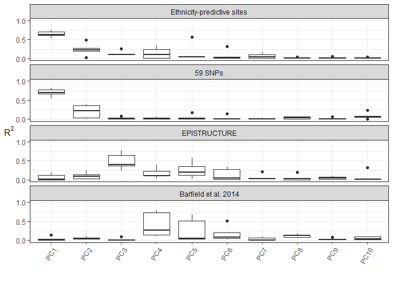

Here I test existing methods to infer population structure in our combined data, and compare to
the ethnicity predictor

# 1.0 Setup

Load libraries


```r
library(dplyr)
```

```
## Warning: package 'dplyr' was built under R version 3.5.1
```

```r
library(tidyr)
```

```
## Warning: package 'tidyr' was built under R version 3.5.1
```

```r
library(ggplot2)
```

```
## Warning: package 'ggplot2' was built under R version 3.5.1
```

```r
library(caret)
library(RColorBrewer)
library(pheatmap)
library(reshape2)
library(vicbits) # github/wvictor14/vicbits
library(gridExtra)
library(grid)
library(extrafont)
library(impute)
library(limma)
library(CpGassoc)
```

```
## Warning: package 'CpGassoc' was built under R version 3.5.1
```

```r
font_import(pattern = "calibri", prompt = F)
```

Load Data


```r
# betas and pdata
betas <- readRDS('../../Robjects_final/01_processed_betas_EPIC.rds') 
dim(betas) #  319625    510
```

```
## [1] 319233    510
```

```r
pDat <- readRDS('../../Robjects_final/02_pDat.rds') #pData with predicted ethnicity probabilities
dim(pDat) # 499 29
```

```
## [1] 499  30
```

```r
# load non-filtered betas
betas_all <- readRDS('../../Robjects_final/02_BMIQ_nofiltering.rds')

# filter out south asians and replicates
dim(betas_all) # 485577    518
```

```
## [1] 485577    518
```

```r
betas_all <- betas_all[,colnames(betas)]
dim(betas_all) # 485577    510
```

```
## [1] 485577    510
```

```r
# knn impute
sum(is.na(betas));sum(is.na(betas_all)) #340, 848
```

```
## [1] 339
```

```
## [1] 848
```

```r
set.seed(1)
betas <- impute.knn(as.matrix(betas), maxp = 15000)$data
```

```
## Cluster size 319233 broken into 154713 164520 
## Cluster size 154713 broken into 62742 91971 
## Cluster size 62742 broken into 30470 32272 
## Cluster size 30470 broken into 14322 16148 
## Done cluster 14322 
## Cluster size 16148 broken into 7658 8490 
## Done cluster 7658 
## Done cluster 8490 
## Done cluster 16148 
## Done cluster 30470 
## Cluster size 32272 broken into 16350 15922 
## Cluster size 16350 broken into 13822 2528 
## Done cluster 13822 
## Done cluster 2528 
## Done cluster 16350 
## Cluster size 15922 broken into 11649 4273 
## Done cluster 11649 
## Done cluster 4273 
## Done cluster 15922 
## Done cluster 32272 
## Done cluster 62742 
## Cluster size 91971 broken into 63575 28396 
## Cluster size 63575 broken into 42097 21478 
## Cluster size 42097 broken into 14224 27873 
## Done cluster 14224 
## Cluster size 27873 broken into 15821 12052 
## Cluster size 15821 broken into 6862 8959 
## Done cluster 6862 
## Done cluster 8959 
## Done cluster 15821 
## Done cluster 12052 
## Done cluster 27873 
## Done cluster 42097 
## Cluster size 21478 broken into 11733 9745 
## Done cluster 11733 
## Done cluster 9745 
## Done cluster 21478 
## Done cluster 63575 
## Cluster size 28396 broken into 16275 12121 
## Cluster size 16275 broken into 8620 7655 
## Done cluster 8620 
## Done cluster 7655 
## Done cluster 16275 
## Done cluster 12121 
## Done cluster 28396 
## Done cluster 91971 
## Done cluster 154713 
## Cluster size 164520 broken into 101365 63155 
## Cluster size 101365 broken into 38474 62891 
## Cluster size 38474 broken into 17605 20869 
## Cluster size 17605 broken into 8674 8931 
## Done cluster 8674 
## Done cluster 8931 
## Done cluster 17605 
## Cluster size 20869 broken into 4 20865 
## Done cluster 4 
## Cluster size 20865 broken into 3144 17721 
## Done cluster 3144 
## Cluster size 17721 broken into 17720 1 
## Cluster size 17720 broken into 8080 9640 
## Done cluster 8080 
## Done cluster 9640 
## Done cluster 17720 
## Done cluster 1 
## Done cluster 17721 
## Done cluster 20865 
## Done cluster 20869 
## Done cluster 38474 
## Cluster size 62891 broken into 29052 33839 
## Cluster size 29052 broken into 5784 23268 
## Done cluster 5784 
## Cluster size 23268 broken into 10541 12727 
## Done cluster 10541 
## Done cluster 12727 
## Done cluster 23268 
## Done cluster 29052 
## Cluster size 33839 broken into 31397 2442 
## Cluster size 31397 broken into 15982 15415 
## Cluster size 15982 broken into 4240 11742 
## Done cluster 4240 
## Done cluster 11742 
## Done cluster 15982 
## Cluster size 15415 broken into 6155 9260 
## Done cluster 6155 
## Done cluster 9260 
## Done cluster 15415 
## Done cluster 31397 
## Done cluster 2442 
## Done cluster 33839 
## Done cluster 62891 
## Done cluster 101365 
## Cluster size 63155 broken into 30835 32320 
## Cluster size 30835 broken into 15213 15622 
## Cluster size 15213 broken into 8765 6448 
## Done cluster 8765 
## Done cluster 6448 
## Done cluster 15213 
## Cluster size 15622 broken into 4214 11408 
## Done cluster 4214 
## Done cluster 11408 
## Done cluster 15622 
## Done cluster 30835 
## Cluster size 32320 broken into 15344 16976 
## Cluster size 15344 broken into 8551 6793 
## Done cluster 8551 
## Done cluster 6793 
## Done cluster 15344 
## Cluster size 16976 broken into 12369 4607 
## Done cluster 12369 
## Done cluster 4607 
## Done cluster 16976 
## Done cluster 32320 
## Done cluster 63155 
## Done cluster 164520
```

```r
set.seed(1)
betas_all <- impute.knn(as.matrix(betas_all), maxp = 15000)$data
```

```
## Cluster size 485577 broken into 237466 248111 
## Cluster size 237466 broken into 144971 92495 
## Cluster size 144971 broken into 88786 56185 
## Cluster size 88786 broken into 36386 52400 
## Cluster size 36386 broken into 7505 28881 
## Done cluster 7505 
## Cluster size 28881 broken into 11180 17701 
## Done cluster 11180 
## Cluster size 17701 broken into 9977 7724 
## Done cluster 9977 
## Done cluster 7724 
## Done cluster 17701 
## Done cluster 28881 
## Done cluster 36386 
## Cluster size 52400 broken into 29269 23131 
## Cluster size 29269 broken into 14498 14771 
## Done cluster 14498 
## Done cluster 14771 
## Done cluster 29269 
## Cluster size 23131 broken into 17755 5376 
## Cluster size 17755 broken into 20 17735 
## Done cluster 20 
## Cluster size 17735 broken into 13181 4554 
## Done cluster 13181 
## Done cluster 4554 
## Done cluster 17735 
## Done cluster 17755 
## Done cluster 5376 
## Done cluster 23131 
## Done cluster 52400 
## Done cluster 88786 
## Cluster size 56185 broken into 31510 24675 
## Cluster size 31510 broken into 1 31509 
## Done cluster 1 
## Cluster size 31509 broken into 1 31508 
## Done cluster 1 
## Cluster size 31508 broken into 26806 4702 
## Cluster size 26806 broken into 18810 7996 
## Cluster size 18810 broken into 6499 12311 
## Done cluster 6499 
## Done cluster 12311 
## Done cluster 18810 
## Done cluster 7996 
## Done cluster 26806 
## Done cluster 4702 
## Done cluster 31508 
## Done cluster 31509 
## Done cluster 31510 
## Cluster size 24675 broken into 22538 2137 
## Cluster size 22538 broken into 8353 14185 
## Done cluster 8353 
## Done cluster 14185 
## Done cluster 22538 
## Done cluster 2137 
## Done cluster 24675 
## Done cluster 56185 
## Done cluster 144971 
## Cluster size 92495 broken into 48543 43952 
## Cluster size 48543 broken into 3824 44719 
## Done cluster 3824 
## Cluster size 44719 broken into 22144 22575 
## Cluster size 22144 broken into 4828 17316 
## Done cluster 4828 
## Cluster size 17316 broken into 9801 7515 
## Done cluster 9801 
## Done cluster 7515 
## Done cluster 17316 
## Done cluster 22144 
## Cluster size 22575 broken into 9652 12923 
## Done cluster 9652 
## Done cluster 12923 
## Done cluster 22575 
## Done cluster 44719 
## Done cluster 48543 
## Cluster size 43952 broken into 22252 21700 
## Cluster size 22252 broken into 13054 9198 
## Done cluster 13054 
## Done cluster 9198 
## Done cluster 22252 
## Cluster size 21700 broken into 8760 12940 
## Done cluster 8760 
## Done cluster 12940 
## Done cluster 21700 
## Done cluster 43952 
## Done cluster 92495 
## Done cluster 237466 
## Cluster size 248111 broken into 76858 171253 
## Cluster size 76858 broken into 35049 41809 
## Cluster size 35049 broken into 18219 16830 
## Cluster size 18219 broken into 8561 9658 
## Done cluster 8561 
## Done cluster 9658 
## Done cluster 18219 
## Cluster size 16830 broken into 3583 13247 
## Done cluster 3583 
## Done cluster 13247 
## Done cluster 16830 
## Done cluster 35049 
## Cluster size 41809 broken into 19462 22347 
## Cluster size 19462 broken into 3216 16246 
## Done cluster 3216 
## Cluster size 16246 broken into 7310 8936 
## Done cluster 7310 
## Done cluster 8936 
## Done cluster 16246 
## Done cluster 19462 
## Cluster size 22347 broken into 11791 10556 
## Done cluster 11791 
## Done cluster 10556 
## Done cluster 22347 
## Done cluster 41809 
## Done cluster 76858 
## Cluster size 171253 broken into 39536 131717 
## Cluster size 39536 broken into 19837 19699 
## Cluster size 19837 broken into 15833 4004 
## Cluster size 15833 broken into 9201 6632 
## Done cluster 9201 
## Done cluster 6632 
## Done cluster 15833 
## Done cluster 4004 
## Done cluster 19837 
## Cluster size 19699 broken into 10335 9364 
## Done cluster 10335 
## Done cluster 9364 
## Done cluster 19699 
## Done cluster 39536 
## Cluster size 131717 broken into 42073 89644 
## Cluster size 42073 broken into 26604 15469 
## Cluster size 26604 broken into 1297 25307 
## Done cluster 1297 
## Cluster size 25307 broken into 17774 7533 
## Cluster size 17774 broken into 6776 10998 
## Done cluster 6776 
## Done cluster 10998 
## Done cluster 17774 
## Done cluster 7533 
## Done cluster 25307 
## Done cluster 26604 
## Cluster size 15469 broken into 14136 1333 
## Done cluster 14136 
## Done cluster 1333 
## Done cluster 15469 
## Done cluster 42073 
## Cluster size 89644 broken into 38539 51105 
## Cluster size 38539 broken into 35777 2762 
## Cluster size 35777 broken into 19734 16043 
## Cluster size 19734 broken into 8494 11240 
## Done cluster 8494 
## Done cluster 11240 
## Done cluster 19734 
## Cluster size 16043 broken into 8587 7456 
## Done cluster 8587 
## Done cluster 7456 
## Done cluster 16043 
## Done cluster 35777 
## Done cluster 2762 
## Done cluster 38539 
## Cluster size 51105 broken into 27066 24039 
## Cluster size 27066 broken into 19385 7681 
## Cluster size 19385 broken into 10405 8980 
## Done cluster 10405 
## Done cluster 8980 
## Done cluster 19385 
## Done cluster 7681 
## Done cluster 27066 
## Cluster size 24039 broken into 7769 16270 
## Done cluster 7769 
## Cluster size 16270 broken into 8559 7711 
## Done cluster 8559 
## Done cluster 7711 
## Done cluster 16270 
## Done cluster 24039 
## Done cluster 51105 
## Done cluster 89644 
## Done cluster 131717 
## Done cluster 171253 
## Done cluster 248111
```

```r
sum(is.na(betas));sum(is.na(betas_all)) #0,0
```

```
## [1] 0
```

```
## [1] 0
```

```r
# remove south asians and replicates
betas <- betas[,pDat$sampleNames]
betas_all <- betas_all[,pDat$sampleNames]
table(pDat$Ethnicity2) # 57        53       391
```

```
## 
##   African     Asian Caucasian 
##        57        53       389
```

```r
# Clean pDat
pDat3 <- pDat %>% 
  separate(Array, into =c('Row', 'Column'), sep = 3) %>%
  select(sampleNames, Ethnicity2, Dataset, Sex, PE, GA, Row, Column, Condition, 
         contains('Prob'), Predicted_ethnicity) %>%
  mutate(GA = as.numeric(GA), Ethnicity2 = as.factor(Ethnicity2)) %>% as_tibble
```

```
## Warning in evalq(as.numeric(GA), <environment>): NAs introduced by coercion
```

```r
# other methylation methods:
load('../../data/Barfield2014/cpgs_within_0bp_of_TGP_SNP.Rdata') 
bp0 <- a2; rm(a2) # 7703 cpgs 0 bp away from a snp
epi <- read.csv('../../data/EPISTRUCTURE/13072_2016_108_MOESM3_ESM.csv', 
                header = F)
```

## Load AIMs


```r
aims_plomics <- read.csv('../../data/Robinson/AIMs/MDSCOORD_AIMsWR-P2.csv')
aims_rob <- read.csv('../../data/Robinson/AIMs/ROBLAB.MDS.noAMR.csv')

# merge the two
aims <- rbind(aims_plomics, aims_rob) %>% as_tibble() %>% 
  mutate(sampleNames = gsub('v$', '', X)) %>%
  rename(AIMs_Coordinate1 = Coordinate1, AIMs_Coordinate2 = Coordinate2, 
         AIMs_Coordinate3 = Coordinate3) %>% select(-X)

# add aims to pDat
pDat <- pDat %>% 
  separate(Array, into =c('Row', 'Column'), sep = 3) %>%
  select(-Flag) %>%
  mutate(GA = as.numeric(GA), Ethnicity2 = as.factor(Ethnicity2)) %>% 
  left_join(aims)
```

```
## Warning in evalq(as.numeric(GA), <environment>): NAs introduced by coercion
```

```
## Joining, by = "sampleNames"
```

```r
# drop variables 'fold' and 'pred', create GSEaccession and Cohort ID
pDat <- pDat %>% 
  mutate(GSE_Accession = case_when(
      Dataset == 'Michels' ~ 'GSE70453',
      Dataset == 'Fry' ~ 'GSE73375',
      Dataset == 'Robinson' ~ 'GSE100197, GSE108567, GSE74738',
      Dataset == 'Marsit' ~ 'GSE75248' ,
      Dataset == 'Cox' ~ 'GSE100197'),
    Cohort = case_when(
      Dataset == 'Michels' ~ 'C1',
      Dataset == 'Fry' ~ 'C2',
      Dataset == 'Robinson' ~ 'C5',
      Dataset == 'Marsit' ~ 'C3' ,
      Dataset == 'Cox' ~ 'C4')) %>% 
  dplyr::select(sampleNames, Dataset, Cohort, GSE_Accession, Sex, Ethnicity2, Predicted_ethnicity,
                contains('Prob'), contains('Coord'), Condition, PE:Slide, Ethnicity, 
                MaternalEthnicity:matAge, rownames:meanSScor)
```

Subset down to samples with both aims and methylation data

betas2 = filtered data
betas_all2 = unfiltered data


```r
pDat2 <- pDat %>% inner_join(aims)
```

```
## Joining, by = c("sampleNames", "AIMs_Coordinate1", "AIMs_Coordinate2", "AIMs_Coordinate3")
```

```r
betas2 <- betas[,pDat2$sampleNames]
betas_all2 <- betas_all[,pDat2$sampleNames]
nrow(pDat2) == ncol(betas2) # T
```

```
## [1] TRUE
```

```r
pDat2 <- pDat2 %>% rename(SampleID=sampleNames)
```

# 2.0 Evaluating methods in within each placental cohort

Obtain pc coordinates for each set of population structure -associated features.
For the glmnet features, to avoid bias, I take out ethnicity features using the classifiers fit in
cross validation.

So for the robinson dataset, I used the robinson fold to pull out those features from the classifier
fit to the other 4 datasets.

Pull out the list of sites corresponding to each dataset


```r
glm_fit1 <- readRDS('../../Robjects_final/02_innerCV_glm_fit_logloss.rds')

glm_rob <- predictors(glm_fit1$fold1)
glm_cox <- predictors(glm_fit1$fold2)
glm_mar <- predictors(glm_fit1$fold3)
glm_fry <- predictors(glm_fit1$fold4)
glm_mic <- predictors(glm_fit1$fold5)
```

## 2.1 Association with ethnicity and other variables


```r
getCoords <- function(b1, b2){
  # b1 is the unfiltered data used to calculated epistructure
  pca_EPI <- prcomp(t(b1[intersect(epi$V1, rownames(b1)),]), center = T, scale. = T)
  pca_BF0 <- prcomp(t(b1[intersect(bp0$CpG, rownames(b1)),]), center = T, scale. = T)
  pca_SNP <- prcomp(t(b1[grep('rs*', rownames(b1)),]), center = T, scale. = T)
  
  colnames(pca_EPI$x) <- paste0('EPI_', colnames(pca_EPI$x))
  colnames(pca_BF0$x) <- paste0('BF0_', colnames(pca_BF0$x))
  colnames(pca_SNP$x) <- paste0('SNP_', colnames(pca_SNP$x))
  
  df <- as.data.frame(cbind(pca_EPI$x[,1:10], pca_BF0$x[,1:10], pca_SNP$x[,1:10]))
  return(df) 
}

pca_glm_rob <- prcomp(t(betas_all[glm_rob,pDat$sampleNames[pDat$Dataset=='Robinson']]), 
                  center = T, scale. = T)
pca_glm_cox <- prcomp(t(betas_all[glm_cox,pDat$sampleNames[pDat$Dataset=='Cox']]), 
                  center = T, scale. = T)
pca_glm_mar <- prcomp(t(betas_all[glm_mar,pDat$sampleNames[pDat$Dataset=='Marsit']]), 
                  center = T, scale. = T)
pca_glm_fry <- prcomp(t(betas_all[glm_fry,pDat$sampleNames[pDat$Dataset=='Fry']]), 
                  center = T, scale. = T)
pca_glm_mic <- prcomp(t(betas_all[glm_mic,pDat$sampleNames[pDat$Dataset=='Michels']]), 
                  center = T, scale. = T)

colnames(pca_glm_rob$x) <- paste0('GLM_', colnames(pca_glm_rob$x))
colnames(pca_glm_cox$x) <- paste0('GLM_', colnames(pca_glm_cox$x))
colnames(pca_glm_mar$x) <- paste0('GLM_', colnames(pca_glm_mar$x))
colnames(pca_glm_fry$x) <- paste0('GLM_', colnames(pca_glm_fry$x))
colnames(pca_glm_mic$x) <- paste0('GLM_', colnames(pca_glm_mic$x))

# get PCs
coords_mar <- cbind(pca_glm_mar$x[,1:10],
                    getCoords(betas_all[,pDat$sampleNames[pDat$Dataset=='Marsit']],
                        betas[,pDat$sampleNames[pDat$Dataset=='Marsit']]))
coords_rob <- cbind(pca_glm_rob$x[,1:10],
                    getCoords(betas_all[,pDat$sampleNames[pDat$Dataset=='Robinson']],
                        betas[,pDat$sampleNames[pDat$Dataset=='Robinson']]))
coords_cox <- cbind(pca_glm_cox$x[,1:10],
                    getCoords(betas_all[,pDat$sampleNames[pDat$Dataset=='Cox']],
                        betas[,pDat$sampleNames[pDat$Dataset=='Cox']]))
coords_fry <- cbind(pca_glm_fry$x[,1:10],
                    getCoords(betas_all[,pDat$sampleNames[pDat$Dataset=='Fry']],
                        betas[,pDat$sampleNames[pDat$Dataset=='Fry']]))
coords_mic <- cbind(pca_glm_mic$x[,1:10],
                    getCoords(betas_all[,pDat$sampleNames[pDat$Dataset=='Michels']],
                        betas[,pDat$sampleNames[pDat$Dataset=='Michels']]))

# get R^2
pcs_cor_mar <- lmmatrix(dep = coords_mar, 
                        ind = pDat %>% filter(Dataset == 'Marsit') %>%
                          select(Ethnicity2, Sex, GA, Condition, Row, Column)) %>% t() 
pcs_cor_rob <- lmmatrix(dep = coords_rob,
                        ind = pDat %>% filter(Dataset == 'Robinson') %>% 
                          select(Ethnicity2, Sex, GA, PE, Row, Column, contains('Coord'))) %>% t() 
pcs_cor_cox <- lmmatrix(dep = coords_cox,
                        ind = pDat %>% filter(Dataset == 'Cox') %>%
                          select(Ethnicity2, Sex, GA, PE, Row, Column, contains('Coord'))) %>% t()
pcs_cor_fry <- lmmatrix(dep = coords_fry,
                        ind = pDat %>% filter(Dataset == 'Fry') %>% 
                          select(Ethnicity2, Ethnicity2, Sex, GA, PE)) %>% t() 
pcs_cor_mic <- lmmatrix(dep = coords_mic,
                        ind = pDat %>% filter(Dataset == 'Michels') %>% 
                          select(Ethnicity2, Sex)) %>% t() 

# reshape the data so ggplot2 can plot heatmap
pcs_cor_mar <- pcs_cor_mar %>% as.data.frame() %>% 
  mutate(x = rownames(pcs_cor_mar), Dataset = 'Marsit', Cohort = 'C3') %>% 
  separate(x, into = c('method', 'PC')) %>% rename(Birthweight = Condition) %>%
  gather(-method, -PC, -Dataset, -Cohort, Ethnicity2:Column, key = 'Variable', value = 'Rsquared') 

pcs_cor_rob <- pcs_cor_rob %>% as.data.frame() %>%
  mutate(x = rownames(pcs_cor_rob), Dataset = 'Robinson', Cohort = 'C5') %>% 
  separate(x, into = c('method', 'PC')) %>%
  gather(-method, -PC, -Dataset, -Cohort, Ethnicity2:Column, key = 'Variable', value = 'Rsquared') 

pcs_cor_cox <- pcs_cor_cox %>% as.data.frame() %>%
  mutate(x = rownames(pcs_cor_cox), Dataset = 'Cox', Cohort = 'C4') %>% 
  separate(x, into = c('method', 'PC')) %>%
  gather(-method, -PC, -Dataset, -Cohort, Ethnicity2:Column, key = 'Variable', value = 'Rsquared') 
  
pcs_cor_fry <- pcs_cor_fry %>% as.data.frame() %>% 
  mutate(x = rownames(pcs_cor_fry), Dataset = 'Fry', Cohort = 'C2') %>% 
  separate(x, into = c('method', 'PC')) %>%
  gather(-method, -PC, -Dataset, -Cohort, Ethnicity2:PE, key = 'Variable', value = 'Rsquared') 

pcs_cor_mic <- pcs_cor_mic %>% as.data.frame() %>% 
  mutate(x = rownames(pcs_cor_mic), Dataset = 'Michels', Cohort = 'C1') %>% separate(x, into = c('method', 'PC')) %>%
  gather(-method, -PC, -Dataset, -Cohort, Ethnicity2:Sex, key = 'Variable', value = 'Rsquared') 

pcs_cor <- rbind(pcs_cor_mar, pcs_cor_rob, pcs_cor_cox, pcs_cor_fry, pcs_cor_mic) %>% as_tibble %>%
  mutate(PC = factor(PC, levels = paste0('PC', 1:10)),
         Variable = factor(ifelse(Variable == "Ethnicity2", "Ethnicity", 
                                  ifelse(Variable == 'GA', 'Gest. Age', 
                                         ifelse(Variable == 'PE', 'Preeclampsia', 
                                                gsub('AIMs_', 'AIMs ', Variable)))),
                           levels = c("Column","Row","Birthweight","Gest. Age","Preeclampsia",
                                      "Sex", "AIMs Coordinate1", "AIMs Coordinate2",
                                      "AIMs Coordinate3", "Ethnicity")),
         method = factor(case_when(
           method == 'BF0' ~ 'Barfield et al. 2014',
           method == 'EPI' ~ 'EPISTRUCTURE',
           method == 'GLM' ~ 'Ethnicity-predictive sites',
           method == 'SNP' ~ '59 SNPs'
         ))) %>%
  mutate(method = factor(method, levels = levels(method)[c(4,1,3,2)]))

g1 <- ggplot(pcs_cor, aes(x = PC, y = Variable)) + 
  geom_tile(aes(fill = Rsquared), col = 'lightgrey') + 
  geom_text(aes(label = ifelse(round(Rsquared,2)>0.1,round(Rsquared,2),'')), size = 2)+
  scale_fill_gradientn(colours=c("white", "#ffffcc", "#41b6c4", "#2c7fb8", "#253494"), 
                       breaks = c(0,0.5,1), limits = c(0,1), 
                       guide = guide_colorbar(frame.colour = "black", ticks.colour = "black")) +
  theme_bw(base_size = 11) +
  theme(axis.text.x = element_text(angle = 60, vjust = 1, hjust=1),
        aspect.ratio = 1) +
  facet_grid(Cohort~method, space = 'free', scales = 'free_y')  +
  scale_x_discrete(expand = c(0, 0)) +
  scale_y_discrete(expand = c(0, 0),
                   breaks = levels(pcs_cor$Variable),
                   labels = c(levels(pcs_cor$Variable)[1:6], 
                              expression(bold('AIMs Coordinate1')),
                              expression(bold('AIMs Coordinate2')), 
                              expression(bold('AIMs Coordinate3')), 
                              expression(bold('Ethnicity')))) +
  labs(fill = expression(R^2), x = '', y = '');g1
```

<!-- -->

```r
# summarize variance explained in ethnicity
ggplot(pcs_cor %>% filter(Variable == 'Ethnicity'), 
       aes(x = PC, y = Rsquared, col = Cohort, group = Cohort)) +
  geom_point(aes(col = Cohort), alpha = 0.75) + geom_line(aes()) + theme_bw() +
  facet_wrap(~method, ncol = 1) + 
  scale_color_brewer(palette = 6, type = 'qual') +
  theme(axis.text.x = element_text(angle = 60, vjust = 1, hjust=1),
        axis.title.y = element_text(angle = 0, vjust = 0.5)) +
  labs(y = expression(R^2), x = '') +
  scale_y_continuous(limits = c(0,1), breaks = c(0,0.5,1)) # ggsave h = 5, w = 3
```

<!-- -->

```r
ggplot(pcs_cor %>% filter(Variable == 'Ethnicity'), 
       aes(x = PC, y = Rsquared)) +
  geom_boxplot(aes(col = method)) + scale_y_continuous(limits = c(0,1)) +
  labs(title = 'Averaged across cohorts', y = expression(R^2), x = '') +
  theme_bw() + theme(axis.title.y = element_text(angle = 0, vjust = 0.5)) 
```

<!-- -->

```r
ggplot(pcs_cor %>% filter(Variable == 'Ethnicity'), 
       aes(x = PC, y = Rsquared)) +
  geom_boxplot() +
  facet_wrap(~method, ncol = 1) +
  labs(y = expression(R^2), x = '') +
  theme_bw() + theme(axis.title.y = element_text(angle = 0, vjust = 0.5),
                     axis.text.x = element_text(angle = 60, vjust = 1, hjust=1))  +
  scale_y_continuous(limits = c(0,1), breaks = c(0,0.5,1))
```

<!-- -->

```r
## proportion of variance explaind in genetic ancestry
ggplot(pcs_cor %>% filter(grepl('Coordinate1', Variable)), 
       aes(x = PC, y = Rsquared, col = Cohort, group = Cohort)) +
  geom_point(aes(col = Cohort), alpha = 0.75) + geom_line(aes()) + theme_bw() +
  facet_wrap(~method, ncol = 1) + 
  scale_colour_manual(values = c('#984ea3', '#ff7f00'))+
  theme(axis.text.x = element_text(angle = 60, vjust = 1, hjust=1),
        axis.title.y = element_text(angle = 0, vjust = 0.5)) +
  labs(y = expression(R^2), x = '') +
  scale_y_continuous(limits = c(0,1), breaks = c(0,0.5,1)) # ggsave h = 5, w = 3
```

<!-- -->

```r
ggplot(pcs_cor %>% filter(grepl('Coordinate2', Variable)), 
       aes(x = PC, y = Rsquared, col = Cohort, group = Cohort)) +
  geom_point(aes(col = Cohort), alpha = 0.75) + geom_line(aes()) + theme_bw() +
  facet_wrap(~method, ncol = 1) + 
  scale_colour_manual(values = c('#984ea3', '#ff7f00'))+
  theme(axis.text.x = element_text(angle = 60, vjust = 1, hjust=1),
        axis.title.y = element_text(angle = 0, vjust = 0.5)) +
  labs(y = expression(R^2), x = '') +
  scale_y_continuous(limits = c(0,1), breaks = c(0,0.5,1)) # ggsave h = 5, w = 3
```

<!-- -->

```r
ggplot(pcs_cor %>% filter(grepl('Coordinate3', Variable)), 
       aes(x = PC, y = Rsquared, col = Cohort, group = Cohort)) +
  geom_point(aes(col = Cohort)) + geom_line(aes()) + theme_bw() +
  facet_wrap(~method, ncol = 1) + 
  scale_colour_manual(values = c('#8856a7', '#8c96c6'))+
  theme(axis.text.x = element_text(angle = 60, vjust = 1, hjust=1),
        axis.title.y = element_text(angle = 0, vjust = 0.5)) +
  labs(y = expression(R^2), x = '') +
  scale_y_continuous(limits = c(0,1), breaks = c(0,0.5,1)) # ggsave h = 6, w = 3.5
```

<!-- -->

## 2.2 Correcting in linear modeling

Now see how many associations remain after correcting with these PCs in a linear modeling procedure.


```r
# apply linear modeling in each dataset adjusting for 1 pc of each method, then for the first 2 pcs 
# of each method, first 3, first 4..... so on. and take out the number of Hits at significance 
for (i in levels(pDat$Dataset)) {
  ind <- which(pDat$Dataset == i)  # index for dataset
  b <- betas[,ind]                  # betas for dataset
  Eth <- as.factor(pDat[ind,] %>% pull(Ethnicity2)) # pull out the independent variable of interest
  
  # Pull out all available covariates, and pcs
  if(i == 'Michels'){
    Cov <- pDat[ind,] %>% select(Sex)
    coords <- coords_mic
  }
  if(i == 'Fry'){
    Cov <- pDat[ind,] %>% select(Sex, GA, PE)
    coords <- coords_fry
  }
  if(i == 'Robinson'){
    Cov <- pDat[ind,] %>% select(Sex, GA, PE, Row)
    coords <- coords_rob
  }
  if(i == 'Cox'){
    Cov <- pDat[ind,] %>% select(Sex, GA, PE, Row)
    coords <- coords_cox
  }
  if(i == 'Marsit'){
    Cov <- pDat[ind, ] %>% select(Sex, GA, Condition, Row)
    coords <- coords_mar
  }
  
  #unadjusted analysis
  U <- cpg.assoc(b, Eth, Cov)
  P <- cpg.assoc(b, Eth, pDat[ind,] %>% select(Prob_Caucasian, Prob_Asian))
  
  # adjusted analysis
  for(j in 1:10){   # cumulative addition of PCs to adjust for
    BF <- cpg.assoc(b, Eth, cbind(Cov, coords[,paste0('BF0_PC', 1:j)]))
    EP <- cpg.assoc(b, Eth, cbind(Cov, coords[,paste0('EPI_PC', 1:j)]))
    SN <- cpg.assoc(b, Eth, cbind(Cov, coords[,paste0('SNP_PC', 1:j)]))
    NS <- cpg.assoc(b, Eth, cbind(Cov, coords[,paste0('GLM_PC', 1:j)]))
  
    if (j > 1) { # after first iteration, extend the dataframe of results
      df <- df %>% 
        rbind(tibble(Method = c('BF0', 'EPI', 'SNP', 'GLM'), 
                   PC = paste0('PC', j),
                   Holm = c(nrow(BF$Holm.sig), nrow(EP$Holm.sig), nrow(SN$Holm.sig), nrow(NS$Holm.sig)),
                   BH = c(nrow(BF$FDR.sig), nrow(EP$FDR.sig), nrow(SN$FDR.sig), nrow(NS$FDR.sig))))
    } else { # for first iteration create a new dataframe
      df <- tibble(Method = c('BF0', 'EPI', 'SNP', 'GLM'), 
                   PC = paste0('PC', j),
                   Holm = c(nrow(BF$Holm.sig), nrow(EP$Holm.sig), nrow(SN$Holm.sig), nrow(NS$Holm.sig)),
                   BH = c(nrow(BF$FDR.sig), nrow(EP$FDR.sig), nrow(SN$FDR.sig), nrow(NS$FDR.sig)))
    }
  }
  
  df <-  df %>% mutate(Dataset = i) # create a dataset column
  
  if (i == 'Michels') {
    Hits_a <- df
    Hits_u <- tibble(Method = c('unadjusted', 'adjusted'),
                     Holm = c(nrow(U$Holm.sig), nrow(P$Holm.sig)), 
                     BH = c(nrow(U$FDR.sig), nrow(P$FDR.sig)), 
                     Dataset = 'Michels')
  } else {
    Hits_a <- rbind(Hits_a, df)
    Hits_u <- rbind(Hits_u, 
                    tibble(Method = c('unadjusted', 'adjusted'), 
                           Holm = c(nrow(U$Holm.sig), nrow(P$Holm.sig)), 
                           BH = c(nrow(U$FDR.sig), nrow(P$FDR.sig)), Dataset = i))
  }
}

Hits_a <-Hits_a %>% gather(Holm, BH, -Method, -PC, -Dataset, key = 'Adjustment', value = 'Hits') 
Hits_u <-Hits_u %>% gather(Holm, BH, -Method, -Dataset, key = 'Adjustment', value = 'Hits') 

Hits_a <- Hits_a %>% mutate(Cohort = case_when(
  Dataset == 'Michels' ~ 'GSE70453',
  Dataset == 'Fry' ~ 'GSE73375',
  Dataset == 'Robinson' ~ 'GSE100197, GSE108567, GSE74738',
  Dataset == 'Marsit' ~ 'GSE75248' ,
  Dataset == 'Cox' ~ 'GSE100197'),
  Method = case_when(
    Method == 'BF0' ~ 'Barfield et al. 2014',
    Method == 'EPI' ~ 'EPISTRUCTURE',
    Method == 'SNP' ~ '59 SNPs',
    Method == 'GLM' ~ 'Ethnicity-predictive sites'
  ))
Hits_u <- Hits_u %>% mutate(Cohort = case_when(
  Dataset == 'Michels' ~ 'GSE70453',
  Dataset == 'Fry' ~ 'GSE73375',
  Dataset == 'Robinson' ~ 'GSE100197, GSE108567, GSE74738',
  Dataset == 'Marsit' ~ 'GSE75248' ,
  Dataset == 'Cox' ~ 'GSE100197'
))
ggplot(Hits_u, aes(x = Method, y = Hits)) +
  geom_bar(stat = 'identity') + facet_grid(Dataset~Adjustment, scales = 'free')
```

<!-- -->

```r
ggplot(Hits_a %>% mutate(PC = factor(PC, levels = paste0('PC', 1:10))) %>% 
         filter(Adjustment == 'Holm', Method != 'Ethnicity-predictive sites'), 
       aes(x = PC, y = Hits, color = Method, group = Method)) +
  geom_point() + geom_line() + facet_wrap(Cohort~., scales = 'free',ncol = 2) +
  geom_hline(data = Hits_u %>% filter(Adjustment == 'BH'), 
             aes(yintercept = Hits, linetype = Method)) +
  labs(x = '', col = '') + 
  theme_bw() +theme(axis.title.y = element_text(angle = 0, vjust = 0.5)) 
```

<!-- -->

PC heatmap for each dataset

## 2.3 Comparison to AIMs


```r
getCoords <- function(b){
  # b is the unfiltered data used to calculated epistructure
  pca_EPI <- prcomp(t(b[intersect(epi$V1, rownames(b)),]), center = T, scale. = T)
  pca_BF0 <- prcomp(t(b[intersect(bp0$CpG, rownames(b)),]), center = T, scale. = T)
  pca_SNP <- prcomp(t(b[grep('rs*', rownames(b)),]), center = T, scale. = T)
  
  colnames(pca_EPI$x) <- paste0('EPI_', colnames(pca_EPI$x))
  colnames(pca_BF0$x) <- paste0('BF0_', colnames(pca_BF0$x))
  colnames(pca_SNP$x) <- paste0('SNP_', colnames(pca_SNP$x))
  
  df <- as.data.frame(cbind(pca_EPI$x[,1:10], pca_BF0$x[,1:10], pca_SNP$x[,1:10]))
  return(df) 
}

# get PCs
coords_rob <- getCoords(betas_all2[,pDat2$SampleID[pDat2$Dataset=='Robinson']])
coords_cox <- getCoords(betas_all2[,pDat2$SampleID[pDat2$Dataset=='Cox']])

pDat2 <- pDat2 %>% 
  separate(Array, into =c('Row', 'Column'), sep = 3) %>%
  select(SampleID, Ethnicity2, Dataset, Sex, PE, GA, Row, Column, Condition, contains('Coord')) %>%
  mutate(GA = as.numeric(GA), Ethnicity2 = as.factor(Ethnicity2)) %>% as_tibble

pcs_cor_rob <- lmmatrix(dep = coords_rob,
                        ind = pDat2 %>% filter(Dataset == 'Robinson') %>% 
                          select(Ethnicity2, Sex, GA, PE, Row, Column, contains('Coord'))) %>% t() 
pcs_cor_cox <- lmmatrix(dep = coords_cox,
                        ind = pDat2 %>% filter(Dataset == 'Cox') %>%
                          select(Ethnicity2, Sex, GA, PE, Row, Column, contains('Coord'))) %>% t()

# reshape the data so ggplot2 can plot heatmap
pcs_cor_rob <- pcs_cor_rob %>% as.data.frame() %>%
  mutate(x = rownames(pcs_cor_rob), Dataset = 'Robinson') %>% 
  separate(x, into = c('method', 'PC')) %>%
  gather(-method, -PC, -Dataset, Ethnicity2:Coordinate3, key = 'Variable', value = 'Rsquared') 

pcs_cor_cox <- pcs_cor_cox %>% as.data.frame() %>%
  mutate(x = rownames(pcs_cor_cox), Dataset = 'Cox') %>% separate(x, into = c('method', 'PC')) %>%
  gather(-method, -PC, -Dataset, Ethnicity2:Coordinate3, key = 'Variable', value = 'Rsquared') 

pcs_cor <- rbind(pcs_cor_rob, pcs_cor_cox) %>% as_tibble %>%
  mutate(PC = factor(PC, levels = paste0('PC', 1:10)),
         Variable = factor(ifelse(Variable == "Ethnicity2", "Ethnicity", 
                                  ifelse(Variable == 'GA', 'Gest. Age', 
                                         ifelse(Variable == 'PE', 'Preeclampsia', Variable))),
                           levels = c("Column","Row","Birthweight","Gest. Age","Preeclampsia",
                                      "Sex", "Ethnicity", 
                                      "Coordinate3", "Coordinate2", "Coordinate1")),
         Cohort = case_when(
           Dataset == 'Robinson' ~ 'GSE100197, GSE108567, GSE74738',
           Dataset == 'Cox' ~ 'GSE100197'),
         method = case_when(
           method == 'BF0' ~ 'Barfield et al. 2014',
           method == 'EPI' ~ 'EPISTRUCTURE',
           method == 'SNP' ~ '59 SNPs'
         ))

#heatmap of associations
g2 <- ggplot(pcs_cor, aes(x = PC, y = Variable)) + 
  geom_tile(aes(fill = Rsquared), col = 'lightgrey') + 
  geom_text(aes(label = ifelse(round(Rsquared,2)>0.1,round(Rsquared,2),'')), size = 2.75)+
  scale_fill_gradientn(colours=c("white", "#ffffcc", "#41b6c4", "#2c7fb8", "#253494"), 
                       breaks = c(0,0.5,1), limits = c(0,1), 
                       guide = guide_colorbar(frame.colour = "black", ticks.colour = "black")) +
  theme_bw() +
  theme(axis.text.x = element_text(angle = 60, vjust = 1, hjust=1),
        axis.text.y = element_text(face = c(rep('plain', 6), 'bold')),
        aspect.ratio = 1) +
  facet_grid(Cohort~method, space = 'free', scales = 'free_y')  +
  scale_x_discrete(expand = c(0, 0)) +
  scale_y_discrete(expand = c(0, 0)) +
  labs(fill = expression(R^2), x = '', y = '');g2

# plot 1 and 2
pDat2 <- pDat2  %>% cbind(
  rbind(coords_rob, coords_cox)[pDat2$SampleID,])

rbind(coords_rob, coords_cox)[pDat2$SampleID,]

plot_pdat<- pDat2 %>% 
  select(SampleID, Ethnicity2, Dataset, Coordinate1, Coordinate2, EPI_PC1, EPI_PC2, BF0_PC1, BF0_PC2,
                 SNP_PC1, SNP_PC2) %>% melt() %>% as_tibble() %>% 
  separate(variable, into = c('Method', 'Coordinate'), sep = -1) %>%
  mutate(Method = case_when(
    Method == 'BF0_PC' ~ 'Barfield et al. 2014',
    Method == 'Coordinate' ~ 'AIMS',
    Method == 'EPI_PC' ~ 'EPISTRUCTURE', 
    Method == 'SNP_PC' ~ '59 SNPs'),
    Cohort = case_when(
           Dataset == 'Robinson' ~ 'GSE100197, GSE108567, GSE74738',
           Dataset == 'Cox' ~ 'GSE100197')) %>% 
  spread(Coordinate, value) %>% rename(PC1 = `1`, PC2 = `2`) %>%
  mutate(Method = factor(Method, levels = c('AIMS', '59 SNPs', 
                                            'Barfield et al. 2014', 'EPISTRUCTURE')))

ggplot(plot_pdat %>% filter(Dataset == 'Cox'), aes(x = PC1, y = PC2, col = Ethnicity2)) +
  geom_point() + theme_bw() + labs(col = '') +
  facet_wrap(~Method, scales = 'free', ncol = 4) 
  
ggplot(plot_pdat %>% filter(Dataset == 'Robinson'), aes(x = PC1, y = PC2, col = Ethnicity2)) +
  geom_point() + theme_bw() +labs(col = '') +
  facet_wrap(~Method, scales = 'free', ncol = 4) 
```

## 2.4 Create a final meta data table for samples

Here I curate the pdat to create a final table for sample-specific information


```r
# create a final curated pdata
pDat_final <- pDat %>% 
  dplyr::rename(Cohort_owner = Dataset, Cohort_ID = Cohort, 
                Self_reported_ethnicity = Ethnicity2, Alternate_ID = rownames) %>%
  select(sampleNames, Alternate_ID, Cohort_owner:Highest_Prob, AIMs_Coordinate1:GA, Row:Slide,
         MaternalEthnicity:BW_SD, ndet:meanSScor) %>%
# remove GSE accession and alternate_ID for robinson samples
  mutate(GSE_Accession = ifelse(Cohort_owner == 'Robinson', NA, GSE_Accession),
         Alternate_ID = ifelse(Cohort_owner == 'Robinson', NA, Alternate_ID))
```

The only sample I'm not sure about is PM139, I'm using PM139_r2, but it says in the sheet that only
PM139 has been publishhed and has an associated GEO ID.

saveRDS(pDat_final, '../../Robjects_final/03_final_pData.rds')
write.table(pDat_final, '../../final_pData.txt', quote=F, row.names = F, sep = '\t')


