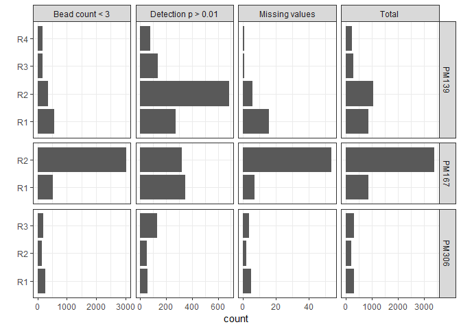
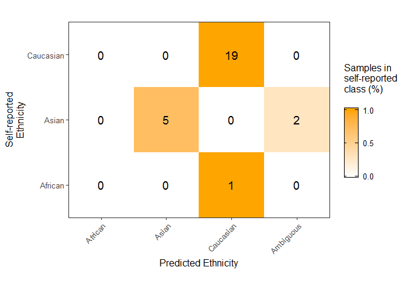
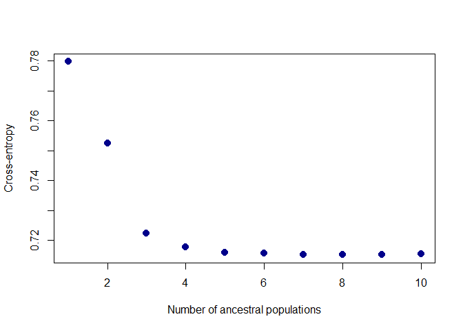
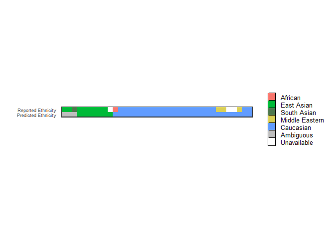
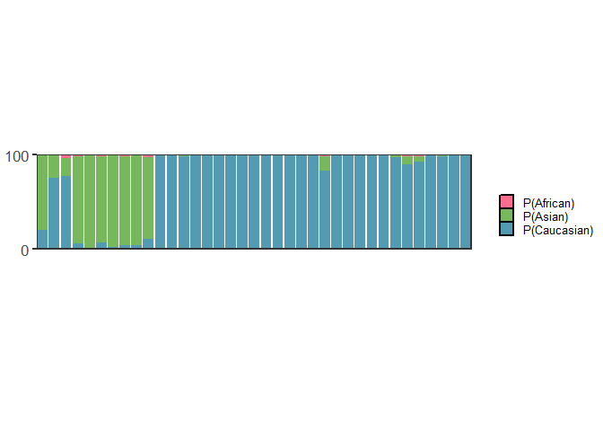
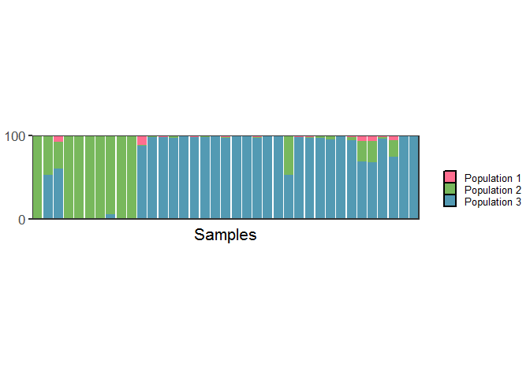
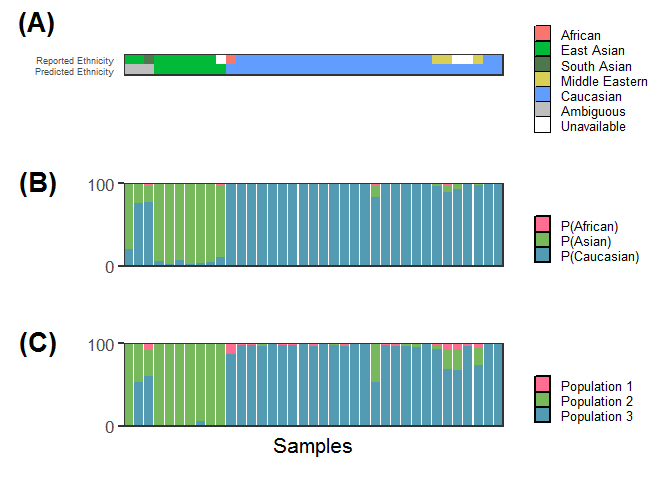
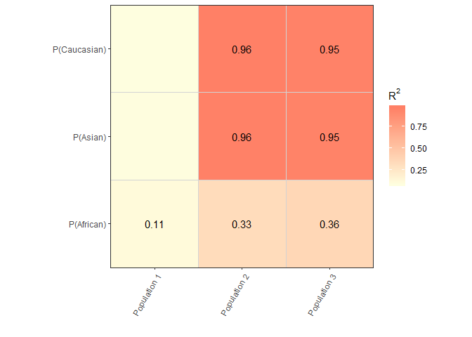
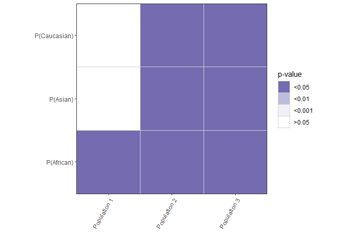

# Libraries


```r
library(minfi)
library(wateRmelon)
library(tidyr)
library(MatrixEQTL)
library(ggplot2)
library(methylkit)
library(reshape2)
library(plyr)
library(dplyr)
library(corrplot)
library(vicbits) # library(devtools);install_github('wvictor14/vicbits')
library(stringr)
library(gridExtra)
library(grid)
library(sva)
library(limma)
library(snpReady) # don't think I used this either
library(egg) # don't think I use this, was for plotting multiple things
library(caret) 
library(LEA) # for running STRUCTURE
library(gtable) # plotting multiple things
library(doParallel) # fitting predictor
library(SNPRelate) # snp pruning
library(IlluminaHumanMethylation450kanno.ilmn12.hg19)
library(cowplot)
library(qqman)
source('Z:/Victor/Code/makeSampleSheet.R')
```

# 1.0 Methylation Data

## 1.1 read data in

I read in all samples ran on the 2.5Omni array part of Giulia's project, then filter down to those 
with 450k data.


```r
# Load all CNV data
load('../../../data/Robinson/Omni2.5_Array/01_GenoRep2c.RData')
cnvPP <- read.csv('../../../data/Robinson/Omni2.5_Array/CNV PROJECT PLANNING VYedit.csv') %>% as_tibble()
Omni25Cases <- read.csv('../../../data/Robinson/Omni2.5_Array/Omni25Cases.csv') %>% as_tibble()
snpanno <- read.delim('Z:/ROBLAB6 Infinium450k John/ILLUMINA SNP ARRAYS/ILLUMINA GS files/HumanOmni2-5-8-v1-3-a1/InfiniumOmni2-5-8v1-3_A1.annotated.txt') %>% as_tibble()
rs_to_kgp <- read.delim('../../../data/Illumina manifest//InfiniumOmni2-5-8v1-3_A1_b144_rsids.txt') %>%
  as_tibble()

# match snp kgp ids to updated rs ids
snpanno <- snpanno %>% inner_join(rs_to_kgp) %>% select(Name, RsID, Chr:Mutation.s.) %>%
  inner_join(tibble(Name = rownames(geno.rep2c)))
```

```
## Warning: Column `Name` joining factor and character vector, coercing into
## character vector
```

```r
snpanno <- snpanno[match(rownames(geno.rep2c), as.character(snpanno$Name)),]
all(snpanno$Name == rownames(geno.rep2c)) # T
```

```
## [1] TRUE
```

```r
#filter out only those that are in Omni25Cases
Omni25Cases <- Omni25Cases %>% mutate(Sample_ID2 = gsub('-', '', Sample_ID)) %>% #no dash!
  filter(Sample_ID2 %in%colnames(geno.rep2c)) 
snps <- geno.rep2c[,Omni25Cases$Sample_ID2]
dim(snps)
```

```
## [1] 2370487      54
```

```r
#filter only those with 450k data
Samp450k <- cnvPP %>% filter(X450k.array == 'YES') %>% pull(Study.ID)
all(Samp450k %in% Omni25Cases$Case_ID)
```

```
## [1] TRUE
```

```r
samplesheet <- makeSampleSheet(Samp450k) # will also load non-villi samples, so need to filter these out
```

```
## [1] "2 of 2 PL samples are found in the master 450k sample sheet"
## [1] "40 of 40 PM samples are found in the master 450k sample sheet"
## [1] "These samples were ran more than once:"
## [1] "Finding all files in 450k raw data directory..."
## [1] "Found 49250 files."
```

```r
# what samples are there no villi for?
villi450k <- samplesheet %>% filter(Tissue == 'villi') %>% pull(Sample_Name)
Samp450k[!Samp450k %in% villi450k] #samples that are marked as in 450k, but are not villi
```

```
## [1] PL-86  PL-145 PM151  PM234  PM83   PM110 
## 54 Levels: PL-145 PL-86 PM10 PM110 PM112 PM114 PM116 PM12 PM120 ... PM99
```

```r
samplesheet %>% filter(Sample_Name %in% c('PM151',  'PM234',  'PM83',   'PM110' ))
```

```
## # A tibble: 6 x 7
##   Sample_Name Tissue    Sample_Plate  Batch    Sentrix_ID Sentrix_Position
##   <chr>       <chr>     <chr>         <chr>         <dbl> <chr>           
## 1 PM110       amnion    WG0002823-MS~ 1_Jul20~ 6042324125 R05C02          
## 2 PM110       chorion   WG0002823-MS~ 1_Jul20~ 6042324125 R06C02          
## 3 PM151       mat_blood WG0011624-MS~ 3_May20~ 9285451059 R03C02          
## 4 PM234       mat_blood WG0011624-MS~ 3_May20~ 9285451020 R06C02          
## 5 PM83        amnion    WG0002823-MS~ 1_Jul20~ 6042324158 R06C02          
## 6 PM83        chorion   WG0002823-MS~ 1_Jul20~ 6042324158 R05C02          
## # ... with 1 more variable: Basename <chr>
```

```r
# read em all in
rgset <- read.metharray.exp(targets = samplesheet, extended =T, verbose = T)
```

```
## Warning: Setting row names on a tibble is deprecated.
```

54 unique samples ran on omni (1 site per patient)


```r
pDat <- as.data.frame(pData(rgset)) %>% as_tibble() 
table(is.na(pDat$Tissue)) # 2 falses
```

```
## 
## FALSE  TRUE 
##    62     2
```

```r
pDat$Tissue[is.na(pDat$Tissue)] <- 'villi' # for the two pl samples
pDat$rownames <- colnames(rgset)

pDat <- pDat %>% filter(Tissue == 'villi') %>% select(-filenames, -Basename)
rgset <- rgset[,pDat$rownames]
```

## Take out replicates

I keep only 1 sample per replicate group, the one that is highest quality. Quality
i define as number of poor quality probes a


```r
# add replicate symbol for dups
pDat <- pDat %>% group_by(Sample_Name) %>% 
  mutate(Replicate_ID = paste0(Sample_Name, '_R', row_number()),
         Replicate_Num = gsub('^.*_', '', Replicate_ID))

## get data
colnames(rgset) <- pDat$Replicate_ID
betas <- getBeta(rgset)
```

```
## Loading required package: IlluminaHumanMethylation450kmanifest
```

```r
detp <- detectionP(rgset)
bc <- beadcount(rgset)

#calculate poor quality probe numbers
pDat <- pDat %>% ungroup %>% 
  mutate(NAs_betas = colSums(is.na(betas)), detp_01 = colSums(detp>0.01),
         bc_lessthan_3 = colSums(is.na(bc)), 
         Poor_quality_probes = NAs_betas + detp_01 + bc_lessthan_3)

#subset out replicates
dups <- pDat %>% group_by(Sample_Name) %>% filter(n() >1)
dups_melted <- dups %>% 
  select(Sample_Name, Replicate_Num, NAs_betas, detp_01, bc_lessthan_3,
         Poor_quality_probes) %>%
    melt() %>% as_tibble() %>% 
  mutate(variable = gsub('NAs_betas', 'Missing values',
                         gsub('detp_01', 'Detection p > 0.01',
                              gsub('bc_lessthan_3', 'Bead count < 3', 
                                   gsub('Poor_quality_probes', 'Total', variable)))))
```

```
## Using Sample_Name, Replicate_Num as id variables
```

```r
p1 <- ggplot(dups_melted, aes(x=Replicate_Num, y = value)) +
  geom_bar(stat='identity') + theme_bw() +coord_flip() + labs(x = '', y = 'count')+
  facet_grid(Sample_Name~variable, scales = 'free', space = 'free_y') 
p1
```

<!-- -->

Here we can see that PM167 replicate 2 has a lot more poor quality probes than replicate 1.
For the other samples, PM139 and PM306, it isn't as clear which sample to keep. (PM139 R2 
has high number of detection p probes though)

I retain the sample with the least amount of poor quality probes


```r
finalsamples <- pDat %>%  group_by(Sample_Name) %>%
  filter(Poor_quality_probes == min(Poor_quality_probes)) %>% pull(Replicate_ID) 
length(finalsamples) # 38 out of 42
```

```
## [1] 38
```

```r
# filter dnam data
pDat <- pDat %>% filter(Replicate_ID %in% finalsamples)
betas <- betas[,pDat$Replicate_ID]
rgset <- rgset[,pDat$Replicate_ID]
detp <- detp[,pDat$Replicate_ID]
bc <- beadcount(rgset)

#filter snps
snps_pDat <- tibble(genorep2c_ID = colnames(snps), 
                    Sample_Name = gsub('_V.*', '', colnames(snps)),
                    Site = gsub('.*_', '', colnames(snps)))
all(pDat$Sample_Name %in% snps_pDat$Sample_Name) # 38 == all
```

```
## [1] TRUE
```

```r
pDat <- pDat %>% ungroup %>% inner_join(snps_pDat, by = 'Sample_Name')
snps <- snps[,pDat$genorep2c_ID]

#fix sample IDs for all data
colnames(rgset) <- colnames(betas) <- colnames(snps) <- colnames(detp) <- colnames(bc) <- 
  pDat$Sample_Name
```

## Fix pData


```r
des <- read.csv('../../../Data/Robinson/Omni2.5_Array/DES_CASES.CNVproj.csv ') %>% as_tibble()
setdiff(pDat$Sample_Name, des$Case_ID)
```

```
## [1] "PM321"
```

PM321 is the sample with big segmental aneuploidys so I will remove it from this analysis


```r
pDat <- pDat %>% select(-Tissue, -Site) %>% inner_join(des, by = c('Sample_Name' = 'Case_ID'))
```

```
## Warning: Column `Sample_Name`/`Case_ID` joining character vector and
## factor, coercing into character vector
```

```r
betas <- betas[,pDat$Sample_Name]
rgset <- rgset[,pDat$Sample_Name]
```

summary of filtering up till now:

54 samples (mostly batch 3 (higher quality))
38 samples  with 450k data
--- 3 of which have been ran more than once, highest quality samples used for analysis
--- PM321 -> has many large CNVs -> drop
37 samples final w/matched 450k/omni3.5 data

# 2.0 DNAm preprocessing

## 2.1 Noob + BMIQ

I skip all filtering steps because it won't matter for the predictor


```r
#noob normalization
mset <- preprocessNoob(rgset)
```

```
## [dyeCorrection] Applying R/G ratio flip to fix dye bias
```

```r
bmiq_nofilt <- BMIQ(mset)  
```

```
## Warning: package 'RPMM' was built under R version 3.5.1
```

```
## Warning: package 'cluster' was built under R version 3.5.1
```

```
## 
## Attaching package: 'RPMM'
```

```
## The following object is masked from 'package:limma':
## 
##     ebayes
```

```r
bmiq_nofilt <- rbind(bmiq_nofilt, getSnpBeta(rgset)) # add snp probes to dnam matrix
colnames(bmiq_nofilt) <- pDat$Replicate_ID
dim(bmiq_nofilt) # 485577     37
```

```
## [1] 485577     37
```

# 3.0 Infer ethnicity/ancestry

## 3.1 plmec

To predict ethnicity I will also use these samples as an independent test set and retrain the 
predictor using only samples not in the 37 sample snp-DNAm roblab dataset

First I load in the training data, and then subset out any samples in the 37 sample dataset. 


```r
pDat_C1_C5 <- readRDS('../../../Robjects_final/02_pDat.rds')
dim(pDat_C1_C5) # 499 30
```

```
## [1] 499  30
```

27/37 samples overlap with data that I used to train the predictor


```r
pDat_C6 <- pDat %>% 
  left_join(pDat_C1_C5 %>% select(sampleNames,contains('Prob'), contains('Pred')), 
            by = c('Sample_Name' = 'sampleNames'))

pDat_C6 %>% filter(is.na(glm_pred)) %>% nrow() # 10 samples that need to be predicted onto
```

```
## [1] 10
```

```r
test_ind <- pDat_C6 %>% filter(is.na(glm_pred))  %>% pull(Replicate_ID)
```

The 10 remaining samples I need to predict their ethnicity with, which I do using an independently 
trained predictor (non-rob samples).

Here I load in that predictor


```r
glm_fit <- readRDS('../../../Robjects_final/02_innerCV_glm_fit_logloss.rds')
pred_10 <- predict(glm_fit[[1]], t(bmiq_nofilt[glm_fit[[1]]$finalModel$xNames ,test_ind]))
pred_prob <-  predict(glm_fit[[1]], t(bmiq_nofilt[glm_fit[[1]]$finalModel$xNames ,test_ind]),
                      type = 'prob')
colnames(pred_prob) <- paste0('Prob_', colnames(pred_prob))
pred <- data.frame(Replicate_ID = rownames(pred_prob), glm_pred = pred_10) %>% cbind(pred_prob)

# now I need to fill in the pData with these predicted values, only when there are NAs!
# coalesce is the star
pDat_C6 <- pDat_C6  %>% 
  left_join(pred, by = 'Replicate_ID') %>% 
  mutate(glm_pred = coalesce(glm_pred.x, glm_pred.y),
         Prob_African = coalesce(Prob_African.x, Prob_African.y),
         Prob_Asian = coalesce(Prob_Asian.x, Prob_Asian.y),
         Prob_Caucasian = coalesce(Prob_Caucasian.x, Prob_Caucasian.y)) %>% 
  select(-contains('.x'), -contains('.y'))
```

```
## Warning: Column `Replicate_ID` joining character vector and factor,
## coercing into character vector
```

```r
# add other ethnicity variables into pData:
## add ethnicity2 info to pDat
pDat_C6 <- pDat_C6 %>% left_join(pDat_C1_C5 %>% select(sampleNames, Ethnicity2), 
                      by = c('Sample_Name' = 'sampleNames'))

## threshold
pDat_C6 <- pDat_C6 %>% 
  mutate(Highest_Prob = case_when(
            (Prob_African > Prob_Asian) &  (Prob_African > Prob_Caucasian) ~ Prob_African,
            (Prob_Asian > Prob_African) &  (Prob_Asian > Prob_Caucasian) ~ Prob_Asian,
            (Prob_Caucasian > Prob_African) &  (Prob_Caucasian > Prob_Asian) ~ Prob_Caucasian),
         Predicted_ethnicity = case_when(
            Highest_Prob > 0.8 ~ as.character(glm_pred),
            Highest_Prob < 0.8 ~ 'Ambiguous'))

## evaluate prediction performance 
# confusion matrix
levels <- c("African", "Asian", "Caucasian", "Ambiguous")
cm <-confusionMatrix(factor(pDat_C6$Predicted_ethnicity, levels = levels),
                     reference = factor(pDat_C6$Ethnicity2, levels = levels))

# pull out count table of reference classes to calculate proportions
fr <- table(factor(pDat_C6$Ethnicity2, levels = levels))

# convert to plottable format and add proportion column
cmt <- cm$table %>% as.data.frame() %>%
    filter(Reference != 'Ambiguous') %>%
    mutate(proportion = case_when(
              Reference=='African' ~ Freq/fr[1],
              Reference=='Asian' ~ Freq/fr[2],
              Reference=='Caucasian'~ Freq/fr[3]),
           Cohort = 'C6')

#print and plot results
cmt
```

```
##    Prediction Reference Freq proportion Cohort
## 1     African   African    0  0.0000000     C6
## 2       Asian   African    0  0.0000000     C6
## 3   Caucasian   African    1  1.0000000     C6
## 4   Ambiguous   African    0  0.0000000     C6
## 5     African     Asian    0  0.0000000     C6
## 6       Asian     Asian    5  0.7142857     C6
## 7   Caucasian     Asian    0  0.0000000     C6
## 8   Ambiguous     Asian    2  0.2857143     C6
## 9     African Caucasian    0  0.0000000     C6
## 10      Asian Caucasian    0  0.0000000     C6
## 11  Caucasian Caucasian   19  1.0000000     C6
## 12  Ambiguous Caucasian    0  0.0000000     C6
```

```r
cm$overall[1:2]
```

```
##  Accuracy     Kappa 
## 0.8888889 0.7420382
```

```r
ggplot(cmt) +
  geom_tile(aes(x = Prediction, y = Reference, fill = proportion)) +
  geom_text(aes(x = Prediction, y = Reference, label = Freq), size = 5) +
  scale_fill_gradient2(low = "white", high = "orange", limits = c(0,1),
                       breaks = c(0, 0.5, 1.0), 
                       guide = guide_colorbar(frame.colour = "black", ticks.colour = "black")) +
  theme_bw(base_size = 12) + 
  theme(axis.text.x = element_text(angle = 45, vjust = 1, hjust = 1)) +
  scale_x_discrete(expand = c(0,0)) + 
  scale_y_discrete(expand=c(0,0))+
  labs(fill = 'Samples in\nself-reported\nclass (%)\n', 
       x = 'Predicted Ethnicity', y = 'Self-reported\nEthnicity') +
  coord_equal()
```

<!-- -->
write.table(cmt, '../../../Performance_by_dataset.txt', quote = F, row.names= F)

Now I have my probabilities and predicted ethnicity. Let's compare this to genetic ancestry


## 3.2 LEA: genetic ancestry

I used plink to prepare the data. Mainly to take Giulia's merged data (CNV cases + 1000gp) and filter
to my samples, and filter for probes, strand flip etc.

See plink folder for details.

Starting with the output from plink processing:


```r
library(LEA)
# convert ped file to geno file
#output <- ped2geno("./04_LEA/VY_1KGP_flip_filt.ped", "./04_LEA/VY_1KGP_flip_filt.geno")
#snmf_proj <- snmf('./04_LEA/VY_1KGP_flip_filt.geno', K = 1:10, seed = 1, entropy = T, project = 'new')
```


```r
snmf_proj <- load.snmfProject('./VY_1KGP_flip_filt.snmfProject')
plot(snmf_proj, col = "blue4", cex = 1.4, pch = 19) # cross-entropy
```

<!-- -->

Manual says to pick the 'knee', so k = 3,4,5 is what I consider the knee.

### Qmatrix plotting

Because these samples are in a different order than my methylation data and pdata, I reorder based
on the fam file.


```r
# subset out my samples, read in fam file for the order of samples in the qmatrix
fam <- read.table('../../../plink/VY_1KGP_flip.fam', sep = '', header = F)
fam$V7 <- gsub('PL-', 'PL', fam$V2)

# add ethnicity info to fam 
Q_res <- fam %>% select(V7, V2) %>% slice(grep('P[LM]{1}', V7)) %>% 
  left_join(pDat_C6 %>% select(genorep2c_ID, Ethnicity2, Mat_Ethnicity, Predicted_ethnicity), 
            by = c('V7' = 'genorep2c_ID')) 

# add sample ID info to qmatrices
K3Q <- Q(snmf_proj, K =3)[1:37,] %>% as_tibble() %>% mutate(K='3', genorep2c_ID = Q_res$V7)
K4Q <- Q(snmf_proj, K =4)[1:37,] %>% as_tibble() %>% mutate(K='4', genorep2c_ID = Q_res$V7)
K5Q <- Q(snmf_proj, K =5)[1:37,] %>% as_tibble() %>% mutate(K='5', genorep2c_ID = Q_res$V7)

# rename/reshape for plotting
K3Q <- K3Q %>% melt() %>% rename(STRUCTURE_component = variable, STRUCTURE_value = value)
```

```
## Using K, genorep2c_ID as id variables
```

```r
K4Q <- K4Q %>% melt() %>% rename(STRUCTURE_component = variable, STRUCTURE_value = value)
```

```
## Using K, genorep2c_ID as id variables
```

```r
K5Q <- K5Q %>% melt() %>% rename(STRUCTURE_component = variable, STRUCTURE_value = value)
```

```
## Using K, genorep2c_ID as id variables
```

```r
# I want samples to be ordered by ethnicity, so I rearrange Q_res first, and then the q matrices
Q_res <- Q_res %>% arrange(Predicted_ethnicity, Ethnicity2, Mat_Ethnicity) %>% 
  mutate(V7 = factor(V7, levels = V7))

# melt and combine K3 K4 K5 and order by ethnicity
Qmatrix <- rbind(K3Q, K4Q, K5Q) %>% as_tibble %>% 
  mutate(genorep2c_ID = factor(genorep2c_ID, levels = levels(Q_res$V7))) 

# sample ethnicity info
library(tidyr)

## load gsat info
GSAT_samp_comp <- read_xlsx('../../../Ethnicity Predictor sample info/GSAT sample comparisonTEST.xlsx',
                            sheet = 2)
Q_res <- Q_res[,-2] %>% as_tibble() %>%
  mutate(study_id = gsub('_.*', '', V7)) %>% 
  left_join(GSAT_samp_comp[,c(1,5,6,7,8,9,10,11)])
```

```
## Joining, by = "study_id"
```

```r
Q_res2 <- Q_res %>% 
  select(V7, `Mat ethnicity summary`, Predicted_ethnicity) %>% 
  gather(key = Ethnicity_variable, value = Ethnicity_value, -V7) %>% 
  mutate(Ethnicity_variable = factor(case_when(
    Ethnicity_variable == 'Mat ethnicity summary' ~ 'Reported Ethnicity',
    Ethnicity_variable == 'Predicted_ethnicity' ~ 'Predicted Ethnicity'),
    levels = c('Predicted Ethnicity', 'Reported Ethnicity')),
    Ethnicity_value = ifelse(Ethnicity_value == '' | is.na(Ethnicity_value) |
                               Ethnicity_value == 'Unknown', 'Unavailable',
                             Ethnicity_value))
```

Plots


```r
theme_set(theme_gray(base_size = 24))
basesize <- 16
col_asian <- '#78B85C'
col_african <-'#FF6E90'
col_caucasian <- '#539AB3'

p1 <- ggplot(Q_res2, aes(x = V7, y = Ethnicity_variable)) + 
  geom_tile(aes(fill = Ethnicity_value)) +
  scale_fill_manual(values = c('African' = '#F8766D', 'Ambiguous' = 'gray', 'Asian' = '#00BA38', 
                      'East_Asian' = '#00BA38', 'South_Asian' = '#4E774D', 
                      'Middle Eastern' = '#DACF55', 'Unavailable' = 'white', 
                      'Caucasian' = '#619CFF'),
                     breaks = c('African', 'East_Asian', 'South_Asian', 'Middle Eastern', 
                                'Caucasian', 'Ambiguous','Unavailable'),
                    labels = c('African', 'East Asian', 'South Asian', 'Middle Eastern', 
                               'Caucasian', 'Ambiguous', 'Unavailable')) + 
  scale_x_discrete(expand = c(0, 0)) +coord_equal() + 
  labs(y = '', x = '', fill = '') +
  scale_y_discrete(expand = c(0, 0)) +
  theme_bw(base_size = basesize) +
  theme(axis.text.x = element_blank(), axis.ticks = element_blank(),
        axis.text.y = element_text(size = basesize-9),
        legend.text = element_text(size =basesize-6),
        legend.key.size = unit(0.4, "cm"),
        legend.key = element_rect( color = "black"), # add box around legend icons
        legend.justification = c(0,0.5));p1       # aligns legends
```

<!-- -->

```r
# plot probabilities above the heatmap
pDat_plot <- pDat_C6 %>% 
  select(genorep2c_ID, contains('Prob_', ignore.case=F), -contains('cat'), - contains('con')) %>% 
  melt() %>%
  as_tibble() %>% mutate(variable = gsub('Prob_', '', variable)) %>%
  rename(Prob_Class = variable, Probability = value) %>% 
  mutate(genorep2c_ID = factor(genorep2c_ID, levels = levels(Q_res2$V7)))
```

```
## Using genorep2c_ID as id variables
```

```r
p2 <- ggplot(pDat_plot, aes(x = genorep2c_ID, y = Probability, fill = Prob_Class)) + 
  geom_bar(stat='identity') +
  stat_summary(fun.y=sum,geom="bar",show.legend = FALSE) +
  labs(x = '', y = '', fill ='') +
  scale_y_discrete(expand = c(0, 0), limits = c(0,1), labels = c(0, 100)) + 
  scale_x_discrete(expand = c(0,0)) +
  scale_fill_manual(values = c('African' = col_african, 'Asian' = col_asian, 
                               'Caucasian' = col_caucasian), 
                    labels = c('P(African)', 'P(Asian)', 'P(Caucasian)'))+ 
  theme_bw(base_size = basesize) +
  theme(axis.text.x = element_blank(), axis.ticks.x = element_blank(), 
        axis.title.y = element_text(angle = 0),
        panel.background =  element_blank(), legend.box.margin = margin(c(0,0,0,0)),
        legend.justification = c(0,0.5),
        legend.text = element_text(size =basesize-6),
        legend.key.size = unit(0.4, "cm"),
        legend.key = element_rect(fill = "white", colour = "black"),
        plot.margin = unit(c(0, 0, 0, 0), "cm")) +
  coord_fixed(ratio = 8);p2
```

<!-- -->

```r
# plot Q matrices
p3 <- ggplot(Qmatrix %>% filter(K == '3') %>% 
               mutate(STRUCTURE_component = 
                        factor(STRUCTURE_component, levels(STRUCTURE_component)[c(2,3,1)])),
             aes(x = genorep2c_ID, y = STRUCTURE_value, fill = STRUCTURE_component)) + 
  geom_bar(stat='identity') + 
  labs(x = 'Samples', y = '',fill ='') +
  scale_y_discrete(expand=c(0,0), limits = c(0,1), labels = c(0,100)) + 
  scale_x_discrete(expand=c(0,0)) +
  scale_fill_manual(values = c('V2' = col_african, 'V3' = col_asian, 'V1' = col_caucasian),
                    labels = c('Population 1', 'Population 2','Population 3'))+ 
  theme_bw(base_size = basesize) +
  theme(axis.text.x = element_blank(), axis.ticks.x = element_blank(), 
        axis.title.y = element_text(angle = 0),
        panel.background =  element_blank(), 
        legend.box.margin = margin(c(0,0,0,0)),
        legend.justification = c(0,0.5),
        legend.text = element_text(size =basesize-6),
        legend.key.size = unit(0.4, "cm"),
        legend.key = element_rect(fill = "white", colour = "black"),
        plot.margin = unit(c(0, 0, 0, 0), "cm")) +
  coord_fixed(ratio = 8);p3
```

<!-- -->

```r
library(cowplot)

p4 <- plot_grid(p1,p2,p3, ncol = 1, align = 'v', 
                labels = c('(A)', '(B)', '(C)'), label_size = basesize+4);p4
```

<!-- -->

ggsave(plot = p4, filename = "../../../Results/04_C6_genetic_ancestry.tiff", h = 6, w = 13.5*3/5) 

## 3.3 Significance Testing

Here I test for the association between probabilities of predicited ethnicity with genetic ancestry
coefficients.


```r
qmat <- Qmatrix %>% filter(K == '3') %>% spread(STRUCTURE_component, STRUCTURE_value)
prob_k <- pDat_C6 %>% select(genorep2c_ID, Prob_African, Prob_Caucasian, Prob_Asian) %>% 
  left_join(qmat %>% select(-K))
```

```
## Joining, by = "genorep2c_ID"
```

```
## Warning: Column `genorep2c_ID` joining character vector and factor,
## coercing into character vector
```

```r
# test for pairwise associations 
prob_k_r <- lmmatrix(dep = prob_k %>% select(contains('V')), 
                   ind = prob_k %>% select(contains('prob')))
prob_k_p <- lmmatrix(dep = prob_k %>% select(contains('V')), 
                   ind = prob_k %>% select(contains('prob')), metric = 'Pvalue')
# reshape
prob_k_r <- as.data.frame(prob_k_r) %>% mutate(Prob = rownames(prob_k_r)) %>%
  gather('K', 'Rsquared', -Prob)
prob_k_p <- as.data.frame(prob_k_p) %>% mutate(Prob = rownames(prob_k_p)) %>%
  gather('K', 'Pvalue', -Prob)


prob_k_r <- prob_k_r %>% 
  mutate( pop = case_when(
    K == 'V1' ~ 'Population 3',
    K == 'V2' ~ 'Population 1',
    K == 'V3' ~ 'Population 2'))
prob_k_p <- prob_k_p %>% as_tibble() %>%
  mutate( pop = case_when(
    K == 'V1' ~ 'Population 3',
    K == 'V2' ~ 'Population 1',
    K == 'V3' ~ 'Population 2'),
          Pvalue_group = factor(case_when(
            Pvalue < 0.05 ~ '<0.05',
            Pvalue < 0.01 ~ '<0.01',
            Pvalue < 0.001 ~ '<0.001',
            Pvalue > 0.05 ~ '>0.05'
          ), levels = c('<0.05','<0.01','<0.001','>0.05')))

ggplot(prob_k_r, aes(x = pop, y = Prob)) + 
  geom_tile(aes(fill = Rsquared), col = 'lightgrey') + 
  geom_text(aes(label = ifelse(round(Rsquared,2)>0.1,round(Rsquared,2),'')))+
  scale_fill_gradient(high = '#FF8066',
                      low = '#FEFEDF') + 
  theme_bw() +
  theme(axis.text.x = element_text(angle = 60, vjust = 1, hjust=1),
        aspect.ratio = 1) +
  scale_x_discrete(expand = c(0, 0)) +
  scale_y_discrete(expand = c(0, 0), labels = c('P(African)', 'P(Asian)', 'P(Caucasian)')) +
  labs(fill = expression(R^2), x = '', y = '')
```

<!-- -->

```r
ggplot(prob_k_p, aes(x = pop, y = Prob)) + 
  geom_tile(aes(fill = Pvalue_group), col = 'lightgrey') + 
  scale_fill_manual(values = c('#756bb1', '#bcbddc', '#f2f0f7', 'white'), drop = F)+
  theme_bw() +
  theme(axis.text.x = element_text(angle = 60, vjust = 1, hjust=1),
        aspect.ratio = 1) +
  scale_x_discrete(expand = c(0, 0)) +
  scale_y_discrete(expand = c(0, 0), labels = c('P(African)', 'P(Asian)', 'P(Caucasian)')) +
  labs(fill = 'p-value', x = '', y = '')
```

<!-- -->

# 4.0 Save pData

Here I save the sample information


```r
pDat_C1_C5_final <- readRDS('../../../Robjects_final/03_final_pData.rds')
pDat_C6_final <- pDat_C6 %>% 
  rename(sampleNames = Sample_Name, Villi_site = genorep2c_ID,
         Predicted_ethnicity2 = Predicted_ethnicity, Predicted_ethnicity1 = glm_pred,
         Self_reported_ethnicity = Ethnicity2) %>%
  select(sampleNames:Site, contains('AIMs'), Self_reported_ethnicity, contains('Predicted'),
         Highest_Prob, Prob_African:Prob_Caucasian)

pDat_C6_final<- pDat_C6_final %>% 
  left_join(pDat_C1_C5_final %>% select(sampleNames, Alternate_ID, GSE_Accession,
                                        contains('Cohort'))) %>%
  select(sampleNames, Alternate_ID:Cohort_ID, Self_reported_ethnicity, Predicted_ethnicity1, 
         Predicted_ethnicity2, contains('Prob', F), contains('AIMs'), Sample_Plate:Site)
```

```
## Joining, by = "sampleNames"
```

```r
pDat_C6_final
```

```
## # A tibble: 37 x 28
##    sampleNames Alternate_ID GSE_Accession Cohort_owner Cohort_ID
##    <chr>       <chr>        <chr>         <fct>        <chr>    
##  1 PM112       <NA>         <NA>          Robinson     C5       
##  2 PM114       <NA>         <NA>          Robinson     C5       
##  3 PM116       <NA>         <NA>          Robinson     C5       
##  4 PM12        <NA>         <NA>          Robinson     C5       
##  5 PM120       <NA>         <NA>          Robinson     C5       
##  6 PM123       <NA>         <NA>          Robinson     C5       
##  7 PM129       <NA>         <NA>          Robinson     C5       
##  8 PM130       <NA>         <NA>          Robinson     C5       
##  9 PM136       <NA>         <NA>          Robinson     C5       
## 10 PM139       <NA>         <NA>          <NA>         <NA>     
## # ... with 27 more rows, and 23 more variables:
## #   Self_reported_ethnicity <fct>, Predicted_ethnicity1 <fct>,
## #   Predicted_ethnicity2 <chr>, Highest_Prob <dbl>, Prob_African <dbl>,
## #   Prob_Asian <dbl>, Prob_Caucasian <dbl>, AIMs_C1 <dbl>, AIMs_C2 <dbl>,
## #   AIMs_C3 <dbl>, Sample_Plate <chr>, Batch <chr>, Sentrix_ID <dbl>,
## #   Sentrix_Position <chr>, rownames <chr>, Replicate_ID <chr>,
## #   Replicate_Num <chr>, NAs_betas <dbl>, detp_01 <dbl>,
## #   bc_lessthan_3 <dbl>, Poor_quality_probes <dbl>, Villi_site <chr>,
## #   Site <fct>
```

saveRDS(pDat_C6_final, '../../../Robjects_final/04_final_pData_C6.rds')
write.table(pDat_C6_final, '../../final_pData.txt', quote=F, row.names = F, sep = '\t')

# Session Info


```r
sessionInfo()
```

```
## R version 3.5.0 (2018-04-23)
## Platform: x86_64-w64-mingw32/x64 (64-bit)
## Running under: Windows Server x64 (build 14393)
## 
## Matrix products: default
## 
## locale:
## [1] LC_COLLATE=English_Canada.1252  LC_CTYPE=English_Canada.1252   
## [3] LC_MONETARY=English_Canada.1252 LC_NUMERIC=C                   
## [5] LC_TIME=English_Canada.1252    
## 
## attached base packages:
##  [1] grid      stats4    parallel  stats     graphics  grDevices utils    
##  [8] datasets  methods   base     
## 
## other attached packages:
##  [1] RPMM_1.25                                         
##  [2] cluster_2.0.7-1                                   
##  [3] IlluminaHumanMethylation450kmanifest_0.4.0        
##  [4] readxl_1.1.0                                      
##  [5] bindrcpp_0.2.2                                    
##  [6] qqman_0.1.4                                       
##  [7] cowplot_0.9.3                                     
##  [8] SNPRelate_1.14.0                                  
##  [9] gdsfmt_1.16.0                                     
## [10] doParallel_1.0.11                                 
## [11] gtable_0.2.0                                      
## [12] LEA_2.2.0                                         
## [13] caret_6.0-80                                      
## [14] lattice_0.20-35                                   
## [15] egg_0.4.0                                         
## [16] snpReady_0.9.6                                    
## [17] impute_1.54.0                                     
## [18] rgl_0.99.16                                       
## [19] matrixcalc_1.0-3                                  
## [20] Matrix_1.2-14                                     
## [21] sva_3.28.0                                        
## [22] genefilter_1.62.0                                 
## [23] mgcv_1.8-24                                       
## [24] nlme_3.1-137                                      
## [25] gridExtra_2.3                                     
## [26] stringr_1.3.1                                     
## [27] vicbits_0.1.0                                     
## [28] corrplot_0.84                                     
## [29] dplyr_0.7.6                                       
## [30] plyr_1.8.4                                        
## [31] methylkit_0.1.0                                   
## [32] MatrixEQTL_2.2                                    
## [33] tidyr_0.8.1                                       
## [34] wateRmelon_1.24.0                                 
## [35] illuminaio_0.22.0                                 
## [36] IlluminaHumanMethylation450kanno.ilmn12.hg19_0.6.0
## [37] ROC_1.56.0                                        
## [38] lumi_2.32.0                                       
## [39] methylumi_2.26.0                                  
## [40] FDb.InfiniumMethylation.hg19_2.2.0                
## [41] org.Hs.eg.db_3.6.0                                
## [42] TxDb.Hsapiens.UCSC.hg19.knownGene_3.2.2           
## [43] GenomicFeatures_1.32.0                            
## [44] AnnotationDbi_1.42.1                              
## [45] ggplot2_3.0.0                                     
## [46] reshape2_1.4.3                                    
## [47] scales_0.5.0                                      
## [48] limma_3.36.2                                      
## [49] minfi_1.26.2                                      
## [50] bumphunter_1.22.0                                 
## [51] locfit_1.5-9.1                                    
## [52] iterators_1.0.10                                  
## [53] foreach_1.4.4                                     
## [54] Biostrings_2.48.0                                 
## [55] XVector_0.20.0                                    
## [56] SummarizedExperiment_1.10.1                       
## [57] DelayedArray_0.6.1                                
## [58] BiocParallel_1.14.1                               
## [59] matrixStats_0.53.1                                
## [60] Biobase_2.40.0                                    
## [61] GenomicRanges_1.32.3                              
## [62] GenomeInfoDb_1.16.0                               
## [63] IRanges_2.14.10                                   
## [64] S4Vectors_0.18.3                                  
## [65] BiocGenerics_0.26.0                               
## 
## loaded via a namespace (and not attached):
##   [1] utf8_1.1.4               tidyselect_0.2.4        
##   [3] RSQLite_2.1.1            htmlwidgets_1.2         
##   [5] munsell_0.5.0            codetools_0.2-15        
##   [7] preprocessCore_1.42.0    nleqslv_3.3.2           
##   [9] miniUI_0.1.1.1           withr_2.1.2             
##  [11] colorspace_1.3-2         BiocInstaller_1.30.0    
##  [13] knitr_1.20               geometry_0.3-6          
##  [15] robustbase_0.93-0        dimRed_0.1.0            
##  [17] labeling_0.3             GenomeInfoDbData_1.1.0  
##  [19] bit64_0.9-7              rhdf5_2.24.0            
##  [21] rprojroot_1.3-2          ipred_0.9-6             
##  [23] R6_2.2.2                 manipulateWidget_0.10.0 
##  [25] DRR_0.0.3                bitops_1.0-6            
##  [27] reshape_0.8.7            assertthat_0.2.0        
##  [29] promises_1.0.1           nnet_7.3-12             
##  [31] affy_1.58.0              ddalpha_1.3.3           
##  [33] timeDate_3043.102        rlang_0.2.1             
##  [35] CVST_0.2-2               calibrate_1.7.2         
##  [37] RcppRoll_0.3.0           splines_3.5.0           
##  [39] rtracklayer_1.40.3       lazyeval_0.2.1          
##  [41] ModelMetrics_1.1.0       GEOquery_2.48.0         
##  [43] broom_0.5.0              yaml_2.1.19             
##  [45] abind_1.4-5              crosstalk_1.0.0         
##  [47] backports_1.1.2          httpuv_1.4.4.1          
##  [49] lava_1.6.1               tools_3.5.0             
##  [51] nor1mix_1.2-3            affyio_1.50.0           
##  [53] RColorBrewer_1.1-2       siggenes_1.54.0         
##  [55] Rcpp_0.12.17             progress_1.2.0          
##  [57] zlibbioc_1.26.0          purrr_0.2.5             
##  [59] RCurl_1.95-4.10          prettyunits_1.0.2       
##  [61] rpart_4.1-13             openssl_1.0.1           
##  [63] sfsmisc_1.1-2            magrittr_1.5            
##  [65] data.table_1.11.4        hms_0.4.2               
##  [67] mime_0.5                 evaluate_0.10.1         
##  [69] xtable_1.8-2             XML_3.98-1.11           
##  [71] mclust_5.4               compiler_3.5.0          
##  [73] biomaRt_2.36.1           tibble_1.4.2            
##  [75] KernSmooth_2.23-15       crayon_1.3.4            
##  [77] htmltools_0.3.6          later_0.7.3             
##  [79] lubridate_1.7.4          DBI_1.0.0               
##  [81] magic_1.5-8              MASS_7.3-50             
##  [83] readr_1.1.1              cli_1.0.1               
##  [85] quadprog_1.5-5           gower_0.1.2             
##  [87] bindr_0.1.1              pkgconfig_2.0.1         
##  [89] GenomicAlignments_1.16.0 registry_0.5            
##  [91] recipes_0.1.3            xml2_1.2.0              
##  [93] annotate_1.58.0          rngtools_1.3.1          
##  [95] pkgmaker_0.27            multtest_2.36.0         
##  [97] beanplot_1.2             webshot_0.5.0           
##  [99] prodlim_2018.04.18       bibtex_0.4.2            
## [101] doRNG_1.6.6              digest_0.6.18           
## [103] pls_2.6-0                cellranger_1.1.0        
## [105] rmarkdown_1.10           base64_2.0              
## [107] DelayedMatrixStats_1.2.0 kernlab_0.9-26          
## [109] shiny_1.1.0              Rsamtools_1.32.0        
## [111] jsonlite_1.5             Rhdf5lib_1.2.1          
## [113] pillar_1.2.3             httr_1.3.1              
## [115] DEoptimR_1.0-8           survival_2.42-3         
## [117] glue_1.2.0               glmnet_2.0-16           
## [119] bit_1.1-14               class_7.3-14            
## [121] stringi_1.1.7            HDF5Array_1.8.1         
## [123] blob_1.1.1               memoise_1.1.0           
## [125] e1071_1.6-8
```
