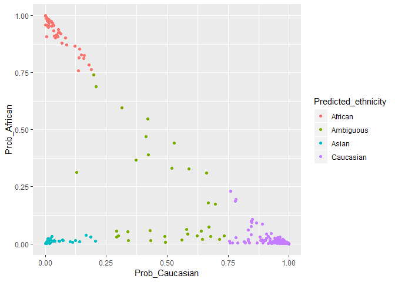
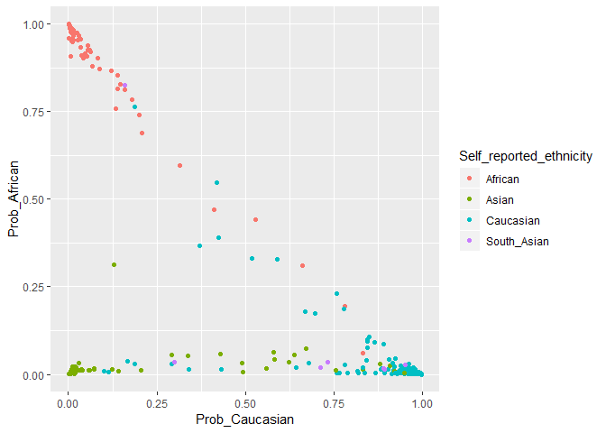

This script is for extracting the final model and saving it for publication. To make this tool more 
user-friendly, I create a function that wraps the prediction to output the following variables:

* Probabilities that a sample belongs to a specific class (1 for each ethnicity)
* A class label determined by the highest class-specific probability
* A class label determined after applying a user-supplied threshold function for 'ambiguous' samples
* The highest class-specific probability, used to determine the threshold

# Libraries and data


```r
library(dplyr)
```

```
## Warning: package 'dplyr' was built under R version 3.5.1
```

```
## 
## Attaching package: 'dplyr'
```

```
## The following objects are masked from 'package:stats':
## 
##     filter, lag
```

```
## The following objects are masked from 'package:base':
## 
##     intersect, setdiff, setequal, union
```

```r
library(impute)
library(caret)
```

```
## Loading required package: lattice
```

```
## Loading required package: ggplot2
```

```
## Warning: package 'ggplot2' was built under R version 3.5.1
```

```r
library(glmnet)
```

```
## Loading required package: Matrix
```

```
## Loading required package: foreach
```

```
## Loaded glmnet 2.0-16
```

```r
library(broom)
```

```
## Warning: package 'broom' was built under R version 3.5.1
```

```r
# Load model and data
GLM_cv <- readRDS('../../Robjects_final/02_GLM_cv_logloss.rds')
betas <- readRDS('../../Robjects_final/01_processed_betas_EPIC.rds') 
dim(betas) #  319233    510
```

```
## [1] 319233    510
```

```r
pDat <- readRDS('../../Robjects_final/01_pDat.rds')
dim(pDat) # 510 22
```

```
## [1] 510  22
```

```r
# knn impute
sum(is.na(betas)) # 339
```

```
## [1] 339
```

```r
set.seed(1)
betas <- impute.knn(as.matrix(betas), maxp = 15000)$data
```

```
## Cluster size 319233 broken into 154713 164520 
## Cluster size 154713 broken into 62742 91971 
## Cluster size 62742 broken into 30470 32272 
## Cluster size 30470 broken into 14322 16148 
## Done cluster 14322 
## Cluster size 16148 broken into 7658 8490 
## Done cluster 7658 
## Done cluster 8490 
## Done cluster 16148 
## Done cluster 30470 
## Cluster size 32272 broken into 16350 15922 
## Cluster size 16350 broken into 13822 2528 
## Done cluster 13822 
## Done cluster 2528 
## Done cluster 16350 
## Cluster size 15922 broken into 11649 4273 
## Done cluster 11649 
## Done cluster 4273 
## Done cluster 15922 
## Done cluster 32272 
## Done cluster 62742 
## Cluster size 91971 broken into 63575 28396 
## Cluster size 63575 broken into 42097 21478 
## Cluster size 42097 broken into 14224 27873 
## Done cluster 14224 
## Cluster size 27873 broken into 15821 12052 
## Cluster size 15821 broken into 6862 8959 
## Done cluster 6862 
## Done cluster 8959 
## Done cluster 15821 
## Done cluster 12052 
## Done cluster 27873 
## Done cluster 42097 
## Cluster size 21478 broken into 11733 9745 
## Done cluster 11733 
## Done cluster 9745 
## Done cluster 21478 
## Done cluster 63575 
## Cluster size 28396 broken into 16275 12121 
## Cluster size 16275 broken into 8620 7655 
## Done cluster 8620 
## Done cluster 7655 
## Done cluster 16275 
## Done cluster 12121 
## Done cluster 28396 
## Done cluster 91971 
## Done cluster 154713 
## Cluster size 164520 broken into 101365 63155 
## Cluster size 101365 broken into 38474 62891 
## Cluster size 38474 broken into 17605 20869 
## Cluster size 17605 broken into 8674 8931 
## Done cluster 8674 
## Done cluster 8931 
## Done cluster 17605 
## Cluster size 20869 broken into 4 20865 
## Done cluster 4 
## Cluster size 20865 broken into 3144 17721 
## Done cluster 3144 
## Cluster size 17721 broken into 17720 1 
## Cluster size 17720 broken into 8080 9640 
## Done cluster 8080 
## Done cluster 9640 
## Done cluster 17720 
## Done cluster 1 
## Done cluster 17721 
## Done cluster 20865 
## Done cluster 20869 
## Done cluster 38474 
## Cluster size 62891 broken into 29052 33839 
## Cluster size 29052 broken into 5784 23268 
## Done cluster 5784 
## Cluster size 23268 broken into 10541 12727 
## Done cluster 10541 
## Done cluster 12727 
## Done cluster 23268 
## Done cluster 29052 
## Cluster size 33839 broken into 31397 2442 
## Cluster size 31397 broken into 15982 15415 
## Cluster size 15982 broken into 4240 11742 
## Done cluster 4240 
## Done cluster 11742 
## Done cluster 15982 
## Cluster size 15415 broken into 6155 9260 
## Done cluster 6155 
## Done cluster 9260 
## Done cluster 15415 
## Done cluster 31397 
## Done cluster 2442 
## Done cluster 33839 
## Done cluster 62891 
## Done cluster 101365 
## Cluster size 63155 broken into 30835 32320 
## Cluster size 30835 broken into 15213 15622 
## Cluster size 15213 broken into 8765 6448 
## Done cluster 8765 
## Done cluster 6448 
## Done cluster 15213 
## Cluster size 15622 broken into 4214 11408 
## Done cluster 4214 
## Done cluster 11408 
## Done cluster 15622 
## Done cluster 30835 
## Cluster size 32320 broken into 15344 16976 
## Cluster size 15344 broken into 8551 6793 
## Done cluster 8551 
## Done cluster 6793 
## Done cluster 15344 
## Cluster size 16976 broken into 12369 4607 
## Done cluster 12369 
## Done cluster 4607 
## Done cluster 16976 
## Done cluster 32320 
## Done cluster 63155 
## Done cluster 164520
```

```r
#subset out south asians
betas_SA <- betas[,which(pDat$Ethnicity == 'South_Asian')]
pDat_SA <- pDat[which(pDat$Ethnicity == 'South_Asian'),]
dim(betas_SA);dim(pDat_SA) # 7 samples
```

```
## [1] 319233      7
```

```
## [1]  7 22
```

```r
glm_fit <- GLM_cv$finalModel
features <- glm_fit$beta$African@Dimnames[[1]]
```

Here I manually create the outputs mentioned above. Later I implement a function that automatically
does this.

# Infer ethnicity 


```r
# obtain predictions
preds <- as.data.frame(predict(glm_fit, t(betas_SA), s = glm_fit$lambdaOpt, type = 'class'))
probs <- as.data.frame(predict(glm_fit, t(betas_SA), s = glm_fit$lambdaOpt, type = 'response'))

#combine
pred_prob <- cbind(preds, probs)
colnames(pred_prob) <- c('Predicted_ethnicity_nothresh', paste0('Prob_', glm_fit$classnames))

# calculate highest probability
pred_prob$Highest_Prob <- apply(pred_prob[,2:4], 1, max)

# call ambiguous if below threshold
pred_prob$Predicted_ethnicity <- ifelse(pred_prob$Highest_Prob < 0.75, 'Ambiguous', 
                                        as.character(pred_prob$Predicted_ethnicity_nothresh))
pred_prob$Sample_ID <- rownames(pred_prob)
pred_prob <- pred_prob[,c(7,1,6, 2:5)]
```

# Function: Attempt 1

Now I wrap the above code into a function:


```r
pl_infer_ethnicity <- function(betas, threshold = 0.75){ # betas need to be in the form of samples in columns
  if(!all(features %in% rownames(betas))) {
    stop('Rownames of betas df must include all 319233 features used to fit classifier.')
  }
  
  betas <- t(betas[features,])
  
  # obtain predictions
  preds <- as.data.frame(predict(glm_fit, betas, s = glm_fit$lambdaOpt, type = 'class'))
  probs <- as.data.frame(predict(glm_fit, betas, s = glm_fit$lambdaOpt, type = 'response'))
  p <- cbind(preds, probs)
  colnames(p) <- c('Predicted_ethnicity_nothresh', paste0('Prob_', glm_fit$classnames))

  p$Highest_Prob <- apply(p[,2:4], 1, max)
  
  p$Predicted_ethnicity <- ifelse(p$Highest_Prob < threshold, 'Ambiguous', 
                                        as.character(p$Predicted_ethnicity_nothresh))
  p$Sample_ID <- rownames(p)
  p <- p[,c(7,1,6, 2:5)]
  
  return(p)
}

pl_infer_ethnicity(betas_SA, threshold = 0.75)
```

```
##             Sample_ID Predicted_ethnicity_nothresh Predicted_ethnicity
## PM263           PM263                    Caucasian           Caucasian
## PM272           PM272                    Caucasian           Ambiguous
## PM29             PM29                    Caucasian           Ambiguous
## COX_6987     COX_6987                    Caucasian           Caucasian
## COX_7646     COX_7646                        Asian           Ambiguous
## GSM1947112 GSM1947112                    Caucasian           Caucasian
## GSM1947297 GSM1947297                      African             African
##            Prob_African Prob_Asian Prob_Caucasian Highest_Prob
## PM263        0.01436988 0.09059824      0.8950319    0.8950319
## PM272        0.03454664 0.23113628      0.7343171    0.7343171
## PM29         0.01877385 0.26729344      0.7139327    0.7139327
## COX_6987     0.01733507 0.09126810      0.8913968    0.8913968
## COX_7646     0.03545782 0.66395634      0.3005858    0.6639563
## GSM1947112   0.02755214 0.01946175      0.9529861    0.9529861
## GSM1947297   0.82591034 0.01353310      0.1605566    0.8259103
```

Unfortunately the above code requires that new samples have all the features used for training 
(n=319233), when only 1860 are required for the final prediction. Below I extract the coefficients
from the final model and see if I can create the same predictions using a cross product with the 
sample vector.

# Function: Attempt 2


```r
# extract coefficients
coef <- coef(glm_fit, glm_fit$lambdaOpt)

# bind feature coefficients for each cpg and intercept
out <- do.call("cbind", lapply(coef, function(x) x[,1])) 
out <- as.data.frame(out) %>% mutate(feature = rownames(out)) %>% as_tibble()
out$feature[1] <- 'Intercept'

# should be 1862 + 1 intercept
out <- out %>% filter(abs(African) > 0 | abs(Asian) > 0 | abs(Caucasian) > 0)
out %>% arrange(desc(Asian), desc(African), desc(Caucasian))

#filter data to features
newDat <- betas_SA[out$feature[2:nrow(out)],2]

#cross product, adding 1 for intercept term
af <- out$African %*% c(1, newDat)
as <- out$Asian %*% c(1, newDat)
ca <- out$Caucasian %*% c(1, newDat)

af/sum(af,as,ca)
as/sum(af,as,ca)
ca/sum(af,as,ca)
```

After taking out the coefficients and trying the cross product, I get values that I can't make sense
of. I think I need to implement a loglink function on this output, but I'm not sure how to do this.

Instead, I create a workaround, where given a new samples with the final 1860 features, I add on
'fake' data of the remaining 319233-1860 features so that the predict() function accepts it.

# Function: Attempt 3


```r
# create 'new' data of only the necessary features
pl_features <- predictors(GLM_cv)
newDat <- betas_SA[pl_features,]
dim(newDat) #1860 features, 7 samples
```

```
## [1] 1860    7
```

```r
pl_infer_ethnicity <- function(betas, threshold = 0.75) {
  
  # find all final predictors in new data
  present_features <- intersect(rownames(betas), pl_features)
  print(paste(length(present_features), 'of 1860 predictors present.'))
  
  dat <- betas[present_features,]
  dim(dat)
  
  # find missing non-predictors used for training
  train_features <- glm_fit$beta$African@Dimnames[[1]]
  missing_features <- setdiff(train_features, present_features)
  
  # Create a matrix of zeros for these missing features
  zeros <- data.frame(
    matrix(data = 0, nrow = length(missing_features), ncol = ncol(betas), 
           dimnames = list(missing_features, colnames(betas))))
  
  # add back into the data
  dat_in <- t(rbind(dat, zeros)[train_features,])
  
  # run prediction
  preds <- as.data.frame(predict(glm_fit, dat_in, s = glm_fit$lambdaOpt, type = 'class'))
  probs <- as.data.frame(predict(glm_fit, dat_in, s = glm_fit$lambdaOpt, type = 'response'))
  p <- cbind(preds, probs)
  colnames(p) <- c('Predicted_ethnicity_nothresh', paste0('Prob_', glm_fit$classnames))
  p$Highest_Prob <- apply(p[,2:4], 1, max)
  p$Predicted_ethnicity <- ifelse(p$Highest_Prob < threshold, 'Ambiguous', 
                                        as.character(p$Predicted_ethnicity_nothresh))
  p$Sample_ID <- rownames(p)
  p <- p[,c(7,1,6, 2:5)]
  
  return(p)
}

#now compare:
pl_infer_ethnicity(newDat)
```

```
## [1] "1860 of 1860 predictors present."
```

```
##             Sample_ID Predicted_ethnicity_nothresh Predicted_ethnicity
## PM263           PM263                    Caucasian           Caucasian
## PM272           PM272                    Caucasian           Ambiguous
## PM29             PM29                    Caucasian           Ambiguous
## COX_6987     COX_6987                    Caucasian           Caucasian
## COX_7646     COX_7646                        Asian           Ambiguous
## GSM1947112 GSM1947112                    Caucasian           Caucasian
## GSM1947297 GSM1947297                      African             African
##            Prob_African Prob_Asian Prob_Caucasian Highest_Prob
## PM263        0.01436988 0.09059824      0.8950319    0.8950319
## PM272        0.03454664 0.23113628      0.7343171    0.7343171
## PM29         0.01877385 0.26729344      0.7139327    0.7139327
## COX_6987     0.01733507 0.09126810      0.8913968    0.8913968
## COX_7646     0.03545782 0.66395634      0.3005858    0.6639563
## GSM1947112   0.02755214 0.01946175      0.9529861    0.9529861
## GSM1947297   0.82591034 0.01353310      0.1605566    0.8259103
```

```r
pred_prob
```

```
##             Sample_ID Predicted_ethnicity_nothresh Predicted_ethnicity
## PM263           PM263                    Caucasian           Caucasian
## PM272           PM272                    Caucasian           Ambiguous
## PM29             PM29                    Caucasian           Ambiguous
## COX_6987     COX_6987                    Caucasian           Caucasian
## COX_7646     COX_7646                        Asian           Ambiguous
## GSM1947112 GSM1947112                    Caucasian           Caucasian
## GSM1947297 GSM1947297                      African             African
##            Prob_African Prob_Asian Prob_Caucasian Highest_Prob
## PM263        0.01436988 0.09059824      0.8950319    0.8950319
## PM272        0.03454664 0.23113628      0.7343171    0.7343171
## PM29         0.01877385 0.26729344      0.7139327    0.7139327
## COX_6987     0.01733507 0.09126810      0.8913968    0.8913968
## COX_7646     0.03545782 0.66395634      0.3005858    0.6639563
## GSM1947112   0.02755214 0.01946175      0.9529861    0.9529861
## GSM1947297   0.82591034 0.01353310      0.1605566    0.8259103
```

yay

# Function: Attempt 4

Because the above workaround requires publishing a 1.1 Gb model fit object, I try again to find a 
formula for the manual cross-product method.


```r
#args
object <-glm_fit
s <- glm_fit$lambdaOpt
type <- "response"
exact <- F
newx <- t(newDat)

a0 <- object$a0 # dunno what this is
rownames(a0) <- rep("(Intercept)", nrow(a0))
nbeta <- object$beta
klam <- dim(a0) # number of lambdas tuned against
nclass <- klam[[1]] # # of classes
nlambda <- length(s) # # of supplied lambda

# if !is.null(s)
lambda <- object$lambda
lamlist <- lambda.interp(lambda, s)
for (i in seq(nclass)) {
  kbeta <- methods::rbind2(a0[i, , drop = FALSE], nbeta[[i]])#was rbind2
  vnames <- dimnames(kbeta)[[1]]
  dimnames(kbeta) <- list(NULL, NULL)
  kbeta <- kbeta[, lamlist$left, drop = FALSE] %*% Diagonal(x=lamlist$frac) +
    kbeta[, lamlist$right, drop = FALSE] %*% Diagonal(x=1 - lamlist$frac)
  dimnames(kbeta) <- list(vnames, paste(seq(along = s)))
  nbeta[[i]] <- kbeta
}

c <- lapply(nbeta, function(x) nonzeroCoef(x[-1, ,drop = FALSE], bystep = TRUE))

dd <- dim(newx)
if (inherits(newx, "sparseMatrix"))
  newx <- as(newx, "dgCMatrix")
npred <- dd[[1]]
dn <- list(names(nbeta), dimnames(nbeta[[1]])[[2]], dimnames(newx)[[1]])
dp <- array(0, c(nclass, nlambda, npred), dimnames = dn)
for (i in seq(nclass)) {
  fitk <- cbind2(1, newx) %*% matrix(nbeta[[i]][c("(Intercept)", colnames(newx)),])
  dp[i, , ] = dp[i, , ] + t(as.matrix(fitk))
}

  switch(type, response = {
    pp <- exp(dp)
    psum <- apply(pp, c(2, 3), sum)
    aperm(pp/rep(psum, rep(nclass, nlambda * npred)), c(3, 
        1, 2))
  }, link <- aperm(dp, c(3, 1, 2)), class = {
    dpp <- aperm(dp, c(3, 1, 2))
    apply(dpp, 3, glmnet_softmax)
  })
```

```
## , , 1
## 
##               African      Asian Caucasian
## PM263      0.01436988 0.09059824 0.8950319
## PM272      0.03454664 0.23113628 0.7343171
## PM29       0.01877385 0.26729344 0.7139327
## COX_6987   0.01733507 0.09126810 0.8913968
## COX_7646   0.03545782 0.66395634 0.3005858
## GSM1947112 0.02755214 0.01946175 0.9529861
## GSM1947297 0.82591034 0.01353310 0.1605566
```

```r
predict(glm_fit, t(betas_SA), s = glm_fit$lambdaOpt, type = 'class')
```

```
##      1          
## [1,] "Caucasian"
## [2,] "Caucasian"
## [3,] "Caucasian"
## [4,] "Caucasian"
## [5,] "Asian"    
## [6,] "Caucasian"
## [7,] "African"
```

```r
predict(glm_fit, t(betas_SA), s = glm_fit$lambdaOpt, type = 'response')
```

```
## , , 1
## 
##               African      Asian Caucasian
## PM263      0.01436988 0.09059824 0.8950319
## PM272      0.03454664 0.23113628 0.7343171
## PM29       0.01877385 0.26729344 0.7139327
## COX_6987   0.01733507 0.09126810 0.8913968
## COX_7646   0.03545782 0.66395634 0.3005858
## GSM1947112 0.02755214 0.01946175 0.9529861
## GSM1947297 0.82591034 0.01353310 0.1605566
```

This works too!

# Save data

saveRDS(glm_fit, '../../Robjects_final/05_glm_fit.rds')

For south asian samples amy is using:


```r
# add predictions to pDat
pDat_SA <- pDat_SA %>% left_join(pred_prob, by = c('sampleNames' = 'Sample_ID'))

# combine with other samples pDat
pDat_final <- readRDS('../../Robjects_final/03_final_pData.rds')
pDat_save <- pDat_final %>% 
  bind_rows(pDat_SA %>% select(-matAge, -CH, -GA_2) %>% mutate(GA = as.numeric(GA)) %>%
              rename(Self_reported_ethnicity = Ethnicity, Cohort_owner = Dataset))
```

```
## Warning in bind_rows_(x, .id): binding factor and character vector,
## coercing into character vector
```

```
## Warning in bind_rows_(x, .id): binding character and factor vector,
## coercing into character vector
```

```r
dim(pDat_save) # 506 33
```

```
## [1] 506  33
```

```r
# recall ambiguous samples based on 0.75 threshold
pDat_save$Predicted_ethnicity <- ifelse(pDat_save$Highest_Prob < 0.75, 'Ambiguous', 
                                        as.character(pDat_save$Predicted_ethnicity))
table(pDat_save$Predicted_ethnicity)
```

```
## 
##   African Ambiguous     Asian Caucasian 
##        50        33        35       388
```

```r
saveRDS(pDat_save, '../../Robjects_final/05_pDat_506samps.rds')

ggplot(pDat_save, aes(x = Prob_Caucasian, y = Prob_African, col = Predicted_ethnicity)) +
  geom_point()
```

<!-- -->

```r
ggplot(pDat_save, aes(x = Prob_Caucasian, y = Prob_African, col = Self_reported_ethnicity)) +
  geom_point()
```

<!-- -->
